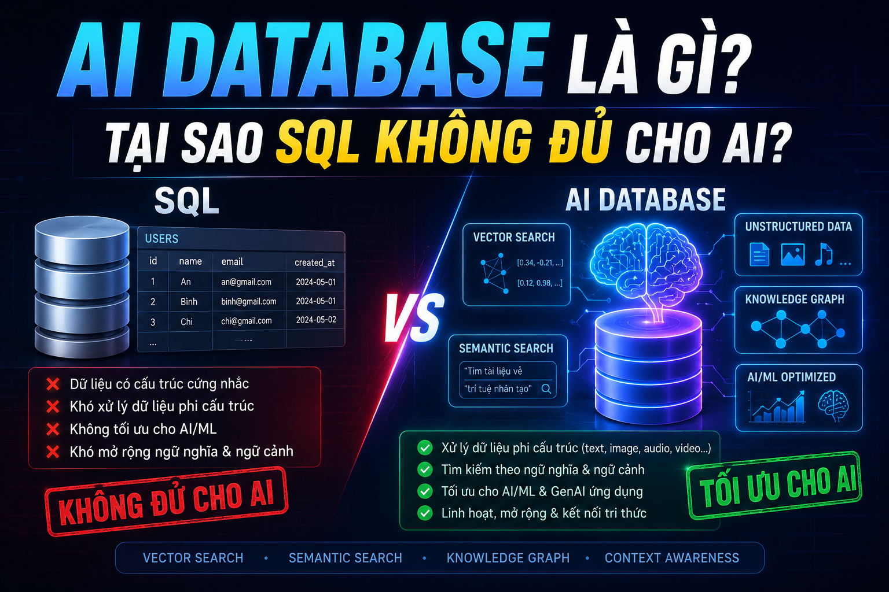

# AI Database là gì? Tại sao SQL Không Đủ Cho AI?



Bạn đang xây dựng một tính năng tìm kiếm cho ứng dụng: user gõ _"khóa học lập trình backend"_ và muốn tìm ra những khóa học liên quan nhất — kể cả những khóa có title là _"Spring Boot từ Zero đến Hero"_ hay _"Java cho người mới bắt đầu"_ dù không chứa từ "backend" trong tiêu đề. SQL truyền thống không làm được điều này. Đây là lúc **AI Database** xuất hiện.

## 1\. Dữ Liệu Trong AI Khác Gì Dữ Liệu Truyền Thống?

Hãy nhìn vào [nguyentienkhoi.hashnode.dev](http://nguyentienkhoi.hashnode.dev) — một platform e-learning điển hình:

**Dữ liệu có cấu trúc (Structured Data) — SQL xử lý tốt:**

```java
users(id, email, name, created_at)
courses(id, title, price, rating)
orders(id, user_id, amount, status)
```

**Dữ liệu phi cấu trúc (Unstructured Data) — SQL bắt đầu gặp khó:**

```java
- Nội dung bài giảng (text dài hàng nghìn từ)
- Video thumbnail (image)
- Audio bài giảng (audio)
- Comment của học viên (free-form text)
- CV của ứng viên khi tìm việc (PDF)
```

Unstructured data chiếm **~80% tổng lượng dữ liệu** trên thế giới và đang tăng nhanh hơn bao giờ hết — đặc biệt trong kỷ nguyên AI. SQL được thiết kế cho structured data, không phải để xử lý unstructured data ở quy mô lớn.

## 2\. Vấn Đề Của SQL Khi Làm AI

### Vấn đề 1: Tìm kiếm theo nghĩa, không theo từ khóa

```sql
-- SQL tìm kiếm exact match hoặc LIKE
SELECT title FROM courses
WHERE title LIKE '%backend%'
   OR title LIKE '%lập trình server%';
```

**Kết quả trả về:** Chỉ những khóa có đúng từ "backend" hoặc "lập trình server" trong title.

**Bị bỏ sót:**

*   "Spring Boot từ Zero đến Hero" ← rõ ràng là backend nhưng không có từ "backend"
    
*   "Node.js API Development" ← cũng là backend
    
*   "Java cho Developer" ← liên quan nhưng bị bỏ qua
    

**Người dùng muốn:** Tìm kiếm theo **ngữ nghĩa** — những gì _có ý nghĩa tương tự_, không phải chỉ _trùng từ khóa_.

### Vấn đề 2: Recommendation "người dùng tương tự"

```sql
-- SQL không thể tự tìm "học viên có hành vi tương tự"
-- Muốn làm phải tự define similarity rule thủ công
SELECT DISTINCT c.title
FROM enrollments e1
JOIN enrollments e2 ON e2.course_id = e1.course_id AND e2.user_id != e1.user_id
JOIN enrollments e3 ON e3.user_id = e2.user_id
JOIN courses c ON c.id = e3.course_id
WHERE e1.user_id = :current_user
  AND e3.course_id NOT IN (
      SELECT course_id FROM enrollments WHERE user_id = :current_user
  );
```

Query này chỉ tìm "học viên học cùng khóa" — không capture được **sự tương đồng về sở thích học tập** giữa các user. Netflix, Spotify, YouTube dùng AI để tìm user _thực sự tương tự_, không phải rule thủ công.

### Vấn đề 3: Xử lý câu hỏi tự nhiên

```sql
-- User hỏi: "Tôi muốn học lập trình để đi làm trong 6 tháng, bắt đầu từ đâu?"
-- SQL không có cách nào hiểu câu hỏi này và map sang dữ liệu
SELECT ??? FROM courses WHERE ???;
```

SQL cần **điều kiện rõ ràng** — không thể hiểu intent của câu hỏi tự nhiên.

## 3\. AI Giải Quyết Bằng Cách Nào? — Embedding

Giải pháp cốt lõi của AI là **biến mọi thứ thành số** — cụ thể là biến text, image, audio thành một **vector** (mảng số thực nhiều chiều).

```java
"Spring Boot từ Zero đến Hero"  →  [0.23, -0.15, 0.87, 0.04, ..., 0.61]  (1536 chiều)
"Java backend development"      →  [0.21, -0.18, 0.85, 0.06, ..., 0.58]  (1536 chiều)
"Học nấu ăn Việt Nam"          →  [-0.45, 0.72, -0.31, 0.89, ..., -0.23] (1536 chiều)
```

**Điều kỳ diệu:** Những thứ có **nghĩa tương tự** sẽ cho ra vector **gần nhau** trong không gian nhiều chiều. "Spring Boot" và "Java backend" gần nhau. "Học nấu ăn" ở rất xa cả hai.

```java
Không gian vector (đơn giản hóa thành 2D):

     Java ●  ● Spring Boot
       ● Backend
    ● API Development
                              ● Nấu ăn
                           ● Ẩm thực
```

Việc biến dữ liệu thành vector như này gọi là **Embedding** — FoxDev sẽ giải thích chi tiết ở Bài 2.

## 4\. AI Database Là Gì?

**AI Database** (hay **Vector Database**) là hệ thống được thiết kế để:

1.  **Lưu trữ** vectors (embeddings) hiệu quả
    
2.  **Tìm kiếm** những vectors _gần nhau nhất_ với tốc độ cao
    
3.  **Kết hợp** vector search với metadata filtering
    

```java
Câu hỏi của user: "khóa học lập trình backend"
         ↓
Embedding Model (AI)
         ↓
Query Vector: [0.22, -0.16, 0.86, ...]
         ↓
Vector Database tìm N vectors gần nhất
         ↓
Kết quả:
  1. Spring Boot từ Zero đến Hero (similarity: 0.94)
  2. Node.js API Development      (similarity: 0.91)
  3. Java cho Developer           (similarity: 0.89)
  4. Docker & Kubernetes          (similarity: 0.82)
```

Thay vì tìm _từ khóa trùng nhau_, Vector DB tìm _ý nghĩa gần nhau_ — đây là bước nhảy vọt về chất lượng tìm kiếm.

## 5\. Bức Tranh Tổng Quan Các Loại AI Database

### 5.1. Vector Database — Trọng Tâm Series Này


| Database | Loại | Điểm mạnh | Dùng khi |
|---|---|---|---|
| pgvector | PostgreSQL extension | Tích hợp thẳng vào PostgreSQL | Bắt đầu, không muốn thêm infra |
| Qdrant | Standalone | Nhanh, filtering mạnh, open source | Production, cần kiểm soát |
| Weaviate | Standalone | GraphQL API, hybrid search tốt | Cần multi-modal |
| Chroma | Embedded/Server | Siêu đơn giản, Python-first | Prototype, local dev |
| Pinecone | Managed Cloud | Không cần ops, scale dễ | Muốn managed service |
| Milvus | Standalone | Scale cực lớn, billion vectors | Enterprise, big data |


### 5.2. Time-Series Database — Cho Monitoring AI

Lưu dữ liệu **thay đổi theo thời gian** — metrics, logs, sensor data:

```java
Model accuracy theo thời gian:  2025-01-01: 94.2%, 2025-01-02: 94.5%...
API latency:                     req_1: 120ms, req_2: 115ms, req_3: 130ms...
User behavior:                   click_1: 09:00:01, click_2: 09:00:03...
```


| Database | Điểm mạnh |
|---|---|
| InfluxDB | Phổ biến nhất, query language riêng |
| TimescaleDB | PostgreSQL extension, SQL quen thuộc |
| Prometheus | Monitoring & alerting, Kubernetes |


### 5.3. Graph Database — Cho Knowledge Graph

Biểu diễn **quan hệ phức tạp** giữa các entities:

```java
(User:Nam) -[LEARNED]-> (Skill:Java)
(User:Nam) -[ENROLLED]-> (Course:SpringBoot)
(Course:SpringBoot) -[REQUIRES]-> (Skill:Java)
(Skill:Java) -[RELATED_TO]-> (Skill:Kotlin)
```


| Database | Điểm mạnh |
|---|---|
| Neo4j | Phổ biến nhất, Cypher query language |
| Amazon Neptune | Managed, tích hợp AWS |


### 5.4. Feature Store — Cho ML Pipeline

Lưu trữ và phục vụ **features đã được tính toán** cho model:

```java
user_id: 1
features: {
    avg_session_duration: 45.2,
    courses_completed: 3,
    preferred_topics: ["java", "spring", "backend"],
    last_active_days_ago: 2
}
```

* * *

## 6\. SQL + AI Database — Không Phải Thay Thế Mà Bổ Sung

Đây là điểm quan trọng nhất: **AI Database không thay thế SQL** — chúng bổ sung cho nhau.

```java
nguyentienkhoi.hashnode.dev Architecture:

PostgreSQL (OLTP)          Vector DB (Qdrant/pgvector)
─────────────────          ──────────────────────────
Lưu users, orders          Lưu course embeddings
Lưu enrollments            Lưu user preference vectors
Xử lý payment              Lưu content embeddings
Auth, permissions          
                    ↘   ↙
              Application Layer
                    │
              User Experience:
              - Tìm kiếm semantic
              - Recommendation
              - Chatbot Q&A
              - Similar courses
```

**Rule of thumb:**

```java
Câu hỏi "Ai mua khóa nào?" → SQL
Câu hỏi "Khóa nào tương tự khóa này?" → Vector DB
Câu hỏi "User này thích học gì?" → Vector DB + SQL
Câu hỏi "Doanh thu tháng này bao nhiêu?" → SQL
Câu hỏi "Tìm khóa học theo mô tả tự nhiên" → Vector DB
```

## 7\. Use Case Thực Tế Cho [nguyentienkhoi.hashnode.dev](http://nguyentienkhoi.hashnode.dev)

Đây là những tính năng AI có thể build trực tiếp trên [nguyentienkhoi.hashnode.dev](http://nguyentienkhoi.hashnode.dev):

### Semantic Search — Tìm Kiếm Thông Minh

```java
User gõ: "học lập trình để đổi nghề trong 6 tháng"
→ Trả về: Roadmap Java, Spring Boot Cơ Bản, SQL cho Developer
  (dù không có từ nào khớp với query)
```

### Course Recommendation

```java
User vừa hoàn thành: "Java Core nền tảng"
→ Gợi ý: Spring Boot, Hibernate, Design Patterns
  (dựa trên vector similarity của course content)
```

### Chatbot Tư Vấn Học

```java
User hỏi: "Tôi biết Python cơ bản, muốn học backend, nên bắt đầu từ đâu?"
→ RAG pipeline: tìm các tài liệu liên quan → generate câu trả lời cá nhân hóa
```

### Similar Courses

```java
User đang xem: "Docker & Kubernetes thực chiến"
→ Hiển thị: "Người xem khóa này cũng quan tâm đến..." (CI/CD, DevOps, Microservices)
```

## 8\. Roadmap Series Này

Đây là hành trình bạn sẽ đi qua:

```java
Bài 1 (bài này)     → Hiểu bức tranh tổng quan
Bài 2               → Embedding & Vector — nền tảng kỹ thuật
Bài 3               → Vector DB hoạt động thế nào bên trong
Bài 4               → Cài đặt pgvector + Qdrant
Bài 5               → pgvector thực chiến với nguyentienkhoi.hashnode.dev
Bài 6               → Qdrant thực chiến
Bài 7               → Chunking & Embedding strategy
Bài 8               → Xây dựng RAG app hoàn chỉnh
Bài 9               → Semantic search production-ready
Bài 10              → Recommendation system
Bài 11-13           → Performance, Production, Multi-modal
Bài 14-16           → Time-series, Graph DB, Feature Store
```

Sau khi hoàn thành series, bạn có thể tự tay xây dựng **semantic search**, **chatbot RAG** và **recommendation system** cho ứng dụng của mình.

## Tổng Kết

*   **SQL** xử lý tốt structured data — transaction, exact match, aggregation
    
*   **AI Database** xử lý unstructured data — tìm kiếm theo nghĩa, recommendation, Q&A
    
*   **Vector Database** là loại AI Database quan trọng nhất hiện nay — lưu và tìm kiếm embeddings
    
*   **Embedding** là kỹ thuật biến text/image thành vector để AI có thể tính toán độ tương đồng
    
*   SQL và Vector DB **bổ sung** cho nhau, không thay thế nhau
    

Bài tiếp theo chúng ta sẽ đi sâu vào **Embedding & Vector** — hiểu rõ cơ chế biến text thành số và tại sao những con số đó lại có thể capture được ý nghĩa của ngôn ngữ tự nhiên.

