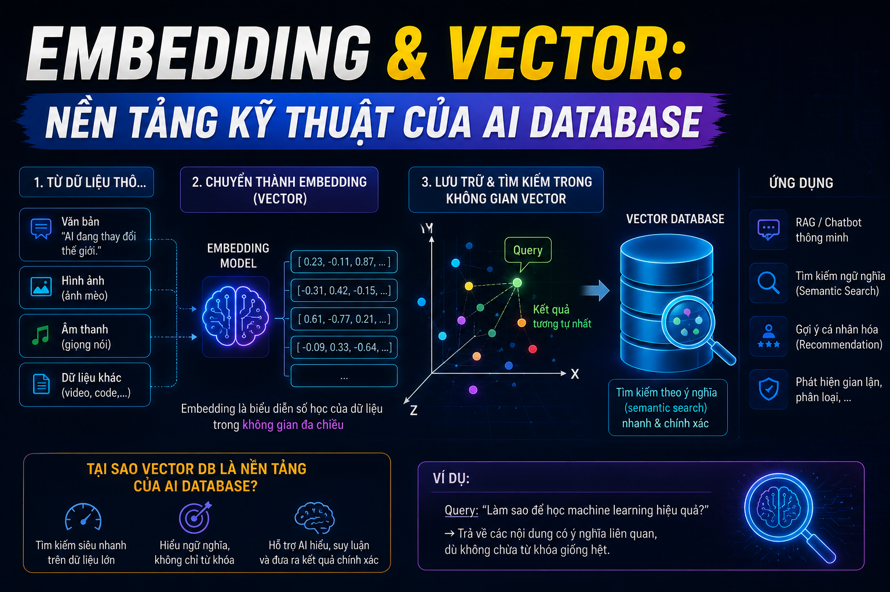

# Embedding & Vector: Nền Tảng Kỹ Thuật Của AI Database



Bài 1 bạn đã hiểu _tại sao_ cần AI Database. Bài này sẽ đi sâu vào _cơ chế hoạt động_ — cụ thể là **Embedding**: kỹ thuật biến text, image, audio thành những con số mà máy tính có thể so sánh được. Đây là nền tảng của mọi thứ trong AI Database, hiểu rõ phần này sẽ giúp bạn đưa ra quyết định đúng khi thiết kế hệ thống.

## 1\. Máy Tính Không Hiểu Chữ — Chỉ Hiểu Số

Bài toán cốt lõi: máy tính không thể so sánh ý nghĩa của 2 câu văn. Nó chỉ hiểu số.

```java
"Spring Boot là framework Java"    →  ???
"Java backend development tool"   →  ???

Máy tính không biết 2 câu này có liên quan đến nhau.
```

Giải pháp: **biến chữ thành số** theo cách giữ nguyên ý nghĩa — những thứ có nghĩa gần nhau cho ra số gần nhau.

## 2\. Từ One-Hot Encoding Đến Embedding

### Cách cũ: One-Hot Encoding — Không Capture Được Nghĩa

Cách đơn giản nhất để biến chữ thành số: mỗi từ là một vị trí trong vector, từ đó = 1, còn lại = 0.

```java
Từ điển: [java, python, spring, cooking, recipe, backend]

"java"    → [1, 0, 0, 0, 0, 0]
"python"  → [0, 1, 0, 0, 0, 0]
"spring"  → [0, 0, 1, 0, 0, 0]
"cooking" → [0, 0, 0, 1, 0, 0]
```

**Vấn đề:** "java" và "python" có khoảng cách bằng "java" và "cooking" — máy tính không biết java và python đều là ngôn ngữ lập trình, còn cooking thì không liên quan.

### Cách mới: Embedding — Capture Được Nghĩa

Embedding Model (được train trên hàng tỷ câu văn) học được rằng "java" và "python" thường xuất hiện trong cùng ngữ cảnh → cho ra vector gần nhau:

```java
"java"    → [0.82, -0.15, 0.43, 0.67, ..., -0.21]  (1536 chiều)
"python"  → [0.79, -0.18, 0.41, 0.71, ..., -0.19]  (1536 chiều)  ← gần java
"spring"  → [0.75, -0.12, 0.38, 0.65, ..., -0.17]  (1536 chiều)  ← gần java, python
"cooking" → [-0.34, 0.72, -0.51, -0.23, ..., 0.88] (1536 chiều)  ← rất xa
```

**Kỳ diệu:** Model không được lập trình cứng "java gần python" — nó **tự học** từ dữ liệu. Nếu trong hàng tỷ câu văn, "java" và "python" thường xuất hiện cùng với "programming", "developer", "code" → model tự hiểu chúng liên quan.

## 3\. Vector Là Gì?

**Vector** đơn giản là một mảng số thực:

```python
# Vector 3 chiều (đơn giản để visualize)
vector_java    = [0.82, -0.15, 0.43]
vector_python  = [0.79, -0.18, 0.41]
vector_cooking = [-0.34, 0.72, -0.51]
```

Trong thực tế, embedding vector thường có **768, 1024, hoặc 1536 chiều** — nhiều chiều hơn giúp capture được nhiều khía cạnh ngữ nghĩa hơn, nhưng cũng tốn bộ nhớ hơn.

```java
Mỗi chiều capture một "khía cạnh" nào đó của ý nghĩa:
  Chiều 1: Mức độ liên quan đến "lập trình"
  Chiều 2: Mức độ liên quan đến "ẩm thực"
  Chiều 3: Mức độ "kỹ thuật" hay "sáng tạo"
  ...
  Chiều 1536: (con người không đặt tên được, model tự học)
```

## 4\. Đo Độ Tương Đồng Giữa Các Vector

Khi đã có vector, cần một cách để đo "2 vector này gần nhau bao nhiêu". Có 3 cách phổ biến:

### Cosine Similarity — Phổ Biến Nhất Cho Text

Đo **góc** giữa 2 vector, không quan tâm độ dài:

```java
cosine_similarity = (A · B) / (|A| × |B|)

Kết quả:
  1.0  = hoàn toàn giống nhau (cùng hướng)
  0.0  = không liên quan (vuông góc)
 -1.0  = đối lập hoàn toàn (ngược hướng)
```

```python
import numpy as np

java    = np.array([0.82, -0.15, 0.43])
python  = np.array([0.79, -0.18, 0.41])
cooking = np.array([-0.34, 0.72, -0.51])

def cosine_similarity(a, b):
    return np.dot(a, b) / (np.linalg.norm(a) * np.linalg.norm(b))

print(cosine_similarity(java, python))   # 0.9998 — rất gần!
print(cosine_similarity(java, cooking))  # -0.7823 — rất xa!
```

**Tại sao dùng Cosine cho text?** Vì độ dài văn bản không quan trọng — "Java là ngôn ngữ lập trình" và "Java là một ngôn ngữ lập trình rất phổ biến được dùng nhiều trong enterprise" nên có similarity cao dù một câu dài hơn nhiều.

### Euclidean Distance — Khoảng Cách Thẳng

Đo **khoảng cách thẳng** giữa 2 điểm trong không gian:

```java
euclidean = sqrt(Σ(Ai - Bi)²)

Kết quả:
  0    = giống hệt nhau
  lớn  = càng xa nhau
```

Dùng tốt cho **image embedding** và khi độ lớn của vector có ý nghĩa.

### Dot Product — Nhanh Nhất

```java
dot_product = Σ(Ai × Bi)
```

Nhanh nhất về mặt tính toán, dùng khi vectors đã được **normalize** (chuẩn hóa về độ dài = 1). Khi vector đã normalize, Dot Product = Cosine Similarity.

### Tóm Tắt Khi Nào Dùng Gì


| Metric | Dùng cho | Lưu ý |
|---|---|---|
| Cosine Similarity | Text embedding, NLP | Phổ biến nhất, ignore độ dài |
| Euclidean Distance | Image, audio embedding | Quan tâm độ lớn vector |
| Dot Product | Khi vectors đã normalized | Nhanh nhất |


## 5\. Embedding Model — Ai Tạo Ra Vector?

**Embedding Model** là một neural network được train để biến input thành vector. Bạn không cần tự train — dùng model có sẵn:

### Text Embedding Models

```python
# OpenAI text-embedding-3-small (1536 chiều)
from openai import OpenAI
client = OpenAI()

response = client.embeddings.create(
    model="text-embedding-3-small",
    input="Spring Boot từ Zero đến Hero"
)
vector = response.data[0].embedding  # list 1536 số thực
```

```python
# Sentence Transformers — open source, chạy local
from sentence_transformers import SentenceTransformer

model = SentenceTransformer('all-MiniLM-L6-v2')
vector = model.encode("Spring Boot từ Zero đến Hero")
# numpy array 384 chiều
```

### So Sánh Các Embedding Model Phổ Biến


| Model | Chiều | Tốc độ | Chất lượng | Chi phí | Tiếng Việt |
|---|---|---|---|---|---|
| OpenAI text-embedding-3-small | 1536 | Nhanh | ⭐⭐⭐⭐⭐ | $0.02/1M tokens | ⭐⭐⭐⭐ |
| OpenAI text-embedding-3-large | 3072 | Vừa | ⭐⭐⭐⭐⭐ | $0.13/1M tokens | ⭐⭐⭐⭐ |
| Cohere embed-v3 | 1024 | Nhanh | ⭐⭐⭐⭐⭐ | $0.10/1M tokens | ⭐⭐⭐⭐ |
| BGE-M3 | 1024 | Vừa | ⭐⭐⭐⭐ | Miễn phí (local) | ⭐⭐⭐⭐⭐ |
| PhoBERT | 768 | Chậm | ⭐⭐⭐⭐ | Miễn phí (local) | ⭐⭐⭐⭐⭐ |
| all-MiniLM-L6-v2 | 384 | Rất nhanh | ⭐⭐⭐ | Miễn phí (local) | ⭐⭐ |


> **Cho tiếng Việt:** BGE-M3 hoặc OpenAI text-embedding-3-small là lựa chọn tốt nhất. BGE-M3 chạy local, không tốn phí, chất lượng tiếng Việt tốt. FoxDev sẽ đi sâu vào phần này ở Bài 7.

## 6\. Ví Dụ Thực Tế — Embed Khóa Học [nguyentienkhoi.hashnode.dev](http://nguyentienkhoi.hashnode.dev)

Hãy xem embedding hoạt động thế nào với dữ liệu thực:

```python
from sentence_transformers import SentenceTransformer
import numpy as np

model = SentenceTransformer('all-MiniLM-L6-v2')

# Embed các khóa học nguyentienkhoi.hashnode.dev
courses = [
    "Spring Boot từ Zero đến Hero - học Java backend từ cơ bản",
    "SQL cho Developer - từ beginner đến senior",
    "Docker & Kubernetes thực chiến",
    "ReactJS cơ bản đến nâng cao",
    "Java Core nền tảng",
    "Học nấu phở bò truyền thống",  # thêm vào để test
]

# Tạo embedding cho từng khóa học
embeddings = model.encode(courses)
# Shape: (6, 384) — 6 khóa học, mỗi khóa 384 chiều

# Embed câu query của user
query = "tôi muốn học backend với Java"
query_embedding = model.encode(query)

# Tính cosine similarity
from sklearn.metrics.pairwise import cosine_similarity

similarities = cosine_similarity(
    [query_embedding],
    embeddings
)[0]

# Sắp xếp kết quả
results = sorted(
    zip(courses, similarities),
    key=lambda x: x[1],
    reverse=True
)

for course, score in results:
    print(f"{score:.4f} — {course}")
```

**Kết quả:**

```java
0.8234 — Spring Boot từ Zero đến Hero - học Java backend từ cơ bản
0.7891 — Java Core nền tảng
0.6543 — SQL cho Developer - từ beginner đến senior
0.5234 — Docker & Kubernetes thực chiến
0.4123 — ReactJS cơ bản đến nâng cao
0.1245 — Học nấu phở bò truyền thống   ← rất thấp, đúng rồi!
```

Query "tôi muốn học backend với Java" → Spring Boot và Java Core lên đầu, nấu phở xuống đáy. Không cần viết rule thủ công — model tự hiểu.

## 7\. Không Chỉ Text — Embedding Cho Mọi Loại Dữ Liệu

### Image Embedding

```python
from transformers import CLIPProcessor, CLIPModel
from PIL import Image

model = CLIPModel.from_pretrained("openai/clip-vit-base-patch32")
processor = CLIPProcessor.from_pretrained("openai/clip-vit-base-patch32")

# Embed thumbnail của khóa học
image = Image.open("spring-boot-thumbnail.jpg")
inputs = processor(images=image, return_tensors="pt")
image_embedding = model.get_image_features(**inputs)
# Vector 512 chiều
```

### Text + Image Trong Cùng Vector Space (CLIP)

CLIP (Contrastive Language-Image Pretraining) của OpenAI có thể embed **cả text lẫn image vào cùng không gian vector**:

```python
# Text embedding
text_inputs = processor(
    text=["Java programming course", "cooking recipe"],
    return_tensors="pt",
    padding=True
)
text_embeddings = model.get_text_features(**text_inputs)

# Image embedding
image = Image.open("spring-boot-thumbnail.jpg")
image_inputs = processor(images=image, return_tensors="pt")
image_embedding = model.get_image_features(**image_inputs)

# Tính similarity giữa text và image!
similarity = cosine_similarity(
    text_embeddings[0].detach().numpy().reshape(1, -1),
    image_embedding.detach().numpy()
)
# → "Java programming course" có similarity cao hơn với thumbnail Spring Boot
```

Đây là nền tảng của **multi-modal search** — tìm kiếm bằng hình ảnh, tìm image bằng text. FoxDev sẽ đi sâu ở Bài 13.

## 8\. Embedding Trong Ngữ Cảnh Database

Khi đã có vector, bước tiếp theo là lưu vào database và tìm kiếm:

```sql
-- pgvector: lưu embedding vào PostgreSQL
CREATE TABLE course_embeddings (
    id          BIGSERIAL PRIMARY KEY,
    course_id   BIGINT NOT NULL REFERENCES courses(id),
    content     TEXT NOT NULL,           -- text đã được embed
    embedding   VECTOR(384) NOT NULL,    -- vector 384 chiều
    model_name  VARCHAR(100) NOT NULL,   -- model nào tạo ra
    created_at  TIMESTAMPTZ DEFAULT NOW()
);

-- Tìm 5 khóa học giống nhất với query vector
SELECT
    c.title,
    1 - (ce.embedding <=> query_vector) AS similarity
FROM course_embeddings ce
JOIN courses c ON c.id = ce.course_id
ORDER BY ce.embedding <=> query_vector  -- <=> là cosine distance
LIMIT 5;
```

```java
Operator trong pgvector:
  <=>  Cosine distance    (1 - cosine_similarity)
  <->  Euclidean distance
  <#>  Negative dot product
```

## 9\. Những Điều Cần Lưu Ý Khi Dùng Embedding

### Embedding Cùng Model Mới So Sánh Được

```python
# ❌ Sai — so sánh embedding từ 2 model khác nhau vô nghĩa
embedding_openai   = openai_model.encode("Spring Boot")    # 1536 chiều
embedding_sentence = sentence_model.encode("Spring Boot")  # 384 chiều
similarity = cosine_similarity(embedding_openai, embedding_sentence)
# Kết quả không có ý nghĩa!

# ✅ Đúng — luôn dùng cùng một model
embedding_1 = model.encode("Spring Boot")
embedding_2 = model.encode("Java backend")
similarity = cosine_similarity(embedding_1, embedding_2)  # ý nghĩa
```

### Thay Đổi Model Phải Re-embed Toàn Bộ

```python
# Nếu đổi từ all-MiniLM (384 chiều) sang OpenAI (1536 chiều)
# → phải embed lại TOÀN BỘ dữ liệu trong database
# → đây là quyết định tốn kém, cần cân nhắc kỹ từ đầu
```

### Embedding Không Phải Là Hằng Số

```python
# Cùng một text nhưng embedding MODEL khác nhau
# "Java" trong model A có thể ở vị trí khác model B
# → không có "giá trị embedding chuẩn" cho một text
```

### Context Quan Trọng — Embed Đủ Thông Tin

```python
# ❌ Chỉ embed title — mất ngữ cảnh
embedding = model.encode("Spring Boot")

# ✅ Embed title + description + tags — nhiều thông tin hơn
text = """
Title: Spring Boot từ Zero đến Hero
Description: Học Java backend với Spring Boot từ cơ bản đến nâng cao.
Tags: java, spring, backend, api, microservices
Level: Beginner to Advanced
"""
embedding = model.encode(text)
```

## 10\. Vector Dimension — Bao Nhiêu Chiều Là Đủ?

Câu hỏi thực tế: chọn model 384, 768, 1024 hay 1536 chiều?


| Chiều | Ưu điểm | Nhược điểm | Phù hợp |
|---|---|---|---|
| 384 | Nhỏ, nhanh, rẻ | Chất lượng thấp hơn | Prototype, production nhỏ |
| 768 | Cân bằng | Vừa phải | Production thông thường |
| 1024 | Chất lượng tốt | Nặng hơn | Production lớn |
| 1536 | Chất lượng cao nhất | Tốn storage, chậm hơn | Khi cần accuracy cao |


**Tính toán storage thực tế:**

```java
1 vector 384 chiều × 4 bytes/float = 1,536 bytes ≈ 1.5KB
1 vector 1536 chiều × 4 bytes/float = 6,144 bytes ≈ 6KB

nguyentienkhoi.hashnode.dev có 1,000 khóa học:
  384 chiều → 1.5MB
  1536 chiều → 6MB

nguyentienkhoi.hashnode.dev có 1 triệu bài review:
  384 chiều → 1.5GB
  1536 chiều → 6GB
```

Với 1 triệu bản ghi, chọn model 384 chiều tiết kiệm được 4.5GB storage và query nhanh hơn đáng kể — cân nhắc kỹ trade-off này.

## Tổng Kết


| Khái niệm | Ý nghĩa |
|---|---|
| Embedding | Biến text/image thành vector số thực |
| Vector | Mảng số thực nhiều chiều đại diện cho ý nghĩa |
| Cosine Similarity | Đo độ tương đồng bằng góc giữa 2 vector (0 đến 1) |
| Embedding Model | Neural network tạo ra embedding |
| Chiều (Dimension) | Số phần tử trong vector — nhiều hơn = tốt hơn nhưng tốn hơn |
| Same Model Rule | Chỉ so sánh vector từ cùng một model |


Bài tiếp theo chúng ta sẽ học **Vector Database hoạt động như thế nào bên trong** — cụ thể là các thuật toán index như HNSW, IVF giúp tìm kiếm hàng triệu vector trong vài milliseconds.

