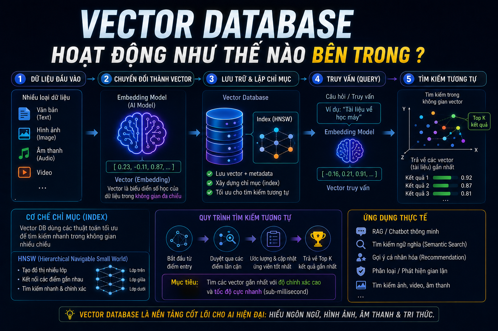

# Vector Database Hoạt Động Như Thế Nào Bên Trong?



Bài 2 bạn đã biết cách tạo ra vector. Câu hỏi tiếp theo: khi có hàng triệu vector trong database, làm sao tìm ra N vector gần nhất với query vector **trong vài milliseconds**? Nếu tính Cosine Similarity với từng vector một thì mất hàng phút — không thể dùng cho production. Bài này sẽ giải thích các thuật toán index giúp Vector DB làm điều tưởng như không thể đó.

## 1\. Vấn Đề: Brute Force Quá Chậm

Cách đơn giản nhất — tính similarity với **toàn bộ** vector trong database:

```python
# Brute force: tìm 5 vector gần nhất trong 1 triệu vector
import numpy as np

query = np.random.rand(1536)          # query vector
database = np.random.rand(1_000_000, 1536)  # 1M vectors

# Tính cosine similarity với TẤT CẢ 1 triệu vector
similarities = np.dot(database, query) / (
    np.linalg.norm(database, axis=1) * np.linalg.norm(query)
)

top_5 = np.argsort(similarities)[-5:]  # lấy 5 cao nhất
```

**Thời gian thực tế:**

```java
1,000 vectors     → ~1ms    ✅
100,000 vectors   → ~100ms  ⚠️ chậm
1,000,000 vectors → ~1,000ms = 1 giây ❌ không dùng được
1,000,000,000 vectors → ~1,000 giây  💀 hoàn toàn không thể
```

Đây gọi là **KNN (K-Nearest Neighbors) chính xác** — kết quả 100% đúng nhưng không scale được.

**Giải pháp:** **ANN (Approximate Nearest Neighbors)** — chấp nhận kết quả **gần đúng** (~95-99% accuracy) để đổi lấy tốc độ **1000x nhanh hơn**.

## 2\. ANN — Approximate Nearest Neighbors

ANN là thuật toán tìm _gần đúng_ N vector gần nhất — không đảm bảo 100% chính xác nhưng trong thực tế search/recommendation, 95% accuracy là hoàn toàn chấp nhận được.

```java
KNN (Exact):
  Tìm 5 vector gần nhất nhất trong 1M vectors
  → 1,000ms, kết quả: [A, B, C, D, E] — chính xác 100%

ANN (Approximate):
  Tìm 5 vector gần nhất (xấp xỉ) trong 1M vectors
  → 1ms, kết quả: [A, B, C, D, F] — F thay vì E
  → Accuracy ~99%, nhanh 1000x
```

Trong thực tế, user không nhận ra sự khác biệt giữa kết quả thứ 5 và kết quả thứ 5 "chính xác" — nhưng sẽ nhận ra ngay nếu search mất 1 giây thay vì 1ms.

## 3\. HNSW — Thuật Toán Index Phổ Biến Nhất

**HNSW (Hierarchical Navigable Small World)** là thuật toán ANN phổ biến nhất hiện nay, được dùng bởi Qdrant, Weaviate, pgvector và hầu hết Vector DB hiện đại.

### Ý Tưởng Cốt Lõi — Bản Đồ Nhiều Cấp Độ

Hãy tưởng tượng bạn đang tìm đường từ Hà Nội đến một quán cà phê nhỏ ở TP.HCM:

```java
Cấp 0 (thô nhất): Bản đồ thế giới
  Hà Nội → TP.HCM  (nhảy lớn)

Cấp 1 (chi tiết hơn): Bản đồ Việt Nam
  Quận 1 → Quận 3 → Quận Bình Thạnh  (nhảy vừa)

Cấp 2 (chi tiết nhất): Bản đồ đường phố
  Đường A → Đường B → Ngõ C → Quán cà phê  (nhảy nhỏ)
```

HNSW hoạt động tương tự — xây dựng nhiều lớp đồ thị:

```java
Layer 2 (ít node nhất, kết nối xa):
  [Node_1] ——————————————————— [Node_50]
       \                            /
        \                          /
Layer 1 (nhiều node hơn, kết nối vừa):
  [Node_1] — [Node_10] — [Node_25] — [Node_50]
                              |
Layer 0 (tất cả node, kết nối gần):
  [N1]-[N2]-[N3]-[N4]-[N5]-[N6]-...-[N50]
```

### Quá Trình Tìm Kiếm HNSW

```java
Query vector Q cần tìm 3 vectors gần nhất:

Bước 1: Bắt đầu từ entry point ở layer cao nhất
  Layer 2: Bắt đầu tại Node_1
           → Tính distance đến neighbors
           → Di chuyển đến node gần Q nhất: Node_50

Bước 2: Đi xuống layer thấp hơn
  Layer 1: Từ Node_50
           → Explore neighbors: Node_25, Node_40, Node_48
           → Di chuyển đến Node_48 (gần Q nhất)

Bước 3: Explore chi tiết ở layer thấp nhất
  Layer 0: Từ Node_48
           → Explore tất cả neighbors
           → Kết quả: Node_47, Node_48, Node_49
```

**Chỉ cần duyệt vài chục node** thay vì toàn bộ 1 triệu node — đó là lý do HNSW nhanh.

### Các Tham Số Quan Trọng Của HNSW

```python
# Qdrant HNSW config
hnsw_config = {
    "m": 16,              # Số kết nối mỗi node có tối đa
                          # Cao hơn → chính xác hơn nhưng tốn RAM hơn
                          # Thường: 8-64, mặc định 16

    "ef_construct": 100,  # Độ rộng search khi BUILD index
                          # Cao hơn → index chất lượng hơn nhưng build chậm hơn
                          # Thường: 50-500, mặc định 100

    "ef": 128,           # Độ rộng search khi QUERY
                          # Cao hơn → chính xác hơn nhưng query chậm hơn
                          # Thường: bằng hoặc lớn hơn m
}
```

```java
Trade-off HNSW parameters:

m (8 → 64):
  m=8:  RAM ít, index nhanh, accuracy thấp hơn
  m=64: RAM nhiều, index chậm, accuracy cao hơn

ef_construct (50 → 500):
  ef=50:  Build index nhanh, quality thấp hơn
  ef=500: Build index chậm, quality cao hơn

ef (query time):
  ef=32:  Query nhanh hơn, accuracy thấp hơn
  ef=256: Query chậm hơn, accuracy cao hơn
```

**Gợi ý cho** [**nguyentienkhoi.hashnode.dev**](http://nguyentienkhoi.hashnode.dev)**:**

```python
# Ít dữ liệu (< 100k vectors) — cân bằng
m=16, ef_construct=100, ef=128

# Dữ liệu lớn (> 1M vectors), cần accuracy cao
m=32, ef_construct=200, ef=256

# Cần query cực nhanh, chấp nhận accuracy thấp hơn một chút
m=8, ef_construct=50, ef=64
```

## 4\. IVF — Inverted File Index

**IVF (Inverted File Index)** là thuật toán ANN khác — chia vector space thành các **cluster**, chỉ tìm kiếm trong cluster liên quan:

### Nguyên Lý Hoạt Động

```java
Bước 1 — BUILD INDEX: Clustering
  Dùng K-Means chia 1M vectors thành 1000 clusters
  Mỗi cluster có centroid (trung tâm)

  Cluster 1 (Java/Backend):  centroid_1 = [0.8, -0.1, 0.4, ...]
  Cluster 2 (Frontend/UI):   centroid_2 = [0.2, 0.7, -0.3, ...]
  Cluster 3 (Ẩm thực):       centroid_3 = [-0.5, 0.6, 0.1, ...]
  ...

Bước 2 — QUERY:
  Query: "học lập trình backend"
  → Tìm 2 cluster gần nhất với query (nprobe=2)
  → Chỉ tìm trong 2 cluster đó: ~2000/1M vectors
  → Nhanh hơn 500x so với brute force
```

### Tham Số IVF

```python
# pgvector IVF config
CREATE INDEX idx_course_embeddings_ivfflat
ON course_embeddings
USING ivfflat (embedding vector_cosine_ops)
WITH (lists = 100);  # Số clusters

-- Số clusters gợi ý: sqrt(số rows)
-- 10,000 rows   → lists = 100
-- 100,000 rows  → lists = 316
-- 1,000,000 rows → lists = 1000

-- Khi query, set probes (số clusters tìm kiếm)
SET ivfflat.probes = 10;  -- tìm trong 10 clusters
-- probes cao → chính xác hơn, chậm hơn
```

### IVF vs HNSW — Khi Nào Dùng Gì?


|  | HNSW | IVF |
|---|---|---|
| Accuracy | Cao hơn | Thấp hơn một chút |
| Query speed | Rất nhanh | Nhanh |
| RAM usage | Nhiều hơn | Ít hơn |
| Build time | Chậm hơn | Nhanh hơn |
| Incremental insert | ✅ Tốt | ❌ Phải rebuild |
| Phù hợp | Production, accuracy quan trọng | Dataset lớn, RAM hạn chế |


> **Thực tế:** Hầu hết production system dùng HNSW. IVF phù hợp khi dataset rất lớn (hàng tỷ vector) và RAM hạn chế.

## 5\. Quantization — Giảm Kích Thước Vector

**Quantization** là kỹ thuật nén vector để tiết kiệm RAM và tăng tốc độ — đánh đổi một chút accuracy:

### Scalar Quantization (SQ)

```java
Original: float32 (4 bytes/dimension)
  [0.8234, -0.1523, 0.4371, ...]

→ Scalar Quantization: int8 (1 byte/dimension)
  [105, -20, 56, ...]

Tiết kiệm: 4x RAM (từ 6MB xuống 1.5MB cho 1536-dim vector × 1M docs)
Accuracy loss: ~1-2%
```

### Binary Quantization (BQ) — Cực Kỳ Nhanh

```java
Original: float32 (4 bytes/dimension)
  [0.8234, -0.1523, 0.4371, -0.2145, ...]

→ Binary: 1 bit/dimension
  [1, 0, 1, 0, ...]  (dương = 1, âm = 0)

Tiết kiệm: 32x RAM!
Tốc độ: Dùng bitwise operations → cực nhanh
Accuracy loss: ~5-10% (cần reranking để bù)
```

### Product Quantization (PQ)

```java
Chia vector thành nhiều đoạn nhỏ, quantize từng đoạn riêng:
  [0.8234, -0.1523 | 0.4371, -0.2145 | 0.6123, 0.3421]
       segment 1         segment 2         segment 3
         ↓ quantize        ↓ quantize        ↓ quantize
          code_1             code_2             code_3

Nén được nhiều hơn SQ, accuracy tốt hơn BQ
```

**Khi nào dùng Quantization:**

```java
Dataset < 1M vectors + RAM đủ   → Không cần, dùng float32
Dataset > 1M vectors            → Scalar Quantization (SQ8)
Dataset > 10M vectors           → Product Quantization (PQ)
Cần tốc độ tối đa, accuracy ~90% → Binary Quantization + reranking
```

## 6\. Filtering — Kết Hợp Vector Search Với Điều Kiện

Trong thực tế, bạn thường cần kết hợp vector search với filter:

```java
Query: "khóa học backend" + filter: price < 500000 AND course_type = 'PAID'
```

Có 3 cách xử lý:

### Pre-filtering — Filter Trước, Search Sau

```java
1. Filter: lấy tất cả courses với price < 500000 → 200 courses
2. Search: tìm vector gần nhất trong 200 courses đó

Ưu điểm: Kết quả chính xác
Nhược điểm: Nếu filter quá chặt (còn 5 courses) → index không hiệu quả
```

### Post-filtering — Search Trước, Filter Sau

```java
1. Search: tìm 100 vectors gần nhất trong toàn bộ database
2. Filter: loại bỏ những cái không thỏa điều kiện price < 500000

Ưu điểm: Tận dụng tối đa index
Nhược điểm: Nếu filter loại 90% → chỉ còn 10 kết quả dù yêu cầu 20
```

### Smart Filtering (Qdrant's approach) — Tốt Nhất

Qdrant tự động chọn chiến lược dựa trên selectivity của filter:

```python
# Qdrant tự động quyết định pre hay post filter
results = client.search(
    collection_name="courses",
    query_vector=query_embedding,
    query_filter=models.Filter(
        must=[
            models.FieldCondition(
                key="price",
                range=models.Range(lte=500000)
            ),
            models.FieldCondition(
                key="course_type",
                match=models.MatchValue(value="PAID")
            )
        ]
    ),
    limit=5
)
```

## 7\. So Sánh Các Vector Database

Hiểu được thuật toán bên trong giúp bạn chọn đúng Vector DB cho use case:


|  | pgvector | Qdrant | Weaviate | Pinecone | Chroma |
|---|---|---|---|---|---|
| Index | HNSW, IVF | HNSW | HNSW | HNSW | HNSW |
| Quantization | ❌ (float32) | ✅ SQ, BQ, PQ | ✅ PQ | ✅ | ❌ |
| Filtering | SQL WHERE | Smart filter | GraphQL | Metadata | Python |
| Scale | ~10M vectors | ~100M vectors | ~100M vectors | Unlimited | ~1M vectors |
| Setup | PostgreSQL ext | Docker/Cloud | Docker/Cloud | Cloud only | Python lib |
| Phù hợp | Bắt đầu, PostgreSQL có sẵn | Production mạnh | GraphQL API | Managed, no ops | Prototype |


## 8\. Kiến Trúc Tổng Thể Của Một Vector DB

```java
┌─────────────────────────────────────────┐
│              Vector Database             │
│                                          │
│  ┌──────────┐    ┌─────────────────┐    │
│  │  Storage │    │   Index Layer   │    │
│  │          │    │                 │    │
│  │ Vector   │    │  HNSW Graph     │    │
│  │ Payload  │◄───│  IVF Clusters   │    │
│  │ (metadata│    │  Quantization   │    │
│  │  as JSON)│    │  tables         │    │
│  └──────────┘    └────────┬────────┘    │
│                           │              │
│  ┌────────────────────────▼────────┐    │
│  │          Query Engine           │    │
│  │  1. Embed query (if needed)     │    │
│  │  2. Apply pre-filter            │    │
│  │  3. ANN search (HNSW/IVF)      │    │
│  │  4. Apply post-filter           │    │
│  │  5. Re-rank results             │    │
│  │  6. Return top-K                │    │
│  └─────────────────────────────────┘    │
└─────────────────────────────────────────┘
```

**Payload** trong Vector DB là metadata đi kèm với vector — tương tự cột trong SQL:

```json
{
  "id": "course_1",
  "vector": [0.82, -0.15, 0.43, ...],
  "payload": {
    "title": "Spring Boot từ Zero đến Hero",
    "price": 799000,
    "course_type": "PAID",
    "rating": 4.8,
    "category": "java",
    "tags": ["java", "spring", "backend"]
  }
}
```

## 9\. Recall — Đo Lường Chất Lượng ANN

**Recall@K** là metric đo lường "trong K kết quả trả về, bao nhiêu % là kết quả đúng so với brute force":

```java
Brute force top-5: [A, B, C, D, E]
ANN top-5:         [A, B, C, D, F]  ← F thay vì E

Recall@5 = 4/5 = 0.8 = 80%
```

```python
# Đo recall trong pgvector
-- Tìm exact top-5 (brute force, không dùng index)
SET enable_indexscan = off;
SELECT id FROM course_embeddings
ORDER BY embedding <=> query_vector LIMIT 5;
-- → [1, 5, 12, 23, 45]

-- Tìm ANN top-5 (dùng HNSW index)
SET enable_indexscan = on;
SELECT id FROM course_embeddings
ORDER BY embedding <=> query_vector LIMIT 5;
-- → [1, 5, 12, 23, 67]  ← 67 thay vì 45

-- Recall@5 = 4/5 = 80%
```

**Recall mục tiêu trong thực tế:**

```java
Search engine, recommendation  → Recall@10 ≥ 95%
Chatbot RAG context retrieval  → Recall@5 ≥ 90%
Image similarity               → Recall@20 ≥ 85%
```

## 10\. Thực Hành — Visualize Vector Space

Để hình dung rõ hơn cách vector hoạt động, hãy chạy đoạn code này:

```python
import numpy as np
import matplotlib.pyplot as plt
from sentence_transformers import SentenceTransformer
from sklearn.decomposition import PCA

model = SentenceTransformer('all-MiniLM-L6-v2')

# Các khóa học và topics nguyentienkhoi.hashnode.dev
texts = [
    # Backend
    "Spring Boot Java backend",
    "Java Core lập trình",
    "Microservices với Java",
    "API RESTful Development",
    # Frontend
    "ReactJS frontend development",
    "JavaScript cơ bản",
    "HTML CSS web design",
    # DevOps
    "Docker containerization",
    "Kubernetes orchestration",
    "CI/CD pipeline",
    # Data
    "SQL database cho developer",
    "PostgreSQL advanced",
    # Không liên quan
    "Học nấu ăn Việt Nam",
    "Yoga và thiền định",
]

labels = [
    "Spring Boot", "Java Core", "Microservices", "REST API",
    "ReactJS", "JavaScript", "HTML/CSS",
    "Docker", "Kubernetes", "CI/CD",
    "SQL", "PostgreSQL",
    "Nấu ăn", "Yoga"
]

colors = [
    "blue", "blue", "blue", "blue",    # Backend
    "green", "green", "green",          # Frontend
    "orange", "orange", "orange",       # DevOps
    "red", "red",                       # Data
    "gray", "gray"                      # Không liên quan
]

# Tạo embeddings
embeddings = model.encode(texts)

# Giảm chiều xuống 2D bằng PCA để visualize
pca = PCA(n_components=2)
vectors_2d = pca.fit_transform(embeddings)

# Vẽ
plt.figure(figsize=(12, 8))
for i, (x, y) in enumerate(vectors_2d):
    plt.scatter(x, y, c=colors[i], s=100, zorder=5)
    plt.annotate(labels[i], (x, y),
                 textcoords="offset points",
                 xytext=(5, 5), fontsize=9)

plt.title("Vector Space: Khóa học nguyentienkhoi.hashnode.dev\n(Blue=Backend, Green=Frontend, Orange=DevOps, Red=Data)")
plt.tight_layout()
plt.savefig("vector_space_foxdev.png", dpi=150)
plt.show()
```

**Kết quả mong đợi:** Các khóa cùng nhóm (Backend, Frontend, DevOps) cluster lại gần nhau, "Nấu ăn" và "Yoga" nằm xa tất cả các nhóm kỹ thuật.

## Tổng Kết


| Khái niệm | Ý nghĩa |
|---|---|
| KNN | Tìm chính xác — đúng 100% nhưng chậm |
| ANN | Tìm xấp xỉ — ~95-99% đúng nhưng nhanh 1000x |
| HNSW | Đồ thị nhiều lớp — nhanh, chính xác, RAM nhiều |
| IVF | Clustering — ít RAM hơn, phù hợp dataset rất lớn |
| Quantization | Nén vector — ít RAM, nhanh hơn, accuracy giảm nhẹ |
| Recall@K | Metric đo chất lượng ANN so với brute force |
| Payload | Metadata đi kèm vector — dùng để filter |
| Pre/Post filter | Thứ tự filter và search ảnh hưởng đến performance |


Bài tiếp theo chúng ta sẽ **cài đặt thực tế** — pgvector extension cho PostgreSQL và Qdrant bằng Docker, sau đó chạy những vector search query đầu tiên trực tiếp trên dữ liệu [nguyentienkhoi.hashnode.dev](http://nguyentienkhoi.hashnode.dev).

