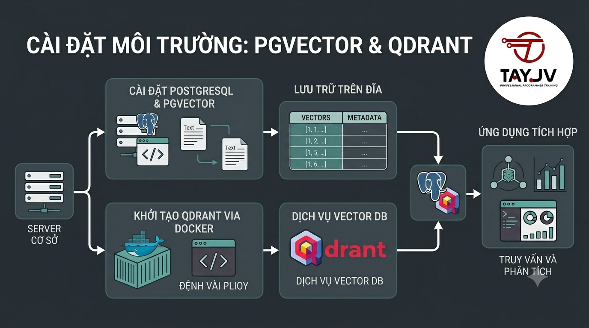

# Cài Đặt Môi Trường: pgvector & Qdrant



Sau 3 bài lý thuyết, đến lúc bắt tay vào thực hành. Bài này hướng dẫn cài đặt 2 Vector DB quan trọng nhất cho developer: **pgvector** — thêm khả năng vector search vào PostgreSQL bạn đang dùng, và **Qdrant** — Vector DB standalone mạnh mẽ hơn cho production. Cuối bài bạn sẽ chạy được câu vector search đầu tiên trên dữ liệu thực.

## 1\. Tổng Quan Môi Trường

Bài này setup 2 công cụ:

```java
┌─────────────────────────────────────────────┐
│              Local Development              │
│                                             │
│  PostgreSQL + pgvector                      │
│  ─────────────────────                      │
│  Port: 5432                                 │
│  Dùng: vector search trong PostgreSQL       │
│  Phù hợp: bắt đầu, không muốn thêm infra    │
│                                             │
│  Qdrant                                     │
│  ──────                                     │
│  Port: 6333 (HTTP) / 6334 (gRPC)            │
│  Dashboard: http://localhost:6333/dashboard │
│  Dùng: vector search standalone             │
│  Phù hợp: production, cần tính năng mạnh    │
└─────────────────────────────────────────────┘
```

**Yêu cầu:**

*   Docker Desktop đã cài (Windows/macOS) hoặc Docker Engine (Linux)
    
*   Python 3.9+ (để chạy code demo)
    
*   PostgreSQL 14+ đã cài (từ Bài 1 của series SQL)
    

## 2\. Cài pgvector

### Cách 1: Cài Trực Tiếp Vào PostgreSQL Đang Có

**macOS (Homebrew):**

```bash
# Cài pgvector extension
brew install pgvector

# Hoặc nếu PostgreSQL cài qua Homebrew
brew install postgresql@16
$(brew --prefix)/opt/postgresql@16/bin/psql -U postgres -c "CREATE EXTENSION vector"
```

**Ubuntu/Debian:**

```bash
# Thêm pgvector apt repository
sudo apt install postgresql-16-pgvector

# Hoặc build từ source
sudo apt install postgresql-server-dev-16 build-essential git

git clone https://github.com/pgvector/pgvector.git
cd pgvector
make
sudo make install
```

**Windows:**

Download binary từ https://github.com/pgvector/pgvector/releases — chọn file `.zip` phù hợp với PostgreSQL version.

### Cách 2: PostgreSQL + pgvector Qua Docker (Khuyến Nghị)

Đơn giản nhất — không cần cài gì thêm:

```bash
# Pull image PostgreSQL đã tích hợp sẵn pgvector
docker pull pgvector/pgvector:pg16

# Chạy container
docker run -d \
  --name postgres-vector \
  -e POSTGRES_USER=postgres \
  -e POSTGRES_PASSWORD=postgres \
  -e POSTGRES_DB=foxdev_ai \
  -p 5432:5432 \
  -v pgvector_data:/var/lib/postgresql/data \
  pgvector/pgvector:pg16
```

**Kiểm tra container đang chạy:**

```bash
docker ps
# CONTAINER ID   IMAGE                    STATUS    PORTS
# abc123         pgvector/pgvector:pg16   Up        0.0.0.0:5432->5432/tcp
```

### Kích Hoạt pgvector Extension

Kết nối vào PostgreSQL và enable extension:

```bash
# Kết nối qua psql
psql -U postgres -h localhost -d foxdev_ai

# Hoặc qua Docker
docker exec -it postgres-vector psql -U postgres -d foxdev_ai
```

```sql
-- Enable pgvector extension
CREATE EXTENSION IF NOT EXISTS vector;

-- Kiểm tra đã cài thành công
SELECT * FROM pg_extension WHERE extname = 'vector';
-- Phải thấy dòng với extname = 'vector'

-- Xem version
SELECT extversion FROM pg_extension WHERE extname = 'vector';
-- 0.7.0 hoặc mới hơn
```

### Test pgvector Cơ Bản

```sql
-- Tạo bảng với cột vector
CREATE TABLE test_vectors (
    id      BIGSERIAL PRIMARY KEY,
    content TEXT,
    embedding VECTOR(3)  -- 3 chiều để test
);

-- Insert dữ liệu mẫu
INSERT INTO test_vectors (content, embedding) VALUES
    ('Spring Boot Java backend',    '[0.8, -0.1, 0.4]'),
    ('Java Core lập trình',         '[0.7, -0.2, 0.5]'),
    ('ReactJS frontend',            '[0.2, 0.7, -0.3]'),
    ('Học nấu ăn Việt Nam',        '[-0.5, 0.6, 0.1]');

-- Query: tìm vector gần nhất với [0.75, -0.15, 0.45]
SELECT content,
       1 - (embedding <=> '[0.75, -0.15, 0.45]') AS similarity
FROM test_vectors
ORDER BY embedding <=> '[0.75, -0.15, 0.45]'
LIMIT 3;
```

**Kết quả mong đợi:**

```java
         content          | similarity
--------------------------+-----------
 Spring Boot Java backend |   0.9998
 Java Core lập trình      |   0.9985
 ReactJS frontend         |   0.7234
```

✅ pgvector đang hoạt động!

## 3\. Cài Qdrant

### Cách 1: Docker (Khuyến Nghị Nhất)

```bash
# Pull và chạy Qdrant
docker run -d \
  --name qdrant \
  -p 6333:6333 \
  -p 6334:6334 \
  -v qdrant_data:/qdrant/storage \
  qdrant/qdrant:latest
```

**Mở dashboard:** http://localhost:6333/dashboard

Bạn sẽ thấy giao diện web của Qdrant — nơi quản lý collections, xem vectors, chạy queries.

### Cách 2: Docker Compose (Cả PostgreSQL + Qdrant)

Tạo file `docker-compose.yml`:

```yaml
version: '3.8'

services:
  postgres:
    image: pgvector/pgvector:pg16
    container_name: postgres-vector
    environment:
      POSTGRES_USER: postgres
      POSTGRES_PASSWORD: postgres
      POSTGRES_DB: foxdev_ai
    ports:
      - "5432:5432"
    volumes:
      - pgvector_data:/var/lib/postgresql/data
    healthcheck:
      test: ["CMD-SHELL", "pg_isready -U postgres"]
      interval: 10s
      timeout: 5s
      retries: 5

  qdrant:
    image: qdrant/qdrant:latest
    container_name: qdrant
    ports:
      - "6333:6333"
      - "6334:6334"
    volumes:
      - qdrant_data:/qdrant/storage
    environment:
      QDRANT__SERVICE__GRPC_PORT: 6334

volumes:
  pgvector_data:
  qdrant_data:
```

```bash
# Khởi động tất cả services
docker-compose up -d

# Kiểm tra
docker-compose ps
# NAME              STATUS    PORTS
# postgres-vector   Up        0.0.0.0:5432->5432/tcp
# qdrant            Up        0.0.0.0:6333->6333/tcp
```

### Kiểm Tra Qdrant

```bash
# Kiểm tra qua HTTP API
curl http://localhost:6333/healthz
# {"title":"qdrant - vector search engine","version":"x.x.x"}

# Xem danh sách collections
curl http://localhost:6333/collections
# {"result":{"collections":[]},"status":"ok","time":0.000123}
```

## 4\. Cài Đặt Python Dependencies

```bash
# Tạo virtual environment
python -m venv venv
source venv/bin/activate  # macOS/Linux
# hoặc: venv\Scripts\activate  # Windows

# Cài các thư viện cần thiết
pip install \
    pgvector \
    psycopg2-binary \
    qdrant-client \
    sentence-transformers \
    numpy \
    python-dotenv
```

**File** `.env`**:**

```env
# PostgreSQL
POSTGRES_HOST=localhost
POSTGRES_PORT=5432
POSTGRES_USER=postgres
POSTGRES_PASSWORD=postgres
POSTGRES_DB=foxdev_ai

# Qdrant
QDRANT_HOST=localhost
QDRANT_PORT=6333

# Embedding Model (dùng local model, không cần API key)
EMBEDDING_MODEL=all-MiniLM-L6-v2
EMBEDDING_DIM=384
```

## 5\. Demo Đầy Đủ — pgvector Với Dữ Liệu Thực

Tạo file `pgvector_demo.py`:

```python
import os
import psycopg2
import numpy as np
from sentence_transformers import SentenceTransformer
from dotenv import load_dotenv

load_dotenv()

# ──────────────────────────────────────────
# 1. Kết nối PostgreSQL
# ──────────────────────────────────────────
conn = psycopg2.connect(
    host=os.getenv("POSTGRES_HOST"),
    port=os.getenv("POSTGRES_PORT"),
    user=os.getenv("POSTGRES_USER"),
    password=os.getenv("POSTGRES_PASSWORD"),
    dbname=os.getenv("POSTGRES_DB")
)
cursor = conn.cursor()
print("✅ Kết nối PostgreSQL thành công")

# ──────────────────────────────────────────
# 2. Tạo extension và bảng
# ──────────────────────────────────────────
cursor.execute("CREATE EXTENSION IF NOT EXISTS vector")

cursor.execute("""
    CREATE TABLE IF NOT EXISTS course_embeddings (
        id          BIGSERIAL PRIMARY KEY,
        course_id   INT NOT NULL,
        title       VARCHAR(255) NOT NULL,
        description TEXT,
        category    VARCHAR(50),
        price       NUMERIC,
        embedding   VECTOR(384) NOT NULL,
        created_at  TIMESTAMPTZ DEFAULT NOW()
    )
""")
conn.commit()
print("✅ Tạo bảng course_embeddings thành công")

# ──────────────────────────────────────────
# 3. Load embedding model
# ──────────────────────────────────────────
print("⏳ Loading embedding model...")
model = SentenceTransformer('all-MiniLM-L6-v2')
print("✅ Model loaded")

# ──────────────────────────────────────────
# 4. Dữ liệu khóa học mẫu (từ nguyentienkhoi.hashnode.dev)
# ──────────────────────────────────────────
courses = [
    {
        "id": 1,
        "title": "Spring Boot từ Zero đến Hero",
        "description": "Học Java backend với Spring Boot từ cơ bản đến nâng cao. REST API, Security, JPA, Microservices.",
        "category": "java",
        "price": 799000
    },
    {
        "id": 2,
        "title": "SQL cho Developer",
        "description": "SQL từ beginner đến senior. PostgreSQL, query optimization, index, transaction, window functions.",
        "category": "database",
        "price": 599000
    },
    {
        "id": 3,
        "title": "Docker & Kubernetes thực chiến",
        "description": "Containerization với Docker, orchestration với Kubernetes. CI/CD pipeline, deployment production.",
        "category": "devops",
        "price": 899000
    },
    {
        "id": 4,
        "title": "ReactJS cơ bản đến nâng cao",
        "description": "Frontend development với ReactJS. Hooks, Redux, TypeScript, Next.js, performance optimization.",
        "category": "frontend",
        "price": 699000
    },
    {
        "id": 5,
        "title": "Java Core nền tảng",
        "description": "Nền tảng lập trình Java. OOP, Collections, Generics, Multithreading, Design Patterns.",
        "category": "java",
        "price": 0
    },
    {
        "id": 6,
        "title": "Microservices với Spring Boot",
        "description": "Kiến trúc Microservices, Spring Cloud, Service Discovery, API Gateway, Circuit Breaker.",
        "category": "java",
        "price": 999000
    },
    {
        "id": 7,
        "title": "Python cho Data Engineer",
        "description": "Python cơ bản đến nâng cao cho Data Engineering. Pandas, NumPy, ETL pipeline, Airflow.",
        "category": "data",
        "price": 799000
    },
    {
        "id": 8,
        "title": "Node.js API Development",
        "description": "Backend với Node.js và Express. REST API, Authentication, Database, Deployment.",
        "category": "backend",
        "price": 699000
    },
]

# ──────────────────────────────────────────
# 5. Tạo embedding và lưu vào PostgreSQL
# ──────────────────────────────────────────
print("\n⏳ Đang tạo embeddings cho các khóa học...")

for course in courses:
    # Kết hợp title + description để embedding có nhiều context hơn
    text_to_embed = f"{course['title']}. {course['description']}"
    embedding = model.encode(text_to_embed).tolist()

    cursor.execute("""
        INSERT INTO course_embeddings
            (course_id, title, description, category, price, embedding)
        VALUES (%s, %s, %s, %s, %s, %s)
        ON CONFLICT DO NOTHING
    """, (
        course['id'],
        course['title'],
        course['description'],
        course['category'],
        course['price'],
        embedding
    ))
    print(f"  ✅ Embedded: {course['title']}")

conn.commit()
print(f"\n✅ Đã lưu {len(courses)} embeddings vào PostgreSQL")

# ──────────────────────────────────────────
# 6. Tạo HNSW Index để query nhanh
# ──────────────────────────────────────────
cursor.execute("""
    CREATE INDEX IF NOT EXISTS idx_course_embeddings_hnsw
    ON course_embeddings
    USING hnsw (embedding vector_cosine_ops)
    WITH (m = 16, ef_construction = 64)
""")
conn.commit()
print("✅ Tạo HNSW index thành công")

# ──────────────────────────────────────────
# 7. Semantic Search — Tìm Kiếm Theo Ngữ Nghĩa
# ──────────────────────────────────────────
def semantic_search(query: str, limit: int = 5, category: str = None):
    """
    Tìm kiếm khóa học theo ngữ nghĩa
    """
    # Embed query của user
    query_embedding = model.encode(query).tolist()

    # Build SQL query
    if category:
        sql = """
            SELECT
                course_id,
                title,
                category,
                price,
                1 - (embedding <=> %s::vector) AS similarity
            FROM course_embeddings
            WHERE category = %s
            ORDER BY embedding <=> %s::vector
            LIMIT %s
        """
        cursor.execute(sql, (query_embedding, category, query_embedding, limit))
    else:
        sql = """
            SELECT
                course_id,
                title,
                category,
                price,
                1 - (embedding <=> %s::vector) AS similarity
            FROM course_embeddings
            ORDER BY embedding <=> %s::vector
            LIMIT %s
        """
        cursor.execute(sql, (query_embedding, query_embedding, limit))

    results = cursor.fetchall()
    return results

# ──────────────────────────────────────────
# 8. Test với các query thực tế
# ──────────────────────────────────────────
print("\n" + "="*60)
print("DEMO SEMANTIC SEARCH")
print("="*60)

test_queries = [
    ("học lập trình backend với Java", None),
    ("containerization và deployment", None),
    ("frontend web development", None),
    ("lập trình backend", "java"),  # filter theo category
]

for query, category in test_queries:
    filter_info = f" (category={category})" if category else ""
    print(f"\n🔍 Query: '{query}'{filter_info}")
    print("-" * 50)

    results = semantic_search(query, limit=3, category=category)

    for rank, (course_id, title, cat, price, similarity) in enumerate(results, 1):
        price_str = "Miễn phí" if price == 0 else f"{price:,.0f}đ"
        print(f"  {rank}. [{similarity:.4f}] {title}")
        print(f"     Category: {cat} | Giá: {price_str}")

# ──────────────────────────────────────────
# 9. Tìm Khóa Học Tương Tự (Similar Courses)
# ──────────────────────────────────────────
print("\n" + "="*60)
print("SIMILAR COURSES")
print("="*60)

def find_similar_courses(course_id: int, limit: int = 3):
    """
    Tìm khóa học tương tự với một khóa học cho trước
    """
    # Lấy embedding của khóa học gốc
    cursor.execute(
        "SELECT embedding, title FROM course_embeddings WHERE course_id = %s",
        (course_id,)
    )
    result = cursor.fetchone()
    if not result:
        return []

    source_embedding, source_title = result

    # Tìm các khóa gần nhất (loại trừ bản thân)
    cursor.execute("""
        SELECT
            course_id,
            title,
            category,
            1 - (embedding <=> %s::vector) AS similarity
        FROM course_embeddings
        WHERE course_id != %s
        ORDER BY embedding <=> %s::vector
        LIMIT %s
    """, (source_embedding, course_id, source_embedding, limit))

    return source_title, cursor.fetchall()

source_title, similar = find_similar_courses(course_id=1)  # Spring Boot
print(f"\n📚 Khóa học tương tự với: '{source_title}'")
print("-" * 50)
for rank, (cid, title, cat, similarity) in enumerate(similar, 1):
    print(f"  {rank}. [{similarity:.4f}] {title} ({cat})")

# Dọn dẹp
cursor.close()
conn.close()
print("\n✅ Demo hoàn thành!")
```

**Chạy demo:**

```bash
python pgvector_demo.py
```

**Output mong đợi:**

```java
✅ Kết nối PostgreSQL thành công
✅ Tạo bảng course_embeddings thành công
⏳ Loading embedding model...
✅ Model loaded

⏳ Đang tạo embeddings cho các khóa học...
  ✅ Embedded: Spring Boot từ Zero đến Hero
  ✅ Embedded: SQL cho Developer
  ...

✅ Đã lưu 8 embeddings vào PostgreSQL
✅ Tạo HNSW index thành công

============================================================
DEMO SEMANTIC SEARCH
============================================================

🔍 Query: 'học lập trình backend với Java'
--------------------------------------------------
  1. [0.8234] Spring Boot từ Zero đến Hero
     Category: java | Giá: 799,000đ
  2. [0.7891] Java Core nền tảng
     Category: java | Giá: Miễn phí
  3. [0.7654] Microservices với Spring Boot
     Category: java | Giá: 999,000đ

🔍 Query: 'containerization và deployment'
--------------------------------------------------
  1. [0.8567] Docker & Kubernetes thực chiến
     Category: devops | Giá: 899,000đ
  2. [0.6234] Microservices với Spring Boot
     Category: java | Giá: 999,000đ
  3. [0.5891] Node.js API Development
     Category: backend | Giá: 699,000đ
```

## 6\. Demo Đầy Đủ — Qdrant Với Dữ Liệu Thực

Tạo file `qdrant_demo.py`:

```python
import os
from qdrant_client import QdrantClient
from qdrant_client.models import (
    Distance, VectorParams,
    PointStruct, Filter,
    FieldCondition, MatchValue, Range
)
from sentence_transformers import SentenceTransformer
from dotenv import load_dotenv

load_dotenv()

# ──────────────────────────────────────────
# 1. Kết nối Qdrant
# ──────────────────────────────────────────
client = QdrantClient(
    host=os.getenv("QDRANT_HOST", "localhost"),
    port=int(os.getenv("QDRANT_PORT", 6333))
)
print("✅ Kết nối Qdrant thành công")

# ──────────────────────────────────────────
# 2. Tạo Collection
# ──────────────────────────────────────────
COLLECTION_NAME = "foxdev_courses"

# Xóa collection cũ nếu có (để demo chạy lại được)
if client.collection_exists(COLLECTION_NAME):
    client.delete_collection(COLLECTION_NAME)

client.create_collection(
    collection_name=COLLECTION_NAME,
    vectors_config=VectorParams(
        size=384,            # all-MiniLM-L6-v2 = 384 chiều
        distance=Distance.COSINE
    )
)
print(f"✅ Tạo collection '{COLLECTION_NAME}' thành công")

# ──────────────────────────────────────────
# 3. Load model và chuẩn bị data
# ──────────────────────────────────────────
print("⏳ Loading embedding model...")
model = SentenceTransformer('all-MiniLM-L6-v2')
print("✅ Model loaded")

courses = [
    {"id": 1, "title": "Spring Boot từ Zero đến Hero",
     "description": "Học Java backend với Spring Boot từ cơ bản đến nâng cao. REST API, Security, JPA.",
     "category": "java", "price": 799000, "rating": 4.8, "is_free": False},

    {"id": 2, "title": "SQL cho Developer",
     "description": "SQL từ beginner đến senior. PostgreSQL, query optimization, index, transaction.",
     "category": "database", "price": 599000, "rating": 4.9, "is_free": False},

    {"id": 3, "title": "Docker & Kubernetes thực chiến",
     "description": "Containerization với Docker, orchestration với Kubernetes. CI/CD pipeline.",
     "category": "devops", "price": 899000, "rating": 4.7, "is_free": False},

    {"id": 4, "title": "ReactJS cơ bản đến nâng cao",
     "description": "Frontend development với ReactJS. Hooks, Redux, TypeScript, Next.js.",
     "category": "frontend", "price": 699000, "rating": 4.5, "is_free": False},

    {"id": 5, "title": "Java Core nền tảng",
     "description": "Nền tảng lập trình Java. OOP, Collections, Generics, Multithreading.",
     "category": "java", "price": 0, "rating": 4.6, "is_free": True},

    {"id": 6, "title": "Microservices với Spring Boot",
     "description": "Kiến trúc Microservices, Spring Cloud, Service Discovery, API Gateway.",
     "category": "java", "price": 999000, "rating": 4.8, "is_free": False},

    {"id": 7, "title": "Python cho Data Engineer",
     "description": "Python cho Data Engineering. Pandas, NumPy, ETL pipeline, Airflow.",
     "category": "data", "price": 799000, "rating": 4.7, "is_free": False},

    {"id": 8, "title": "Node.js API Development",
     "description": "Backend với Node.js và Express. REST API, Authentication, Database.",
     "category": "backend", "price": 699000, "rating": 4.5, "is_free": False},
]

# ──────────────────────────────────────────
# 4. Tạo embedding và upsert vào Qdrant
# ──────────────────────────────────────────
print("\n⏳ Đang tạo embeddings và upload vào Qdrant...")

points = []
for course in courses:
    text = f"{course['title']}. {course['description']}"
    embedding = model.encode(text).tolist()

    points.append(PointStruct(
        id=course['id'],
        vector=embedding,
        payload={                    # metadata — dùng để filter
            "title":    course['title'],
            "category": course['category'],
            "price":    course['price'],
            "rating":   course['rating'],
            "is_free":  course['is_free'],
        }
    ))
    print(f"  ✅ Prepared: {course['title']}")

# Batch upsert — nhanh hơn upsert từng cái
client.upsert(
    collection_name=COLLECTION_NAME,
    points=points
)
print(f"\n✅ Uploaded {len(points)} points vào Qdrant")

# ──────────────────────────────────────────
# 5. Kiểm tra collection info
# ──────────────────────────────────────────
info = client.get_collection(COLLECTION_NAME)
print(f"📊 Collection info: {info.points_count} points, status: {info.status}")

# ──────────────────────────────────────────
# 6. Search Functions
# ──────────────────────────────────────────
def search_courses(query: str, limit: int = 5,
                   category: str = None,
                   max_price: int = None,
                   min_rating: float = None,
                   free_only: bool = False):
    """
    Semantic search với optional filters
    """
    query_vector = model.encode(query).tolist()

    # Build filter conditions
    conditions = []

    if category:
        conditions.append(
            FieldCondition(key="category",
                          match=MatchValue(value=category))
        )
    if max_price is not None:
        conditions.append(
            FieldCondition(key="price",
                          range=Range(lte=max_price))
        )
    if min_rating is not None:
        conditions.append(
            FieldCondition(key="rating",
                          range=Range(gte=min_rating))
        )
    if free_only:
        conditions.append(
            FieldCondition(key="is_free",
                          match=MatchValue(value=True))
        )

    query_filter = Filter(must=conditions) if conditions else None

    results = client.search(
        collection_name=COLLECTION_NAME,
        query_vector=query_vector,
        query_filter=query_filter,
        limit=limit,
        with_payload=True   # trả về payload (metadata)
    )

    return results

# ──────────────────────────────────────────
# 7. Test Searches
# ──────────────────────────────────────────
print("\n" + "="*60)
print("DEMO QDRANT SEARCH")
print("="*60)

# Test 1: Basic semantic search
print("\n🔍 Test 1: Basic search — 'học backend Java'")
print("-" * 50)
results = search_courses("học backend Java", limit=3)
for r in results:
    p = r.payload
    print(f"  [{r.score:.4f}] {p['title']} ({p['category']}) — {p['price']:,}đ")

# Test 2: Filter theo category
print("\n🔍 Test 2: Search + filter category='java'")
print("-" * 50)
results = search_courses("lập trình nâng cao", limit=3, category="java")
for r in results:
    p = r.payload
    print(f"  [{r.score:.4f}] {p['title']} — {p['price']:,}đ")

# Test 3: Filter theo giá
print("\n🔍 Test 3: Search + giá <= 700,000đ")
print("-" * 50)
results = search_courses("backend development", limit=3, max_price=700000)
for r in results:
    p = r.payload
    print(f"  [{r.score:.4f}] {p['title']} — {p['price']:,}đ ⭐{p['rating']}")

# Test 4: Chỉ khóa miễn phí
print("\n🔍 Test 4: Tìm khóa HỌC MIỄN PHÍ về Java")
print("-" * 50)
results = search_courses("Java lập trình", limit=3, free_only=True)
for r in results:
    p = r.payload
    price_str = "Miễn phí" if p['is_free'] else f"{p['price']:,}đ"
    print(f"  [{r.score:.4f}] {p['title']} — {price_str}")

# Test 5: Recommend similar
print("\n🔍 Test 5: Similar courses với 'Spring Boot'")
print("-" * 50)

# Lấy vector của Spring Boot
spring_boot = client.retrieve(
    collection_name=COLLECTION_NAME,
    ids=[1],
    with_vectors=True
)[0]

similar = client.search(
    collection_name=COLLECTION_NAME,
    query_vector=spring_boot.vector,
    limit=4,
    with_payload=True
)

for r in similar:
    if r.id != 1:  # exclude bản thân
        p = r.payload
        print(f"  [{r.score:.4f}] {p['title']} ({p['category']})")

print("\n✅ Qdrant demo hoàn thành!")
print(f"📊 Xem dashboard tại: http://localhost:6333/dashboard")
```

**Chạy demo:**

```bash
python qdrant_demo.py
```

## 7\. Kết Nối DBeaver Với pgvector

Để query pgvector từ DBeaver (giống như đã dùng trong series SQL):

1.  Mở DBeaver → **New Connection** → chọn PostgreSQL
    
2.  Điền thông tin: `localhost:5432`, database `foxdev_ai`, user `postgres`
    
3.  Test connection → Connect
    

```sql
-- Chạy trong DBeaver để xem kết quả
SELECT
    course_id,
    title,
    category,
    price,
    1 - (embedding <=> (
        SELECT embedding FROM course_embeddings
        WHERE title ILIKE '%spring boot%'
        LIMIT 1
    )) AS similarity_to_spring_boot
FROM course_embeddings
ORDER BY similarity_to_spring_boot DESC;
```

## 8\. Troubleshooting

### pgvector không tạo được extension

```sql
-- Lỗi: could not open extension control file
-- Giải pháp: kiểm tra pgvector đã cài đúng version
SELECT version();  -- xem PostgreSQL version
-- Sau đó cài pgvector đúng version
```

### Qdrant không kết nối được

```bash
# Kiểm tra container đang chạy
docker ps | grep qdrant

# Xem logs nếu có lỗi
docker logs qdrant

# Restart container
docker restart qdrant
```

### Embedding model download chậm

```python
# Model được cache sau lần đầu download (~90MB cho all-MiniLM-L6-v2)
# Lần sau sẽ load từ cache, không cần download lại
# Cache location: ~/.cache/huggingface/
```

## Tổng Kết

Sau bài này bạn đã có:

```java
✅ pgvector extension chạy trong PostgreSQL
✅ Qdrant container chạy tại localhost:6333
✅ Python environment với đủ dependencies
✅ Chạy được semantic search đầu tiên
✅ Hiểu sự khác biệt: pgvector (đơn giản) vs Qdrant (mạnh hơn)
```

**Khi nào dùng pgvector, khi nào dùng Qdrant:**

```java
pgvector:
  ✅ Đã có PostgreSQL, không muốn thêm service mới
  ✅ Dataset nhỏ (< 1M vectors)
  ✅ Cần kết hợp vector search với SQL query phức tạp
  ✅ Team quen PostgreSQL

Qdrant:
  ✅ Dataset lớn (> 1M vectors)
  ✅ Cần filtering mạnh và linh hoạt
  ✅ Cần performance tốt hơn
  ✅ Cần Quantization để tiết kiệm RAM
```

Bài tiếp theo chúng ta sẽ đi sâu vào **pgvector thực chiến** — tích hợp trực tiếp vào schema nguyentienkhoi.hashnode.dev, tối ưu index, và xây dựng semantic search API hoàn chỉnh.

