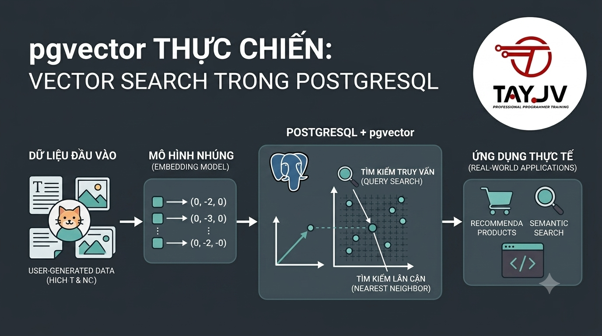

# pgvector Thực Chiến: Vector Search Trong PostgreSQL



Bài 4 bạn đã chạy được demo cơ bản. Bài này đi sâu hơn — tích hợp pgvector trực tiếp vào schema thực của nguyentienkhoi.hashnode.dev, tối ưu index cho production, xây dựng các query pattern thực tế và đo lường hiệu năng. Sau bài này bạn có thể ship semantic search lên production ngay.

## 1\. Thiết Kế Schema pgvector Cho nguyentienkhoi.hashnode.dev

Thay vì tạo bảng riêng, FoxDev sẽ thiết kế schema tích hợp chặt chẽ với database hiện có:

```sql
-- Extension (chạy một lần)
CREATE EXTENSION IF NOT EXISTS vector;

-- ──────────────────────────────────────────
-- Bảng lưu embedding cho courses
-- ──────────────────────────────────────────
CREATE TABLE course_vectors (
    id              BIGSERIAL PRIMARY KEY,
    course_id       BIGINT NOT NULL REFERENCES courses(id) ON DELETE CASCADE,

    -- Nội dung đã được embed (để biết embed từ gì)
    content_text    TEXT NOT NULL,
    content_type    VARCHAR(20) NOT NULL DEFAULT 'full',
    -- 'full'        = title + description + tags
    -- 'title_only'  = chỉ title
    -- 'description' = chỉ description

    -- Vector embedding
    embedding       VECTOR(384) NOT NULL,

    -- Metadata để track
    model_name      VARCHAR(100) NOT NULL DEFAULT 'all-MiniLM-L6-v2',
    model_version   VARCHAR(20),

    -- Timestamps
    created_at      TIMESTAMPTZ NOT NULL DEFAULT CURRENT_TIMESTAMP,
    updated_at      TIMESTAMPTZ NOT NULL DEFAULT CURRENT_TIMESTAMP,

    -- Constraint: mỗi course chỉ có 1 embedding mỗi content_type
    CONSTRAINT uq_course_vectors UNIQUE (course_id, content_type, model_name)
);

-- ──────────────────────────────────────────
-- Bảng lưu embedding cho posts (bài viết)
-- ──────────────────────────────────────────
CREATE TABLE post_vectors (
    id              BIGSERIAL PRIMARY KEY,
    post_id         BIGINT NOT NULL REFERENCES posts(id) ON DELETE CASCADE,
    content_text    TEXT NOT NULL,
    content_type    VARCHAR(20) NOT NULL DEFAULT 'full',
    embedding       VECTOR(384) NOT NULL,
    model_name      VARCHAR(100) NOT NULL DEFAULT 'all-MiniLM-L6-v2',
    created_at      TIMESTAMPTZ NOT NULL DEFAULT CURRENT_TIMESTAMP,
    updated_at      TIMESTAMPTZ NOT NULL DEFAULT CURRENT_TIMESTAMP,

    CONSTRAINT uq_post_vectors UNIQUE (post_id, content_type, model_name)
);

-- ──────────────────────────────────────────
-- Bảng lưu embedding cho users (user preferences)
-- ──────────────────────────────────────────
CREATE TABLE user_preference_vectors (
    id              BIGSERIAL PRIMARY KEY,
    user_id         BIGINT NOT NULL REFERENCES users(id) ON DELETE CASCADE,

    -- Vector tổng hợp từ lịch sử học của user
    embedding       VECTOR(384) NOT NULL,
    model_name      VARCHAR(100) NOT NULL DEFAULT 'all-MiniLM-L6-v2',

    -- Metadata
    courses_count   INT DEFAULT 0,     -- số khóa học đã dùng để tính vector
    last_synced_at  TIMESTAMPTZ,

    created_at      TIMESTAMPTZ NOT NULL DEFAULT CURRENT_TIMESTAMP,
    updated_at      TIMESTAMPTZ NOT NULL DEFAULT CURRENT_TIMESTAMP,

    CONSTRAINT uq_user_pref_vectors UNIQUE (user_id, model_name)
);
```

## 2\. Index Strategy

```sql
-- ──────────────────────────────────────────
-- HNSW Index cho courses — production ready
-- ──────────────────────────────────────────

-- Index chính cho cosine similarity search
CREATE INDEX idx_course_vectors_hnsw_cosine
ON course_vectors
USING hnsw (embedding vector_cosine_ops)
WITH (
    m              = 16,    -- số kết nối mỗi node
    ef_construction = 64    -- độ rộng khi build
);

-- Partial index: chỉ index khóa học đang published
-- Nhỏ hơn nhiều, query nhanh hơn
CREATE INDEX idx_course_vectors_published
ON course_vectors (embedding vector_cosine_ops)
USING hnsw (embedding vector_cosine_ops)
WITH (m = 16, ef_construction = 64)
WHERE content_type = 'full';

-- ──────────────────────────────────────────
-- IVF Index — thay thế khi có > 500k rows
-- ──────────────────────────────────────────
-- CREATE INDEX idx_course_vectors_ivfflat
-- ON course_vectors
-- USING ivfflat (embedding vector_cosine_ops)
-- WITH (lists = 100);  -- sqrt(100k rows) ≈ 316, dùng 100 cho nhỏ

-- ──────────────────────────────────────────
-- Regular B-tree indexes cho filtering
-- ──────────────────────────────────────────
CREATE INDEX idx_course_vectors_course_id ON course_vectors (course_id);
CREATE INDEX idx_course_vectors_model     ON course_vectors (model_name);
CREATE INDEX idx_post_vectors_post_id     ON post_vectors   (post_id);
CREATE INDEX idx_user_pref_user_id        ON user_preference_vectors (user_id);
```

## 3\. Embedding Pipeline

Tạo file `embedding_pipeline.py` — xử lý embed dữ liệu từ PostgreSQL:

```python
import os
import logging
import psycopg2
import psycopg2.extras
from sentence_transformers import SentenceTransformer
from typing import List, Dict, Optional
from datetime import datetime
from dotenv import load_dotenv

load_dotenv()
logging.basicConfig(level=logging.INFO,
                    format='%(asctime)s — %(levelname)s — %(message)s')
logger = logging.getLogger(__name__)

class EmbeddingPipeline:
    """
    Pipeline embed dữ liệu nguyentienkhoi.hashnode.dev vào pgvector
    """

    def __init__(self, model_name: str = "all-MiniLM-L6-v2"):
        self.model_name = model_name
        self.model = SentenceTransformer(model_name)
        self.embedding_dim = self.model.get_sentence_embedding_dimension()
        logger.info(f"Model loaded: {model_name} ({self.embedding_dim} dims)")

        self.conn = psycopg2.connect(
            host=os.getenv("POSTGRES_HOST", "localhost"),
            port=os.getenv("POSTGRES_PORT", 5432),
            user=os.getenv("POSTGRES_USER", "postgres"),
            password=os.getenv("POSTGRES_PASSWORD", "postgres"),
            dbname=os.getenv("POSTGRES_DB", "foxdev_ai")
        )
        self.conn.autocommit = False

    def _build_course_text(self, course: Dict) -> str:
        """
        Xây dựng text để embed từ thông tin khóa học.
        Càng nhiều context → embedding càng chất lượng.
        """
        parts = []

        # Title (quan trọng nhất — lặp lại 2 lần để tăng weight)
        if course.get('title'):
            parts.append(course['title'])
            parts.append(course['title'])  # intentional double

        # Description
        if course.get('description'):
            parts.append(course['description'])

        # Category context
        if course.get('category_name'):
            parts.append(f"Danh mục: {course['category_name']}")

        # Course type context
        if course.get('course_type'):
            type_map = {
                'PAID': 'khóa học có phí',
                'FREE': 'khóa học miễn phí',
                'SUBSCRIPTION': 'khóa học subscription',
            }
            parts.append(type_map.get(course['course_type'], ''))

        return ". ".join(filter(None, parts))

    def embed_courses(self,
                      batch_size: int = 32,
                      only_new: bool = True) -> int:
        """
        Embed tất cả khóa học chưa có vector (hoặc tất cả nếu only_new=False)
        """
        cursor = self.conn.cursor(cursor_factory=psycopg2.extras.DictCursor)

        # Lấy courses cần embed
        if only_new:
            query = """
                SELECT
                    c.id,
                    c.title,
                    c.description,
                    c.course_type,
                    cat.name AS category_name
                FROM courses c
                LEFT JOIN categories cat ON cat.id = c.category_id
                LEFT JOIN course_vectors cv
                       ON cv.course_id = c.id
                      AND cv.model_name = %s
                      AND cv.content_type = 'full'
                WHERE c.course_status = 'PUBLISHED'
                  AND cv.id IS NULL          -- chưa có embedding
                ORDER BY c.id
            """
            cursor.execute(query, (self.model_name,))
        else:
            query = """
                SELECT
                    c.id,
                    c.title,
                    c.description,
                    c.course_type,
                    cat.name AS category_name
                FROM courses c
                LEFT JOIN categories cat ON cat.id = c.category_id
                WHERE c.course_status = 'PUBLISHED'
                ORDER BY c.id
            """
            cursor.execute(query)

        courses = cursor.fetchall()
        logger.info(f"Found {len(courses)} courses to embed")

        if not courses:
            return 0

        # Process theo batch
        total_embedded = 0
        for i in range(0, len(courses), batch_size):
            batch = courses[i:i + batch_size]

            # Tạo text và embedding
            texts = [self._build_course_text(dict(c)) for c in batch]
            embeddings = self.model.encode(
                texts,
                show_progress_bar=False,
                normalize_embeddings=True  # normalize cho cosine similarity
            )

            # Upsert vào database
            for course, text, embedding in zip(batch, texts, embeddings):
                cursor.execute("""
                    INSERT INTO course_vectors
                        (course_id, content_text, content_type, embedding, model_name)
                    VALUES (%s, %s, 'full', %s, %s)
                    ON CONFLICT (course_id, content_type, model_name)
                    DO UPDATE SET
                        content_text = EXCLUDED.content_text,
                        embedding    = EXCLUDED.embedding,
                        updated_at   = NOW()
                """, (
                    course['id'],
                    text,
                    embedding.tolist(),
                    self.model_name
                ))

            self.conn.commit()
            total_embedded += len(batch)
            logger.info(f"Embedded {total_embedded}/{len(courses)} courses")

        cursor.close()
        return total_embedded

    def embed_posts(self, batch_size: int = 32, only_new: bool = True) -> int:
        """
        Embed tất cả bài viết chưa có vector
        """
        cursor = self.conn.cursor(cursor_factory=psycopg2.extras.DictCursor)

        if only_new:
            cursor.execute("""
                SELECT p.id, p.title, p.description, p.seo_description
                FROM posts p
                LEFT JOIN post_vectors pv
                       ON pv.post_id = p.id
                      AND pv.model_name = %s
                WHERE p.post_status = 'PUBLISHED'
                  AND pv.id IS NULL
                ORDER BY p.id
            """, (self.model_name,))
        else:
            cursor.execute("""
                SELECT p.id, p.title, p.description, p.seo_description
                FROM posts p
                WHERE p.post_status = 'PUBLISHED'
                ORDER BY p.id
            """)

        posts = cursor.fetchall()
        logger.info(f"Found {len(posts)} posts to embed")

        if not posts:
            return 0

        total_embedded = 0
        for i in range(0, len(posts), batch_size):
            batch = posts[i:i + batch_size]
            texts = []
            for post in batch:
                # Kết hợp title + description + seo_description
                text = ". ".join(filter(None, [
                    post['title'],
                    post['title'],              # double weight for title
                    post['description'],
                    post['seo_description'],
                ]))
                texts.append(text)

            embeddings = self.model.encode(
                texts,
                normalize_embeddings=True
            )

            for post, text, embedding in zip(batch, texts, embeddings):
                cursor.execute("""
                    INSERT INTO post_vectors
                        (post_id, content_text, content_type, embedding, model_name)
                    VALUES (%s, %s, 'full', %s, %s)
                    ON CONFLICT (post_id, content_type, model_name)
                    DO UPDATE SET
                        content_text = EXCLUDED.content_text,
                        embedding    = EXCLUDED.embedding,
                        updated_at   = NOW()
                """, (post['id'], text, embedding.tolist(), self.model_name))

            self.conn.commit()
            total_embedded += len(batch)

        cursor.close()
        return total_embedded

    def build_user_preference_vector(self, user_id: int) -> bool:
        """
        Tạo preference vector cho user dựa trên lịch sử học.
        Tính trung bình weighted embedding của các khóa đã học.
        """
        cursor = self.conn.cursor(cursor_factory=psycopg2.extras.DictCursor)

        # Lấy embedding của các khóa user đã enroll
        # Weight: completed > enrolled > just viewed
        cursor.execute("""
            SELECT
                cv.embedding,
                CASE
                    WHEN ucc.id IS NOT NULL THEN 3.0  -- completed
                    WHEN tp.completed_count > 5 THEN 2.0  -- in progress
                    ELSE 1.0                              -- just enrolled
                END AS weight
            FROM enrollments e
            JOIN course_vectors cv ON cv.course_id = e.course_id
                                  AND cv.content_type = 'full'
            LEFT JOIN user_course_certificates ucc
                   ON ucc.student_id = e.user_id
                  AND ucc.course_id  = e.course_id
            LEFT JOIN (
                SELECT student_id, COUNT(*) AS completed_count
                FROM tracking_progress
                WHERE completed = TRUE
                GROUP BY student_id
            ) tp ON tp.student_id = e.user_id
            WHERE e.user_id = %s
        """, (user_id,))

        rows = cursor.fetchall()
        if not rows:
            logger.warning(f"User {user_id} has no enrollments")
            return False

        import numpy as np

        # Weighted average của các embeddings
        embeddings = []
        weights = []
        for row in rows:
            # pgvector trả về string '[0.1, 0.2, ...]', cần parse
            emb = [float(x) for x in row['embedding'].strip('[]').split(',')]
            embeddings.append(emb)
            weights.append(row['weight'])

        embeddings = np.array(embeddings)
        weights = np.array(weights)

        # Weighted average
        weighted_avg = np.average(embeddings, axis=0, weights=weights)

        # Normalize
        norm = np.linalg.norm(weighted_avg)
        if norm > 0:
            weighted_avg = weighted_avg / norm

        # Upsert user preference vector
        cursor.execute("""
            INSERT INTO user_preference_vectors
                (user_id, embedding, model_name, courses_count, last_synced_at)
            VALUES (%s, %s, %s, %s, NOW())
            ON CONFLICT (user_id, model_name)
            DO UPDATE SET
                embedding      = EXCLUDED.embedding,
                courses_count  = EXCLUDED.courses_count,
                last_synced_at = NOW(),
                updated_at     = NOW()
        """, (user_id, weighted_avg.tolist(), self.model_name, len(rows)))

        self.conn.commit()
        cursor.close()
        logger.info(f"Built preference vector for user {user_id} from {len(rows)} courses")
        return True

    def close(self):
        self.conn.close()


# ──────────────────────────────────────────
# Chạy pipeline
# ──────────────────────────────────────────
if __name__ == "__main__":
    pipeline = EmbeddingPipeline()

    print("1. Embedding courses...")
    n = pipeline.embed_courses(only_new=True)
    print(f"   → Embedded {n} new courses")

    print("2. Embedding posts...")
    n = pipeline.embed_posts(only_new=True)
    print(f"   → Embedded {n} new posts")

    print("3. Building user preference vectors...")
    # Build cho tất cả users có enrollments
    conn = psycopg2.connect(...)
    cursor = conn.cursor()
    cursor.execute("SELECT DISTINCT user_id FROM enrollments")
    user_ids = [row[0] for row in cursor.fetchall()]
    for uid in user_ids:
        pipeline.build_user_preference_vector(uid)
    print(f"   → Built vectors for {len(user_ids)} users")

    pipeline.close()
    print("✅ Pipeline hoàn thành!")
```

## 4\. Search API

Tạo file `search_service.py` — service thực hiện các loại search:

```python
import os
import psycopg2
import psycopg2.extras
import numpy as np
from sentence_transformers import SentenceTransformer
from typing import List, Dict, Optional, Tuple
from dataclasses import dataclass
from dotenv import load_dotenv

load_dotenv()

@dataclass
class SearchResult:
    id: int
    title: str
    category: str
    price: float
    rating: float
    similarity: float
    content_type: str

class SearchService:

    def __init__(self, model_name: str = "all-MiniLM-L6-v2"):
        self.model = SentenceTransformer(model_name)
        self.model_name = model_name
        self.conn = psycopg2.connect(
            host=os.getenv("POSTGRES_HOST", "localhost"),
            port=os.getenv("POSTGRES_PORT", 5432),
            user=os.getenv("POSTGRES_USER", "postgres"),
            password=os.getenv("POSTGRES_PASSWORD", "postgres"),
            dbname=os.getenv("POSTGRES_DB", "foxdev_ai")
        )

    def semantic_search_courses(
        self,
        query: str,
        limit: int = 10,
        category_id: Optional[int] = None,
        max_price: Optional[float] = None,
        min_rating: Optional[float] = None,
        course_type: Optional[str] = None,
        similarity_threshold: float = 0.5
    ) -> List[SearchResult]:
        """
        Semantic search khóa học với optional filters.
        Chỉ trả về kết quả có similarity >= threshold.
        """
        # Embed query
        query_embedding = self.model.encode(
            query, normalize_embeddings=True
        ).tolist()

        # Build dynamic WHERE conditions
        conditions = [
            "c.course_status = 'PUBLISHED'",
            "cv.model_name = %s",
            "1 - (cv.embedding <=> %s::vector) >= %s",  # similarity threshold
        ]
        params = [self.model_name, query_embedding, similarity_threshold]

        if category_id:
            conditions.append("c.category_id = %s")
            params.append(category_id)

        if max_price is not None:
            conditions.append("(cp.price <= %s OR c.course_type = 'FREE')")
            params.append(max_price)

        if min_rating is not None:
            conditions.append("c.rating >= %s")
            params.append(min_rating)

        if course_type:
            conditions.append("c.course_type = %s")
            params.append(course_type)

        params.extend([query_embedding, limit])

        sql = f"""
            SELECT
                c.id,
                c.title,
                cat.name                                    AS category,
                COALESCE(cp.price, 0)                      AS price,
                COALESCE(c.rating, 0)                      AS rating,
                1 - (cv.embedding <=> %s::vector)          AS similarity,
                cv.content_type
            FROM course_vectors cv
            JOIN courses   c   ON c.id   = cv.course_id
            JOIN categories cat ON cat.id = c.category_id
            LEFT JOIN course_pricing cp
                   ON cp.course_id = c.id
                  AND cp.currency  = 'VND'
                  AND cp.is_active = TRUE
            WHERE {" AND ".join(conditions)}
            ORDER BY cv.embedding <=> %s::vector
            LIMIT %s
        """

        cursor = self.conn.cursor(cursor_factory=psycopg2.extras.DictCursor)
        cursor.execute(sql, params)
        rows = cursor.fetchall()
        cursor.close()

        return [
            SearchResult(
                id=row['id'],
                title=row['title'],
                category=row['category'],
                price=float(row['price']),
                rating=float(row['rating']),
                similarity=float(row['similarity']),
                content_type=row['content_type']
            )
            for row in rows
        ]

    def get_similar_courses(
        self,
        course_id: int,
        limit: int = 6,
        exclude_same_category: bool = False
    ) -> List[SearchResult]:
        """
        Tìm khóa học tương tự với một khóa học cho trước.
        Dùng cho: "Bạn có thể quan tâm đến..."
        """
        cursor = self.conn.cursor(cursor_factory=psycopg2.extras.DictCursor)

        # Lấy embedding của khóa gốc
        cursor.execute("""
            SELECT cv.embedding, c.category_id
            FROM course_vectors cv
            JOIN courses c ON c.id = cv.course_id
            WHERE cv.course_id = %s AND cv.model_name = %s
        """, (course_id, self.model_name))

        row = cursor.fetchone()
        if not row:
            cursor.close()
            return []

        source_embedding = row['embedding']
        source_category  = row['category_id']

        # Build query
        extra_condition = ""
        params = [source_embedding, course_id, self.model_name, source_embedding, limit]

        if exclude_same_category:
            extra_condition = "AND c.category_id != %s"
            params = [source_embedding, course_id, self.model_name,
                      source_category, source_embedding, limit]

        sql = f"""
            SELECT
                c.id,
                c.title,
                cat.name                                AS category,
                COALESCE(cp.price, 0)                  AS price,
                COALESCE(c.rating, 0)                  AS rating,
                1 - (cv.embedding <=> %s::vector)      AS similarity,
                cv.content_type
            FROM course_vectors cv
            JOIN courses    c   ON c.id   = cv.course_id
            JOIN categories cat ON cat.id = c.category_id
            LEFT JOIN course_pricing cp
                   ON cp.course_id = c.id
                  AND cp.currency  = 'VND'
                  AND cp.is_active = TRUE
            WHERE c.course_status = 'PUBLISHED'
              AND cv.course_id   != %s
              AND cv.model_name   = %s
              {extra_condition}
            ORDER BY cv.embedding <=> %s::vector
            LIMIT %s
        """

        cursor.execute(sql, params)
        rows = cursor.fetchall()
        cursor.close()

        return [
            SearchResult(
                id=row['id'],
                title=row['title'],
                category=row['category'],
                price=float(row['price']),
                rating=float(row['rating']),
                similarity=float(row['similarity']),
                content_type=row['content_type']
            )
            for row in rows
        ]

    def get_recommendations_for_user(
        self,
        user_id: int,
        limit: int = 10
    ) -> List[SearchResult]:
        """
        Recommend khóa học dựa trên preference vector của user.
        Loại trừ những khóa user đã enroll.
        """
        cursor = self.conn.cursor(cursor_factory=psycopg2.extras.DictCursor)

        # Lấy preference vector của user
        cursor.execute("""
            SELECT embedding FROM user_preference_vectors
            WHERE user_id = %s AND model_name = %s
        """, (user_id, self.model_name))

        row = cursor.fetchone()
        if not row:
            cursor.close()
            return []

        user_vector = row['embedding']

        cursor.execute("""
            SELECT
                c.id,
                c.title,
                cat.name                               AS category,
                COALESCE(cp.price, 0)                 AS price,
                COALESCE(c.rating, 0)                 AS rating,
                1 - (cv.embedding <=> %s::vector)     AS similarity,
                cv.content_type
            FROM course_vectors cv
            JOIN courses    c   ON c.id   = cv.course_id
            JOIN categories cat ON cat.id = c.category_id
            LEFT JOIN course_pricing cp
                   ON cp.course_id = c.id
                  AND cp.currency  = 'VND'
                  AND cp.is_active = TRUE
            WHERE c.course_status = 'PUBLISHED'
              AND cv.model_name   = %s
              -- Loại trừ khóa đã enroll
              AND c.id NOT IN (
                  SELECT course_id FROM enrollments WHERE user_id = %s
              )
            ORDER BY cv.embedding <=> %s::vector
            LIMIT %s
        """, (user_vector, self.model_name, user_id, user_vector, limit))

        rows = cursor.fetchall()
        cursor.close()

        return [
            SearchResult(
                id=row['id'],
                title=row['title'],
                category=row['category'],
                price=float(row['price']),
                rating=float(row['rating']),
                similarity=float(row['similarity']),
                content_type=row['content_type']
            )
            for row in rows
        ]

    def search_posts(
        self,
        query: str,
        limit: int = 10,
        category_id: Optional[int] = None
    ) -> List[Dict]:
        """
        Semantic search bài viết/blog
        """
        query_embedding = self.model.encode(
            query, normalize_embeddings=True
        ).tolist()

        conditions = [
            "p.post_status = 'PUBLISHED'",
            "pv.model_name = %s",
        ]
        params = [self.model_name, query_embedding]

        if category_id:
            conditions.append("""
                p.id IN (
                    SELECT post_id FROM post_categories WHERE category_id = %s
                )
            """)
            params.append(category_id)

        params.extend([query_embedding, limit])

        sql = f"""
            SELECT
                p.id,
                p.title,
                p.slug,
                p.published_at,
                p.view_count,
                1 - (pv.embedding <=> %s::vector) AS similarity
            FROM post_vectors pv
            JOIN posts p ON p.id = pv.post_id
            WHERE {" AND ".join(conditions)}
            ORDER BY pv.embedding <=> %s::vector
            LIMIT %s
        """

        cursor = self.conn.cursor(cursor_factory=psycopg2.extras.DictCursor)
        cursor.execute(sql, params)
        rows = cursor.fetchall()
        cursor.close()
        return [dict(row) for row in rows]

    def close(self):
        self.conn.close()


# ──────────────────────────────────────────
# Test các search functions
# ──────────────────────────────────────────
if __name__ == "__main__":
    service = SearchService()

    print("=" * 60)
    print("1. SEMANTIC SEARCH COURSES")
    print("=" * 60)
    results = service.semantic_search_courses(
        query="học backend Java cho người mới bắt đầu",
        limit=5,
        min_rating=4.5
    )
    for r in results:
        print(f"  [{r.similarity:.4f}] {r.title} — ⭐{r.rating}")

    print("\n" + "=" * 60)
    print("2. SIMILAR COURSES")
    print("=" * 60)
    similar = service.get_similar_courses(course_id=1, limit=3)
    print(f"  Tương tự 'Spring Boot':")
    for r in similar:
        print(f"  [{r.similarity:.4f}] {r.title} ({r.category})")

    print("\n" + "=" * 60)
    print("3. RECOMMENDATIONS FOR USER")
    print("=" * 60)
    recs = service.get_recommendations_for_user(user_id=1, limit=5)
    print(f"  Đề xuất cho user #1:")
    for r in recs:
        print(f"  [{r.similarity:.4f}] {r.title}")

    print("\n" + "=" * 60)
    print("4. SEARCH POSTS")
    print("=" * 60)
    posts = service.search_posts("SQL optimization cho developer")
    for p in posts:
        print(f"  [{p['similarity']:.4f}] {p['title']}")

    service.close()
```

## 5\. Tối Ưu Query Performance

### Đo Lường Trước Khi Tối Ưu

```sql
-- Bật timing
\timing on

-- Xem query plan
EXPLAIN (ANALYZE, BUFFERS, FORMAT TEXT)
SELECT
    c.id,
    c.title,
    1 - (cv.embedding <=> '[0.1, 0.2, ...]'::vector) AS similarity
FROM course_vectors cv
JOIN courses c ON c.id = cv.course_id
WHERE c.course_status = 'PUBLISHED'
ORDER BY cv.embedding <=> '[0.1, 0.2, ...]'::vector
LIMIT 10;
```

### Tune ef Parameter Khi Query

```sql
-- Tăng ef để chính xác hơn (nhưng chậm hơn một chút)
SET hnsw.ef_search = 100;  -- mặc định là 40

-- Với dataset nhỏ (<10k courses), ef=100 vẫn rất nhanh
-- Chỉ cần tune khi dataset lớn
```

### Kết Hợp Vector Search Với CTE

```sql
-- Pattern hiệu quả: filter trước, search sau
WITH published_courses AS (
    -- Bước 1: lấy courses thỏa filter conditions
    SELECT c.id, c.title, c.rating, cp.price, cat.name AS category
    FROM courses c
    JOIN categories cat ON cat.id = c.category_id
    LEFT JOIN course_pricing cp
           ON cp.course_id = c.id AND cp.currency = 'VND' AND cp.is_active = TRUE
    WHERE c.course_status = 'PUBLISHED'
      AND c.rating >= 4.5           -- filter trước
      AND cp.price <= 800000
),
vector_search AS (
    -- Bước 2: vector search trên subset đã filter
    SELECT cv.course_id,
           1 - (cv.embedding <=> '[...]'::vector) AS similarity
    FROM course_vectors cv
    WHERE cv.course_id IN (SELECT id FROM published_courses)
      AND cv.model_name = 'all-MiniLM-L6-v2'
    ORDER BY cv.embedding <=> '[...]'::vector
    LIMIT 20
)
-- Bước 3: join để lấy thông tin đầy đủ
SELECT
    pc.id,
    pc.title,
    pc.category,
    pc.price,
    pc.rating,
    vs.similarity
FROM vector_search vs
JOIN published_courses pc ON pc.id = vs.course_id
ORDER BY vs.similarity DESC
LIMIT 10;
```

## 6\. Trigger Tự Động Re-embed Khi Dữ Liệu Thay Đổi

```sql
-- Đánh dấu cần re-embed khi course thay đổi title hoặc description
CREATE OR REPLACE FUNCTION mark_course_needs_reembed()
RETURNS TRIGGER
LANGUAGE plpgsql AS $$
BEGIN
    IF OLD.title != NEW.title OR OLD.description IS DISTINCT FROM NEW.description THEN
        -- Xóa embedding cũ → pipeline sẽ tự tạo lại
        DELETE FROM course_vectors
        WHERE course_id  = NEW.id
          AND model_name = 'all-MiniLM-L6-v2';

        RAISE NOTICE 'Course % marked for re-embedding', NEW.id;
    END IF;
    RETURN NEW;
END;
$$;

CREATE TRIGGER trg_course_reembed
AFTER UPDATE ON courses
FOR EACH ROW
EXECUTE FUNCTION mark_course_needs_reembed();
```

## 7\. Monitoring

```sql
-- Xem số lượng embeddings theo model
SELECT
    model_name,
    content_type,
    COUNT(*)               AS total_vectors,
    MIN(created_at)        AS first_embedded,
    MAX(updated_at)        AS last_updated
FROM course_vectors
GROUP BY model_name, content_type
ORDER BY model_name, content_type;

-- Courses chưa có embedding
SELECT c.id, c.title
FROM courses c
LEFT JOIN course_vectors cv ON cv.course_id = c.id
WHERE c.course_status = 'PUBLISHED'
  AND cv.id IS NULL;

-- Xem kích thước index
SELECT
    indexname,
    pg_size_pretty(pg_relation_size(indexname::regclass)) AS index_size
FROM pg_indexes
WHERE tablename = 'course_vectors'
ORDER BY pg_relation_size(indexname::regclass) DESC;
```

## Tổng Kết


| Pattern | Dùng khi |
|---|---|
| embedding <=> query | Cosine distance — phổ biến nhất |
| SET hnsw.ef_search = N | Tune accuracy vs speed |
| CTE pre-filter + vector search | Kết hợp SQL filter với ANN |
| Trigger re-embed | Tự động sync khi dữ liệu thay đổi |
| Weighted average embedding | User preference vector |
| normalize_embeddings=True | Cần thiết khi dùng cosine similarity |


Bài tiếp theo chúng ta sẽ học **Qdrant thực chiến** — tận dụng các tính năng mạnh hơn của Qdrant: sparse vector, payload indexing, collections management và performance tuning cho production.

