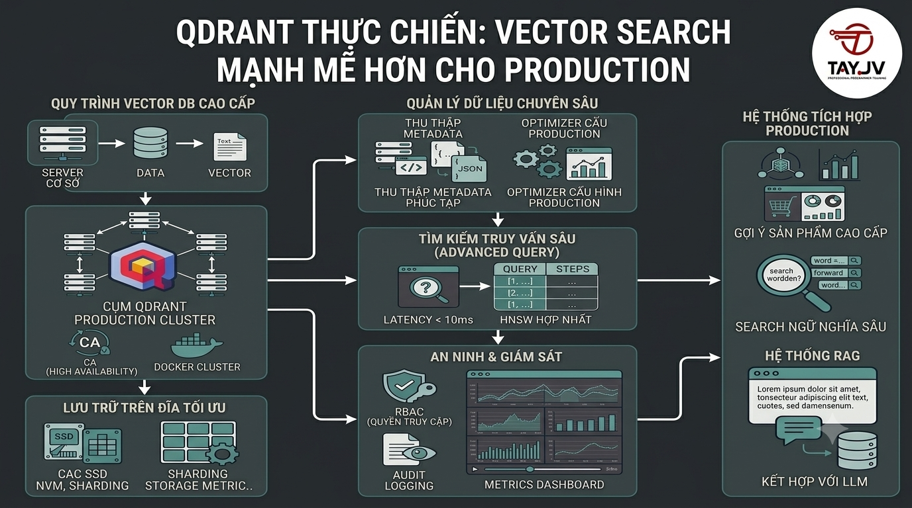

# Qdrant Thực Chiến: Vector Search Mạnh Mẽ Hơn Cho Production



Bài 5 bạn đã biết dùng pgvector — đơn giản, tích hợp thẳng vào PostgreSQL. Bài này sẽ học Qdrant — Vector DB chuyên dụng với nhiều tính năng mạnh hơn: payload indexing, sparse vector, named vectors, snapshot backup và performance tuning. Qdrant là lựa chọn khi bạn cần scale lên hàng triệu vectors hoặc cần filtering linh hoạt hơn.

## 1\. Tại Sao Qdrant Mạnh Hơn pgvector?

```java
pgvector:                          Qdrant:
──────────────────                 ──────────────────────────
✅ Tích hợp PostgreSQL             ✅ Purpose-built cho vector
✅ SQL quen thuộc                  ✅ Filtering nhanh hơn nhiều
✅ Không thêm infra                ✅ Sparse + Dense vector
❌ Quantization hạn chế            ✅ Quantization đầy đủ
❌ Filtering chậm hơn              ✅ Named vectors (nhiều vector/point)
❌ Không có built-in dashboard     ✅ Dashboard đẹp, REST + gRPC API
❌ Scale giới hạn                  ✅ Scale tới hàng tỷ vectors
```

**Dùng Qdrant khi:**

*   Dataset > 1M vectors
    
*   Cần filtering phức tạp với nhiều điều kiện
    
*   Cần lưu nhiều loại vector cho cùng một document
    
*   Cần Quantization để tiết kiệm RAM
    
*   Cần monitoring và observability tốt hơn
    

## 2\. Qdrant Core Concepts

```java
Collection          ← Tương đương bảng trong SQL
    │
    ├── Points      ← Tương đương dòng trong SQL
    │       ├── ID          (uint64 hoặc UUID)
    │       ├── Vector(s)   (float32 array hoặc sparse)
    │       └── Payload     (JSON metadata)
    │
    └── Config
            ├── Vector config (size, distance)
            ├── HNSW config   (m, ef_construct)
            └── Quantization  (scalar, binary, product)
```

## 3\. Collection Management

```python
from qdrant_client import QdrantClient
from qdrant_client.models import (
    Distance, VectorParams, HnswConfigDiff,
    ScalarQuantizationConfig, ScalarType,
    BinaryQuantizationConfig,
    PayloadSchemaType, OptimizersConfigDiff
)

client = QdrantClient(host="localhost", port=6333)

# ──────────────────────────────────────────
# Tạo collection cơ bản
# ──────────────────────────────────────────
client.create_collection(
    collection_name="foxdev_courses",
    vectors_config=VectorParams(
        size=384,
        distance=Distance.COSINE,
        on_disk=False  # True nếu muốn lưu vector trên disk thay RAM
    )
)

# ──────────────────────────────────────────
# Tạo collection với HNSW config tùy chỉnh
# ──────────────────────────────────────────
client.create_collection(
    collection_name="foxdev_courses_optimized",
    vectors_config=VectorParams(
        size=384,
        distance=Distance.COSINE
    ),
    hnsw_config=HnswConfigDiff(
        m=16,               # connections per node
        ef_construct=100,   # build quality
        full_scan_threshold=10000,  # dưới ngưỡng này dùng brute force
        on_disk=False       # True để tiết kiệm RAM (chậm hơn)
    ),
    optimizers_config=OptimizersConfigDiff(
        indexing_threshold=20000,  # số points trước khi build index
        memmap_threshold=50000     # dùng mmap thay RAM khi vượt ngưỡng
    )
)

# ──────────────────────────────────────────
# Tạo collection với Scalar Quantization
# Tiết kiệm RAM 4x với accuracy giảm ~1%
# ──────────────────────────────────────────
client.create_collection(
    collection_name="foxdev_courses_sq",
    vectors_config=VectorParams(
        size=384,
        distance=Distance.COSINE
    ),
    quantization_config=ScalarQuantizationConfig(
        type=ScalarType.INT8,   # float32 → int8 = 4x nhỏ hơn
        quantile=0.99,          # bỏ qua 1% outlier để quantize tốt hơn
        always_ram=True         # giữ quantized vectors trong RAM
    )
)

# ──────────────────────────────────────────
# Tạo collection với Binary Quantization
# Tiết kiệm RAM 32x với accuracy ~90%
# ──────────────────────────────────────────
client.create_collection(
    collection_name="foxdev_courses_bq",
    vectors_config=VectorParams(
        size=384,
        distance=Distance.COSINE
    ),
    quantization_config=BinaryQuantizationConfig(
        always_ram=True
    )
)

# ──────────────────────────────────────────
# Xem thông tin collection
# ──────────────────────────────────────────
info = client.get_collection("foxdev_courses")
print(f"Points: {info.points_count}")
print(f"Vectors: {info.vectors_count}")
print(f"Status: {info.status}")
print(f"Config: {info.config}")

# ──────────────────────────────────────────
# Xóa collection
# ──────────────────────────────────────────
client.delete_collection("foxdev_courses")
```

## 4\. Payload Indexing — Filter Nhanh Hơn

Payload index giúp Qdrant filter **trước khi** vector search — cực kỳ quan trọng khi filter loại bỏ phần lớn dữ liệu:

```python
# ──────────────────────────────────────────
# Tạo payload indexes cho các field hay filter
# ──────────────────────────────────────────

# Keyword index — cho exact match (category, course_type, status)
client.create_payload_index(
    collection_name="foxdev_courses",
    field_name="category",
    field_schema=PayloadSchemaType.KEYWORD
)

client.create_payload_index(
    collection_name="foxdev_courses",
    field_name="course_type",
    field_schema=PayloadSchemaType.KEYWORD
)

# Integer index — cho range query (price, rating * 10)
client.create_payload_index(
    collection_name="foxdev_courses",
    field_name="price",
    field_schema=PayloadSchemaType.INTEGER
)

# Float index — cho rating
client.create_payload_index(
    collection_name="foxdev_courses",
    field_name="rating",
    field_schema=PayloadSchemaType.FLOAT
)

# Boolean index — cho is_free
client.create_payload_index(
    collection_name="foxdev_courses",
    field_name="is_free",
    field_schema=PayloadSchemaType.BOOL
)

# Text index — cho full-text search trong payload
client.create_payload_index(
    collection_name="foxdev_courses",
    field_name="title",
    field_schema=models.TextIndexParams(
        type="text",
        tokenizer=models.TokenizerType.WORD,
        min_token_len=2,
        max_token_len=15,
        lowercase=True
    )
)

print("✅ Payload indexes created")
```

## 5\. Points Operations — CRUD

```python
from qdrant_client.models import (
    PointStruct, PointIdsList,
    UpdateStatus
)
from sentence_transformers import SentenceTransformer

model = SentenceTransformer('all-MiniLM-L6-v2')

# ──────────────────────────────────────────
# UPSERT points
# ──────────────────────────────────────────
def upsert_courses(courses: list):
    points = []
    texts = [f"{c['title']}. {c['description']}" for c in courses]
    embeddings = model.encode(texts, normalize_embeddings=True)

    for course, embedding in zip(courses, embeddings):
        points.append(PointStruct(
            id=course['id'],
            vector=embedding.tolist(),
            payload={
                "title":          course['title'],
                "description":    course['description'],
                "category":       course['category'],
                "course_type":    course['course_type'],
                "price":          course['price'],
                "rating":         course['rating'],
                "is_free":        course['price'] == 0,
                "enrolled_count": course.get('enrolled_count', 0),
                "tags":           course.get('tags', []),
                "instructor_id":  course.get('instructor_id'),
                "created_at":     course.get('created_at', ''),
            }
        ))

    result = client.upsert(
        collection_name="foxdev_courses",
        points=points,
        wait=True   # chờ đến khi index xong mới return
    )
    return result.status == UpdateStatus.COMPLETED

# ──────────────────────────────────────────
# GET một point
# ──────────────────────────────────────────
point = client.retrieve(
    collection_name="foxdev_courses",
    ids=[1],
    with_vectors=True,   # trả về vector
    with_payload=True    # trả về payload
)[0]

print(f"ID: {point.id}")
print(f"Title: {point.payload['title']}")
print(f"Vector dims: {len(point.vector)}")

# ──────────────────────────────────────────
# UPDATE payload (không cần re-embed)
# ──────────────────────────────────────────
client.set_payload(
    collection_name="foxdev_courses",
    payload={
        "rating":         4.9,
        "enrolled_count": 350,
    },
    points=[1]  # course_id = 1
)

# Xóa một field khỏi payload
client.delete_payload(
    collection_name="foxdev_courses",
    keys=["old_field"],
    points=[1]
)

# ──────────────────────────────────────────
# DELETE points
# ──────────────────────────────────────────
# Xóa theo ID
client.delete(
    collection_name="foxdev_courses",
    points_selector=PointIdsList(points=[1, 2, 3])
)

# Xóa theo filter (xóa tất cả DRAFT courses)
from qdrant_client.models import FilterSelector, Filter, FieldCondition, MatchValue

client.delete(
    collection_name="foxdev_courses",
    points_selector=FilterSelector(
        filter=Filter(
            must=[FieldCondition(
                key="course_type",
                match=MatchValue(value="DRAFT")
            )]
        )
    )
)
```

## 6\. Advanced Search — Tất Cả Các Loại Query

```python
from qdrant_client.models import (
    Filter, FieldCondition, MatchValue, MatchAny,
    Range, HasId, IsNull, IsEmpty,
    SearchParams, QuantizationSearchParams
)

# ──────────────────────────────────────────
# 1. Basic Semantic Search
# ──────────────────────────────────────────
query_vector = model.encode(
    "học lập trình backend Java",
    normalize_embeddings=True
).tolist()

results = client.search(
    collection_name="foxdev_courses",
    query_vector=query_vector,
    limit=10,
    with_payload=True,
    score_threshold=0.5  # chỉ trả về kết quả có score >= 0.5
)

# ──────────────────────────────────────────
# 2. Search Với Filter Phức Tạp
# ──────────────────────────────────────────

# MUST (AND) — tất cả điều kiện đều phải thỏa
results = client.search(
    collection_name="foxdev_courses",
    query_vector=query_vector,
    query_filter=Filter(
        must=[
            FieldCondition(key="course_type",
                          match=MatchValue(value="PAID")),
            FieldCondition(key="rating",
                          range=Range(gte=4.5)),
            FieldCondition(key="price",
                          range=Range(lte=800000)),
        ]
    ),
    limit=5
)

# SHOULD (OR) — ít nhất một điều kiện thỏa
results = client.search(
    collection_name="foxdev_courses",
    query_vector=query_vector,
    query_filter=Filter(
        should=[
            FieldCondition(key="category",
                          match=MatchValue(value="java")),
            FieldCondition(key="category",
                          match=MatchValue(value="backend")),
        ]
    ),
    limit=5
)

# MUST_NOT (NOT) — điều kiện không được thỏa
results = client.search(
    collection_name="foxdev_courses",
    query_vector=query_vector,
    query_filter=Filter(
        must_not=[
            FieldCondition(key="category",
                          match=MatchValue(value="frontend")),
        ]
    ),
    limit=5
)

# Kết hợp phức tạp: PAID java course, rating >= 4.5, không phải frontend
results = client.search(
    collection_name="foxdev_courses",
    query_vector=query_vector,
    query_filter=Filter(
        must=[
            FieldCondition(key="course_type",
                          match=MatchValue(value="PAID")),
            FieldCondition(key="rating",
                          range=Range(gte=4.5)),
        ],
        should=[
            FieldCondition(key="category",
                          match=MatchValue(value="java")),
            FieldCondition(key="category",
                          match=MatchValue(value="backend")),
        ],
        must_not=[
            FieldCondition(key="category",
                          match=MatchValue(value="frontend")),
        ]
    ),
    limit=5
)

# MatchAny — một trong nhiều values
results = client.search(
    collection_name="foxdev_courses",
    query_vector=query_vector,
    query_filter=Filter(
        must=[
            FieldCondition(
                key="category",
                match=MatchAny(any=["java", "backend", "devops"])
            )
        ]
    ),
    limit=5
)

# ──────────────────────────────────────────
# 3. Search Với Quantization
# ──────────────────────────────────────────
results = client.search(
    collection_name="foxdev_courses_sq",
    query_vector=query_vector,
    search_params=SearchParams(
        quantization=QuantizationSearchParams(
            ignore=False,        # dùng quantized vectors
            rescore=True,        # rescore top-K bằng full precision
            oversampling=2.0     # lấy gấp 2 để rescore → accuracy tốt hơn
        )
    ),
    limit=10
)

# ──────────────────────────────────────────
# 4. Scroll — Lấy Tất Cả Points Theo Filter
# (Không dùng vector, chỉ filter metadata)
# ──────────────────────────────────────────
results, next_offset = client.scroll(
    collection_name="foxdev_courses",
    scroll_filter=Filter(
        must=[FieldCondition(
            key="course_type",
            match=MatchValue(value="FREE")
        )]
    ),
    limit=100,
    with_payload=True,
    offset=None  # tiếp tục từ đây nếu paginate
)

# Iterate tất cả pages
all_free_courses = []
offset = None
while True:
    results, offset = client.scroll(
        collection_name="foxdev_courses",
        scroll_filter=Filter(
            must=[FieldCondition(key="is_free",
                                match=MatchValue(value=True))]
        ),
        limit=100,
        offset=offset
    )
    all_free_courses.extend(results)
    if offset is None:
        break

print(f"Total free courses: {len(all_free_courses)}")

# ──────────────────────────────────────────
# 5. Count — Đếm Points Theo Filter
# ──────────────────────────────────────────
count = client.count(
    collection_name="foxdev_courses",
    count_filter=Filter(
        must=[FieldCondition(
            key="rating",
            range=Range(gte=4.7)
        )]
    ),
    exact=True  # exact count (chậm hơn) hoặc estimate (nhanh)
)
print(f"Courses with rating >= 4.7: {count.count}")
```

## 7\. Named Vectors — Nhiều Vector Trên Cùng Một Point

Tính năng mạnh của Qdrant — mỗi point có thể có nhiều vector với tên khác nhau:

```python
from qdrant_client.models import VectorsConfig

# Tạo collection với multiple named vectors
client.create_collection(
    collection_name="foxdev_courses_multiview",
    vectors_config={
        # Vector từ title + description
        "content": VectorParams(size=384, distance=Distance.COSINE),
        # Vector từ title only (cho title search nhanh)
        "title":   VectorParams(size=384, distance=Distance.COSINE),
        # Vector từ tags (cho tag-based recommendation)
        "tags":    VectorParams(size=384, distance=Distance.COSINE),
    }
)

# Upsert point với nhiều vectors
points = []
for course in courses:
    content_text = f"{course['title']}. {course['description']}"
    title_text   = course['title']
    tags_text    = " ".join(course.get('tags', []))

    content_emb = model.encode(content_text, normalize_embeddings=True)
    title_emb   = model.encode(title_text,   normalize_embeddings=True)
    tags_emb    = model.encode(tags_text,    normalize_embeddings=True) if tags_text else None

    vectors = {
        "content": content_emb.tolist(),
        "title":   title_emb.tolist(),
    }
    if tags_emb is not None:
        vectors["tags"] = tags_emb.tolist()

    points.append(PointStruct(
        id=course['id'],
        vector=vectors,     # dict thay vì list
        payload={"title": course['title'], "category": course['category']}
    ))

client.upsert(collection_name="foxdev_courses_multiview", points=points)

# Search trên vector cụ thể
results = client.search(
    collection_name="foxdev_courses_multiview",
    query_vector=("content", query_vector),   # chỉ định tên vector
    limit=5
)

# Search trên title vector (nhanh hơn, ít context hơn)
results = client.search(
    collection_name="foxdev_courses_multiview",
    query_vector=("title", query_vector),
    limit=5
)
```

## 8\. Batch Operations — Xử Lý Dữ Liệu Lớn

```python
from qdrant_client.models import Batch
import time

def batch_upsert_courses(courses: list,
                          batch_size: int = 100,
                          show_progress: bool = True):
    """
    Upsert hàng nghìn courses hiệu quả
    """
    total = len(courses)
    uploaded = 0
    start_time = time.time()

    for i in range(0, total, batch_size):
        batch = courses[i:i + batch_size]
        texts = [f"{c['title']}. {c['description']}" for c in batch]

        # Encode cả batch một lúc — nhanh hơn encode từng cái
        embeddings = model.encode(
            texts,
            batch_size=32,
            normalize_embeddings=True,
            show_progress_bar=False
        )

        points = [
            PointStruct(
                id=course['id'],
                vector=embedding.tolist(),
                payload={
                    "title":    course['title'],
                    "category": course['category'],
                    "price":    course['price'],
                    "rating":   course['rating'],
                }
            )
            for course, embedding in zip(batch, embeddings)
        ]

        client.upsert(
            collection_name="foxdev_courses",
            points=points,
            wait=False  # async — không chờ index xong, nhanh hơn
        )

        uploaded += len(batch)
        if show_progress:
            elapsed = time.time() - start_time
            rate = uploaded / elapsed
            eta  = (total - uploaded) / rate if rate > 0 else 0
            print(f"\r  {uploaded}/{total} ({rate:.0f}/s, ETA: {eta:.0f}s)", end="")

    # Chờ index xong sau khi upload hết
    client.update_collection(
        collection_name="foxdev_courses",
        optimizer_config=OptimizersConfigDiff(indexing_threshold=0)
    )
    print(f"\n✅ Uploaded {total} points in {time.time()-start_time:.1f}s")
```

## 9\. Snapshot & Backup

```python
# ──────────────────────────────────────────
# Tạo snapshot để backup
# ──────────────────────────────────────────
snapshot_info = client.create_snapshot(
    collection_name="foxdev_courses"
)
print(f"Snapshot: {snapshot_info.name}")
print(f"Size: {snapshot_info.size} bytes")

# Xem danh sách snapshots
snapshots = client.list_snapshots(collection_name="foxdev_courses")
for snap in snapshots:
    print(f"  {snap.name} — {snap.creation_time}")

# Restore từ snapshot
client.recover_from_snapshot(
    collection_name="foxdev_courses_restored",
    location=f"http://localhost:6333/collections/tayjava_courses/snapshots/{snapshot_info.name}"
)

# Xóa snapshot cũ
client.delete_snapshot(
    collection_name="foxdev_courses",
    snapshot_name=snapshot_info.name
)
```

## 10\. Qdrant Service Hoàn Chỉnh Cho [nguyentienkhoi.hashnode.dev](http://nguyentienkhoi.hashnode.dev)

```python
import os
import logging
from typing import List, Optional, Dict, Any
from dataclasses import dataclass, field
from sentence_transformers import SentenceTransformer
from qdrant_client import QdrantClient
from qdrant_client.models import (
    Distance, VectorParams, Filter,
    FieldCondition, MatchValue, MatchAny, Range,
    PointStruct, UpdateStatus, HnswConfigDiff,
    ScalarQuantizationConfig, ScalarType,
    PayloadSchemaType, SearchParams,
    QuantizationSearchParams
)
from dotenv import load_dotenv

load_dotenv()
logger = logging.getLogger(__name__)

COLLECTION = "foxdev_courses"
MODEL_NAME = "all-MiniLM-L6-v2"
VECTOR_DIM = 384

@dataclass
class CourseSearchResult:
    course_id:  int
    title:      str
    category:   str
    price:      float
    rating:     float
    is_free:    bool
    score:      float
    tags:       List[str] = field(default_factory=list)

class QdrantCourseService:

    def __init__(self):
        self.client = QdrantClient(
            host=os.getenv("QDRANT_HOST", "localhost"),
            port=int(os.getenv("QDRANT_PORT", 6333)),
            timeout=30
        )
        self.model = SentenceTransformer(MODEL_NAME)
        self._ensure_collection()

    def _ensure_collection(self):
        """Tạo collection nếu chưa có"""
        if not self.client.collection_exists(COLLECTION):
            self.client.create_collection(
                collection_name=COLLECTION,
                vectors_config=VectorParams(
                    size=VECTOR_DIM,
                    distance=Distance.COSINE
                ),
                hnsw_config=HnswConfigDiff(
                    m=16,
                    ef_construct=100
                ),
                quantization_config=ScalarQuantizationConfig(
                    type=ScalarType.INT8,
                    always_ram=True
                )
            )
            # Tạo payload indexes
            for field_name, schema in [
                ("category",    PayloadSchemaType.KEYWORD),
                ("course_type", PayloadSchemaType.KEYWORD),
                ("price",       PayloadSchemaType.INTEGER),
                ("rating",      PayloadSchemaType.FLOAT),
                ("is_free",     PayloadSchemaType.BOOL),
            ]:
                self.client.create_payload_index(
                    collection_name=COLLECTION,
                    field_name=field_name,
                    field_schema=schema
                )
            logger.info(f"Collection '{COLLECTION}' created")

    def upsert_course(self, course: Dict[str, Any]) -> bool:
        text = f"{course['title']}. {course.get('description', '')}"
        embedding = self.model.encode(text, normalize_embeddings=True)

        result = self.client.upsert(
            collection_name=COLLECTION,
            points=[PointStruct(
                id=course['id'],
                vector=embedding.tolist(),
                payload={
                    "title":          course['title'],
                    "category":       course.get('category', ''),
                    "course_type":    course.get('course_type', 'PAID'),
                    "price":          int(course.get('price', 0)),
                    "rating":         float(course.get('rating', 0)),
                    "is_free":        course.get('price', 0) == 0,
                    "enrolled_count": course.get('enrolled_count', 0),
                    "tags":           course.get('tags', []),
                }
            )],
            wait=True
        )
        return result.status == UpdateStatus.COMPLETED

    def search(
        self,
        query: str,
        limit: int = 10,
        categories: Optional[List[str]] = None,
        max_price: Optional[int] = None,
        min_rating: Optional[float] = None,
        free_only: bool = False,
        score_threshold: float = 0.4
    ) -> List[CourseSearchResult]:

        query_vector = self.model.encode(
            query, normalize_embeddings=True
        ).tolist()

        # Build filter
        must_conditions = []

        if categories:
            must_conditions.append(
                FieldCondition(
                    key="category",
                    match=MatchAny(any=categories)
                )
            )

        if max_price is not None and not free_only:
            must_conditions.append(
                FieldCondition(
                    key="price",
                    range=Range(lte=max_price)
                )
            )

        if min_rating is not None:
            must_conditions.append(
                FieldCondition(
                    key="rating",
                    range=Range(gte=min_rating)
                )
            )

        if free_only:
            must_conditions.append(
                FieldCondition(
                    key="is_free",
                    match=MatchValue(value=True)
                )
            )

        query_filter = Filter(must=must_conditions) if must_conditions else None

        results = self.client.search(
            collection_name=COLLECTION,
            query_vector=query_vector,
            query_filter=query_filter,
            limit=limit,
            score_threshold=score_threshold,
            with_payload=True,
            search_params=SearchParams(
                quantization=QuantizationSearchParams(
                    rescore=True,
                    oversampling=2.0
                )
            )
        )

        return [
            CourseSearchResult(
                course_id=r.id,
                title=r.payload.get('title', ''),
                category=r.payload.get('category', ''),
                price=r.payload.get('price', 0),
                rating=r.payload.get('rating', 0),
                is_free=r.payload.get('is_free', False),
                score=r.score,
                tags=r.payload.get('tags', [])
            )
            for r in results
        ]

    def get_similar(
        self,
        course_id: int,
        limit: int = 6
    ) -> List[CourseSearchResult]:

        points = self.client.retrieve(
            collection_name=COLLECTION,
            ids=[course_id],
            with_vectors=True
        )
        if not points:
            return []

        results = self.client.search(
            collection_name=COLLECTION,
            query_vector=points[0].vector,
            query_filter=Filter(
                must_not=[
                    FieldCondition(key="id",
                                  match=MatchValue(value=course_id))
                ]
            ),
            limit=limit,
            with_payload=True
        )

        return [
            CourseSearchResult(
                course_id=r.id,
                title=r.payload.get('title', ''),
                category=r.payload.get('category', ''),
                price=r.payload.get('price', 0),
                rating=r.payload.get('rating', 0),
                is_free=r.payload.get('is_free', False),
                score=r.score
            )
            for r in results
        ]


# ──────────────────────────────────────────
# Demo
# ──────────────────────────────────────────
if __name__ == "__main__":
    service = QdrantCourseService()

    # Upsert sample data
    sample_courses = [
        {"id": 1, "title": "Spring Boot từ Zero đến Hero",
         "description": "Java backend REST API Security",
         "category": "java", "course_type": "PAID",
         "price": 799000, "rating": 4.8,
         "tags": ["java", "spring", "backend"]},
        {"id": 2, "title": "SQL cho Developer",
         "description": "PostgreSQL query optimization index",
         "category": "database", "course_type": "PAID",
         "price": 599000, "rating": 4.9,
         "tags": ["sql", "postgresql", "database"]},
        {"id": 3, "title": "Docker & Kubernetes",
         "description": "Container orchestration CI/CD",
         "category": "devops", "course_type": "PAID",
         "price": 899000, "rating": 4.7,
         "tags": ["docker", "kubernetes", "devops"]},
        {"id": 5, "title": "Java Core nền tảng",
         "description": "OOP Collections Generics Multithreading",
         "category": "java", "course_type": "FREE",
         "price": 0, "rating": 4.6,
         "tags": ["java", "oop", "core"]},
    ]

    for course in sample_courses:
        service.upsert_course(course)
    print("✅ Data upserted")

    # Test searches
    print("\n🔍 Search: 'học Java backend'")
    for r in service.search("học Java backend", limit=3):
        free = "Miễn phí" if r.is_free else f"{r.price:,}đ"
        print(f"  [{r.score:.4f}] {r.title} — {free}")

    print("\n🔍 Search với filter: Java category, rating >= 4.5")
    for r in service.search("lập trình",
                            categories=["java"],
                            min_rating=4.5, limit=3):
        print(f"  [{r.score:.4f}] {r.title} ⭐{r.rating}")

    print("\n📚 Similar to course #1 (Spring Boot):")
    for r in service.get_similar(1, limit=3):
        print(f"  [{r.score:.4f}] {r.title}")
```

## 11\. pgvector vs Qdrant — Khi Nào Dùng Gì?

```java
Bắt đầu project mới, dataset nhỏ:
→ pgvector — đơn giản, không cần service mới

Dataset lớn (> 500k vectors):
→ Qdrant — scale tốt hơn, quantization giúp tiết kiệm RAM

Cần filter phức tạp (nhiều AND/OR/NOT conditions):
→ Qdrant — payload index + smart filtering

Cần nhiều vector per document (title, content, tags):
→ Qdrant — named vectors

Cần kết hợp với SQL query phức tạp:
→ pgvector — JOIN với PostgreSQL tables dễ hơn

Team quen PostgreSQL, không muốn học thêm:
→ pgvector

Cần backup/restore đơn giản:
→ Qdrant — snapshot built-in

Production với SLA cao:
→ Qdrant — observability tốt hơn, gRPC API nhanh hơn
```

## Tổng Kết


| Tính năng | pgvector | Qdrant |
|---|---|---|
| Setup | PostgreSQL ext | Docker/Cloud |
| Quantization | Hạn chế | SQ, BQ, PQ đầy đủ |
| Named vectors | ❌ | ✅ |
| Payload index | ❌ | ✅ — filter nhanh hơn |
| Snapshot | ❌ | ✅ |
| Dashboard | DBeaver | Built-in web UI |
| gRPC API | ❌ | ✅ |
| Scale | ~1M vectors | ~1B vectors |


Bài tiếp theo chúng ta sẽ học **Chunking & Embedding Strategy** — cách chia nhỏ tài liệu dài, chọn embedding model tối ưu cho tiếng Việt và xử lý metadata filtering đúng cách.

