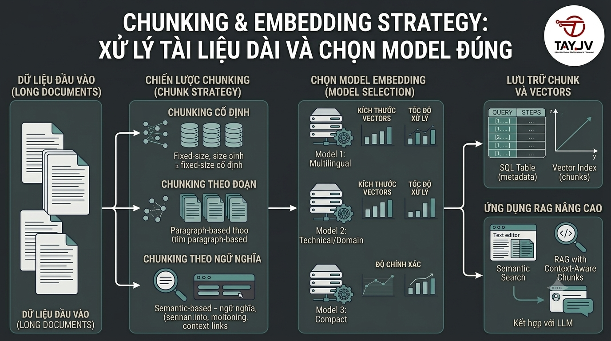

# Chunking & Embedding Strategy: Xử Lý Tài Liệu Dài Và Chọn Model Đúng



Bài 5 và 6 bạn đã embed title + description ngắn của khóa học. Nhưng thực tế, [nguyentienkhoi.hashnode.dev](http://nguyentienkhoi.hashnode.dev) còn có bài viết blog dài hàng nghìn từ, nội dung bài giảng, tài liệu PDF. Không thể embed toàn bộ một lúc — embedding model có giới hạn token, và embedding văn bản dài cho chất lượng kém. **Chunking** là kỹ thuật chia nhỏ tài liệu, **Embedding Strategy** là cách chọn model và cấu hình phù hợp. Đây là bài quyết định chất lượng của toàn bộ hệ thống AI.

## 1\. Tại Sao Cần Chunking?

```java
❌ Không chunking — embed cả bài viết 5000 từ:
  Bài viết: "SQL là gì? SQL (Structured Query Language) là...
             ...Bài tập: Viết query lấy 10 user đầu tiên...
             ...Kết luận: SQL rất quan trọng cho developer..."

  → 1 vector đại diện cho TOÀN BỘ bài viết
  → Vector bị "average out" — mất thông tin chi tiết
  → Query "bài tập SQL" không tìm được đoạn bài tập cụ thể

✅ Chunking — chia nhỏ rồi embed từng chunk:
  Chunk 1: "SQL là gì? SQL (Structured Query Language) là..."
  Chunk 2: "Bài tập: Viết query lấy 10 user đầu tiên..."
  Chunk 3: "Kết luận: SQL rất quan trọng cho developer..."

  → 3 vectors, mỗi cái đại diện 1 phần cụ thể
  → Query "bài tập SQL" → tìm đúng Chunk 2
```

**Hai giới hạn buộc phải chunk:**

*   **Token limit:** hầu hết embedding model giới hạn ~512 tokens (≈ 380 từ tiếng Anh, ≈ 256 từ tiếng Việt)
    
*   **Semantic quality:** text quá dài → vector mất đi sự tập trung, chất lượng tìm kiếm kém
    

## 2\. Các Chiến Lược Chunking

### Chiến Lược 1: Fixed-size Chunking — Đơn Giản Nhất

Chia theo số ký tự/token cố định, có overlap để tránh mất context ở ranh giới:

```python
def fixed_size_chunk(text: str,
                      chunk_size: int = 500,
                      overlap: int = 50) -> list[str]:
    """
    Chia text thành chunks có kích thước cố định với overlap.

    chunk_size: số ký tự mỗi chunk
    overlap:    số ký tự overlap giữa 2 chunks liên tiếp
    """
    if len(text) <= chunk_size:
        return [text]

    chunks = []
    start = 0

    while start < len(text):
        end = start + chunk_size

        # Nếu không phải chunk cuối, tìm điểm cắt tự nhiên (space)
        if end < len(text):
            # Tìm space gần nhất để không cắt giữa từ
            while end > start and text[end] != ' ':
                end -= 1
            if end == start:
                end = start + chunk_size  # không tìm được space → cắt cứng

        chunks.append(text[start:end].strip())
        start = end - overlap  # di chuyển với overlap

    return [c for c in chunks if c]  # loại bỏ chunk rỗng


# Test
text = """SQL là ngôn ngữ truy vấn cơ sở dữ liệu quan hệ.
Được phát triển bởi IBM vào những năm 1970, SQL đã trở thành
chuẩn ngành cho việc làm việc với database.
SELECT là câu lệnh phổ biến nhất trong SQL..."""

chunks = fixed_size_chunk(text, chunk_size=200, overlap=30)
for i, chunk in enumerate(chunks):
    print(f"Chunk {i+1} ({len(chunk)} chars): {chunk[:80]}...")
```

**Ưu điểm:** Đơn giản, nhanh, dễ implement **Nhược điểm:** Cắt giữa câu, mất context ngữ nghĩa

### Chiến Lược 2: Sentence Chunking — Giữ Nguyên Câu

Chia theo câu, gom lại cho đến khi đủ kích thước:

```python
import re
from typing import List

def sentence_chunk(text: str,
                   max_chunk_size: int = 500,
                   overlap_sentences: int = 1) -> List[str]:
    """
    Chia text thành chunks theo câu.
    Không bao giờ cắt giữa câu.
    """
    # Tách thành câu (tiếng Việt + tiếng Anh)
    sentence_endings = r'(?<=[.!?])\s+'
    sentences = re.split(sentence_endings, text.strip())
    sentences = [s.strip() for s in sentences if s.strip()]

    if not sentences:
        return []

    chunks = []
    current_chunk = []
    current_size  = 0

    for i, sentence in enumerate(sentences):
        sentence_size = len(sentence)

        # Nếu câu quá dài → chia tiếp bằng fixed-size
        if sentence_size > max_chunk_size:
            if current_chunk:
                chunks.append(' '.join(current_chunk))
                current_chunk = []
                current_size  = 0
            sub_chunks = fixed_size_chunk(sentence, max_chunk_size, 30)
            chunks.extend(sub_chunks)
            continue

        # Nếu thêm câu này sẽ vượt max_size → lưu chunk hiện tại
        if current_size + sentence_size > max_chunk_size and current_chunk:
            chunks.append(' '.join(current_chunk))

            # Overlap: giữ lại N câu cuối
            if overlap_sentences > 0:
                current_chunk = current_chunk[-overlap_sentences:]
                current_size  = sum(len(s) for s in current_chunk)
            else:
                current_chunk = []
                current_size  = 0

        current_chunk.append(sentence)
        current_size += sentence_size

    # Thêm chunk cuối cùng
    if current_chunk:
        chunks.append(' '.join(current_chunk))

    return chunks


# Test với nội dung bài viết nguyentienkhoi.hashnode.dev
article = """
SQL là gì? SQL (Structured Query Language) là ngôn ngữ lập trình
được thiết kế để quản lý dữ liệu trong hệ thống quản trị cơ sở dữ liệu
quan hệ (RDBMS). SQL cho phép bạn tạo, đọc, cập nhật và xóa dữ liệu.

Tại sao SQL quan trọng? Hầu hết các ứng dụng web đều cần lưu trữ dữ
liệu. SQL là ngôn ngữ phổ biến nhất để làm điều đó. Theo khảo sát
Stack Overflow 2024, SQL là kỹ năng được yêu cầu nhiều nhất.

Ví dụ cơ bản. Câu lệnh SELECT dùng để truy vấn dữ liệu từ database.
Cú pháp: SELECT columns FROM table WHERE condition.
"""

chunks = sentence_chunk(article, max_chunk_size=300, overlap_sentences=1)
for i, chunk in enumerate(chunks):
    print(f"\nChunk {i+1}:")
    print(chunk)
```

### Chiến Lược 3: Semantic Chunking — Chất Lượng Cao Nhất

Chia dựa trên sự thay đổi ngữ nghĩa — chunk mới khi topic thay đổi đáng kể:

```python
import numpy as np
from sentence_transformers import SentenceTransformer

def semantic_chunk(text: str,
                   model: SentenceTransformer,
                   breakpoint_threshold: float = 0.3,
                   min_chunk_size: int = 100,
                   max_chunk_size: int = 1000) -> List[str]:
    """
    Chia text dựa trên sự thay đổi ngữ nghĩa.
    Chunk mới được tạo khi cosine distance giữa 2 câu liên tiếp
    vượt ngưỡng breakpoint_threshold.
    """
    # Tách câu
    sentences = re.split(r'(?<=[.!?])\s+', text.strip())
    sentences = [s.strip() for s in sentences if len(s.strip()) > 10]

    if len(sentences) <= 1:
        return sentences

    # Embed tất cả câu
    embeddings = model.encode(sentences, normalize_embeddings=True)

    # Tính cosine distance giữa các câu liên tiếp
    distances = []
    for i in range(len(embeddings) - 1):
        # cosine_distance = 1 - cosine_similarity
        dist = 1 - np.dot(embeddings[i], embeddings[i+1])
        distances.append(dist)

    # Tìm breakpoints — nơi topic thay đổi đột ngột
    breakpoints = [0]  # bắt đầu từ câu đầu tiên
    for i, dist in enumerate(distances):
        if dist > breakpoint_threshold:
            breakpoints.append(i + 1)

    breakpoints.append(len(sentences))  # kết thúc

    # Tạo chunks từ breakpoints
    chunks = []
    for i in range(len(breakpoints) - 1):
        start = breakpoints[i]
        end   = breakpoints[i + 1]
        chunk = ' '.join(sentences[start:end])

        # Merge chunk quá nhỏ với chunk kế tiếp
        if len(chunk) < min_chunk_size and chunks:
            chunks[-1] = chunks[-1] + ' ' + chunk
        # Split chunk quá lớn
        elif len(chunk) > max_chunk_size:
            sub_chunks = fixed_size_chunk(chunk, max_chunk_size, 50)
            chunks.extend(sub_chunks)
        else:
            chunks.append(chunk)

    return chunks


# Test
model = SentenceTransformer('all-MiniLM-L6-v2')
long_article = """
SQL là gì? SQL là ngôn ngữ truy vấn cơ sở dữ liệu. Nó được dùng để
thao tác với dữ liệu trong RDBMS. SQL rất quan trọng cho developer.

Index trong SQL giúp tăng tốc query. Khi bảng có nhiều dữ liệu,
index giúp tìm kiếm nhanh hơn nhiều. PostgreSQL hỗ trợ nhiều loại index.

Kubernetes là hệ thống orchestration container. Nó giúp deploy và
quản lý container tự động. Docker và Kubernetes thường đi cùng nhau.
"""

chunks = semantic_chunk(long_article, model)
print(f"Created {len(chunks)} semantic chunks:")
for i, chunk in enumerate(chunks):
    print(f"\nChunk {i+1}: {chunk[:100]}...")
```

### Chiến Lược 4: Hierarchical Chunking — Cho Tài Liệu Có Cấu Trúc

Giữ nguyên cấu trúc của tài liệu (heading, section):

```python
import re
from dataclasses import dataclass

@dataclass
class DocumentChunk:
    content:    str
    chunk_type: str          # 'heading', 'section', 'paragraph'
    heading:    str = ""     # heading của section chứa chunk này
    level:      int = 0      # heading level (1, 2, 3)
    position:   int = 0      # vị trí trong tài liệu

def hierarchical_chunk(markdown_text: str,
                        max_chunk_size: int = 500) -> List[DocumentChunk]:
    """
    Chunk tài liệu Markdown giữ nguyên cấu trúc heading.
    """
    chunks = []
    lines  = markdown_text.split('\n')

    current_heading = ""
    current_level   = 0
    current_content = []
    position        = 0

    for line in lines:
        # Phát hiện heading
        heading_match = re.match(r'^(#{1,6})\s+(.+)', line)
        if heading_match:
            # Lưu content hiện tại trước khi bắt đầu section mới
            if current_content:
                content = '\n'.join(current_content).strip()
                if content:
                    # Chia tiếp nếu quá lớn
                    if len(content) > max_chunk_size:
                        sub_chunks = sentence_chunk(content, max_chunk_size)
                        for sc in sub_chunks:
                            chunks.append(DocumentChunk(
                                content=sc,
                                chunk_type='section',
                                heading=current_heading,
                                level=current_level,
                                position=position
                            ))
                            position += 1
                    else:
                        chunks.append(DocumentChunk(
                            content=content,
                            chunk_type='section',
                            heading=current_heading,
                            level=current_level,
                            position=position
                        ))
                        position += 1
                current_content = []

            # Bắt đầu section mới
            level   = len(heading_match.group(1))
            heading = heading_match.group(2).strip()

            # Thêm heading như một chunk riêng (để tìm được bằng title)
            chunks.append(DocumentChunk(
                content=heading,
                chunk_type='heading',
                heading=heading,
                level=level,
                position=position
            ))
            position        += 1
            current_heading  = heading
            current_level    = level

        else:
            current_content.append(line)

    # Thêm content cuối cùng
    if current_content:
        content = '\n'.join(current_content).strip()
        if content:
            chunks.append(DocumentChunk(
                content=content,
                chunk_type='section',
                heading=current_heading,
                level=current_level,
                position=position
            ))

    return chunks


# Test với bài viết nguyentienkhoi.hashnode.dev (Markdown format)
markdown = """
# SQL cho Developer — Hướng dẫn từ A đến Z

SQL là ngôn ngữ thiết yếu cho mọi developer. Bài này sẽ hướng dẫn
từ cơ bản đến nâng cao.

## 1. SELECT cơ bản

SELECT là câu lệnh phổ biến nhất. Cú pháp: SELECT columns FROM table.
Ví dụ: SELECT * FROM users WHERE id = 1.

## 2. JOIN — Kết hợp nhiều bảng

JOIN dùng để kết hợp dữ liệu từ nhiều bảng. Có nhiều loại JOIN khác nhau.
INNER JOIN chỉ lấy dòng khớp ở cả hai bảng.
"""

chunks = hierarchical_chunk(markdown)
for chunk in chunks:
    print(f"\n[{chunk.chunk_type}] Level:{chunk.level} Heading:'{chunk.heading}'")
    print(f"  Content: {chunk.content[:80]}...")
```

## 3\. Chọn Chunk Size Phù Hợp

```java
Chunk size ảnh hưởng trực tiếp đến chất lượng search:

Quá nhỏ (< 100 chars):
  + Tìm kiếm chính xác hơn về vị trí
  - Thiếu context → embedding kém
  - Nhiều chunks → tốn storage + search chậm hơn

Quá lớn (> 1000 chars):
  + Nhiều context cho embedding
  - Mất đi sự tập trung ngữ nghĩa
  - Kết quả trả về không cụ thể (trả về cả đoạn dài)

Tối ưu (300-600 chars / ~200-400 tokens):
  ✅ Đủ context cho embedding chất lượng
  ✅ Đủ cụ thể để search chính xác
  ✅ Phù hợp với context window của LLM khi dùng RAG
```

**Gợi ý cho** [**nguyentienkhoi.hashnode.dev**](http://nguyentienkhoi.hashnode.dev)**:**


| Loại nội dung | Chunk size | Chiến lược |
|---|---|---|
| Tiêu đề + mô tả khóa học | Không cần chunk | Embed nguyên |
| Bài viết blog (Markdown) | 400-600 chars | Hierarchical |
| Nội dung bài giảng | 300-500 chars | Sentence |
| Hỏi & đáp (Q&A) | Không chunk | Embed từng cặp Q+A |
| PDF tài liệu | 500-800 chars | Sentence + overlap |


## 4\. Embedding Model Cho Tiếng Việt

Đây là phần quan trọng nhất cho [nguyentienkhoi.hashnode.dev](http://nguyentienkhoi.hashnode.dev) — hầu hết tài liệu viết bằng tiếng Việt.

### So Sánh Chi Tiết Các Model

```python
from sentence_transformers import SentenceTransformer
import numpy as np
import time

def test_vietnamese_embedding(model_name: str, texts: List[str]) -> dict:
    """Đo chất lượng và tốc độ của model với tiếng Việt"""
    start = time.time()
    model = SentenceTransformer(model_name)
    load_time = time.time() - start

    start = time.time()
    embeddings = model.encode(texts, normalize_embeddings=True)
    encode_time = time.time() - start

    # Test semantic similarity
    # "Spring Boot Java" và "lập trình backend Java" nên gần nhau
    spring_boot = model.encode("Spring Boot Java backend", normalize_embeddings=True)
    java_backend = model.encode("lập trình backend với Java", normalize_embeddings=True)
    cooking     = model.encode("học nấu ăn Việt Nam", normalize_embeddings=True)

    sim_related   = np.dot(spring_boot, java_backend)  # nên cao
    sim_unrelated = np.dot(spring_boot, cooking)        # nên thấp

    return {
        "model":        model_name,
        "dimensions":   embeddings.shape[1],
        "load_time":    f"{load_time:.1f}s",
        "encode_time":  f"{encode_time:.3f}s",
        "sim_related":  f"{sim_related:.4f}",    # càng cao càng tốt
        "sim_unrelated": f"{sim_unrelated:.4f}", # càng thấp càng tốt
        "separation":   f"{sim_related - sim_unrelated:.4f}",  # càng cao càng tốt
    }

# Texts tiếng Việt để test
vi_texts = [
    "Spring Boot là framework Java phổ biến nhất",
    "Học lập trình backend với Java",
    "Docker containerization và deployment",
    "Cách nấu phở bò truyền thống",
]

# Danh sách models để so sánh
models_to_test = [
    "all-MiniLM-L6-v2",          # nhanh nhất, ít tiếng Việt
    "paraphrase-multilingual-MiniLM-L12-v2",  # multilingual
    "BAAI/bge-m3",               # tốt nhất cho đa ngôn ngữ
]

for model_name in models_to_test:
    result = test_vietnamese_embedding(model_name, vi_texts)
    print(f"\n{result['model']}:")
    print(f"  Dims: {result['dimensions']}, Load: {result['load_time']}")
    print(f"  Sim(related): {result['sim_related']}, Sim(unrelated): {result['sim_unrelated']}")
    print(f"  Separation: {result['separation']} ← càng cao càng tốt")
```

### Kết Quả Thực Tế (Benchmark)


| Model | Dims | Size | Tiếng Việt | Speed | Recommended |
|---|---|---|---|---|---|
| all-MiniLM-L6-v2 | 384 | 90MB | ⭐⭐ | ⭐⭐⭐⭐⭐ | Prototype only |
| paraphrase-multilingual-MiniLM-L12-v2 | 384 | 420MB | ⭐⭐⭐⭐ | ⭐⭐⭐⭐ | Good choice |
| BAAI/bge-m3 | 1024 | 570MB | ⭐⭐⭐⭐⭐ | ⭐⭐⭐ | Best for Vietnamese |
| openai/text-embedding-3-small | 1536 | API | ⭐⭐⭐⭐ | ⭐⭐⭐⭐ | Good, has cost |
| openai/text-embedding-3-large | 3072 | API | ⭐⭐⭐⭐⭐ | ⭐⭐⭐⭐ | Best quality, most cost |


**Khuyến nghị cho** [**nguyentienkhoi.hashnode.dev**](http://nguyentienkhoi.hashnode.dev)**:**

```java
Development/Prototype:
  → all-MiniLM-L6-v2 (nhanh, nhẹ, đủ dùng để test)

Production (free):
  → BAAI/bge-m3 (tốt nhất cho tiếng Việt, chạy local)

Production (budget available):
  → openai/text-embedding-3-small (cost-effective, quality tốt)
```

## 5\. Chunking Pipeline Hoàn Chỉnh

```python
import os
import json
import hashlib
import psycopg2
from dataclasses import dataclass, asdict
from typing import List, Optional
from sentence_transformers import SentenceTransformer
from dotenv import load_dotenv

load_dotenv()

@dataclass
class Chunk:
    chunk_id:    str      # hash của content để dedup
    source_id:   int      # ID của document gốc
    source_type: str      # 'post', 'course', 'lecture'
    content:     str      # nội dung chunk
    chunk_index: int      # vị trí chunk trong document
    heading:     str      # heading của section (nếu có)
    chunk_type:  str      # 'heading', 'section', 'paragraph'
    metadata:    dict     # thông tin bổ sung

class ChunkingPipeline:

    def __init__(self,
                 model_name: str = "paraphrase-multilingual-MiniLM-L12-v2",
                 chunk_size: int = 500,
                 overlap:    int = 50):
        self.model      = SentenceTransformer(model_name)
        self.model_name = model_name
        self.chunk_size = chunk_size
        self.overlap    = overlap
        self.conn       = psycopg2.connect(
            host=os.getenv("POSTGRES_HOST"),
            port=os.getenv("POSTGRES_PORT"),
            user=os.getenv("POSTGRES_USER"),
            password=os.getenv("POSTGRES_PASSWORD"),
            dbname=os.getenv("POSTGRES_DB")
        )

    def _content_hash(self, content: str) -> str:
        return hashlib.md5(content.encode()).hexdigest()

    def chunk_post(self, post_id: int) -> List[Chunk]:
        """Chunk bài viết từ database"""
        cursor = self.conn.cursor()
        cursor.execute("""
            SELECT title, content, seo_description
            FROM posts WHERE id = %s
        """, (post_id,))
        row = cursor.fetchone()
        cursor.close()

        if not row:
            return []

        title, content, seo_desc = row

        # Combine title + content
        full_text = f"# {title}\n\n{content or ''}"

        # Dùng hierarchical chunking cho Markdown
        doc_chunks = hierarchical_chunk(full_text, self.chunk_size)

        chunks = []
        for i, doc_chunk in enumerate(doc_chunks):
            chunks.append(Chunk(
                chunk_id    = self._content_hash(doc_chunk.content),
                source_id   = post_id,
                source_type = 'post',
                content     = doc_chunk.content,
                chunk_index = i,
                heading     = doc_chunk.heading,
                chunk_type  = doc_chunk.chunk_type,
                metadata    = {"seo_description": seo_desc}
            ))
        return chunks

    def chunk_lecture(self, lecture_id: int) -> List[Chunk]:
        """Chunk nội dung bài giảng"""
        cursor = self.conn.cursor()
        cursor.execute("""
            SELECT l.title, l.description, c.title as course_title
            FROM lectures l
            JOIN topics t ON t.id = l.topic_id
            JOIN courses c ON c.id = t.course_id
            WHERE l.id = %s
        """, (lecture_id,))
        row = cursor.fetchone()
        cursor.close()

        if not row:
            return []

        title, description, course_title = row

        # Thêm context: course_title + lecture_title + description
        text = f"Khóa học: {course_title}. Bài: {title}. {description or ''}"

        # Dùng sentence chunking
        text_chunks = sentence_chunk(text, self.chunk_size, overlap_sentences=1)

        return [
            Chunk(
                chunk_id    = self._content_hash(chunk),
                source_id   = lecture_id,
                source_type = 'lecture',
                content     = chunk,
                chunk_index = i,
                heading     = title,
                chunk_type  = 'section',
                metadata    = {"course_title": course_title}
            )
            for i, chunk in enumerate(text_chunks)
        ]

    def embed_and_store_chunks(self,
                                chunks: List[Chunk],
                                table: str = "content_chunks") -> int:
        """Embed chunks và lưu vào PostgreSQL"""
        if not chunks:
            return 0

        cursor = self.conn.cursor()

        # Tạo bảng nếu chưa có
        cursor.execute(f"""
            CREATE TABLE IF NOT EXISTS {table} (
                id          BIGSERIAL PRIMARY KEY,
                chunk_id    VARCHAR(32) NOT NULL UNIQUE,
                source_id   BIGINT NOT NULL,
                source_type VARCHAR(20) NOT NULL,
                content     TEXT NOT NULL,
                chunk_index INT NOT NULL,
                heading     TEXT,
                chunk_type  VARCHAR(20),
                metadata    JSONB,
                embedding   VECTOR(384) NOT NULL,
                model_name  VARCHAR(100) NOT NULL,
                created_at  TIMESTAMPTZ DEFAULT NOW()
            )
        """)

        # Tạo index
        cursor.execute(f"""
            CREATE INDEX IF NOT EXISTS idx_{table}_hnsw
            ON {table}
            USING hnsw (embedding vector_cosine_ops)
            WITH (m = 16, ef_construction = 64)
        """)
        cursor.execute(f"""
            CREATE INDEX IF NOT EXISTS idx_{table}_source
            ON {table} (source_type, source_id)
        """)
        self.conn.commit()

        # Embed tất cả chunks một lần
        texts = [c.content for c in chunks]
        embeddings = self.model.encode(
            texts,
            normalize_embeddings=True,
            batch_size=32,
            show_progress_bar=True
        )

        # Upsert vào database
        stored = 0
        for chunk, embedding in zip(chunks, embeddings):
            cursor.execute(f"""
                INSERT INTO {table}
                    (chunk_id, source_id, source_type, content,
                     chunk_index, heading, chunk_type, metadata,
                     embedding, model_name)
                VALUES (%s, %s, %s, %s, %s, %s, %s, %s, %s, %s)
                ON CONFLICT (chunk_id) DO NOTHING
            """, (
                chunk.chunk_id,
                chunk.source_id,
                chunk.source_type,
                chunk.content,
                chunk.chunk_index,
                chunk.heading,
                chunk.chunk_type,
                json.dumps(chunk.metadata),
                embedding.tolist(),
                self.model_name
            ))
            stored += cursor.rowcount

        self.conn.commit()
        cursor.close()
        return stored

    def search_chunks(self,
                       query: str,
                       source_type: Optional[str] = None,
                       limit: int = 5) -> List[dict]:
        """Search trong chunks"""
        query_embedding = self.model.encode(
            query, normalize_embeddings=True
        ).tolist()

        cursor = self.conn.cursor()

        extra_filter = ""
        params = [query_embedding, query_embedding, limit]

        if source_type:
            extra_filter = "AND source_type = %s"
            params = [query_embedding, source_type, query_embedding, limit]

        cursor.execute(f"""
            SELECT
                source_id,
                source_type,
                content,
                heading,
                chunk_type,
                metadata,
                1 - (embedding <=> %s::vector) AS similarity
            FROM content_chunks
            WHERE 1=1 {extra_filter}
            ORDER BY embedding <=> %s::vector
            LIMIT %s
        """, params)

        rows = cursor.fetchall()
        cursor.close()

        return [
            {
                "source_id":   row[0],
                "source_type": row[1],
                "content":     row[2],
                "heading":     row[3],
                "chunk_type":  row[4],
                "metadata":    row[5],
                "similarity":  float(row[6])
            }
            for row in rows
        ]

    def close(self):
        self.conn.close()


# ──────────────────────────────────────────
# Test pipeline
# ──────────────────────────────────────────
if __name__ == "__main__":
    pipeline = ChunkingPipeline(
        model_name="paraphrase-multilingual-MiniLM-L12-v2"
    )

    # Chunk tất cả bài viết
    print("Chunking posts...")
    cursor = pipeline.conn.cursor()
    cursor.execute("SELECT id FROM posts WHERE post_status = 'PUBLISHED'")
    post_ids = [row[0] for row in cursor.fetchall()]
    cursor.close()

    total_stored = 0
    for post_id in post_ids:
        chunks = pipeline.chunk_post(post_id)
        n = pipeline.embed_and_store_chunks(chunks)
        total_stored += n
        print(f"  Post {post_id}: {len(chunks)} chunks, {n} stored")

    print(f"\n✅ Total: {total_stored} chunks stored")

    # Test search
    print("\n🔍 Search: 'cách viết query SQL tối ưu'")
    results = pipeline.search_chunks(
        "cách viết query SQL tối ưu",
        source_type='post',
        limit=3
    )
    for r in results:
        print(f"  [{r['similarity']:.4f}] [{r['heading']}] {r['content'][:100]}...")

    pipeline.close()
```

## 6\. Context-Aware Chunking — Thêm Context Vào Chunk

Trick quan trọng: thêm context của document vào đầu mỗi chunk — giúp embedding hiểu chunk đang nói về gì:

```python
def add_context_to_chunks(chunks: List[str],
                           document_context: str) -> List[str]:
    """
    Thêm context của document vào đầu mỗi chunk.
    Giúp embedding model hiểu ngữ cảnh rộng hơn.
    """
    contextualized = []
    for chunk in chunks:
        # Thêm summary/title của document vào đầu chunk
        contextualized_chunk = f"{document_context}\n\n{chunk}"
        contextualized.append(contextualized_chunk)
    return contextualized

# Ví dụ thực tế
post_title = "Hướng dẫn SQL từ A đến Z cho Developer"
chunks = sentence_chunk(long_post_content)

# Thêm title của bài vào đầu mỗi chunk
contextualized = add_context_to_chunks(
    chunks,
    document_context=f"Bài viết: {post_title}"
)

# Khi search:
# Query: "cách dùng GROUP BY"
# → Sẽ match chunk: "Bài viết: SQL... \n GROUP BY dùng để..."
# thay vì chỉ match: "GROUP BY dùng để..."
# → Chất lượng embedding tốt hơn vì có context
```

## 7\. Đánh Giá Chất Lượng Chunking

```python
def evaluate_chunking_quality(pipeline: ChunkingPipeline,
                                test_queries: List[dict]) -> dict:
    """
    Đánh giá chất lượng chunking bằng test queries có đáp án.

    test_queries format:
    [
        {
            "query": "cách dùng JOIN trong SQL",
            "expected_chunk_contains": "JOIN",
            "source_type": "post"
        }
    ]
    """
    correct = 0
    total   = len(test_queries)
    results = []

    for test in test_queries:
        chunks = pipeline.search_chunks(
            test['query'],
            source_type=test.get('source_type'),
            limit=3
        )

        # Kiểm tra có chunk nào chứa expected content không
        found = any(
            test['expected_chunk_contains'].lower() in c['content'].lower()
            for c in chunks
        )

        if found:
            correct += 1

        results.append({
            "query":    test['query'],
            "found":    found,
            "top_score": chunks[0]['similarity'] if chunks else 0
        })

    return {
        "accuracy":    correct / total,
        "correct":     correct,
        "total":       total,
        "details":     results
    }

# Test cases
test_cases = [
    {"query": "cách viết query SQL",
     "expected_chunk_contains": "SELECT",
     "source_type": "post"},
    {"query": "index trong database",
     "expected_chunk_contains": "index",
     "source_type": "post"},
    {"query": "bài giảng về Spring Boot",
     "expected_chunk_contains": "Spring",
     "source_type": "lecture"},
]

results = evaluate_chunking_quality(pipeline, test_cases)
print(f"Accuracy: {results['accuracy']:.1%} ({results['correct']}/{results['total']})")
```

## Tổng Kết


| Chiến lược | Tốt cho | Chất lượng | Tốc độ |
|---|---|---|---|
| Fixed-size | Văn bản thuần không cấu trúc | ⭐⭐⭐ | ⭐⭐⭐⭐⭐ |
| Sentence | Bài viết, tài liệu thông thường | ⭐⭐⭐⭐ | ⭐⭐⭐⭐ |
| Semantic | Tài liệu nhiều chủ đề | ⭐⭐⭐⭐⭐ | ⭐⭐ |
| Hierarchical | Markdown, tài liệu có cấu trúc | ⭐⭐⭐⭐⭐ | ⭐⭐⭐ |


**Embedding model cho** [**nguyentienkhoi.hashnode.dev**](http://nguyentienkhoi.hashnode.dev)**:**

*   Dev/test: `all-MiniLM-L6-v2`
    
*   Production free: `BAAI/bge-m3`
    
*   Production paid: `openai/text-embedding-3-small`
    

Bài tiếp theo chúng ta sẽ xây dựng **RAG (Retrieval-Augmented Generation)** — kết hợp Vector DB với LLM để tạo chatbot có thể trả lời câu hỏi dựa trên nội dung [nguyentienkhoi.hashnode.dev](http://nguyentienkhoi.hashnode.dev).

