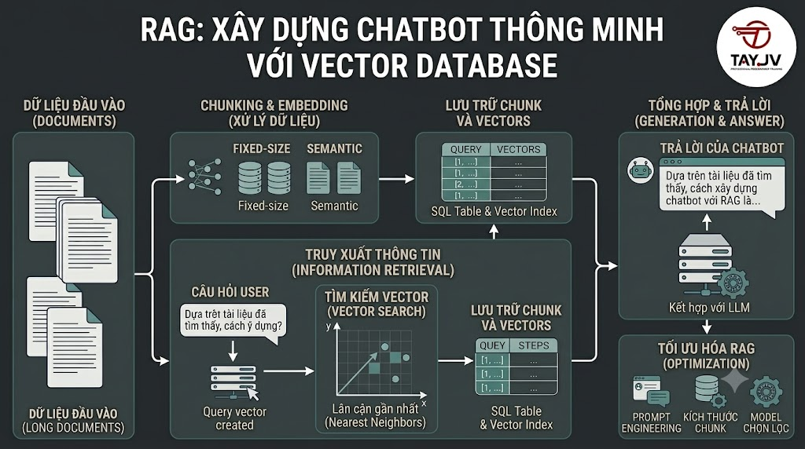

# RAG: Xây Dựng Chatbot Thông Minh Với Vector Database



Bạn đã có Vector DB đầy dữ liệu từ [nguyentienkhoi.hashnode.dev](http://nguyentienkhoi.hashnode.dev). Bài này sẽ dùng nó để xây dựng **RAG (Retrieval-Augmented Generation)** — hệ thống cho phép LLM (ChatGPT, Claude) trả lời câu hỏi dựa trên nội dung **thực tế** của [nguyentienkhoi.hashnode.dev](http://nguyentienkhoi.hashnode.dev) thay vì chỉ dựa vào kiến thức training. Kết quả: chatbot tư vấn học tập có thể trả lời "Khóa Spring Boot của foxdev có dạy microservices không?" chính xác 100%.

## 1\. RAG Là Gì Và Tại Sao Cần?

### Vấn Đề Của LLM Thuần Túy

```java
User: "Khóa SQL của nguyentienkhoi.hashnode.dev có bao nhiêu bài học?"

LLM (không có RAG):
"Tôi không có thông tin cụ thể về khóa học của nguyentienkhoi.hashnode.dev.
Thông thường một khóa SQL có thể có 20-50 bài học..."
→ Hallucination — bịa ra thông tin!

LLM (có RAG):
1. Tìm trong Vector DB: chunk liên quan đến "khóa SQL foxdev"
   → Tìm thấy: "Khóa SQL cho Developer gồm 24 bài, từ beginner đến senior"
2. Đưa context vào LLM + câu hỏi
3. LLM trả lời dựa trên context thực:
   "Theo thông tin từ nguyentienkhoi.hashnode.dev, khóa SQL cho Developer gồm 24 bài học,
   được chia thành 4 level: Beginner, Intermediate, Advanced và Senior."
→ Chính xác, có nguồn!
```

### RAG Pipeline Tổng Quan

```java
                    ┌─────────────────────────────────┐
                    │         INDEXING (offline)       │
                    │                                  │
                    │  Documents → Chunk → Embed       │
                    │                  ↓               │
                    │            Vector DB             │
                    └─────────────────────────────────┘

                    ┌─────────────────────────────────┐
                    │         QUERYING (online)        │
                    │                                  │
User Question  →    │  1. Embed Question               │
                    │  2. Search Vector DB             │
                    │  3. Retrieve top-K chunks        │
                    │  4. Build Prompt:                │
                    │     Context + Question           │
                    │  5. LLM generates answer         │
                    │                    ↓             │
                    │              Answer              │
                    └─────────────────────────────────┘
```

## 2\. Setup LLM

Tao sẽ demo với 2 lựa chọn: **OpenAI API** (dễ nhất) và **Ollama** (chạy local, miễn phí):

```bash
# Cài dependencies
pip install openai ollama httpx

# Nếu dùng Ollama (chạy LLM local):
# 1. Cài Ollama: https://ollama.ai
# 2. Pull model:
ollama pull llama3.2      # 2GB — nhẹ, nhanh
ollama pull qwen2.5:7b    # 4.7GB — tốt cho tiếng Việt
ollama pull gemma2:9b     # 5.5GB — chất lượng tốt
```

```python
import os
from abc import ABC, abstractmethod
from typing import AsyncIterator
from dotenv import load_dotenv

load_dotenv()

class LLMProvider(ABC):
    """Abstract LLM provider — dễ swap giữa OpenAI và Ollama"""

    @abstractmethod
    async def generate(self,
                       prompt: str,
                       system: str = "",
                       stream: bool = False) -> str:
        pass

    @abstractmethod
    async def stream(self,
                     prompt: str,
                     system: str = "") -> AsyncIterator[str]:
        pass


class OpenAIProvider(LLMProvider):
    """OpenAI GPT-4o-mini — tốt nhất, có chi phí"""

    def __init__(self, model: str = "gpt-4o-mini"):
        from openai import AsyncOpenAI
        self.client = AsyncOpenAI(api_key=os.getenv("OPENAI_API_KEY"))
        self.model  = model

    async def generate(self, prompt: str,
                       system: str = "",
                       stream: bool = False) -> str:
        messages = []
        if system:
            messages.append({"role": "system", "content": system})
        messages.append({"role": "user", "content": prompt})

        response = await self.client.chat.completions.create(
            model=self.model,
            messages=messages,
            temperature=0.1,  # thấp → ít hallucination
            max_tokens=1000
        )
        return response.choices[0].message.content

    async def stream(self, prompt: str,
                     system: str = "") -> AsyncIterator[str]:
        messages = []
        if system:
            messages.append({"role": "system", "content": system})
        messages.append({"role": "user", "content": prompt})

        async with self.client.chat.completions.stream(
            model=self.model,
            messages=messages,
            temperature=0.1
        ) as stream:
            async for chunk in stream:
                if chunk.choices[0].delta.content:
                    yield chunk.choices[0].delta.content


class OllamaProvider(LLMProvider):
    """Ollama — chạy local, miễn phí"""

    def __init__(self, model: str = "qwen2.5:7b"):
        import httpx
        self.model  = model
        self.base_url = "http://localhost:11434"

    async def generate(self, prompt: str,
                       system: str = "",
                       stream: bool = False) -> str:
        import httpx
        messages = []
        if system:
            messages.append({"role": "system", "content": system})
        messages.append({"role": "user", "content": prompt})

        async with httpx.AsyncClient(timeout=120) as client:
            response = await client.post(
                f"{self.base_url}/api/chat",
                json={
                    "model": self.model,
                    "messages": messages,
                    "stream": False,
                    "options": {"temperature": 0.1}
                }
            )
        return response.json()["message"]["content"]

    async def stream(self, prompt: str,
                     system: str = "") -> AsyncIterator[str]:
        import httpx
        import json
        messages = []
        if system:
            messages.append({"role": "system", "content": system})
        messages.append({"role": "user", "content": prompt})

        async with httpx.AsyncClient(timeout=120) as client:
            async with client.stream(
                "POST",
                f"{self.base_url}/api/chat",
                json={"model": self.model, "messages": messages, "stream": True}
            ) as response:
                async for line in response.aiter_lines():
                    if line:
                        data = json.loads(line)
                        if not data.get("done"):
                            yield data["message"]["content"]
```

## 3\. Naive RAG — Pipeline Cơ Bản

```python
import asyncio
from typing import List, Dict, Optional
from sentence_transformers import SentenceTransformer
import psycopg2
import psycopg2.extras

class NaiveRAG:
    """
    RAG cơ bản: Retrieve → Augment → Generate
    """

    SYSTEM_PROMPT = """Bạn là trợ lý tư vấn học tập của nguyentienkhoi.hashnode.dev — \
một nền tảng e-learning chuyên về lập trình Java, SQL, DevOps và các \
công nghệ backend.

Hãy trả lời câu hỏi của học viên dựa trên thông tin được cung cấp \
trong phần CONTEXT. Nếu thông tin không đủ, hãy nói thẳng là không \
biết thay vì bịa ra câu trả lời.

Trả lời bằng tiếng Việt, thân thiện và dễ hiểu."""

    def __init__(self,
                 llm: LLMProvider,
                 model_name: str = "paraphrase-multilingual-MiniLM-L12-v2",
                 top_k: int = 5,
                 similarity_threshold: float = 0.4):
        self.llm       = llm
        self.model     = SentenceTransformer(model_name)
        self.top_k     = top_k
        self.threshold = similarity_threshold
        self.conn      = psycopg2.connect(
            host=os.getenv("POSTGRES_HOST"),
            port=os.getenv("POSTGRES_PORT"),
            user=os.getenv("POSTGRES_USER"),
            password=os.getenv("POSTGRES_PASSWORD"),
            dbname=os.getenv("POSTGRES_DB")
        )

    def retrieve(self,
                 query: str,
                 source_types: Optional[List[str]] = None) -> List[Dict]:
        """
        Bước 1: Retrieve — tìm chunks liên quan
        """
        query_embedding = self.model.encode(
            query, normalize_embeddings=True
        ).tolist()

        cursor = self.conn.cursor(cursor_factory=psycopg2.extras.DictCursor)

        filter_clause = ""
        params = [query_embedding, self.threshold, query_embedding, self.top_k]

        if source_types:
            placeholders = ','.join(['%s'] * len(source_types))
            filter_clause = f"AND source_type IN ({placeholders})"
            params = [query_embedding, self.threshold] + source_types + [query_embedding, self.top_k]

        cursor.execute(f"""
            SELECT
                source_id,
                source_type,
                content,
                heading,
                chunk_type,
                metadata,
                1 - (embedding <=> %s::vector) AS similarity
            FROM content_chunks
            WHERE 1 - (embedding <=> %s::vector) >= %s
              {filter_clause}
            ORDER BY embedding <=> %s::vector
            LIMIT %s
        """, params)

        rows = cursor.fetchall()
        cursor.close()

        return [dict(row) for row in rows]

    def build_context(self, chunks: List[Dict]) -> str:
        """
        Bước 2: Build context từ retrieved chunks
        """
        if not chunks:
            return "Không tìm thấy thông tin liên quan."

        context_parts = []
        for i, chunk in enumerate(chunks, 1):
            source_info = f"[Nguồn {i}: {chunk['source_type']} #{chunk['source_id']}]"
            if chunk.get('heading'):
                source_info += f" [{chunk['heading']}]"

            context_parts.append(f"{source_info}\n{chunk['content']}")

        return "\n\n---\n\n".join(context_parts)

    def build_prompt(self, question: str, context: str) -> str:
        """
        Bước 3: Augment — kết hợp context + question
        """
        return f"""CONTEXT:
{context}

---

CÂU HỎI: {question}

Hãy trả lời câu hỏi dựa trên CONTEXT ở trên. Nếu context không đủ thông tin, \
hãy nói rõ điều đó."""

    async def answer(self,
                     question: str,
                     source_types: Optional[List[str]] = None) -> Dict:
        """
        Full RAG pipeline: Retrieve → Augment → Generate
        """
        # 1. Retrieve
        chunks = self.retrieve(question, source_types)

        # 2. Build context
        context = self.build_context(chunks)

        # 3. Build prompt
        prompt = self.build_prompt(question, context)

        # 4. Generate
        answer = await self.llm.generate(prompt, system=self.SYSTEM_PROMPT)

        return {
            "question":     question,
            "answer":       answer,
            "chunks_used":  len(chunks),
            "sources":      [
                {
                    "source_id":   c['source_id'],
                    "source_type": c['source_type'],
                    "similarity":  round(c['similarity'], 4),
                    "heading":     c.get('heading', ''),
                    "preview":     c['content'][:100] + "..."
                }
                for c in chunks
            ]
        }

    async def stream_answer(self,
                             question: str,
                             source_types: Optional[List[str]] = None):
        """
        Streaming response — hiển thị từng token ngay khi có
        """
        chunks   = self.retrieve(question, source_types)
        context  = self.build_context(chunks)
        prompt   = self.build_prompt(question, context)

        # Yield sources trước
        yield {"type": "sources", "data": chunks}

        # Sau đó stream answer
        async for token in self.llm.stream(prompt, system=self.SYSTEM_PROMPT):
            yield {"type": "token", "data": token}

        yield {"type": "done", "data": ""}
```

## 4\. Advanced RAG — Cải Thiện Chất Lượng

### 4.1 Query Rewriting — Cải Thiện Query Trước Khi Search

```python
class AdvancedRAG(NaiveRAG):

    REWRITE_PROMPT = """Bạn là chuyên gia tối ưu hóa tìm kiếm.
Hãy viết lại câu hỏi sau thành query tìm kiếm hiệu quả hơn.
Chỉ trả về query đã viết lại, không giải thích gì thêm."""

    async def rewrite_query(self, question: str) -> str:
        """
        Dùng LLM để viết lại query trước khi search.

        "Tôi mới học lập trình, muốn tìm khóa học phù hợp để
        bắt đầu học Java từ đầu, không cần kinh nghiệm trước"

        → "khóa học Java cơ bản cho người mới bắt đầu"
        """
        prompt = f"Câu hỏi gốc: {question}\n\nViết lại thành query tìm kiếm ngắn gọn:"
        rewritten = await self.llm.generate(
            prompt,
            system=self.REWRITE_PROMPT
        )
        return rewritten.strip()

    # 4.2 Hypothetical Document Embedding (HyDE)
    async def generate_hypothetical_answer(self, question: str) -> str:
        """
        HyDE: Sinh ra một câu trả lời giả định, rồi dùng nó để search.
        Câu trả lời giả định thường gần với documents thật hơn câu hỏi.
        """
        prompt = f"""Giả sử bạn đang viết nội dung cho nguyentienkhoi.hashnode.dev.
Hãy viết một đoạn ngắn (2-3 câu) như thể bạn đang trả lời câu hỏi này:

{question}

Chỉ viết nội dung, không cần giải thích."""

        hypothetical = await self.llm.generate(prompt)
        return hypothetical.strip()

    # 4.3 Multi-query Retrieval
    async def expand_query(self, question: str) -> List[str]:
        """
        Sinh ra nhiều version của query để tìm kiếm rộng hơn.
        """
        prompt = f"""Hãy viết 3 cách diễn đạt khác nhau cho câu hỏi sau,
để tìm kiếm được nhiều thông tin liên quan hơn.
Mỗi version trên một dòng, không đánh số.

Câu hỏi: {question}"""

        response = await self.llm.generate(prompt)
        queries = [q.strip() for q in response.strip().split('\n') if q.strip()]
        return [question] + queries[:3]  # original + 3 variations

    async def advanced_answer(self, question: str) -> Dict:
        """
        Advanced RAG với query rewriting và multi-query retrieval
        """
        # 1. Rewrite query
        rewritten_query = await self.rewrite_query(question)
        print(f"  Rewritten: {rewritten_query}")

        # 2. Expand query
        queries = await self.expand_query(rewritten_query)
        print(f"  Queries: {queries}")

        # 3. Retrieve với tất cả queries, deduplicate
        all_chunks = {}
        for query in queries:
            chunks = self.retrieve(query)
            for chunk in chunks:
                # Key = source_id + content để dedup
                key = f"{chunk['source_id']}_{chunk['content'][:50]}"
                if key not in all_chunks or chunk['similarity'] > all_chunks[key]['similarity']:
                    all_chunks[key] = chunk

        # Sort by similarity
        unique_chunks = sorted(
            all_chunks.values(),
            key=lambda x: x['similarity'],
            reverse=True
        )[:self.top_k]

        # 4. Build context và generate
        context = self.build_context(unique_chunks)
        prompt  = self.build_prompt(question, context)
        answer  = await self.llm.generate(prompt, system=self.SYSTEM_PROMPT)

        return {
            "question":      question,
            "rewritten":     rewritten_query,
            "answer":        answer,
            "chunks_used":   len(unique_chunks),
            "queries_used":  queries,
        }
```

### 4.3 Reranking — Sắp Xếp Lại Kết Quả

```python
class RAGWithReranking(AdvancedRAG):

    def rerank_with_cross_encoder(self,
                                   query: str,
                                   chunks: List[Dict],
                                   top_n: int = 3) -> List[Dict]:
        """
        Dùng Cross-Encoder để rerank chunks sau khi retrieve.
        Cross-Encoder tính similarity của (query, chunk) cùng lúc
        → chính xác hơn Bi-Encoder (embedding riêng lẻ) nhưng chậm hơn.
        """
        from sentence_transformers import CrossEncoder

        # Cross-encoder model — chỉ dùng cho reranking (không tạo vector)
        cross_encoder = CrossEncoder('cross-encoder/ms-marco-MiniLM-L-6-v2')

        # Tính score cho từng (query, chunk) pair
        pairs = [(query, chunk['content']) for chunk in chunks]
        scores = cross_encoder.predict(pairs)

        # Sort theo cross-encoder score
        reranked = sorted(
            zip(chunks, scores),
            key=lambda x: x[1],
            reverse=True
        )

        return [chunk for chunk, _ in reranked[:top_n]]

    async def answer_with_reranking(self, question: str) -> Dict:
        """
        RAG với reranking: retrieve nhiều → rerank → dùng top-N
        """
        # Retrieve nhiều hơn để reranker có nhiều lựa chọn
        original_top_k = self.top_k
        self.top_k = 20  # retrieve 20

        chunks = self.retrieve(question)
        self.top_k = original_top_k

        # Rerank xuống còn 5
        reranked = self.rerank_with_cross_encoder(question, chunks, top_n=5)

        context = self.build_context(reranked)
        prompt  = self.build_prompt(question, context)
        answer  = await self.llm.generate(prompt, system=self.SYSTEM_PROMPT)

        return {"question": question, "answer": answer, "chunks_used": len(reranked)}
```

## 5\. Conversational RAG — Hỗ Trợ Multi-turn

```python
from collections import deque

class ConversationalRAG(AdvancedRAG):
    """
    RAG với memory — nhớ lịch sử cuộc hội thoại
    """

    def __init__(self, *args, max_history: int = 5, **kwargs):
        super().__init__(*args, **kwargs)
        self.history     = deque(maxlen=max_history * 2)  # user + assistant turns
        self.session_id  = None

    def add_to_history(self, role: str, content: str):
        self.history.append({"role": role, "content": content})

    def build_conversation_prompt(self,
                                   question: str,
                                   context: str) -> str:
        """
        Build prompt có kèm lịch sử hội thoại
        """
        # Format conversation history
        history_text = ""
        if self.history:
            history_text = "\nLỊCH SỬ HỘI THOẠI:\n"
            for turn in self.history:
                role = "Học viên" if turn["role"] == "user" else "Trợ lý"
                history_text += f"{role}: {turn['content']}\n"
            history_text += "\n"

        return f"""CONTEXT TỪ nguyentienkhoi.hashnode.dev:
{context}
{history_text}
CÂU HỎI HIỆN TẠI: {question}

Hãy trả lời dựa trên context và lịch sử hội thoại."""

    async def chat(self, user_message: str) -> Dict:
        """
        Multi-turn chat với memory
        """
        # Kết hợp câu hỏi hiện tại với context từ lịch sử
        # để search được tốt hơn
        search_query = user_message
        if self.history:
            # Lấy 2 turn gần nhất để enrich query
            recent = list(self.history)[-2:]
            context_hint = " ".join([t["content"][:100] for t in recent])
            search_query = f"{context_hint} {user_message}"

        # Retrieve
        chunks  = self.retrieve(search_query)
        context = self.build_context(chunks)

        # Build prompt với history
        prompt = self.build_conversation_prompt(user_message, context)
        answer = await self.llm.generate(prompt, system=self.SYSTEM_PROMPT)

        # Lưu vào history
        self.add_to_history("user", user_message)
        self.add_to_history("assistant", answer)

        return {
            "answer":      answer,
            "chunks_used": len(chunks),
            "turn":        len(self.history) // 2
        }

    def reset(self):
        """Reset conversation history"""
        self.history.clear()
```

## 6\. RAG API — FastAPI Endpoint

```python
from fastapi import FastAPI, HTTPException
from fastapi.responses import StreamingResponse
from pydantic import BaseModel
from typing import Optional
import asyncio
import json

app = FastAPI(title="nguyentienkhoi.hashnode.dev RAG API")

# Global instances
llm = OllamaProvider(model="qwen2.5:7b")  # hoặc OpenAIProvider()
rag = ConversationalRAG(llm=llm)

class ChatRequest(BaseModel):
    message:      str
    session_id:   Optional[str] = None
    stream:       bool = False

class ChatResponse(BaseModel):
    answer:      str
    sources:     list
    turn:        int

@app.post("/chat")
async def chat(request: ChatRequest):
    """
    Endpoint chat với RAG
    """
    if not request.message.strip():
        raise HTTPException(400, "Message không được để trống")

    if request.stream:
        # Streaming response
        async def generate():
            async for event in rag.stream_answer(request.message):
                yield f"data: {json.dumps(event)}\n\n"
            yield "data: [DONE]\n\n"

        return StreamingResponse(
            generate(),
            media_type="text/event-stream"
        )

    # Non-streaming
    result = await rag.chat(request.message)
    return result

@app.post("/chat/reset")
async def reset_chat():
    """Reset conversation history"""
    rag.reset()
    return {"status": "ok", "message": "Conversation reset"}

@app.get("/search")
async def search(q: str, limit: int = 5):
    """
    Pure vector search không có LLM generation
    """
    chunks = rag.retrieve(q)
    return {
        "query":   q,
        "results": [
            {
                "content":    c['content'][:200],
                "similarity": round(c['similarity'], 4),
                "source":     f"{c['source_type']}#{c['source_id']}"
            }
            for c in chunks[:limit]
        ]
    }
```

## 7\. Demo Hoàn Chỉnh

```python
import asyncio

async def demo():
    # Chọn LLM provider
    # llm = OpenAIProvider()      # cần OPENAI_API_KEY
    llm = OllamaProvider(model="qwen2.5:7b")  # chạy local

    rag = ConversationalRAG(llm=llm, top_k=5)

    print("🤖 nguyentienkhoi.hashnode.dev AI Assistant")
    print("=" * 50)

    # Test 1: Câu hỏi đơn giản
    print("\n📝 Test 1: Câu hỏi về khóa học")
    result = await rag.chat("FoxDev có khóa học nào về Java không?")
    print(f"Answer: {result['answer'][:300]}...")
    print(f"Dùng {result['chunks_used']} chunks")

    # Test 2: Follow-up question (multi-turn)
    print("\n📝 Test 2: Follow-up (nhớ context)")
    result = await rag.chat("Khóa đó có phù hợp cho người mới bắt đầu không?")
    print(f"Answer: {result['answer'][:300]}...")

    # Test 3: Câu hỏi về SQL
    print("\n📝 Test 3: Câu hỏi kỹ thuật")
    result = await rag.chat(
        "Trong SQL, sự khác biệt giữa HAVING và WHERE là gì?"
    )
    print(f"Answer: {result['answer'][:300]}...")

    # Test 4: Câu hỏi không có trong database
    print("\n📝 Test 4: Câu hỏi ngoài phạm vi")
    result = await rag.chat("Làm thế nào để nấu phở ngon?")
    print(f"Answer: {result['answer'][:200]}...")
    # Expect: "Tôi không tìm thấy thông tin về điều này trong nguyentienkhoi.hashnode.dev"

    # Test 5: Streaming
    print("\n📝 Test 5: Streaming response")
    print("Trả lời: ", end="", flush=True)
    async for event in rag.stream_answer("Docker là gì?"):
        if event["type"] == "token":
            print(event["data"], end="", flush=True)
        elif event["type"] == "done":
            print("\n")

asyncio.run(demo())
```

## 8\. Đánh Giá Chất Lượng RAG

```python
from dataclasses import dataclass

@dataclass
class RAGEvalCase:
    question:        str
    expected_answer: str   # keywords phải có trong answer
    should_refuse:   bool = False  # True nếu expect LLM từ chối trả lời

async def evaluate_rag(rag: NaiveRAG,
                        test_cases: List[RAGEvalCase]) -> dict:
    """
    Đánh giá RAG pipeline theo các tiêu chí:
    - Faithfulness: câu trả lời có dựa trên context không?
    - Relevance: context retrieved có liên quan không?
    - Refusal rate: có từ chối đúng khi không có thông tin không?
    """
    results = []
    for case in test_cases:
        result = await rag.answer(case.question)
        answer = result['answer'].lower()

        # Check faithfulness — keywords có trong answer không
        keywords_found = all(
            kw.lower() in answer
            for kw in case.expected_answer.split(',')
        ) if not case.should_refuse else True

        # Check refusal — có từ chối đúng không
        refused = any(
            phrase in answer
            for phrase in ["không tìm thấy", "không có thông tin",
                           "không biết", "ngoài phạm vi"]
        )
        refusal_correct = refused == case.should_refuse

        results.append({
            "question":        case.question,
            "keywords_found":  keywords_found,
            "refusal_correct": refusal_correct,
            "chunks_used":     result['chunks_used'],
            "answer_preview":  result['answer'][:100]
        })

    passed = sum(1 for r in results if r['keywords_found'] and r['refusal_correct'])

    return {
        "score":       f"{passed}/{len(results)}",
        "accuracy":    passed / len(results),
        "details":     results
    }

# Test cases
test_cases = [
    RAGEvalCase(
        question="FoxDev có khóa Spring Boot không?",
        expected_answer="Spring Boot,Java,backend"
    ),
    RAGEvalCase(
        question="Giá khóa SQL là bao nhiêu?",
        expected_answer="SQL,599"
    ),
    RAGEvalCase(
        question="Làm sao nấu bánh mì ngon?",
        expected_answer="",
        should_refuse=True  # expect từ chối
    ),
]

# Chạy evaluation
results = asyncio.run(evaluate_rag(rag, test_cases))
print(f"RAG Score: {results['score']} ({results['accuracy']:.0%})")
```

## Tổng Kết


| Thành phần | Vai trò |
|---|---|
| Vector DB | Lưu và tìm chunks liên quan |
| Embedding Model | Biến query và chunks thành vector |
| LLM | Generate câu trả lời từ context |
| Query Rewriting | Cải thiện query trước khi search |
| HyDE | Sinh hypothetical answer để search tốt hơn |
| Multi-query | Expand query để tìm rộng hơn |
| Reranking | Sắp xếp lại kết quả bằng Cross-Encoder |
| Conversation Memory | Nhớ lịch sử để support multi-turn |


```java
Naive RAG:
  Embed → Search → Prompt → LLM → Answer

Advanced RAG:
  Rewrite Query → Multi-query Search → Deduplicate
  → Rerank → Context → Prompt + History → LLM → Answer
```

Bài tiếp theo chúng ta sẽ học **Semantic Search Production-ready** — hybrid search kết hợp full-text và vector search, reranking pipeline và A/B testing chất lượng search.

