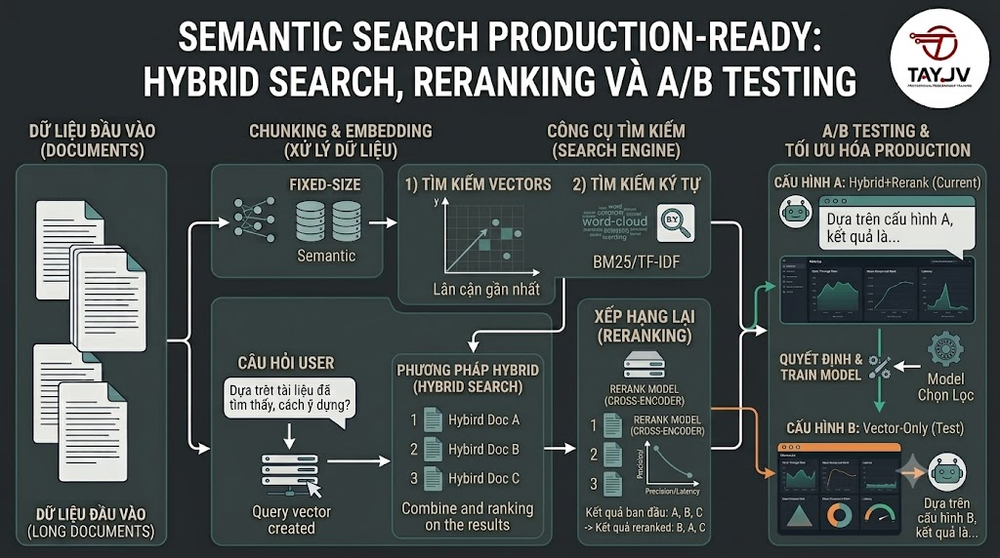

# Semantic Search Production-Ready: Hybrid Search, Reranking và A/B Testing



Bài 8 bạn đã xây dựng RAG chatbot. Bài này tập trung vào một use case khác nhưng quan trọng không kém: **Semantic Search cho trang tìm kiếm** — nơi user gõ vào thanh search và nhận kết quả chính xác, nhanh, thân thiện. Production-ready search cần nhiều hơn chỉ vector search đơn thuần: **Hybrid Search** kết hợp full-text và semantic, **Reranking** để cải thiện độ chính xác, **caching** để tăng tốc, và **A/B testing** để liên tục cải thiện.

## 1\. Vấn Đề Của Pure Vector Search

```java
User search: "spring boot 3.2"

Pure Vector Search:
  → Embedding: [0.82, -0.15, ...]
  → Kết quả: Các khóa về "Java backend", "API development"...
  → Vấn đề: "spring boot 3.2" là version cụ thể — vector search
    không hiểu exact version number, trả về kết quả semantic
    nhưng có thể bỏ qua khóa học đúng về "Spring Boot 3.2"

Pure Full-text Search:
  → LIKE '%spring boot 3.2%' hoặc Full-text index
  → Kết quả: Chỉ tài liệu có đúng text "spring boot 3.2"
  → Vấn đề: Miss "Spring Boot mới nhất" hay "Spring Framework 6"

Hybrid Search (Vector + Full-text):
  → Kết hợp cả hai → tốt nhất của 2 thế giới
  → "spring boot 3.2" → tìm được exact match VÀ semantic matches
```

## 2\. Hybrid Search — Kết Hợp Vector và Full-text

### 2.1 Full-text Search Trong PostgreSQL

```sql
-- Enable full-text search cho tiếng Việt + tiếng Anh
-- PostgreSQL tích hợp sẵn, không cần extension thêm

-- Thêm tsvector column để tối ưu
ALTER TABLE course_vectors
    ADD COLUMN search_vector TSVECTOR;

-- Populate search_vector từ content_text
UPDATE course_vectors
SET search_vector = to_tsvector('simple', content_text);
-- Dùng 'simple' config cho tiếng Việt vì không có Vietnamese parser built-in
-- 'english' chỉ phù hợp cho tiếng Anh

-- GIN index cho full-text search
CREATE INDEX idx_course_vectors_fts
    ON course_vectors USING gin(search_vector);

-- Trigger tự động update search_vector
CREATE OR REPLACE FUNCTION update_search_vector()
RETURNS TRIGGER LANGUAGE plpgsql AS $$
BEGIN
    NEW.search_vector := to_tsvector('simple', NEW.content_text);
    RETURN NEW;
END;
$$;

CREATE TRIGGER trg_update_search_vector
BEFORE INSERT OR UPDATE OF content_text
ON course_vectors
FOR EACH ROW EXECUTE FUNCTION update_search_vector();
```

```python
# Full-text search query
def fulltext_search(conn, query: str, limit: int = 20) -> list:
    """
    Full-text search dùng PostgreSQL tsvector
    """
    cursor = conn.cursor()

    # Chuyển query thành tsquery
    # 'Spring Boot' → 'Spring & Boot' (AND), 'Spring | Boot' (OR)
    # websearch_to_tsquery xử lý tự nhiên hơn
    cursor.execute("""
        SELECT
            cv.course_id,
            cv.content_text,
            cv.heading,
            ts_rank(cv.search_vector,
                    websearch_to_tsquery('simple', %s)) AS fts_score
        FROM course_vectors cv
        WHERE cv.search_vector @@ websearch_to_tsquery('simple', %s)
        ORDER BY fts_score DESC
        LIMIT %s
    """, (query, query, limit))

    return cursor.fetchall()
```

### 2.2 Reciprocal Rank Fusion (RRF) — Merge Kết Quả

RRF là thuật toán phổ biến nhất để kết hợp kết quả từ nhiều retrieval system:

```python
from typing import List, Dict, Tuple
import numpy as np

def reciprocal_rank_fusion(
    rankings: List[List[Tuple[str, float]]],
    k: int = 60
) -> List[Tuple[str, float]]:
    """
    Reciprocal Rank Fusion — merge nhiều ranked lists.

    Args:
        rankings: List của các ranked lists, mỗi list là [(doc_id, score), ...]
        k:        Constant để tránh over-emphasize top ranks (thường = 60)

    Returns:
        Merged ranked list theo RRF score
    """
    rrf_scores: Dict[str, float] = {}

    for ranking in rankings:
        for rank, (doc_id, score) in enumerate(ranking, start=1):
            if doc_id not in rrf_scores:
                rrf_scores[doc_id] = 0.0
            # RRF score: 1 / (k + rank)
            rrf_scores[doc_id] += 1.0 / (k + rank)

    # Sort theo RRF score giảm dần
    merged = sorted(rrf_scores.items(), key=lambda x: x[1], reverse=True)
    return merged


def hybrid_search(
    conn,
    model,
    query: str,
    limit: int = 10,
    vector_weight: float = 0.7,
    fts_weight: float = 0.3,
    use_rrf: bool = True
) -> List[Dict]:
    """
    Hybrid search: kết hợp vector search và full-text search.
    """
    cursor = conn.cursor()

    # 1. Vector Search
    query_embedding = model.encode(query, normalize_embeddings=True).tolist()
    cursor.execute("""
        SELECT
            course_id::TEXT AS doc_id,
            content_text,
            heading,
            1 - (embedding <=> %s::vector) AS vector_score
        FROM course_vectors
        ORDER BY embedding <=> %s::vector
        LIMIT %s
    """, (query_embedding, query_embedding, limit * 3))  # lấy nhiều hơn để merge

    vector_results = [
        (row[0], row[1], row[2], float(row[3]))
        for row in cursor.fetchall()
    ]

    # 2. Full-text Search
    cursor.execute("""
        SELECT
            course_id::TEXT AS doc_id,
            content_text,
            heading,
            ts_rank(search_vector,
                    websearch_to_tsquery('simple', %s)) AS fts_score
        FROM course_vectors
        WHERE search_vector @@ websearch_to_tsquery('simple', %s)
        ORDER BY fts_score DESC
        LIMIT %s
    """, (query, query, limit * 3))

    fts_results = [
        (row[0], row[1], row[2], float(row[3]))
        for row in cursor.fetchall()
    ]
    cursor.close()

    if use_rrf:
        # RRF approach
        vector_ranking = [(r[0], r[3]) for r in vector_results]
        fts_ranking    = [(r[0], r[3]) for r in fts_results]

        merged = reciprocal_rank_fusion([vector_ranking, fts_ranking])

        # Build final results với content
        content_map = {r[0]: (r[1], r[2]) for r in vector_results + fts_results}

        return [
            {
                "doc_id":  doc_id,
                "content": content_map.get(doc_id, ("", ""))[0],
                "heading": content_map.get(doc_id, ("", ""))[1],
                "score":   rrf_score,
                "method":  "hybrid_rrf"
            }
            for doc_id, rrf_score in merged[:limit]
            if doc_id in content_map
        ]

    else:
        # Linear combination approach
        vector_scores = {r[0]: r[3] for r in vector_results}
        fts_scores    = {r[0]: r[3] for r in fts_results}

        # Normalize scores về [0, 1]
        def normalize(scores: Dict[str, float]) -> Dict[str, float]:
            if not scores:
                return {}
            min_s = min(scores.values())
            max_s = max(scores.values())
            if max_s == min_s:
                return {k: 1.0 for k in scores}
            return {k: (v - min_s) / (max_s - min_s) for k, v in scores.items()}

        norm_vector = normalize(vector_scores)
        norm_fts    = normalize(fts_scores)

        all_docs = set(vector_scores.keys()) | set(fts_scores.keys())
        combined = {
            doc: (norm_vector.get(doc, 0) * vector_weight +
                  norm_fts.get(doc, 0)    * fts_weight)
            for doc in all_docs
        }

        sorted_docs = sorted(combined.items(), key=lambda x: x[1], reverse=True)
        content_map = {r[0]: (r[1], r[2]) for r in vector_results + fts_results}

        return [
            {
                "doc_id":  doc_id,
                "content": content_map.get(doc_id, ("", ""))[0],
                "heading": content_map.get(doc_id, ("", ""))[1],
                "score":   score,
                "method":  "hybrid_linear"
            }
            for doc_id, score in sorted_docs[:limit]
            if doc_id in content_map
        ]
```

## 3\. Search Service Hoàn Chỉnh

```python
import time
import hashlib
import json
import logging
from dataclasses import dataclass, field
from typing import List, Optional, Dict, Any
from functools import lru_cache
import psycopg2
import psycopg2.extras
from sentence_transformers import SentenceTransformer, CrossEncoder
from dotenv import load_dotenv

load_dotenv()
logger = logging.getLogger(__name__)

@dataclass
class SearchResult:
    course_id:   int
    title:       str
    slug:        str
    description: str
    category:    str
    price:       float
    rating:      float
    is_free:     bool
    score:       float
    method:      str
    snippet:     str = ""    # highlighted excerpt
    tags:        List[str] = field(default_factory=list)

@dataclass
class SearchResponse:
    query:          str
    results:        List[SearchResult]
    total:          int
    took_ms:        float
    search_method:  str

class ProductionSearchService:

    def __init__(self,
                 embed_model: str = "paraphrase-multilingual-MiniLM-L12-v2",
                 rerank_model: str = "cross-encoder/ms-marco-MiniLM-L-6-v2"):

        logger.info("Loading embedding model...")
        self.embed_model  = SentenceTransformer(embed_model)

        logger.info("Loading reranker model...")
        self.rerank_model = CrossEncoder(rerank_model)

        self.conn = psycopg2.connect(
            host=os.getenv("POSTGRES_HOST"),
            port=os.getenv("POSTGRES_PORT"),
            user=os.getenv("POSTGRES_USER"),
            password=os.getenv("POSTGRES_PASSWORD"),
            dbname=os.getenv("POSTGRES_DB")
        )

        # Simple in-memory cache
        # Production: dùng Redis
        self._cache: Dict[str, Any] = {}
        self._cache_ttl = 300  # 5 phút

    def _cache_key(self, query: str, **kwargs) -> str:
        params = json.dumps({"q": query, **kwargs}, sort_keys=True)
        return hashlib.md5(params.encode()).hexdigest()

    def _get_cache(self, key: str) -> Optional[Any]:
        if key in self._cache:
            data, expires_at = self._cache[key]
            if time.time() < expires_at:
                return data
            del self._cache[key]
        return None

    def _set_cache(self, key: str, data: Any):
        self._cache[key] = (data, time.time() + self._cache_ttl)

    def _generate_snippet(self, content: str, query: str,
                          snippet_length: int = 150) -> str:
        """
        Tạo snippet highlight phần liên quan nhất trong content.
        """
        # Tìm vị trí query trong content (case-insensitive)
        content_lower = content.lower()
        query_words   = query.lower().split()

        best_pos = 0
        best_count = 0

        # Tìm đoạn có nhiều từ query nhất
        window = snippet_length
        for i in range(0, len(content) - window, 50):
            segment = content_lower[i:i + window]
            count   = sum(1 for word in query_words if word in segment)
            if count > best_count:
                best_count = count
                best_pos   = i

        # Trích xuất snippet
        start = max(0, best_pos - 20)
        end   = min(len(content), best_pos + window)
        snippet = content[start:end].strip()

        # Thêm "..." nếu cắt giữa chừng
        if start > 0:
            snippet = "..." + snippet
        if end < len(content):
            snippet = snippet + "..."

        return snippet

    def search(
        self,
        query: str,
        limit: int = 10,
        category_id: Optional[int] = None,
        max_price: Optional[float] = None,
        min_rating: Optional[float] = None,
        free_only: bool = False,
        use_reranking: bool = True,
        use_cache: bool = True
    ) -> SearchResponse:
        """
        Production search với hybrid search + reranking + caching
        """
        start_time = time.time()

        # Check cache
        cache_key = self._cache_key(
            query,
            limit=limit,
            category_id=category_id,
            max_price=max_price,
            min_rating=min_rating,
            free_only=free_only
        )

        if use_cache:
            cached = self._get_cache(cache_key)
            if cached:
                logger.info(f"Cache hit for: '{query}'")
                cached.took_ms = (time.time() - start_time) * 1000
                return cached

        cursor = self.conn.cursor(cursor_factory=psycopg2.extras.DictCursor)

        # ──────────────────────────────────────────
        # 1. Hybrid Search: Vector + Full-text
        # ──────────────────────────────────────────
        query_embedding = self.embed_model.encode(
            query, normalize_embeddings=True
        ).tolist()

        # Build filter conditions
        filter_joins   = ""
        filter_clauses = ""
        filter_params  = []

        if category_id:
            filter_clauses += " AND c.category_id = %s"
            filter_params.append(category_id)

        if max_price is not None:
            filter_clauses += " AND (c.course_type = 'FREE' OR cp.price <= %s)"
            filter_params.append(max_price)

        if min_rating is not None:
            filter_clauses += " AND c.rating >= %s"
            filter_params.append(min_rating)

        if free_only:
            filter_clauses += " AND c.course_type = 'FREE'"

        # Vector search
        vector_params = [query_embedding, query_embedding] + filter_params + [limit * 3]
        cursor.execute(f"""
            SELECT
                c.id                                           AS course_id,
                c.title,
                c.slug,
                COALESCE(c.description, '')                    AS description,
                cat.name                                       AS category,
                COALESCE(cp.price, 0)                         AS price,
                COALESCE(c.rating, 0)                         AS rating,
                (c.course_type = 'FREE')                      AS is_free,
                cv.content_text                               AS chunk_content,
                1 - (cv.embedding <=> %s::vector)             AS vector_score,
                'vector'                                       AS method
            FROM course_vectors cv
            JOIN courses    c   ON c.id   = cv.course_id
            JOIN categories cat ON cat.id = c.category_id
            LEFT JOIN course_pricing cp
                   ON cp.course_id = c.id
                  AND cp.currency = 'VND'
                  AND cp.is_active = TRUE
            WHERE c.course_status = 'PUBLISHED'
              {filter_clauses}
            ORDER BY cv.embedding <=> %s::vector
            LIMIT %s
        """, vector_params)
        vector_rows = cursor.fetchall()

        # Full-text search
        fts_params = [query, query] + filter_params + [limit * 3]
        cursor.execute(f"""
            SELECT
                c.id                                          AS course_id,
                c.title,
                c.slug,
                COALESCE(c.description, '')                   AS description,
                cat.name                                      AS category,
                COALESCE(cp.price, 0)                        AS price,
                COALESCE(c.rating, 0)                        AS rating,
                (c.course_type = 'FREE')                     AS is_free,
                cv.content_text                              AS chunk_content,
                ts_rank(cv.search_vector,
                    websearch_to_tsquery('simple', %s))      AS fts_score,
                'fts'                                        AS method
            FROM course_vectors cv
            JOIN courses    c   ON c.id   = cv.course_id
            JOIN categories cat ON cat.id = c.category_id
            LEFT JOIN course_pricing cp
                   ON cp.course_id = c.id
                  AND cp.currency = 'VND'
                  AND cp.is_active = TRUE
            WHERE c.course_status = 'PUBLISHED'
              AND cv.search_vector @@ websearch_to_tsquery('simple', %s)
              {filter_clauses}
            ORDER BY fts_score DESC
            LIMIT %s
        """, fts_params)
        fts_rows = cursor.fetchall()
        cursor.close()

        # ──────────────────────────────────────────
        # 2. Merge bằng RRF
        # ──────────────────────────────────────────
        k = 60  # RRF constant

        # Build rankings (theo course_id để deduplicate)
        # Nếu cùng course có nhiều chunks → lấy chunk có score cao nhất
        vector_by_course: Dict[int, dict] = {}
        for row in vector_rows:
            cid = row['course_id']
            if cid not in vector_by_course or row['vector_score'] > vector_by_course[cid]['score']:
                vector_by_course[cid] = dict(row)
                vector_by_course[cid]['score'] = row['vector_score']

        fts_by_course: Dict[int, dict] = {}
        for row in fts_rows:
            cid = row['course_id']
            if cid not in fts_by_course or row['fts_score'] > fts_by_course[cid]['score']:
                fts_by_course[cid] = dict(row)
                fts_by_course[cid]['score'] = row['fts_score']

        # RRF scoring
        rrf_scores: Dict[int, float] = {}
        all_courses: Dict[int, dict] = {}

        for rank, (cid, row) in enumerate(vector_by_course.items(), 1):
            rrf_scores[cid] = rrf_scores.get(cid, 0) + 1.0 / (k + rank)
            all_courses[cid] = row

        for rank, (cid, row) in enumerate(fts_by_course.items(), 1):
            rrf_scores[cid] = rrf_scores.get(cid, 0) + 1.0 / (k + rank)
            if cid not in all_courses:
                all_courses[cid] = row

        # Sort theo RRF score
        sorted_courses = sorted(
            rrf_scores.items(), key=lambda x: x[1], reverse=True
        )[:limit * 2]  # lấy nhiều hơn để rerank

        candidates = [all_courses[cid] for cid, _ in sorted_courses]

        # ──────────────────────────────────────────
        # 3. Reranking với Cross-Encoder
        # ──────────────────────────────────────────
        if use_reranking and candidates:
            pairs  = [(query, c['chunk_content']) for c in candidates]
            scores = self.rerank_model.predict(pairs)

            reranked = sorted(
                zip(candidates, scores),
                key=lambda x: x[1],
                reverse=True
            )
            candidates = [c for c, _ in reranked[:limit]]
            final_scores = [float(s) for _, s in reranked[:limit]]
        else:
            final_scores = [rrf_scores.get(c['course_id'], 0) for c in candidates[:limit]]
            candidates = candidates[:limit]

        # ──────────────────────────────────────────
        # 4. Build final results
        # ──────────────────────────────────────────
        results = []
        seen_course_ids = set()

        for course, score in zip(candidates, final_scores):
            cid = course['course_id']
            if cid in seen_course_ids:
                continue
            seen_course_ids.add(cid)

            results.append(SearchResult(
                course_id   = cid,
                title       = course['title'],
                slug        = course['slug'],
                description = course['description'],
                category    = course['category'],
                price       = float(course['price']),
                rating      = float(course['rating']),
                is_free     = bool(course['is_free']),
                score       = score,
                method      = "hybrid+rerank" if use_reranking else "hybrid",
                snippet     = self._generate_snippet(course['chunk_content'], query),
                tags        = []
            ))

        took_ms = (time.time() - start_time) * 1000

        response = SearchResponse(
            query         = query,
            results       = results,
            total         = len(results),
            took_ms       = round(took_ms, 2),
            search_method = "hybrid+rerank" if use_reranking else "hybrid"
        )

        # Cache kết quả
        if use_cache:
            self._set_cache(cache_key, response)

        logger.info(f"Search '{query}': {len(results)} results in {took_ms:.1f}ms")
        return response
```

## 4\. Search API với FastAPI

```python
from fastapi import FastAPI, Query as QueryParam
from fastapi.middleware.cors import CORSMiddleware
from pydantic import BaseModel
from typing import Optional, List
import uvicorn

app = FastAPI(title="nguyentienkhoi.hashnode.dev Search API", version="1.0")

app.add_middleware(
    CORSMiddleware,
    allow_origins=["*"],
    allow_methods=["*"],
    allow_headers=["*"]
)

search_service = ProductionSearchService()

class SearchResultDTO(BaseModel):
    course_id:   int
    title:       str
    slug:        str
    description: str
    category:    str
    price:       float
    rating:      float
    is_free:     bool
    score:       float
    snippet:     str

class SearchResponseDTO(BaseModel):
    query:         str
    results:       List[SearchResultDTO]
    total:         int
    took_ms:       float
    search_method: str

@app.get("/search/courses", response_model=SearchResponseDTO)
async def search_courses(
    q:           str            = QueryParam(..., min_length=1, max_length=200),
    limit:       int            = QueryParam(10, ge=1, le=50),
    category_id: Optional[int]  = None,
    max_price:   Optional[float] = None,
    min_rating:  Optional[float] = None,
    free_only:   bool           = False,
    rerank:      bool           = True
):
    """
    Search khóa học với hybrid search + reranking
    """
    response = search_service.search(
        query         = q,
        limit         = limit,
        category_id   = category_id,
        max_price     = max_price,
        min_rating    = min_rating,
        free_only     = free_only,
        use_reranking = rerank
    )

    return SearchResponseDTO(
        query         = response.query,
        results       = [SearchResultDTO(**{
            k: v for k, v in vars(r).items()
            if k in SearchResultDTO.__fields__
        }) for r in response.results],
        total         = response.total,
        took_ms       = response.took_ms,
        search_method = response.search_method
    )

@app.get("/search/suggest")
async def suggest(q: str = QueryParam(..., min_length=2)):
    """
    Autocomplete suggestions — trả về nhanh, không rerank
    """
    response = search_service.search(
        query=q, limit=5, use_reranking=False
    )
    return {
        "suggestions": [r.title for r in response.results]
    }

if __name__ == "__main__":
    uvicorn.run(app, host="0.0.0.0", port=8000)
```

## 5\. A/B Testing Search Quality

```python
import random
from datetime import datetime
from enum import Enum

class SearchVariant(Enum):
    CONTROL    = "vector_only"    # baseline: chỉ vector search
    TREATMENT  = "hybrid_rerank"  # mới: hybrid + reranking

class ABTestSearchService:
    """
    A/B test 2 variants của search
    """

    def __init__(self, search_service: ProductionSearchService,
                 treatment_ratio: float = 0.5):
        self.service          = search_service
        self.treatment_ratio  = treatment_ratio
        self.results_log: List[dict] = []

    def assign_variant(self, user_id: Optional[int] = None) -> SearchVariant:
        """
        Assign user vào variant dựa trên user_id (deterministic)
        hoặc ngẫu nhiên nếu không có user_id
        """
        if user_id:
            # Deterministic: cùng user → cùng variant
            return (SearchVariant.TREATMENT
                    if (user_id % 100) < (self.treatment_ratio * 100)
                    else SearchVariant.CONTROL)
        return (SearchVariant.TREATMENT
                if random.random() < self.treatment_ratio
                else SearchVariant.CONTROL)

    def search_with_variant(
        self,
        query: str,
        user_id: Optional[int] = None,
        **kwargs
    ) -> tuple[SearchResponse, SearchVariant]:
        """
        Search với variant assignment
        """
        variant = self.assign_variant(user_id)

        if variant == SearchVariant.TREATMENT:
            # Hybrid + reranking
            response = self.service.search(
                query, use_reranking=True, **kwargs
            )
        else:
            # Control: vector only, no reranking
            response = self.service.search(
                query, use_reranking=False, **kwargs
            )

        return response, variant

    def log_click(self,
                  query: str,
                  clicked_course_id: int,
                  position: int,
                  variant: SearchVariant,
                  user_id: Optional[int] = None):
        """
        Log click event để phân tích sau
        """
        self.results_log.append({
            "timestamp":         datetime.now().isoformat(),
            "query":             query,
            "clicked_course_id": clicked_course_id,
            "position":          position,
            "variant":           variant.value,
            "user_id":           user_id
        })

    def compute_metrics(self) -> dict:
        """
        Tính CTR (Click-Through Rate) và MRR (Mean Reciprocal Rank)
        theo từng variant
        """
        from collections import defaultdict

        metrics = defaultdict(lambda: {
            "impressions": 0, "clicks": 0,
            "reciprocal_ranks": []
        })

        for log in self.results_log:
            variant = log["variant"]
            metrics[variant]["clicks"] += 1
            if log["position"] > 0:
                metrics[variant]["reciprocal_ranks"].append(
                    1.0 / log["position"]
                )

        results = {}
        for variant, data in metrics.items():
            rr = data["reciprocal_ranks"]
            results[variant] = {
                "total_clicks": data["clicks"],
                "mrr":          sum(rr) / len(rr) if rr else 0,  # Mean Reciprocal Rank
                "avg_position": sum(1/r for r in rr) / len(rr) if rr else 0
            }

        return results
```

## 6\. Search Analytics

```python
def log_search_event(conn, query: str, results: List[int],
                     user_id: Optional[int], took_ms: float,
                     method: str):
    """Log search events vào DB để phân tích sau"""
    cursor = conn.cursor()
    cursor.execute("""
        INSERT INTO search_logs
            (query, result_ids, user_id, took_ms, method, searched_at)
        VALUES (%s, %s, %s, %s, %s, NOW())
    """, (query, results, user_id, took_ms, method))
    conn.commit()
    cursor.close()

def get_search_analytics(conn) -> dict:
    """
    Phân tích các query phổ biến, zero-result queries
    """
    cursor = conn.cursor()

    # Top queries
    cursor.execute("""
        SELECT query, COUNT(*) AS total, AVG(took_ms) AS avg_ms
        FROM search_logs
        WHERE searched_at >= NOW() - INTERVAL '7 days'
        GROUP BY query
        ORDER BY total DESC
        LIMIT 20
    """)
    top_queries = cursor.fetchall()

    # Zero-result queries (array_length = 0)
    cursor.execute("""
        SELECT query, COUNT(*) AS total
        FROM search_logs
        WHERE array_length(result_ids, 1) IS NULL
          AND searched_at >= NOW() - INTERVAL '7 days'
        GROUP BY query
        ORDER BY total DESC
        LIMIT 20
    """)
    zero_results = cursor.fetchall()

    # Performance
    cursor.execute("""
        SELECT
            method,
            COUNT(*)             AS total_searches,
            AVG(took_ms)         AS avg_ms,
            PERCENTILE_CONT(0.95)
                WITHIN GROUP (ORDER BY took_ms) AS p95_ms
        FROM search_logs
        WHERE searched_at >= NOW() - INTERVAL '7 days'
        GROUP BY method
    """)
    performance = cursor.fetchall()

    cursor.close()
    return {
        "top_queries":   top_queries,
        "zero_results":  zero_results,
        "performance":   performance
    }
```

## 7\. Test End-to-End

```python
def test_search():
    service = ProductionSearchService()

    test_cases = [
        # (query, expected_in_results)
        ("spring boot backend",        "Spring Boot"),
        ("SQL database optimization",  "SQL"),
        ("docker kubernetes devops",   "Docker"),
        ("học lập trình miễn phí",    "Java Core"),  # free_only
        ("spring boot 3.2",           "Spring Boot"),  # exact version
    ]

    print("=" * 60)
    print("SEARCH QUALITY TEST")
    print("=" * 60)

    for query, expected in test_cases:
        response = service.search(query, limit=5)
        titles   = [r.title for r in response.results]
        found    = any(expected.lower() in t.lower() for t in titles)

        status = "✅" if found else "❌"
        print(f"\n{status} Query: '{query}' ({response.took_ms:.1f}ms)")
        for i, r in enumerate(response.results[:3], 1):
            price = "Free" if r.is_free else f"{r.price:,.0f}đ"
            print(f"   {i}. [{r.score:.4f}] {r.title} — {price}")
        if response.results:
            print(f"   Snippet: {response.results[0].snippet[:80]}...")

test_search()
```

## Tổng Kết


| Thành phần | Mục đích |
|---|---|
| Full-text Search | Tìm exact keyword, version number |
| Vector Search | Tìm theo ngữ nghĩa, ý định |
| RRF Fusion | Merge 2 ranked lists một cách thông minh |
| Cross-Encoder Reranking | Cải thiện accuracy sau khi retrieve |
| Snippet Generation | Highlight context liên quan cho user |
| Result Caching | Giảm latency cho query phổ biến |
| A/B Testing | So sánh variants để cải thiện liên tục |
| Search Analytics | Hiểu user search behavior |


```java
Production Search Pipeline:
  Query
    ↓ (parallel)
  Vector Search + Full-text Search
    ↓
  RRF Merge + Deduplicate
    ↓
  Cross-Encoder Rerank
    ↓
  Cache + Log
    ↓
  SearchResponse
```

Bài tiếp theo chúng ta sẽ học **Recommendation System** — dùng Vector DB để xây dựng hệ thống gợi ý khóa học cá nhân hóa dựa trên hành vi học của từng user.

