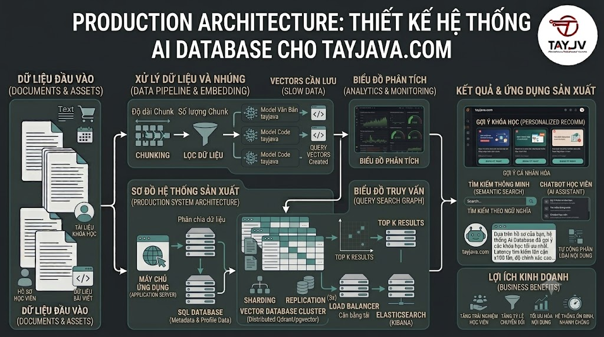

# Production Architecture: Thiết Kế Hệ Thống AI Database Cho nguyentienkhoi.hashnode.dev



Bạn đã biết từng thành phần riêng lẻ — pgvector, Qdrant, embedding pipeline, caching. Bài này kết hợp tất cả lại thành **một kiến trúc production hoàn chỉnh**: data flow từ OLTP PostgreSQL sang Vector DB, sync pipeline, failover strategy, cost optimization và deployment guide. Đây là bài "big picture" trước khi đi vào các use case nâng cao.

## 1\. Kiến Trúc Tổng Thể

```java
┌──────────────────────────────────────────────────────────────┐
│                     nguyentienkhoi.hashnode.dev Production                   │
│                                                              │
│  ┌─────────────┐    ┌─────────────┐     ┌─────────────────┐  │
│  │   Spring    │    │  Next.js    │     │   Admin Panel   │  │
│  │   Boot API  │    │  Frontend   │     │                 │  │
│  └──────┬──────┘    └──────┬──────┘     └────────┬────────┘  │
│         │                  │                     │           │
│  ┌──────▼──────────────────▼─────────────────────▼────────┐  │
│  │                    API Gateway / Load Balancer         │  │
│  └──────┬──────────────────┬─────────────────────┬────────┘  │
│         │                  │                     │           │
│  ┌──────▼──────┐    ┌──────▼──────┐     ┌────────▼────────┐  │
│  │  Write API  │    │  Search API │     │  Rec Engine API │  │
│  │  (CRUD)     │    │  (FastAPI)  │     │  (FastAPI)      │  │
│  └──────┬──────┘    └──────┬──────┘     └────────┬────────┘  │
│         │                  │                     │           │
│  ┌──────▼──────┐    ┌──────▼──────┐     ┌────────▼────────┐  │
│  │ PostgreSQL  │    │   Redis     │     │   Redis         │  │
│  │ (Primary)   │◄───│   Cache     │     │   Cache         │  │
│  │  OLTP Data  │    │   L2 Cache  │     │   Rec Cache     │  │
│  └──────┬──────┘    └─────────────┘     └─────────────────┘  │
│         │                                                    │
│  ┌──────▼──────┐                                             │
│  │  CDC/Sync   │  ← Change Data Capture                      │
│  │  Pipeline   │                                             │
│  └──────┬──────┘                                             │
│         │                                                    │
│  ┌──────▼──────────────────────────────┐                     │
│  │           Vector DB Layer           │                     │
│  │                                     │                     │
│  │  pgvector (PostgreSQL extension)    │                     │
│  │  → Small dataset, SQL integration   │                     │
│  │                                     │                     │
│  │  Qdrant (Standalone)                │                     │
│  │  → Large dataset, production        │                     │
│  └─────────────────────────────────────┘                     │
└──────────────────────────────────────────────────────────────┘
```

## 2\. Quyết Định: pgvector vs Qdrant

Dựa trên scale thực tế của [nguyentienkhoi.hashnode.dev](http://nguyentienkhoi.hashnode.dev):

```java
Hiện tại (small scale):
  Courses:  ~100-500    → pgvector đủ
  Posts:    ~500-2000   → pgvector đủ
  Users:    ~10k-50k    → pgvector đủ
  Chunks:   ~10k-100k   → pgvector đủ

Tương lai (medium scale, 2-3 năm):
  Courses:  ~1000-5000  → pgvector vẫn ổn
  Posts:    ~5k-20k     → pgvector vẫn ổn
  Users:    ~100k-500k  → user vectors → Qdrant
  Chunks:   ~500k-2M    → Qdrant tốt hơn

Recommendation:
  Giai đoạn 1: pgvector only — đơn giản, ít infra
  Giai đoạn 2: pgvector (courses/posts) + Qdrant (user vectors)
  Giai đoạn 3: Migrate toàn bộ sang Qdrant khi > 1M vectors
```

## 3\. Sync Pipeline — OLTP → Vector DB

### 3.1 Event-driven Sync

```python
import os
import json
import logging
import asyncio
from enum import Enum
from typing import Optional, List
from dataclasses import dataclass
from datetime import datetime
import psycopg2
import psycopg2.extras
from sentence_transformers import SentenceTransformer
from dotenv import load_dotenv

load_dotenv()
logger = logging.getLogger(__name__)

class SyncEventType(Enum):
    COURSE_CREATED  = "course.created"
    COURSE_UPDATED  = "course.updated"
    COURSE_DELETED  = "course.deleted"
    POST_PUBLISHED  = "post.published"
    POST_UPDATED    = "post.updated"
    USER_ENROLLED   = "user.enrolled"
    USER_COMPLETED  = "user.completed"

@dataclass
class SyncEvent:
    event_type: SyncEventType
    entity_id:  int
    data:       dict
    occurred_at: datetime

class VectorSyncPipeline:
    """
    Sync dữ liệu từ PostgreSQL sang Vector DB
    khi có thay đổi trong OLTP database.
    """

    def __init__(self):
        self.model = SentenceTransformer(
            "paraphrase-multilingual-MiniLM-L12-v2"
        )
        self.conn  = psycopg2.connect(
            host=os.getenv("POSTGRES_HOST"),
            port=os.getenv("POSTGRES_PORT"),
            user=os.getenv("POSTGRES_USER"),
            password=os.getenv("POSTGRES_PASSWORD"),
            dbname=os.getenv("POSTGRES_DB")
        )

    async def handle_event(self, event: SyncEvent):
        """Route event đến handler phù hợp"""
        handlers = {
            SyncEventType.COURSE_CREATED:  self.sync_course,
            SyncEventType.COURSE_UPDATED:  self.sync_course,
            SyncEventType.COURSE_DELETED:  self.delete_course_vector,
            SyncEventType.POST_PUBLISHED:  self.sync_post,
            SyncEventType.POST_UPDATED:    self.sync_post,
            SyncEventType.USER_ENROLLED:   self.update_user_vector,
            SyncEventType.USER_COMPLETED:  self.update_user_vector,
        }

        handler = handlers.get(event.event_type)
        if handler:
            try:
                await handler(event.entity_id)
                logger.info(f"Synced: {event.event_type.value} #{event.entity_id}")
            except Exception as e:
                logger.error(f"Sync failed: {event.event_type.value} #{event.entity_id}: {e}")
                raise

    async def sync_course(self, course_id: int):
        """Embed và upsert course vào Vector DB"""
        cursor = self.conn.cursor(cursor_factory=psycopg2.extras.DictCursor)

        cursor.execute("""
            SELECT
                c.id, c.title, c.description, c.course_type,
                cat.name AS category_name
            FROM courses c
            LEFT JOIN categories cat ON cat.id = c.category_id
            WHERE c.id = %s AND c.course_status = 'PUBLISHED'
        """, (course_id,))

        course = cursor.fetchone()
        cursor.close()

        if not course:
            await self.delete_course_vector(course_id)
            return

        # Build text to embed
        text = " ".join(filter(None, [
            course['title'], course['title'],  # double weight
            course['description'],
            course['category_name'],
        ]))

        embedding = self.model.encode(text, normalize_embeddings=True)

        # Upsert vào pgvector
        cursor = self.conn.cursor()
        cursor.execute("""
            INSERT INTO course_vectors
                (course_id, content_text, content_type, embedding, model_name)
            VALUES (%s, %s, 'full', %s, %s)
            ON CONFLICT (course_id, content_type, model_name)
            DO UPDATE SET
                content_text = EXCLUDED.content_text,
                embedding    = EXCLUDED.embedding,
                updated_at   = NOW()
        """, (
            course_id, text, embedding.tolist(),
            "paraphrase-multilingual-MiniLM-L12-v2"
        ))
        self.conn.commit()
        cursor.close()

    async def delete_course_vector(self, course_id: int):
        """Xóa vector khi course bị unpublish/delete"""
        cursor = self.conn.cursor()
        cursor.execute(
            "DELETE FROM course_vectors WHERE course_id = %s",
            (course_id,)
        )
        self.conn.commit()
        cursor.close()

    async def sync_post(self, post_id: int):
        """Embed và chunk bài viết"""
        cursor = self.conn.cursor(cursor_factory=psycopg2.extras.DictCursor)

        cursor.execute("""
            SELECT id, title, content, seo_description
            FROM posts
            WHERE id = %s AND post_status = 'PUBLISHED'
        """, (post_id,))

        post = cursor.fetchone()
        cursor.close()

        if not post:
            cursor = self.conn.cursor()
            cursor.execute(
                "DELETE FROM post_vectors WHERE post_id = %s", (post_id,)
            )
            self.conn.commit()
            cursor.close()
            return

        # Xóa chunks cũ
        cursor = self.conn.cursor()
        cursor.execute(
            "DELETE FROM content_chunks WHERE source_id = %s AND source_type = 'post'",
            (post_id,)
        )

        # Simple chunk: title + description (bài ngắn)
        text = f"{post['title']}. {post['title']}. {post['seo_description'] or ''}"
        embedding = self.model.encode(text, normalize_embeddings=True)

        cursor.execute("""
            INSERT INTO post_vectors
                (post_id, content_text, content_type, embedding, model_name)
            VALUES (%s, %s, 'full', %s, %s)
            ON CONFLICT (post_id, content_type, model_name)
            DO UPDATE SET
                content_text = EXCLUDED.content_text,
                embedding    = EXCLUDED.embedding,
                updated_at   = NOW()
        """, (
            post_id, text, embedding.tolist(),
            "paraphrase-multilingual-MiniLM-L12-v2"
        ))

        self.conn.commit()
        cursor.close()

    async def update_user_vector(self, user_id: int):
        """
        Rebuild user preference vector khi user enroll/complete course.
        Có debounce: tránh rebuild quá nhiều lần liên tiếp.
        """
        debounce_key = f"user_vec_pending:{user_id}"

        # Dùng Redis để debounce (nếu đã schedule rồi thì skip)
        import redis as redis_lib
        r = redis_lib.from_url("redis://localhost:6379")
        if r.get(debounce_key):
            return

        # Mark pending với TTL 30 giây
        r.setex(debounce_key, 30, "1")

        # Delay 30 giây trước khi rebuild (chờ các events khác cùng user)
        await asyncio.sleep(30)

        # Rebuild user vector
        cursor = self.conn.cursor(cursor_factory=psycopg2.extras.DictCursor)

        cursor.execute("""
            SELECT
                cv.embedding,
                CASE
                    WHEN ucc.id IS NOT NULL THEN 3.0
                    ELSE 1.0
                END AS weight
            FROM enrollments e
            JOIN course_vectors cv
                ON cv.course_id    = e.course_id
               AND cv.content_type = 'full'
            LEFT JOIN user_course_certificates ucc
                ON ucc.student_id = e.user_id
               AND ucc.course_id  = e.course_id
            WHERE e.user_id = %s
        """, (user_id,))

        rows = cursor.fetchall()
        cursor.close()

        if not rows:
            return

        import numpy as np
        embeddings = np.array([
            [float(x) for x in row['embedding'].strip('[]').split(',')]
            for row in rows
        ])
        weights = np.array([float(row['weight']) for row in rows])

        weighted_avg = np.average(embeddings, axis=0, weights=weights)
        norm         = np.linalg.norm(weighted_avg)
        if norm > 0:
            weighted_avg /= norm

        cursor = self.conn.cursor()
        cursor.execute("""
            INSERT INTO user_preference_vectors
                (user_id, embedding, model_name, courses_count, last_synced_at)
            VALUES (%s, %s, %s, %s, NOW())
            ON CONFLICT (user_id, model_name)
            DO UPDATE SET
                embedding      = EXCLUDED.embedding,
                courses_count  = EXCLUDED.courses_count,
                last_synced_at = NOW(),
                updated_at     = NOW()
        """, (
            user_id, weighted_avg.tolist(),
            "paraphrase-multilingual-MiniLM-L12-v2",
            len(rows)
        ))
        self.conn.commit()
        cursor.close()

        r.delete(debounce_key)
        logger.info(f"Updated preference vector for user {user_id}")
```

### 3.2 Polling-based Sync (Đơn Giản Hơn)

```python
class PollingSync:
    """
    Thay thế đơn giản hơn cho CDC:
    Chạy cron job định kỳ, tìm và sync dữ liệu đã thay đổi.
    """

    def __init__(self, pipeline: VectorSyncPipeline):
        self.pipeline  = pipeline
        self.conn      = pipeline.conn

    async def sync_changed_courses(self, since_minutes: int = 5):
        """Sync courses đã thay đổi trong N phút qua"""
        cursor = self.conn.cursor(cursor_factory=psycopg2.extras.DictCursor)

        cursor.execute("""
            SELECT c.id
            FROM courses c
            LEFT JOIN course_vectors cv
                   ON cv.course_id = c.id AND cv.content_type = 'full'
            WHERE c.course_status = 'PUBLISHED'
              AND (
                  cv.id IS NULL  -- chưa có vector
                  OR c.updated_at > cv.updated_at  -- đã thay đổi
                  OR c.updated_at > NOW() - INTERVAL '%s minutes'
              )
        """, (since_minutes,))

        course_ids = [row['id'] for row in cursor.fetchall()]
        cursor.close()

        if not course_ids:
            return 0

        logger.info(f"Syncing {len(course_ids)} changed courses...")
        for course_id in course_ids:
            await self.pipeline.sync_course(course_id)

        return len(course_ids)

    async def run_forever(self, interval_seconds: int = 60):
        """Chạy polling loop mãi mãi"""
        logger.info(f"Starting polling sync (interval={interval_seconds}s)")
        while True:
            try:
                n = await self.sync_changed_courses()
                if n > 0:
                    logger.info(f"Synced {n} courses")
            except Exception as e:
                logger.error(f"Polling sync error: {e}")

            await asyncio.sleep(interval_seconds)
```

## 4\. Full-Text Search Table Setup

```sql
-- Bảng search_logs để track queries
CREATE TABLE IF NOT EXISTS search_logs (
    id          BIGSERIAL PRIMARY KEY,
    query       TEXT NOT NULL,
    result_ids  INT[],
    user_id     BIGINT,
    took_ms     FLOAT,
    method      VARCHAR(50),
    searched_at TIMESTAMPTZ DEFAULT NOW()
);

CREATE INDEX idx_search_logs_searched_at ON search_logs (searched_at DESC);
CREATE INDEX idx_search_logs_user_id     ON search_logs (user_id);

-- Full-text search column cho course_vectors
ALTER TABLE course_vectors
    ADD COLUMN IF NOT EXISTS search_vector TSVECTOR
        GENERATED ALWAYS AS (to_tsvector('simple', content_text)) STORED;

CREATE INDEX IF NOT EXISTS idx_course_vectors_fts
    ON course_vectors USING gin(search_vector);
```

## 5\. Spring Boot Integration

Vì [nguyentienkhoi.hashnode.dev](http://nguyentienkhoi.hashnode.dev) dùng Spring Boot, đây là cách tích hợp Vector Search vào Java backend:

```java
// VectorSearchClient.java — gọi Python FastAPI từ Spring Boot
@Service
public class VectorSearchClient {

    private final RestTemplate restTemplate;
    private final String searchApiUrl;

    public VectorSearchClient(RestTemplate restTemplate,
                               @Value("${search.api.url}") String searchApiUrl) {
        this.restTemplate = restTemplate;
        this.searchApiUrl = searchApiUrl;
    }

    public SearchResponse searchCourses(String query,
                                        Integer limit,
                                        Long categoryId,
                                        Double maxPrice) {
        String url = UriComponentsBuilder
            .fromHttpUrl(searchApiUrl + "/search/courses")
            .queryParam("q", query)
            .queryParamIfPresent("limit", Optional.ofNullable(limit))
            .queryParamIfPresent("category_id", Optional.ofNullable(categoryId))
            .queryParamIfPresent("max_price", Optional.ofNullable(maxPrice))
            .toUriString();

        return restTemplate.getForObject(url, SearchResponse.class);
    }

    public List<RecommendedCourse> getRecommendations(Long userId) {
        String url = searchApiUrl + "/recommendations/homepage?user_id=" + userId;
        return Arrays.asList(
            restTemplate.getForObject(url, RecommendedCourse[].class)
        );
    }

    public void notifyCourseUpdated(Long courseId) {
        // Trigger sync khi course thay đổi
        restTemplate.postForEntity(
            searchApiUrl + "/sync/course/" + courseId,
            null,
            Void.class
        );
    }
}

// CourseController.java — trigger sync sau khi update
@RestController
@RequestMapping("/api/courses")
public class CourseController {

    private final CourseService courseService;
    private final VectorSearchClient searchClient;

    @PutMapping("/{id}")
    public ResponseEntity<CourseResponse> updateCourse(
            @PathVariable Long id,
            @RequestBody UpdateCourseRequest request) {

        CourseResponse updated = courseService.update(id, request);

        // Async notify search service
        CompletableFuture.runAsync(() -> {
            searchClient.notifyCourseUpdated(id);
        });

        return ResponseEntity.ok(updated);
    }
}
```

## 6\. Sync API Endpoint

```python
from fastapi import FastAPI, BackgroundTasks

sync_app = FastAPI(title="Vector Sync API")
pipeline = VectorSyncPipeline()

@sync_app.post("/sync/course/{course_id}")
async def sync_course(course_id: int,
                       background_tasks: BackgroundTasks):
    """
    Trigger re-embed cho một course.
    Chạy async để không block Spring Boot response.
    """
    background_tasks.add_task(pipeline.sync_course, course_id)
    return {"status": "queued", "course_id": course_id}

@sync_app.post("/sync/post/{post_id}")
async def sync_post(post_id: int,
                     background_tasks: BackgroundTasks):
    background_tasks.add_task(pipeline.sync_post, post_id)
    return {"status": "queued", "post_id": post_id}

@sync_app.post("/sync/user/{user_id}/vector")
async def update_user_vector(user_id: int,
                               background_tasks: BackgroundTasks):
    background_tasks.add_task(pipeline.update_user_vector, user_id)
    return {"status": "queued", "user_id": user_id}

@sync_app.post("/sync/full")
async def full_sync(background_tasks: BackgroundTasks):
    """Full re-embed toàn bộ — chạy khi đổi model"""
    async def do_full_sync():
        conn   = pipeline.conn
        cursor = conn.cursor()
        cursor.execute(
            "SELECT id FROM courses WHERE course_status = 'PUBLISHED'"
        )
        course_ids = [row[0] for row in cursor.fetchall()]
        cursor.close()

        for cid in course_ids:
            await pipeline.sync_course(cid)
            await asyncio.sleep(0.1)  # throttle

    background_tasks.add_task(do_full_sync)
    return {"status": "full_sync_started"}

@sync_app.get("/sync/status")
async def sync_status():
    """Kiểm tra trạng thái sync"""
    cursor = pipeline.conn.cursor()

    cursor.execute("""
        SELECT
            (SELECT COUNT(*) FROM courses WHERE course_status = 'PUBLISHED') AS total_courses,
            (SELECT COUNT(*) FROM course_vectors) AS embedded_courses,
            (SELECT COUNT(*) FROM posts WHERE post_status = 'PUBLISHED') AS total_posts,
            (SELECT COUNT(*) FROM post_vectors) AS embedded_posts,
            (SELECT COUNT(*) FROM user_preference_vectors) AS user_vectors
    """)

    row = cursor.fetchone()
    cursor.close()

    return {
        "courses": {
            "total":    row[0],
            "embedded": row[1],
            "coverage": f"{row[1]/max(row[0],1)*100:.1f}%"
        },
        "posts": {
            "total":    row[2],
            "embedded": row[3],
            "coverage": f"{row[3]/max(row[2],1)*100:.1f}%"
        },
        "user_vectors": row[4]
    }
```

## 7\. Deployment với Docker Compose

```yaml
# docker-compose.production.yml
version: '3.8'

services:

  # PostgreSQL với pgvector
  postgres:
    image: pgvector/pgvector:pg16
    environment:
      POSTGRES_USER:     ${POSTGRES_USER}
      POSTGRES_PASSWORD: ${POSTGRES_PASSWORD}
      POSTGRES_DB:       ${POSTGRES_DB}
    volumes:
      - postgres_data:/var/lib/postgresql/data
      - ./init.sql:/docker-entrypoint-initdb.d/init.sql
    ports:
      - "5432:5432"
    restart: unless-stopped
    healthcheck:
      test: ["CMD-SHELL", "pg_isready -U ${POSTGRES_USER}"]
      interval: 10s
      timeout: 5s
      retries: 5

  # Qdrant (cho user vectors + large scale)
  qdrant:
    image: qdrant/qdrant:latest
    ports:
      - "6333:6333"
      - "6334:6334"
    volumes:
      - qdrant_data:/qdrant/storage
    environment:
      QDRANT__SERVICE__GRPC_PORT: 6334
    restart: unless-stopped

  # Redis (cache + debounce)
  redis:
    image: redis:7-alpine
    ports:
      - "6379:6379"
    volumes:
      - redis_data:/data
    command: redis-server --appendonly yes --maxmemory 512mb --maxmemory-policy allkeys-lru
    restart: unless-stopped

  # Search & Recommendation API
  search-api:
    build:
      context: ./search-service
      dockerfile: Dockerfile
    environment:
      POSTGRES_HOST:     postgres
      POSTGRES_PORT:     5432
      POSTGRES_USER:     ${POSTGRES_USER}
      POSTGRES_PASSWORD: ${POSTGRES_PASSWORD}
      POSTGRES_DB:       ${POSTGRES_DB}
      QDRANT_HOST:       qdrant
      QDRANT_PORT:       6333
      REDIS_URL:         redis://redis:6379
    ports:
      - "8001:8000"
    depends_on:
      postgres:
        condition: service_healthy
      qdrant:
        condition: service_started
      redis:
        condition: service_started
    restart: unless-stopped
    deploy:
      resources:
        limits:
          memory: 2G  # embedding model cần RAM

  # Sync Service (polling)
  sync-service:
    build:
      context: ./search-service
      dockerfile: Dockerfile
    command: python sync_worker.py
    environment:
      POSTGRES_HOST:     postgres
      POSTGRES_USER:     ${POSTGRES_USER}
      POSTGRES_PASSWORD: ${POSTGRES_PASSWORD}
      POSTGRES_DB:       ${POSTGRES_DB}
      REDIS_URL:         redis://redis:6379
    depends_on:
      - postgres
      - redis
    restart: unless-stopped

volumes:
  postgres_data:
  qdrant_data:
  redis_data:
```

## 8\. Checklist Trước Khi Lên Production

```java
✅ DATA INTEGRITY:
□ Tất cả published courses có embedding
□ Tất cả published posts có embedding
□ Sync coverage > 99% (kiểm tra /sync/status)
□ Trigger tự động re-embed khi course/post update

✅ PERFORMANCE:
□ Search latency P95 < 100ms
□ Recommendation latency P95 < 200ms
□ Cache hit rate > 40% sau 24h
□ HNSW index đã được tạo
□ Payload indexes đã tạo (Qdrant)

✅ RELIABILITY:
□ Health check endpoints hoạt động
□ Graceful shutdown (flush cache trước khi stop)
□ Error handling và retry logic
□ Dead letter queue cho failed sync events

✅ MONITORING:
□ Latency dashboard (Grafana/Datadog)
□ Cache hit rate tracking
□ Zero-result alert
□ Sync lag alert (> 5 phút)
□ Disk usage alert (Qdrant storage)

✅ COST:
□ Ước tính RAM cần thiết (embedding model ~500MB)
□ Qdrant storage estimate (100k vectors × 384 dims × 4 bytes = 150MB)
□ Redis memory limit đặt phù hợp
□ Cân nhắc Quantization nếu RAM hạn chế
```

## Tổng Kết

```java
Production Architecture nguyentienkhoi.hashnode.dev:

Spring Boot API
    ↓ REST call
Search/Rec FastAPI  ←→  Redis Cache
    ↓                        ↑
pgvector ←── Sync ──── PostgreSQL (OLTP)
    +
Qdrant (user vectors)
```


| Component | Role | Scale |
|---|---|---|
| PostgreSQL + pgvector | Courses & Posts vectors | ~100k vectors |
| Qdrant | User preference vectors | ~500k users |
| Redis | Cache L2 + debounce | ~512MB |
| Sync Service | Poll & re-embed changes | Background |
| Search API | Hybrid search + reranking | Stateless |
| Rec Engine | Recommendations | Stateless |


Bài tiếp theo chúng ta sẽ học **Multi-modal Vector Search** — tìm kiếm bằng hình ảnh thumbnail, kết hợp text và image embedding trong cùng một vector space với CLIP model.

