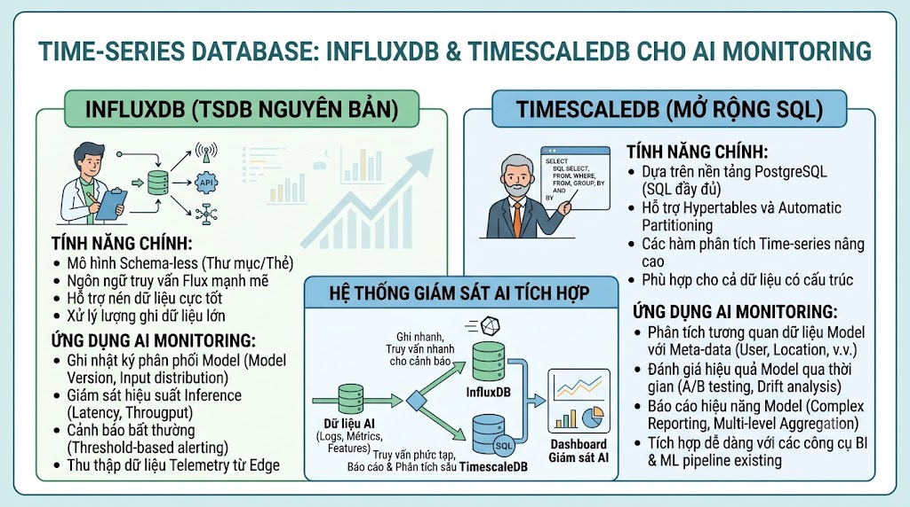

# Time-series Database: InfluxDB & TimescaleDB Cho AI Monitoring



Vector DB giỏi tìm kiếm theo ngữ nghĩa. SQL giỏi transaction và aggregation. Nhưng khi cần theo dõi **dữ liệu thay đổi liên tục theo thời gian** — model accuracy drift, search latency qua từng giờ, user behavior tracking, API request rate — đây là lãnh địa của **Time-series Database (TSDB)**. Bài này sẽ học InfluxDB và TimescaleDB để xây dựng hệ thống monitoring cho AI features của [nguyentienkhoi.hashnode.dev](http://nguyentienkhoi.hashnode.dev).

## 1\. Tại Sao Cần Time-series Database?

```java
Câu hỏi điển hình của TSDB:
  "Search latency P95 trong 1 giờ qua là bao nhiêu?"
  "Recall@10 của recommendation đã giảm từ khi nào?"
  "Số lượng vector search per second vào giờ cao điểm?"
  "Model embedding có bị drift không sau khi update dữ liệu?"

❌ PostgreSQL xử lý kém:
  - Insert liên tục hàng nghìn rows/giây → bottleneck
  - Query aggregation time-range trên bảng 100M rows → chậm
  - Không có time-series specific functions (downsample, retention policy)
  - Storage kém hiệu quả cho sequential time data

✅ TSDB xử lý tốt:
  - Ingestion: 100k+ data points/giây
  - Query: time-range aggregation cực nhanh
  - Compression: time-series data nén được 10-50x
  - Built-in: retention policy, downsampling, alerting
```

## 2\. InfluxDB vs TimescaleDB


|  | InfluxDB 3.0 | TimescaleDB |
|---|---|---|
| Base | Standalone TSDB | PostgreSQL extension |
| Query Language | SQL (InfluxDB 3.0) | SQL (PostgreSQL) |
| Learning Curve | Thấp (SQL) | Rất thấp (đã biết PostgreSQL) |
| Ingestion Speed | Rất cao | Cao |
| Compression | ~90% | ~90% |
| Retention Policy | Built-in | Tự cấu hình |
| Ecosystem | Grafana native | PostgreSQL ecosystem |
| Setup | Standalone | PostgreSQL extension |
| Best For | Metrics, IoT, monitoring | Analytics + time-series kết hợp |


**Khuyến nghị cho** [**nguyentienkhoi.hashnode.dev**](http://nguyentienkhoi.hashnode.dev)**:**

*   **TimescaleDB** nếu đã có PostgreSQL — thêm extension, không cần service mới
    
*   **InfluxDB** nếu muốn solution chuyên biệt cho metrics
    

## 3\. TimescaleDB — TSDB Trên PostgreSQL

### 3.1 Cài Đặt

```bash
# Docker với TimescaleDB
docker run -d \
  --name timescaledb \
  -e POSTGRES_USER=postgres \
  -e POSTGRES_PASSWORD=postgres \
  -e POSTGRES_DB=foxdev_metrics \
  -p 5433:5432 \
  timescale/timescaledb:latest-pg16

# Hoặc thêm vào PostgreSQL hiện có
docker exec -it postgres-vector psql -U postgres -c \
  "CREATE EXTENSION IF NOT EXISTS timescaledb"
```

### 3.2 Tạo Hypertable

**Hypertable** là bảng PostgreSQL thông thường được TimescaleDB tự động partition theo thời gian:

```sql
-- Kết nối vào TimescaleDB
\c foxdev_metrics

-- Enable extension
CREATE EXTENSION IF NOT EXISTS timescaledb;

-- ──────────────────────────────────────────
-- Bảng metrics cho AI/Search features
-- ──────────────────────────────────────────
CREATE TABLE search_metrics (
    time        TIMESTAMPTZ NOT NULL,
    query       TEXT,
    latency_ms  DOUBLE PRECISION NOT NULL,
    num_results INT             NOT NULL,
    cache_hit   BOOLEAN         NOT NULL DEFAULT FALSE,
    method      TEXT            NOT NULL,  -- 'vector', 'hybrid', 'fts'
    user_id     BIGINT,
    session_id  TEXT
);

-- Chuyển thành hypertable — tự động partition theo thời gian
SELECT create_hypertable('search_metrics', by_range('time'));

-- ──────────────────────────────────────────
-- Bảng metrics cho recommendation
-- ──────────────────────────────────────────
CREATE TABLE recommendation_metrics (
    time            TIMESTAMPTZ NOT NULL,
    user_id         BIGINT,
    rec_type        TEXT NOT NULL,   -- 'content', 'collaborative', 'popular'
    section         TEXT,            -- 'homepage', 'course_page'
    num_results     INT  NOT NULL,
    latency_ms      DOUBLE PRECISION NOT NULL,
    clicked_rank    INT,             -- rank của item được click (NULL nếu không click)
    clicked_id      BIGINT
);

SELECT create_hypertable('recommendation_metrics', by_range('time'));

-- ──────────────────────────────────────────
-- Bảng embedding model performance
-- ──────────────────────────────────────────
CREATE TABLE model_metrics (
    time            TIMESTAMPTZ NOT NULL,
    model_name      TEXT NOT NULL,
    metric_name     TEXT NOT NULL,   -- 'recall_at_10', 'latency_ms', 'throughput'
    value           DOUBLE PRECISION NOT NULL,
    tags            JSONB
);

SELECT create_hypertable('model_metrics', by_range('time'));

-- ──────────────────────────────────────────
-- Compression policy — tự động nén data cũ
-- ──────────────────────────────────────────
ALTER TABLE search_metrics
    SET (timescaledb.compress,
         timescaledb.compress_segmentby = 'method');

SELECT add_compression_policy('search_metrics',
    INTERVAL '7 days');  -- nén data sau 7 ngày

-- ──────────────────────────────────────────
-- Retention policy — tự động xóa data cũ
-- ──────────────────────────────────────────
SELECT add_retention_policy('search_metrics',
    INTERVAL '90 days');  -- giữ 90 ngày

-- ──────────────────────────────────────────
-- Continuous Aggregates — pre-computed rollups
-- ──────────────────────────────────────────
CREATE MATERIALIZED VIEW search_metrics_hourly
WITH (timescaledb.continuous) AS
SELECT
    time_bucket('1 hour', time) AS hour,
    method,
    COUNT(*)                     AS total_searches,
    AVG(latency_ms)              AS avg_latency_ms,
    PERCENTILE_CONT(0.95)
        WITHIN GROUP (ORDER BY latency_ms) AS p95_latency_ms,
    SUM(CASE WHEN cache_hit THEN 1 ELSE 0 END)::float / COUNT(*) AS cache_hit_rate,
    SUM(CASE WHEN num_results = 0 THEN 1 ELSE 0 END) AS zero_results
FROM search_metrics
GROUP BY hour, method
WITH NO DATA;

-- Refresh policy: cập nhật mỗi giờ
SELECT add_continuous_aggregate_policy('search_metrics_hourly',
    start_offset => INTERVAL '3 hours',
    end_offset   => INTERVAL '1 hour',
    schedule_interval => INTERVAL '1 hour'
);

-- Daily aggregate
CREATE MATERIALIZED VIEW search_metrics_daily
WITH (timescaledb.continuous) AS
SELECT
    time_bucket('1 day', time) AS day,
    method,
    COUNT(*)                    AS total_searches,
    AVG(latency_ms)             AS avg_latency_ms,
    PERCENTILE_CONT(0.99)
        WITHIN GROUP (ORDER BY latency_ms) AS p99_latency_ms
FROM search_metrics
GROUP BY day, method
WITH NO DATA;

SELECT add_continuous_aggregate_policy('search_metrics_daily',
    start_offset => INTERVAL '3 days',
    end_offset   => INTERVAL '1 day',
    schedule_interval => INTERVAL '1 day'
);
```

## 4\. Metrics Collection Service

```python
import os
import time
import threading
import logging
from queue import Queue, Empty
from dataclasses import dataclass, field
from typing import Optional, List, Dict, Any
from datetime import datetime, timezone
import psycopg2
import psycopg2.extras
from dotenv import load_dotenv

load_dotenv()
logger = logging.getLogger(__name__)


@dataclass
class SearchMetricPoint:
    """Một data point cho search metrics"""
    latency_ms:  float
    num_results: int
    cache_hit:   bool
    method:      str
    query:       str           = ""
    user_id:     Optional[int] = None
    session_id:  Optional[str] = None
    time:        datetime = field(default_factory=lambda: datetime.now(timezone.utc))

@dataclass
class RecMetricPoint:
    """Một data point cho recommendation metrics"""
    rec_type:    str
    num_results: int
    latency_ms:  float
    section:     str           = ""
    user_id:     Optional[int] = None
    clicked_rank: Optional[int] = None
    clicked_id:  Optional[int] = None
    time:        datetime = field(default_factory=lambda: datetime.now(timezone.utc))

@dataclass
class ModelMetricPoint:
    """Một data point cho model performance metrics"""
    model_name:  str
    metric_name: str
    value:       float
    tags:        Dict[str, Any] = field(default_factory=dict)
    time:        datetime = field(default_factory=lambda: datetime.now(timezone.utc))


class MetricsCollector:
    """
    Non-blocking metrics collector với background batch writer.
    Ghi metrics không block main request thread.
    """

    def __init__(self,
                 dsn: str = None,
                 batch_size: int = 100,
                 flush_interval: int = 5):
        self.dsn            = dsn or (
            f"host={os.getenv('TIMESCALE_HOST', 'localhost')} "
            f"port={os.getenv('TIMESCALE_PORT', '5433')} "
            f"user={os.getenv('POSTGRES_USER', 'postgres')} "
            f"password={os.getenv('POSTGRES_PASSWORD', 'postgres')} "
            f"dbname={os.getenv('TIMESCALE_DB', 'foxdev_metrics')}"
        )
        self.batch_size     = batch_size
        self.flush_interval = flush_interval

        # Thread-safe queues
        self.search_queue = Queue(maxsize=10000)
        self.rec_queue    = Queue(maxsize=10000)
        self.model_queue  = Queue(maxsize=10000)

        # Background writer thread
        self._stop_event = threading.Event()
        self._writer = threading.Thread(
            target=self._batch_writer_loop,
            daemon=True,
            name="metrics-writer"
        )
        self._writer.start()
        logger.info("MetricsCollector started")

    def record_search(self, metric: SearchMetricPoint):
        """Non-blocking: đẩy vào queue"""
        try:
            self.search_queue.put_nowait(metric)
        except Exception:
            pass  # Drop nếu queue đầy — metrics không quan trọng hơn business logic

    def record_recommendation(self, metric: RecMetricPoint):
        try:
            self.rec_queue.put_nowait(metric)
        except Exception:
            pass

    def record_model_metric(self, metric: ModelMetricPoint):
        try:
            self.model_queue.put_nowait(metric)
        except Exception:
            pass

    def _batch_writer_loop(self):
        """Background thread: flush metrics vào TimescaleDB theo batch"""
        conn = None
        while not self._stop_event.is_set():
            try:
                if conn is None or conn.closed:
                    conn = psycopg2.connect(self.dsn)

                # Collect batch
                search_batch: List[SearchMetricPoint] = []
                rec_batch:    List[RecMetricPoint]    = []
                model_batch:  List[ModelMetricPoint]  = []

                # Drain queues (tối đa batch_size items)
                deadline = time.time() + self.flush_interval
                while time.time() < deadline:
                    try:
                        search_batch.append(
                            self.search_queue.get_nowait()
                        )
                    except Empty:
                        break

                for _ in range(self.batch_size):
                    try:
                        rec_batch.append(self.rec_queue.get_nowait())
                    except Empty:
                        break

                for _ in range(self.batch_size):
                    try:
                        model_batch.append(self.model_queue.get_nowait())
                    except Empty:
                        break

                # Write batches
                if search_batch:
                    self._write_search_batch(conn, search_batch)
                if rec_batch:
                    self._write_rec_batch(conn, rec_batch)
                if model_batch:
                    self._write_model_batch(conn, model_batch)

            except Exception as e:
                logger.error(f"Metrics writer error: {e}")
                if conn:
                    try:
                        conn.close()
                    except Exception:
                        pass
                    conn = None

            time.sleep(max(0, deadline - time.time()))

    def _write_search_batch(self, conn,
                             batch: List[SearchMetricPoint]):
        cursor = conn.cursor()
        psycopg2.extras.execute_values(
            cursor,
            """
            INSERT INTO search_metrics
                (time, query, latency_ms, num_results,
                 cache_hit, method, user_id, session_id)
            VALUES %s
            """,
            [
                (m.time, m.query, m.latency_ms, m.num_results,
                 m.cache_hit, m.method, m.user_id, m.session_id)
                for m in batch
            ]
        )
        conn.commit()
        cursor.close()

    def _write_rec_batch(self, conn,
                          batch: List[RecMetricPoint]):
        cursor = conn.cursor()
        psycopg2.extras.execute_values(
            cursor,
            """
            INSERT INTO recommendation_metrics
                (time, user_id, rec_type, section,
                 num_results, latency_ms, clicked_rank, clicked_id)
            VALUES %s
            """,
            [
                (m.time, m.user_id, m.rec_type, m.section,
                 m.num_results, m.latency_ms, m.clicked_rank, m.clicked_id)
                for m in batch
            ]
        )
        conn.commit()
        cursor.close()

    def _write_model_batch(self, conn,
                            batch: List[ModelMetricPoint]):
        import json
        cursor = conn.cursor()
        psycopg2.extras.execute_values(
            cursor,
            """
            INSERT INTO model_metrics (time, model_name, metric_name, value, tags)
            VALUES %s
            """,
            [
                (m.time, m.model_name, m.metric_name, m.value,
                 json.dumps(m.tags))
                for m in batch
            ]
        )
        conn.commit()
        cursor.close()

    def stop(self):
        self._stop_event.set()
        self._writer.join(timeout=10)
        logger.info("MetricsCollector stopped")


# ──────────────────────────────────────────
# Decorator để tự động record metrics
# ──────────────────────────────────────────
import functools

collector = MetricsCollector()

def track_search(method: str = "hybrid"):
    """Decorator tự động record search metrics"""
    def decorator(func):
        @functools.wraps(func)
        def wrapper(*args, **kwargs):
            start = time.perf_counter()
            result = func(*args, **kwargs)
            latency_ms = (time.perf_counter() - start) * 1000

            # Extract metrics từ result
            num_results = len(result) if isinstance(result, list) else 0
            query       = kwargs.get('query', args[1] if len(args) > 1 else "")

            collector.record_search(SearchMetricPoint(
                latency_ms  = latency_ms,
                num_results = num_results,
                cache_hit   = False,
                method      = method,
                query       = str(query)[:200]
            ))
            return result
        return wrapper
    return decorator

# Usage
class SearchService:
    @track_search(method="hybrid")
    def search(self, query: str, **kwargs):
        # ... search logic
        pass
```

## 5\. Analytics Queries

```python
class AIMetricsAnalytics:
    """Query analytics từ TimescaleDB"""

    def __init__(self, dsn: str):
        self.conn = psycopg2.connect(dsn)

    def get_search_performance(self,
                                hours: int = 24,
                                method: str = None) -> List[Dict]:
        """P50/P95/P99 latency theo giờ"""
        cursor = self.conn.cursor(cursor_factory=psycopg2.extras.DictCursor)

        method_filter = "AND method = %s" if method else ""
        params = [hours] + ([method] if method else [])

        cursor.execute(f"""
            SELECT
                hour,
                method,
                total_searches,
                ROUND(avg_latency_ms::numeric, 2)  AS avg_ms,
                ROUND(p95_latency_ms::numeric, 2)  AS p95_ms,
                ROUND(cache_hit_rate * 100, 1)     AS cache_hit_pct,
                zero_results
            FROM search_metrics_hourly
            WHERE hour >= NOW() - INTERVAL '%s hours'
              {method_filter}
            ORDER BY hour DESC, method
        """, params)

        rows = cursor.fetchall()
        cursor.close()
        return [dict(row) for row in rows]

    def detect_latency_regression(self,
                                   threshold_pct: float = 20.0) -> List[Dict]:
        """
        Phát hiện latency tăng đột biến so với 24h trước.
        Dùng để alert khi có deployment gây chậm.
        """
        cursor = self.conn.cursor(cursor_factory=psycopg2.extras.DictCursor)
        cursor.execute("""
            WITH recent AS (
                SELECT
                    method,
                    AVG(latency_ms) AS avg_ms
                FROM search_metrics
                WHERE time >= NOW() - INTERVAL '1 hour'
                GROUP BY method
            ),
            baseline AS (
                SELECT
                    method,
                    AVG(latency_ms) AS avg_ms
                FROM search_metrics
                WHERE time >= NOW() - INTERVAL '25 hours'
                  AND time <  NOW() - INTERVAL '24 hours'
                GROUP BY method
            )
            SELECT
                r.method,
                ROUND(r.avg_ms::numeric, 2)  AS current_ms,
                ROUND(b.avg_ms::numeric, 2)  AS baseline_ms,
                ROUND(
                    (r.avg_ms - b.avg_ms) * 100.0 / NULLIF(b.avg_ms, 0),
                    1
                )                             AS change_pct
            FROM recent r
            JOIN baseline b ON b.method = r.method
            WHERE (r.avg_ms - b.avg_ms) * 100.0 / NULLIF(b.avg_ms, 0) > %s
            ORDER BY change_pct DESC
        """, (threshold_pct,))

        rows = cursor.fetchall()
        cursor.close()
        return [dict(row) for row in rows]

    def get_recommendation_ctr(self,
                                days: int = 7) -> List[Dict]:
        """
        Click-through rate của recommendation theo ngày và type.
        """
        cursor = self.conn.cursor(cursor_factory=psycopg2.extras.DictCursor)
        cursor.execute("""
            SELECT
                time_bucket('1 day', time) AS day,
                rec_type,
                COUNT(*)                   AS total_impressions,
                COUNT(clicked_rank)        AS total_clicks,
                ROUND(
                    COUNT(clicked_rank) * 100.0 / NULLIF(COUNT(*), 0),
                    2
                )                          AS ctr_pct,
                ROUND(AVG(clicked_rank), 1) AS avg_click_rank
            FROM recommendation_metrics
            WHERE time >= NOW() - INTERVAL '%s days'
            GROUP BY day, rec_type
            ORDER BY day DESC, rec_type
        """, (days,))

        rows = cursor.fetchall()
        cursor.close()
        return [dict(row) for row in rows]

    def get_model_drift(self,
                         model_name: str,
                         metric: str = "recall_at_10",
                         days: int = 30) -> List[Dict]:
        """
        Theo dõi model metric theo thời gian để phát hiện drift.
        """
        cursor = self.conn.cursor(cursor_factory=psycopg2.extras.DictCursor)
        cursor.execute("""
            SELECT
                time_bucket('1 day', time) AS day,
                ROUND(AVG(value)::numeric, 4)   AS avg_value,
                ROUND(MIN(value)::numeric, 4)   AS min_value,
                ROUND(MAX(value)::numeric, 4)   AS max_value
            FROM model_metrics
            WHERE model_name = %s
              AND metric_name = %s
              AND time >= NOW() - INTERVAL '%s days'
            GROUP BY day
            ORDER BY day ASC
        """, (model_name, metric, days))

        rows = cursor.fetchall()
        cursor.close()
        return [dict(row) for row in rows]

    def get_top_queries(self,
                         hours: int = 24,
                         limit: int = 20) -> List[Dict]:
        """Top queries trong N giờ qua"""
        cursor = self.conn.cursor(cursor_factory=psycopg2.extras.DictCursor)
        cursor.execute("""
            SELECT
                query,
                COUNT(*)                     AS total,
                ROUND(AVG(latency_ms), 1)    AS avg_ms,
                SUM(CASE WHEN num_results = 0
                         THEN 1 ELSE 0 END)  AS zero_result_count
            FROM search_metrics
            WHERE time >= NOW() - INTERVAL '%s hours'
              AND query != ''
            GROUP BY query
            ORDER BY total DESC
            LIMIT %s
        """, (hours, limit))

        rows = cursor.fetchall()
        cursor.close()
        return [dict(row) for row in rows]
```

## 6\. Model Drift Detection

```python
class ModelDriftDetector:
    """
    Tự động đo và ghi lại model quality metrics định kỳ.
    Phát hiện khi search/recommendation quality giảm.
    """

    def __init__(self,
                 collector: MetricsCollector,
                 search_service,
                 model_name: str = "paraphrase-multilingual-MiniLM-L12-v2"):
        self.collector      = collector
        self.search_service = search_service
        self.model_name     = model_name

        # Test queries với expected results (ground truth)
        self.test_cases = [
            {"query": "Spring Boot Java backend", "expected_ids": [1, 5, 6]},
            {"query": "SQL database optimization", "expected_ids": [2]},
            {"query": "Docker Kubernetes devops", "expected_ids": [3]},
        ]

    def measure_recall(self) -> float:
        """Đo Recall@10 trên test cases"""
        total_recall = 0.0
        for test in self.test_cases:
            results    = self.search_service.search(test["query"], limit=10)
            result_ids = {r.course_id for r in results}
            expected   = set(test["expected_ids"])
            recall     = len(result_ids & expected) / len(expected) if expected else 0
            total_recall += recall

        return total_recall / len(self.test_cases)

    def measure_latency(self, n_queries: int = 50) -> Dict[str, float]:
        """Đo latency distribution"""
        import random
        import statistics

        test_queries = [t["query"] for t in self.test_cases]
        latencies    = []

        for _ in range(n_queries):
            query = random.choice(test_queries)
            start = time.perf_counter()
            self.search_service.search(query, limit=10)
            latencies.append((time.perf_counter() - start) * 1000)

        return {
            "p50":  statistics.median(latencies),
            "p95":  sorted(latencies)[int(n_queries * 0.95)],
            "mean": statistics.mean(latencies)
        }

    def run_health_check(self):
        """
        Chạy đầy đủ health check và ghi metrics.
        Gọi từ cron job mỗi 15 phút.
        """
        # Recall
        recall = self.measure_recall()
        self.collector.record_model_metric(ModelMetricPoint(
            model_name  = self.model_name,
            metric_name = "recall_at_10",
            value       = recall,
            tags        = {"test_cases": len(self.test_cases)}
        ))

        # Latency
        latency_stats = self.measure_latency()
        for metric_name, value in latency_stats.items():
            self.collector.record_model_metric(ModelMetricPoint(
                model_name  = self.model_name,
                metric_name = f"search_latency_{metric_name}",
                value       = value
            ))

        logger.info(f"Health check: recall={recall:.4f}, "
                    f"p95_latency={latency_stats['p95']:.1f}ms")

        # Alert nếu recall giảm
        if recall < 0.90:
            logger.warning(
                f"⚠️  Recall dropped to {recall:.4f}! "
                f"Check embedding model or data quality."
            )

        return {"recall": recall, **latency_stats}
```

## 7\. InfluxDB — Alternative Setup

```python
# InfluxDB 3.0 dùng SQL — dễ hơn InfluxDB 2.x (Flux language)
from influxdb_client_3 import InfluxDBClient3, Point
from datetime import datetime, timezone

class InfluxDBMetricsWriter:
    """
    Ghi metrics vào InfluxDB 3.0 (dùng SQL và Arrow Flight)
    """

    def __init__(self, token: str, host: str, database: str):
        self.client   = InfluxDBClient3(
            host     = host,
            token    = token,
            database = database
        )
        self.database = database

    def write_search_metric(self, metric: SearchMetricPoint):
        point = (Point("search_metrics")
                 .tag("method",    metric.method)
                 .tag("cache_hit", str(metric.cache_hit).lower())
                 .field("latency_ms",  metric.latency_ms)
                 .field("num_results", metric.num_results)
                 .time(metric.time))

        self.client.write(record=point, write_precision="s")

    def query_latency_trend(self, hours: int = 24) -> list:
        """Query bằng SQL (InfluxDB 3.0)"""
        sql = f"""
            SELECT
                date_bin(INTERVAL '1 hour', time) AS hour,
                method,
                AVG(latency_ms)                   AS avg_latency,
                APPROX_PERCENTILE_CONT(0.95) WITHIN GROUP
                    (ORDER BY latency_ms)         AS p95_latency,
                COUNT(*)                          AS total
            FROM search_metrics
            WHERE time >= NOW() - INTERVAL '{hours} hours'
            GROUP BY hour, method
            ORDER BY hour DESC
        """
        return self.client.query(sql)
```

## 8\. Grafana Dashboard Setup

```python
# Grafana JSON dashboard config (snippet)
GRAFANA_DASHBOARD = {
    "title": "nguyentienkhoi.hashnode.dev AI Metrics",
    "panels": [
        {
            "title": "Search Latency P95 (1h)",
            "type":  "timeseries",
            "datasource": "TimescaleDB",
            "targets": [{
                "rawSql": """
                    SELECT
                        hour AS time,
                        method,
                        p95_latency_ms AS value
                    FROM search_metrics_hourly
                    WHERE hour >= $__timeFrom()
                    ORDER BY hour
                """,
                "format": "time_series"
            }]
        },
        {
            "title": "Cache Hit Rate",
            "type":  "gauge",
            "datasource": "TimescaleDB",
            "targets": [{
                "rawSql": """
                    SELECT
                        AVG(cache_hit_rate) * 100 AS cache_hit_pct
                    FROM search_metrics_hourly
                    WHERE hour >= NOW() - INTERVAL '1 hour'
                """
            }]
        },
        {
            "title": "Recommendation CTR by Type",
            "type":  "barchart",
            "datasource": "TimescaleDB",
            "targets": [{
                "rawSql": """
                    SELECT
                        rec_type,
                        COUNT(clicked_rank)::float / COUNT(*) * 100 AS ctr
                    FROM recommendation_metrics
                    WHERE time >= NOW() - INTERVAL '24 hours'
                    GROUP BY rec_type
                """
            }]
        },
        {
            "title": "Model Recall@10 Trend",
            "type":  "timeseries",
            "datasource": "TimescaleDB",
            "targets": [{
                "rawSql": """
                    SELECT
                        time_bucket('1 day', time) AS time,
                        model_name,
                        AVG(value) AS recall
                    FROM model_metrics
                    WHERE metric_name = 'recall_at_10'
                    GROUP BY 1, model_name
                    ORDER BY 1
                """
            }]
        }
    ]
}
```

## 9\. Demo Hoàn Chỉnh

```python
import asyncio

async def demo_tsdb():
    collector  = MetricsCollector()
    analytics  = AIMetricsAnalytics(dsn="...")

    print("=" * 60)
    print("TIME-SERIES METRICS DEMO")
    print("=" * 60)

    # Simulate search events
    print("\n⏳ Simulating 100 search events...")
    import random

    methods    = ["vector", "hybrid", "fts"]
    for _ in range(100):
        method = random.choice(methods)
        collector.record_search(SearchMetricPoint(
            latency_ms  = random.gauss(50, 20),  # ~50ms mean
            num_results = random.randint(0, 20),
            cache_hit   = random.random() > 0.6,
            method      = method,
            query       = random.choice(["java", "spring boot", "sql", "docker"])
        ))

    # Simulate recommendation events
    for _ in range(50):
        collector.record_recommendation(RecMetricPoint(
            rec_type    = random.choice(["content", "collaborative", "popular"]),
            num_results = random.randint(3, 10),
            latency_ms  = random.gauss(80, 30),
            user_id     = random.randint(1, 100),
            clicked_rank = random.randint(1, 5) if random.random() > 0.7 else None
        ))

    # Wait for batch write
    print("⏳ Waiting for metrics flush...")
    await asyncio.sleep(6)

    # Query analytics
    print("\n📊 Search Performance (last 24h):")
    stats = analytics.get_search_performance(hours=24)
    for s in stats[:5]:
        print(f"  {s['hour'].strftime('%H:00')} [{s['method']:8}] "
              f"avg={s['avg_ms']}ms p95={s['p95_ms']}ms "
              f"cache={s['cache_hit_pct']}%")

    print("\n📊 Regression Detection:")
    regressions = analytics.detect_latency_regression(threshold_pct=10)
    if regressions:
        for r in regressions:
            print(f"  ⚠️  {r['method']}: {r['current_ms']}ms "
                  f"(+{r['change_pct']}% vs baseline)")
    else:
        print("  ✅ No regressions detected")

    print("\n📊 Top Queries:")
    top = analytics.get_top_queries(hours=1)
    for q in top[:5]:
        print(f"  '{q['query']}': {q['total']} searches, "
              f"avg {q['avg_ms']}ms")

    collector.stop()

asyncio.run(demo_tsdb())
```

## Tổng Kết


| Use Case | Tool |
|---|---|
| Search latency tracking | TimescaleDB / InfluxDB |
| Recommendation CTR | TimescaleDB |
| Model drift detection | TimescaleDB + cron job |
| Real-time dashboard | Grafana + TimescaleDB |
| Alerting | Grafana Alerts / custom |
| Long-term analytics | Continuous Aggregates |
| Data retention | Automatic drop policy |


```java
Metrics Pipeline:
  Search/Rec API
      ↓ (non-blocking, queue)
  MetricsCollector (background thread)
      ↓ (batch write every 5s)
  TimescaleDB (hypertable)
      ↓
  Continuous Aggregates (hourly, daily)
      ↓
  Grafana Dashboard + Alerts
```

Bài tiếp theo chúng ta sẽ học **Graph Database với Neo4j** — biểu diễn quan hệ phức tạp giữa users, courses, skills và xây dựng knowledge graph để cải thiện recommendation.

