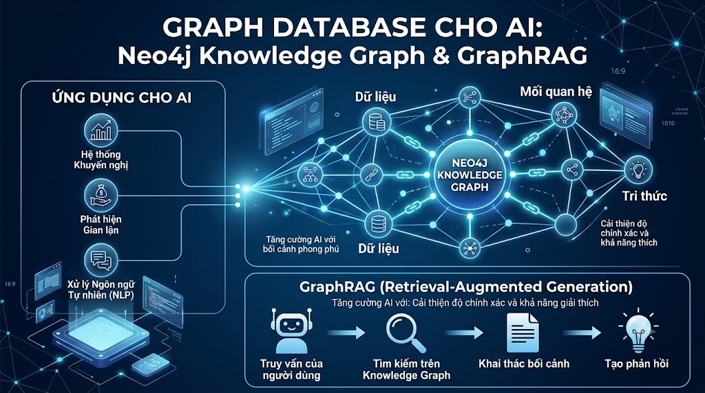

# Graph Database Cho AI: Neo4j Knowledge Graph & GraphRAG



Vector DB giỏi tìm "những thứ giống nhau". Graph DB giỏi trả lời "những thứ liên quan như thế nào". Khi user hỏi "Tôi biết Java, muốn học Microservices, cần học gì trước?" — câu hỏi này cần hiểu **quan hệ** giữa skills, courses, prerequisites. Neo4j và Knowledge Graph giải quyết đúng vấn đề này, và kết hợp với Vector DB tạo ra **GraphRAG** — thế hệ tiếp theo của RAG.

## 1\. Tại Sao Graph DB Cho AI?

```java
Vector DB:
  "Spring Boot" gần "Java backend" ← OK
  Nhưng không biết: Spring Boot REQUIRES Java, Java PART_OF JVM ecosystem

Graph DB (Neo4j):
  (User:Nam) -[KNOWS]-> (Skill:Java)
  (Course:SpringBoot) -[REQUIRES]-> (Skill:Java)
  (Course:SpringBoot) -[TEACHES]-> (Skill:SpringBoot)
  (Skill:SpringBoot) -[PART_OF]-> (Skill:Java_Ecosystem)
  (User:Nam) -[ENROLLED]-> (Course:JavaCore)

  Query: "Nam biết Java, khóa nào phù hợp tiếp theo?"
  → Graph traversal: Nam KNOWS Java → Course REQUIRES Java → recommend
  → Kết quả chính xác hơn pure vector similarity
```

**Use cases chính:**

*   **Learning Path**: tìm con đường học tối ưu dựa trên skill hiện có
    
*   **Knowledge Graph**: biểu diễn quan hệ khái niệm
    
*   **GraphRAG**: augment RAG với structural knowledge
    
*   **Fraud Detection**: phát hiện pattern bất thường
    
*   **Prerequisite Chain**: "để học X cần biết gì?"
    

## 2\. Cài Đặt Neo4j

```bash
# Docker
docker run -d \
  --name neo4j \
  -e NEO4J_AUTH=neo4j/password123 \
  -e NEO4J_PLUGINS='["apoc", "graph-data-science"]' \
  -p 7474:7474 \
  -p 7687:7687 \
  -v neo4j_data:/data \
  neo4j:5-community

# Browser UI: http://localhost:7474
# Bolt connection: bolt://localhost:7687

# Python driver
pip install neo4j
```

## 3\. Cypher — Ngôn Ngữ Truy Vấn Graph

```cypher
-- Tạo nodes
CREATE (u:User {id: 1, name: "Nam Nguyen", email: "nam@gmail.com"})
CREATE (c:Course {id: 1, title: "Spring Boot từ Zero đến Hero", price: 799000})
CREATE (s:Skill {id: 1, name: "Java", level: "language"})

-- Tạo relationships
MATCH (u:User {id: 1}), (c:Course {id: 1})
CREATE (u)-[:ENROLLED {enrolled_at: datetime()}]->(c)

MATCH (c:Course {id: 1}), (s:Skill {id: 1})
CREATE (c)-[:REQUIRES]->(s)
CREATE (c)-[:TEACHES {proficiency: "intermediate"}]->(s)

-- Query: Tìm khóa học user có thể học dựa trên skills
MATCH (u:User {id: 1})-[:KNOWS]->(s:Skill)
      <-[:REQUIRES]-(c:Course)
WHERE NOT (u)-[:ENROLLED]->(c)
RETURN c.title, c.price
ORDER BY c.price
```

## 4\. Xây Dựng Knowledge Graph Cho [nguyentienkhoi.hashnode.dev](http://nguyentienkhoi.hashnode.dev)

```python
import os
from neo4j import GraphDatabase
from typing import List, Dict, Optional, Any
import logging

logger = logging.getLogger(__name__)

class FoxDevKnowledgeGraph:
    """
    Knowledge Graph cho nguyentienkhoi.hashnode.dev:
    - Users và learning history
    - Courses với prerequisites và skills
    - Skills và relationships
    - Learning paths
    """

    def __init__(self,
                 uri:      str = "bolt://localhost:7687",
                 user:     str = "neo4j",
                 password: str = "password123"):
        self.driver = GraphDatabase.driver(uri, auth=(user, password))
        self._setup_constraints()
        self._setup_indexes()
        logger.info("Knowledge Graph connected")

    def _setup_constraints(self):
        """Tạo uniqueness constraints"""
        with self.driver.session() as session:
            constraints = [
                "CREATE CONSTRAINT IF NOT EXISTS FOR (u:User) REQUIRE u.id IS UNIQUE",
                "CREATE CONSTRAINT IF NOT EXISTS FOR (c:Course) REQUIRE c.id IS UNIQUE",
                "CREATE CONSTRAINT IF NOT EXISTS FOR (s:Skill) REQUIRE s.name IS UNIQUE",
                "CREATE CONSTRAINT IF NOT EXISTS FOR (t:Topic) REQUIRE t.name IS UNIQUE",
            ]
            for constraint in constraints:
                session.run(constraint)

    def _setup_indexes(self):
        """Tạo indexes để query nhanh hơn"""
        with self.driver.session() as session:
            indexes = [
                "CREATE INDEX IF NOT EXISTS FOR (u:User) ON (u.email)",
                "CREATE INDEX IF NOT EXISTS FOR (c:Course) ON (c.title)",
                "CREATE INDEX IF NOT EXISTS FOR (s:Skill) ON (s.category)",
            ]
            for idx in indexes:
                session.run(idx)

    # ──────────────────────────────────────────
    # UPSERT Operations
    # ──────────────────────────────────────────

    def upsert_user(self, user_id: int, name: str, email: str):
        """Tạo hoặc update user node"""
        with self.driver.session() as session:
            session.run("""
                MERGE (u:User {id: $id})
                ON CREATE SET u.name = $name, u.email = $email,
                              u.created_at = datetime()
                ON MATCH  SET u.name = $name, u.email = $email,
                              u.updated_at = datetime()
            """, id=user_id, name=name, email=email)

    def upsert_course(self, course_id: int, title: str,
                      category: str, price: float,
                      level: str = "beginner"):
        """Tạo hoặc update course node"""
        with self.driver.session() as session:
            session.run("""
                MERGE (c:Course {id: $id})
                ON CREATE SET c.title    = $title,
                              c.category = $category,
                              c.price    = $price,
                              c.level    = $level,
                              c.created_at = datetime()
                ON MATCH  SET c.title    = $title,
                              c.category = $category,
                              c.price    = $price,
                              c.level    = $level,
                              c.updated_at = datetime()
            """, id=course_id, title=title, category=category,
                price=price, level=level)

    def upsert_skill(self, skill_name: str, category: str = "general",
                     description: str = ""):
        """Tạo hoặc update skill node"""
        with self.driver.session() as session:
            session.run("""
                MERGE (s:Skill {name: $name})
                ON CREATE SET s.category    = $category,
                              s.description = $description
                ON MATCH  SET s.category    = $category,
                              s.description = $description
            """, name=skill_name, category=category, description=description)

    def set_course_requires_skill(self, course_id: int, skill_name: str,
                                   level: str = "basic"):
        """Course yêu cầu skill để học"""
        with self.driver.session() as session:
            session.run("""
                MATCH (c:Course {id: $course_id})
                MERGE (s:Skill {name: $skill_name})
                MERGE (c)-[r:REQUIRES]->(s)
                SET r.level = $level
            """, course_id=course_id, skill_name=skill_name, level=level)

    def set_course_teaches_skill(self, course_id: int, skill_name: str,
                                  proficiency: str = "intermediate"):
        """Course dạy skill gì"""
        with self.driver.session() as session:
            session.run("""
                MATCH (c:Course {id: $course_id})
                MERGE (s:Skill {name: $skill_name})
                MERGE (c)-[r:TEACHES]->(s)
                SET r.proficiency = $proficiency
            """, course_id=course_id, skill_name=skill_name,
                proficiency=proficiency)

    def set_skill_prerequisite(self, skill_name: str,
                                prerequisite_name: str):
        """Skill A cần biết Skill B trước"""
        with self.driver.session() as session:
            session.run("""
                MERGE (s:Skill {name: $skill_name})
                MERGE (p:Skill {name: $prereq_name})
                MERGE (s)-[:REQUIRES]->(p)
            """, skill_name=skill_name, prereq_name=prerequisite_name)

    def set_user_knows_skill(self, user_id: int, skill_name: str,
                              level: str = "basic"):
        """User biết skill ở level nào"""
        with self.driver.session() as session:
            session.run("""
                MATCH (u:User {id: $user_id})
                MERGE (s:Skill {name: $skill_name})
                MERGE (u)-[r:KNOWS]->(s)
                SET r.level = $level,
                    r.updated_at = datetime()
            """, user_id=user_id, skill_name=skill_name, level=level)

    def set_user_enrolled(self, user_id: int, course_id: int):
        """User đã enroll course"""
        with self.driver.session() as session:
            session.run("""
                MATCH (u:User {id: $user_id})
                MATCH (c:Course {id: $course_id})
                MERGE (u)-[r:ENROLLED]->(c)
                ON CREATE SET r.enrolled_at = datetime()
            """, user_id=user_id, course_id=course_id)

    def set_user_completed(self, user_id: int, course_id: int):
        """User đã hoàn thành course"""
        with self.driver.session() as session:
            session.run("""
                MATCH (u:User {id: $user_id})-[r:ENROLLED]->(c:Course {id: $course_id})
                SET r.completed = true,
                    r.completed_at = datetime()
            """, user_id=user_id, course_id=course_id)

    # ──────────────────────────────────────────
    # Query Operations
    # ──────────────────────────────────────────

    def get_recommended_courses(self,
                                 user_id: int,
                                 limit: int = 10) -> List[Dict]:
        """
        Recommend courses dựa trên skills của user.
        Logic: User KNOWS skills → find courses that REQUIRE those skills
        """
        with self.driver.session() as session:
            result = session.run("""
                MATCH (u:User {id: $user_id})-[:KNOWS]->(s:Skill)
                      <-[:REQUIRES]-(c:Course)
                WHERE NOT (u)-[:ENROLLED]->(c)

                -- Tính score: số skills user biết / số skills course cần
                WITH c,
                     COUNT(DISTINCT s) AS known_prereqs,
                     [(c)-[:REQUIRES]->(req) | req] AS all_prereqs
                WITH c,
                     known_prereqs,
                     SIZE(all_prereqs) AS total_prereqs

                RETURN
                    c.id                              AS course_id,
                    c.title                           AS title,
                    c.category                        AS category,
                    c.price                           AS price,
                    c.level                           AS level,
                    known_prereqs                     AS matched_skills,
                    total_prereqs                     AS required_skills,
                    toFloat(known_prereqs) / NULLIF(total_prereqs, 0)
                                                      AS readiness_score
                ORDER BY readiness_score DESC, c.price ASC
                LIMIT $limit
            """, user_id=user_id, limit=limit)

            return [dict(record) for record in result]

    def get_learning_path(self,
                           user_id: int,
                           target_skill: str,
                           max_depth: int = 5) -> List[Dict]:
        """
        Tìm con đường học tối ưu từ skills hiện có đến target skill.
        Duyệt skill prerequisite chain.
        """
        with self.driver.session() as session:
            result = session.run("""
                -- Tìm skills user đã biết
                MATCH (u:User {id: $user_id})-[:KNOWS]->(known:Skill)
                WITH COLLECT(known.name) AS known_skills

                -- Tìm target skill
                MATCH (target:Skill {name: $target_skill})

                -- Tìm tất cả prerequisite paths đến target
                MATCH path = (prereq:Skill)-[:REQUIRES*0..5]->(target)
                WHERE NOT prereq.name IN known_skills
                  AND prereq <> target

                -- Tìm courses dạy từng skill trong path
                WITH prereq, target, known_skills,
                     LENGTH(path) AS distance
                MATCH (c:Course)-[:TEACHES]->(prereq)

                RETURN DISTINCT
                    prereq.name   AS skill_to_learn,
                    c.id          AS course_id,
                    c.title       AS course_title,
                    c.price       AS price,
                    distance      AS steps_from_target
                ORDER BY distance DESC, c.price ASC
            """, user_id=user_id, target_skill=target_skill)

            return [dict(record) for record in result]

    def get_skill_gap(self,
                       user_id: int,
                       target_course_id: int) -> Dict:
        """
        Phân tích skill gap: user cần học gì để sẵn sàng cho course.
        """
        with self.driver.session() as session:
            # Skills đã có
            known = session.run("""
                MATCH (u:User {id: $user_id})-[:KNOWS]->(s:Skill)
                RETURN COLLECT(s.name) AS known_skills
            """, user_id=user_id).single()

            # Skills course yêu cầu
            required = session.run("""
                MATCH (c:Course {id: $course_id})-[:REQUIRES]->(s:Skill)
                RETURN COLLECT(s.name) AS required_skills, c.title AS title
            """, course_id=target_course_id).single()

            if not required:
                return {}

            known_skills    = set(known['known_skills']) if known else set()
            required_skills = set(required['required_skills'])

            missing = required_skills - known_skills
            matched = required_skills & known_skills

            # Tìm courses để học missing skills
            courses_for_missing = []
            if missing:
                result = session.run("""
                    UNWIND $missing_skills AS skill_name
                    MATCH (s:Skill {name: skill_name})
                          <-[:TEACHES]-(c:Course)
                    RETURN skill_name, c.id AS course_id,
                           c.title AS course_title, c.price AS price
                    ORDER BY c.price ASC
                """, missing_skills=list(missing))
                courses_for_missing = [dict(r) for r in result]

            return {
                "target_course":   required['title'],
                "required_skills": list(required_skills),
                "known_skills":    list(matched),
                "missing_skills":  list(missing),
                "readiness":       len(matched) / len(required_skills) if required_skills else 1.0,
                "courses_to_take": courses_for_missing
            }

    def get_similar_learners(self,
                              user_id: int,
                              limit: int = 10) -> List[Dict]:
        """
        Tìm users có learning profile tương tự.
        Dùng Jaccard similarity trên enrolled courses.
        """
        with self.driver.session() as session:
            result = session.run("""
                MATCH (u:User {id: $user_id})-[:ENROLLED]->(c:Course)
                      <-[:ENROLLED]-(other:User)
                WHERE other.id <> $user_id

                WITH u, other,
                     COUNT(DISTINCT c) AS common_courses

                MATCH (u)-[:ENROLLED]->(uc:Course)
                MATCH (other)-[:ENROLLED]->(oc:Course)

                WITH other, common_courses,
                     COUNT(DISTINCT uc) AS u_total,
                     COUNT(DISTINCT oc) AS other_total

                RETURN
                    other.id    AS user_id,
                    other.name  AS name,
                    common_courses,
                    -- Jaccard similarity
                    toFloat(common_courses) /
                    (u_total + other_total - common_courses) AS similarity
                ORDER BY similarity DESC
                LIMIT $limit
            """, user_id=user_id, limit=limit)

            return [dict(record) for record in result]

    def get_course_knowledge_map(self, course_id: int) -> Dict:
        """
        Lấy full knowledge map của một course:
        - Skills required và taught
        - Related courses
        - Learning path context
        """
        with self.driver.session() as session:
            # Skills
            skills_result = session.run("""
                MATCH (c:Course {id: $course_id})
                OPTIONAL MATCH (c)-[r:REQUIRES]->(req:Skill)
                OPTIONAL MATCH (c)-[t:TEACHES]->(taught:Skill)
                RETURN
                    c.title AS title,
                    COLLECT(DISTINCT {name: req.name, level: r.level}) AS requires,
                    COLLECT(DISTINCT {name: taught.name, proficiency: t.proficiency}) AS teaches
            """, course_id=course_id).single()

            # Related courses (share skills)
            related_result = session.run("""
                MATCH (c:Course {id: $course_id})-[:TEACHES|REQUIRES]->(s:Skill)
                      <-[:TEACHES|REQUIRES]-(related:Course)
                WHERE related.id <> $course_id
                RETURN
                    related.id    AS course_id,
                    related.title AS title,
                    COUNT(DISTINCT s) AS shared_skills
                ORDER BY shared_skills DESC
                LIMIT 5
            """, course_id=course_id)

            return {
                "title":    skills_result['title'] if skills_result else None,
                "requires": skills_result['requires'] if skills_result else [],
                "teaches":  skills_result['teaches'] if skills_result else [],
                "related":  [dict(r) for r in related_result]
            }

    def close(self):
        self.driver.close()
```

## 5\. Populate Graph Từ PostgreSQL

```python
import psycopg2
import psycopg2.extras

def populate_graph_from_postgres(
    pg_conn,
    graph: FoxDevKnowledgeGraph
):
    """
    Sync dữ liệu từ PostgreSQL sang Neo4j Knowledge Graph.
    """
    cursor = pg_conn.cursor(cursor_factory=psycopg2.extras.DictCursor)

    # 1. Upsert Users
    print("Syncing users...")
    cursor.execute("""
        SELECT id, first_name || ' ' || last_name AS name, email
        FROM users
        WHERE account_status = 'ACTIVE'
        LIMIT 1000
    """)
    for row in cursor.fetchall():
        graph.upsert_user(row['id'], row['name'], row['email'])

    # 2. Upsert Courses
    print("Syncing courses...")
    cursor.execute("""
        SELECT c.id, c.title, cat.name AS category,
               COALESCE(cp.price, 0) AS price, c.course_level
        FROM courses c
        JOIN categories cat ON cat.id = c.category_id
        LEFT JOIN course_pricing cp
               ON cp.course_id = c.id
              AND cp.currency = 'VND'
              AND cp.is_active = TRUE
        WHERE c.course_status = 'PUBLISHED'
    """)
    for row in cursor.fetchall():
        graph.upsert_course(
            course_id = row['id'],
            title     = row['title'],
            category  = row['category'],
            price     = float(row['price']),
            level     = row['course_level'] or 'beginner'
        )

    # 3. Upsert Skills từ job_skills và course_skills
    print("Syncing skills...")
    cursor.execute("""
        SELECT DISTINCT s.id, s.name, sc.name AS category
        FROM skills s
        LEFT JOIN skill_categories sc ON sc.id = s.category_id
    """)
    for row in cursor.fetchall():
        graph.upsert_skill(row['name'], row['category'] or 'general')

    # 4. Course-Skill relationships
    print("Syncing course-skill relationships...")
    cursor.execute("""
        SELECT cs.course_id, s.name AS skill_name
        FROM course_skills cs
        JOIN skills s ON s.id = cs.skill_id
    """)
    for row in cursor.fetchall():
        graph.set_course_teaches_skill(row['course_id'], row['skill_name'])

    # 5. User enrollments
    print("Syncing enrollments...")
    cursor.execute("""
        SELECT user_id, course_id FROM enrollments
        ORDER BY enrolled_at DESC
        LIMIT 10000
    """)
    for row in cursor.fetchall():
        graph.set_user_enrolled(row['user_id'], row['course_id'])

    # 6. User certificates (completed)
    cursor.execute("""
        SELECT student_id AS user_id, course_id FROM user_course_certificates
    """)
    for row in cursor.fetchall():
        graph.set_user_completed(row['user_id'], row['course_id'])

    cursor.close()
    print("✅ Graph populated successfully")


# ──────────────────────────────────────────
# Manually define skill prerequisites
# (knowledge mà PostgreSQL không có)
# ──────────────────────────────────────────
def define_skill_prerequisites(graph: FoxDevKnowledgeGraph):
    """
    Define learning dependencies giữa các skills.
    Đây là domain knowledge — cần expert định nghĩa.
    """
    prerequisites = [
        # Java ecosystem
        ("Spring Boot",      "Java Core"),
        ("Spring Boot",      "Maven/Gradle"),
        ("Microservices",    "Spring Boot"),
        ("Microservices",    "Docker"),
        ("Spring Security",  "Spring Boot"),
        ("Hibernate/JPA",    "Java Core"),
        ("Hibernate/JPA",    "SQL"),

        # DevOps
        ("Kubernetes",       "Docker"),
        ("CI/CD",            "Docker"),
        ("Terraform",        "Cloud Basics"),

        # Database
        ("PostgreSQL Advanced", "SQL Basics"),
        ("Redis",            "Data Structures"),
        ("MongoDB",          "NoSQL Concepts"),

        # Frontend
        ("ReactJS",          "JavaScript"),
        ("Next.js",          "ReactJS"),
        ("TypeScript",       "JavaScript"),
    ]

    for skill, prereq in prerequisites:
        graph.upsert_skill(skill)
        graph.upsert_skill(prereq)
        graph.set_skill_prerequisite(skill, prereq)

    print(f"✅ Defined {len(prerequisites)} skill prerequisites")
```

## 6\. GraphRAG — Kết Hợp Graph + Vector

```python
from sentence_transformers import SentenceTransformer
import psycopg2

class GraphRAG:
    """
    GraphRAG: augment RAG context với structural knowledge từ Graph DB.
    
    Standard RAG: Query → Vector Search → Chunks → LLM
    GraphRAG:     Query → Vector Search → Chunks
                        + Graph Traversal → Related concepts → LLM
    """

    def __init__(self,
                 graph: FoxDevKnowledgeGraph,
                 pg_conn,
                 model_name: str = "paraphrase-multilingual-MiniLM-L12-v2"):
        self.graph = graph
        self.conn  = pg_conn
        self.model = SentenceTransformer(model_name)

    def retrieve_with_graph_context(
        self,
        query: str,
        user_id: Optional[int] = None,
        top_k: int = 5
    ) -> Dict:
        """
        Kết hợp vector search và graph knowledge để tạo rich context.
        """

        # 1. Vector search (như RAG thông thường)
        query_embedding = self.model.encode(
            query, normalize_embeddings=True
        ).tolist()

        cursor = self.conn.cursor(cursor_factory=psycopg2.extras.DictCursor)
        cursor.execute("""
            SELECT
                source_type, source_id, content, heading,
                1 - (embedding <=> %s::vector) AS similarity
            FROM content_chunks
            ORDER BY embedding <=> %s::vector
            LIMIT %s
        """, (query_embedding, query_embedding, top_k))
        vector_chunks = [dict(row) for row in cursor.fetchall()]
        cursor.close()

        # 2. Graph context — structural knowledge
        graph_context = {}

        if user_id:
            # User's skill profile
            with self.graph.driver.session() as session:
                result = session.run("""
                    MATCH (u:User {id: $uid})-[r:KNOWS]->(s:Skill)
                    RETURN s.name AS skill, r.level AS level
                    ORDER BY r.level DESC
                """, uid=user_id)
                user_skills = [dict(r) for r in result]

            graph_context['user_skills'] = user_skills

            # Recommendations từ graph
            graph_recs = self.graph.get_recommended_courses(user_id, limit=3)
            graph_context['recommended_by_graph'] = graph_recs

        # 3. Extract course/skill mentions từ query
        with self.graph.driver.session() as session:
            result = session.run("""
                MATCH (s:Skill)
                WHERE toLower($query) CONTAINS toLower(s.name)
                RETURN s.name AS skill, s.category AS category
                LIMIT 5
            """, query=query)
            mentioned_skills = [dict(r) for r in result]

        if mentioned_skills:
            # Tìm courses liên quan đến skills được mention
            with self.graph.driver.session() as session:
                skill_names = [s['skill'] for s in mentioned_skills]
                result = session.run("""
                    UNWIND $skills AS skill_name
                    MATCH (s:Skill {name: skill_name})
                          <-[:TEACHES|REQUIRES]-(c:Course)
                    RETURN DISTINCT c.id AS course_id, c.title AS title,
                           c.price AS price, c.level AS level
                    ORDER BY c.price ASC
                    LIMIT 5
                """, skills=skill_names)
                related_courses = [dict(r) for r in result]

            graph_context['mentioned_skills']  = mentioned_skills
            graph_context['related_courses']   = related_courses

        return {
            "query":          query,
            "vector_chunks":  vector_chunks,
            "graph_context":  graph_context
        }

    def build_graphrag_prompt(self,
                               query: str,
                               retrieval_result: Dict) -> str:
        """
        Build prompt kết hợp vector context và graph context.
        """
        prompt_parts = ["THÔNG TIN TỪ nguyentienkhoi.hashnode.dev:\n"]

        # Vector context
        if retrieval_result['vector_chunks']:
            prompt_parts.append("--- Nội dung liên quan ---")
            for i, chunk in enumerate(retrieval_result['vector_chunks'], 1):
                heading = f"[{chunk['heading']}] " if chunk.get('heading') else ""
                prompt_parts.append(
                    f"{i}. {heading}{chunk['content'][:300]}..."
                )

        # Graph context
        gc = retrieval_result.get('graph_context', {})

        if gc.get('user_skills'):
            skills_str = ", ".join(
                f"{s['skill']} ({s['level']})" for s in gc['user_skills']
            )
            prompt_parts.append(f"\n--- Kỹ năng của học viên ---\n{skills_str}")

        if gc.get('mentioned_skills'):
            skills_str = ", ".join(s['skill'] for s in gc['mentioned_skills'])
            prompt_parts.append(f"\n--- Skills liên quan đến câu hỏi ---\n{skills_str}")

        if gc.get('related_courses'):
            prompt_parts.append("\n--- Khóa học liên quan ---")
            for c in gc['related_courses'][:3]:
                price = "Miễn phí" if c['price'] == 0 else f"{c['price']:,.0f}đ"
                prompt_parts.append(f"- {c['title']} ({c['level']}, {price})")

        if gc.get('recommended_by_graph'):
            prompt_parts.append("\n--- Khóa học phù hợp với bạn ---")
            for c in gc['recommended_by_graph'][:3]:
                prompt_parts.append(
                    f"- {c['title']} (sẵn sàng {c.get('readiness_score', 0)*100:.0f}%)"
                )

        prompt_parts.append(f"\n---\n\nCÂU HỎI: {query}")
        prompt_parts.append(
            "\nHãy trả lời dựa trên thông tin trên. "
            "Nếu câu hỏi về lộ trình học, hãy đề xuất thứ tự học phù hợp."
        )

        return "\n".join(prompt_parts)
```

## 7\. Demo Hoàn Chỉnh

```python
def demo_knowledge_graph():
    graph = FoxDevKnowledgeGraph()

    print("=" * 60)
    print("KNOWLEDGE GRAPH DEMO")
    print("=" * 60)

    # Setup data
    print("\n⏳ Setting up graph data...")

    # Users
    graph.upsert_user(1, "Nam Nguyen", "nam@gmail.com")
    graph.upsert_user(2, "Linh Tran", "linh@gmail.com")

    # Courses
    graph.upsert_course(1, "Java Core nền tảng", "java", 0, "beginner")
    graph.upsert_course(2, "Spring Boot từ Zero đến Hero", "java", 799000, "intermediate")
    graph.upsert_course(3, "Microservices với Spring Boot", "java", 999000, "advanced")
    graph.upsert_course(4, "Docker & Kubernetes", "devops", 899000, "intermediate")
    graph.upsert_course(5, "SQL cho Developer", "database", 599000, "beginner")

    # Skills
    for skill in ["Java Core", "Spring Boot", "Microservices",
                  "Docker", "Kubernetes", "SQL"]:
        graph.upsert_skill(skill)

    # Course-skill relationships
    graph.set_course_teaches_skill(1, "Java Core")
    graph.set_course_requires_skill(2, "Java Core")
    graph.set_course_teaches_skill(2, "Spring Boot")
    graph.set_course_requires_skill(3, "Spring Boot")
    graph.set_course_requires_skill(3, "Docker")
    graph.set_course_teaches_skill(3, "Microservices")
    graph.set_course_teaches_skill(4, "Docker")
    graph.set_course_teaches_skill(4, "Kubernetes")
    graph.set_course_teaches_skill(5, "SQL")

    # User skills
    graph.set_user_knows_skill(1, "Java Core", "intermediate")
    graph.set_user_knows_skill(1, "SQL", "basic")
    graph.set_user_enrolled(1, 1)  # Nam đã học Java Core
    graph.set_user_completed(1, 1)

    define_skill_prerequisites(graph)

    print("✅ Graph setup complete")

    # Test queries
    print("\n🎯 1. Recommended Courses for Nam:")
    recs = graph.get_recommended_courses(user_id=1, limit=5)
    for r in recs:
        readiness = r.get('readiness_score', 0) or 0
        print(f"  [{readiness:.0%} ready] {r['title']} — {r.get('price', 0):,.0f}đ")

    print("\n🗺️  2. Learning Path → Microservices:")
    path = graph.get_learning_path(user_id=1, target_skill="Microservices")
    for step in path:
        print(f"  Step (dist={step['steps_from_target']}): "
              f"Learn '{step['skill_to_learn']}' via '{step['course_title']}'")

    print("\n📊 3. Skill Gap for Microservices Course:")
    gap = graph.get_skill_gap(user_id=1, target_course_id=3)
    print(f"  Readiness: {gap.get('readiness', 0):.0%}")
    print(f"  Missing: {gap.get('missing_skills', [])}")
    print(f"  Need to take:")
    for c in gap.get('courses_to_take', []):
        print(f"    → {c['course_title']} (learn {c['skill_name']})")

    print("\n🗺️  4. Course Knowledge Map (Spring Boot):")
    km = graph.get_course_knowledge_map(course_id=2)
    print(f"  Requires: {[s['name'] for s in km['requires'] if s['name']]}")
    print(f"  Teaches:  {[s['name'] for s in km['teaches'] if s['name']]}")
    print(f"  Related:  {[r['title'] for r in km['related']]}")

    graph.close()

demo_knowledge_graph()
```

## Tổng Kết


| Query Type | Graph DB (Neo4j) | Vector DB |
|---|---|---|
| "Khóa học tương tự" | ❌ Kém | ✅ Tốt |
| "Con đường học đến target" | ✅ Tốt | ❌ Không biết |
| "Skill gap analysis" | ✅ Tốt | ❌ Không biết |
| "Users học tương tự" | ✅ Jaccard sim | ✅ Embedding sim |
| "Khái niệm liên quan" | ✅ Relationship | ✅ Semantic sim |
| "Prerequisite chain" | ✅ Graph traversal | ❌ Không biết |


```java
GraphRAG = Vector DB + Graph DB:
  Vector DB: "Những gì gần nhau về ngữ nghĩa"
  Graph DB:  "Những gì liên quan về cấu trúc"
  Kết hợp:   Context phong phú hơn → LLM trả lời chính xác hơn
```

Bài tiếp theo — bài cuối của series — chúng ta sẽ học **Feature Store**: quản lý và phục vụ features cho ML models, pipeline từ raw data đến real-time feature serving.

