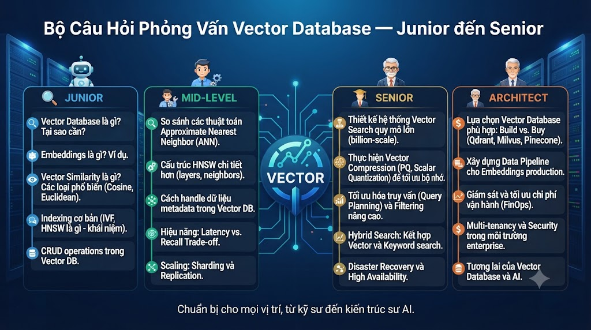

# Bộ Câu Hỏi Phỏng Vấn Vector Database — Junior đến Senior



* * *

## 🟢 JUNIOR (0–2 năm)

Mục tiêu: Kiểm tra hiểu biết cơ bản về khái niệm, embedding và cách dùng Vector DB đơn giản.

* * *

### Khái Niệm Cơ Bản

**Q1. Vector Database là gì? Tại sao cần Vector DB thay vì dùng PostgreSQL thông thường?**

Đáp án mong đợi:

*   Vector DB được thiết kế để lưu trữ và tìm kiếm **embedding vectors** — mảng số thực nhiều chiều
    
*   PostgreSQL dùng SQL tìm kiếm **exact match** (`WHERE title LIKE '%java%'`)
    
*   Vector DB tìm kiếm theo **ngữ nghĩa** — những thứ có ý nghĩa gần nhau dù không trùng từ khóa
    
*   Ví dụ: query "học backend Java" → tìm được "Spring Boot từ Zero đến Hero" dù không có từ "backend"
    

🚩 Red flag: Không giải thích được sự khác biệt giữa exact search và semantic search

**Q2. Embedding là gì? Cho ví dụ cụ thể.**

Đáp án mong đợi:

*   Embedding là kỹ thuật biến text/image thành **mảng số thực** nhiều chiều
    
*   Những thứ có ý nghĩa tương tự → vector gần nhau trong không gian nhiều chiều
    
*   Ví dụ: "Java" → \[0.82, -0.15, 0.43, ...\], "Python" → \[0.79, -0.18, 0.41, ...\]
    
*   Java và Python gần nhau vì đều là ngôn ngữ lập trình
    
*   Embedding model (sentence-transformers, OpenAI) là công cụ tạo ra vectors
    

✅ Điểm cộng: Đề cập đến embedding model cụ thể như all-MiniLM, OpenAI text-embedding

**Q3. Cosine Similarity là gì? Tại sao dùng nó thay vì Euclidean Distance cho text?**

Đáp án mong đợi:

*   Cosine Similarity đo **góc** giữa 2 vectors, không quan tâm độ dài
    
*   Kết quả từ -1 đến 1: 1 = giống nhau, 0 = không liên quan, -1 = đối lập
    
*   Dùng cho text vì: văn bản dài và ngắn về cùng chủ đề nên có similarity cao
    
*   "Java là ngôn ngữ lập trình" và "Java là ngôn ngữ lập trình rất phổ biến được dùng trong enterprise" → cùng ý nghĩa dù độ dài khác nhau
    

**Q4. Kể tên 3 Vector Database phổ biến hiện nay và điểm khác biệt chính?**

Đáp án mong đợi:

*   **pgvector**: extension của PostgreSQL, đơn giản, không cần service mới, phù hợp dataset nhỏ
    
*   **Qdrant**: standalone, mạnh hơn, filtering tốt, quantization, phù hợp production
    
*   **Pinecone**: managed cloud, không cần ops, scale dễ nhưng có chi phí
    
*   Các DB khác: Weaviate, Chroma, Milvus
    

🚩 Red flag: Chỉ biết 1 loại, không biết khi nào dùng loại nào

**Q5. Viết câu query tìm kiếm vector gần nhất trong pgvector.**

Đáp án mong đợi:

```sql
SELECT id, title,
       1 - (embedding <=> '[0.1, 0.2, 0.3]'::vector) AS similarity
FROM courses
ORDER BY embedding <=> '[0.1, 0.2, 0.3]'::vector
LIMIT 10;
```

*   Giải thích được operator `<=>` là cosine distance
    
*   Biết `1 - distance = similarity`
    
*   Biết cần `LIMIT` để không scan toàn bảng
    

**Q6. RAG là gì? Tại sao cần RAG thay vì dùng LLM thẳng?**

Đáp án mong đợi:

*   RAG = Retrieval-Augmented Generation
    
*   LLM thuần túy: hallucinate — bịa ra thông tin không có thật
    
*   RAG: tìm kiếm context thực từ Vector DB → đưa vào prompt → LLM generate dựa trên context thật
    
*   Pipeline: Query → Embed → Search Vector DB → Retrieve chunks → Build prompt → LLM → Answer
    

✅ Điểm cộng: Đề cập đến "grounding" — anchoring LLM vào dữ liệu thực

**Q7. Chunking là gì và tại sao cần chia nhỏ tài liệu trước khi embed?**

Đáp án mong đợi:

*   Embedding model có giới hạn token (~512 tokens)
    
*   Text quá dài → vector bị "average out", mất thông tin chi tiết
    
*   Chunking: chia tài liệu thành đoạn nhỏ, embed từng đoạn
    
*   Query "bài tập SQL" → tìm đúng đoạn có bài tập, không phải toàn bài viết
    

### Coding Question Junior

**Q8. Viết đoạn code Python embed một đoạn text và lưu vào pgvector.**

Đáp án mong đợi:

```python
from sentence_transformers import SentenceTransformer
import psycopg2

model = SentenceTransformer('all-MiniLM-L6-v2')

# Embed
text = "Spring Boot từ Zero đến Hero"
embedding = model.encode(text, normalize_embeddings=True)

# Lưu vào PostgreSQL
conn = psycopg2.connect(...)
cursor = conn.cursor()
cursor.execute(
    "INSERT INTO courses (title, embedding) VALUES (%s, %s)",
    (text, embedding.tolist())
)
conn.commit()
```

🚩 Red flag: Không biết `normalize_embeddings=True`, không biết `.tolist()`

* * *

## 🟡 INTERMEDIATE (2–4 năm)

Mục tiêu: Kiểm tra hiểu biết về thuật toán, thiết kế schema, performance và production patterns.

* * *

### Thuật Toán & Index

**Q9. HNSW là gì? Giải thích tại sao nó nhanh hơn brute force search.**

Đáp án mong đợi:

*   HNSW = Hierarchical Navigable Small World
    
*   Xây dựng đồ thị nhiều lớp: lớp trên thưa (kết nối xa), lớp dưới dày (kết nối gần)
    
*   Search: bắt đầu từ lớp cao nhất, di chuyển đến node gần nhất, xuống lớp thấp hơn
    
*   Brute force: tính similarity với N vectors → O(n) → chậm với dataset lớn
    
*   HNSW: chỉ duyệt log(n) nodes → gần như O(1) trong thực tế
    
*   Đánh đổi: kết quả xấp xỉ (ANN) thay vì chính xác 100% (KNN)
    

✅ Điểm cộng: Giải thích được 3 tham số m, ef\_construction, ef\_search và ảnh hưởng của chúng

**Q10. Giải thích ANN vs KNN. Tại sao production system thường chọn ANN?**

Đáp án mong đợi:

*   **KNN** (K-Nearest Neighbors): tìm chính xác K vectors gần nhất, scan toàn bộ → O(n), chậm
    
*   **ANN** (Approximate Nearest Neighbors): tìm gần đúng → nhanh hơn 100-1000x, accuracy ~95-99%
    
*   Production chọn ANN vì:
    
    *   1M vectors × brute force = ~1 giây → không thể dùng cho search
        
    *   ANN = ~1ms, accuracy 98% → user không nhận ra sự khác biệt
        
    *   Latency quan trọng hơn perfect accuracy trong search/recommendation
        

**Q11. Scalar Quantization và Binary Quantization là gì? Trade-off ra sao?**

Đáp án mong đợi:

*   **Scalar Quantization (SQ8)**: float32 → int8, tiết kiệm 4x RAM, giảm ~1% recall
    
*   **Binary Quantization (BQ)**: float32 → 1 bit, tiết kiệm 32x RAM, giảm ~10% recall
    
*   BQ thường dùng kèm rescore: tìm nhiều kết quả → rescore bằng full precision → accuracy về gần 100%
    
*   Khi nào dùng:
    
    *   < 1M vectors: không cần, dùng float32
        
    *   1-10M vectors: SQ8 hợp lý
        
    
    > 10M vectors: BQ + rescore
    

**Q12. Thiết kế schema Vector DB cho hệ thống e-learning. Cần lưu những gì?**

Đáp án mong đợi tốt:

```sql
CREATE TABLE course_vectors (
    id          BIGSERIAL PRIMARY KEY,
    course_id   BIGINT NOT NULL REFERENCES courses(id),
    content_text TEXT NOT NULL,       -- text đã embed
    content_type VARCHAR(20),          -- 'full', 'title', 'description'
    embedding   VECTOR(384) NOT NULL,
    model_name  VARCHAR(100) NOT NULL, -- tracking model version
    created_at  TIMESTAMPTZ DEFAULT NOW(),
    UNIQUE (course_id, content_type, model_name)
);
```

Điểm đánh giá:

*   Lưu `content_text` để biết embed từ gì
    
*   Lưu `model_name` để tracking
    
*   Lưu `content_type` nếu cần embed nhiều version
    
*   UNIQUE constraint để tránh duplicate
    

🚩 Red flag: Chỉ lưu embedding, không lưu metadata

**Q13. Hybrid Search là gì? Giải thích RRF (Reciprocal Rank Fusion).**

Đáp án mong đợi:

*   Hybrid Search = kết hợp Vector Search (semantic) + Full-text Search (keyword)
    
*   Vector search giỏi: "tìm theo nghĩa", "spring boot" ≈ "java backend"
    
*   Full-text giỏi: "tìm exact", "spring boot 3.2" (version cụ thể)
    
*   RRF merge hai ranked lists:
    
    ```java
    score(doc) = Σ 1/(k + rank_in_list)
    ```
    
    *   k=60 (hằng số tránh over-emphasize top rank)
        
    *   Doc xuất hiện trong nhiều lists → score cao hơn
        
*   RRF tốt hơn linear combination vì không cần normalize scores
    

✅ Điểm cộng: Biết khi nào pre-filter vs post-filter

**Q14. Payload indexing trong Qdrant là gì? Tại sao quan trọng?**

Đáp án mong đợi:

*   Payload = metadata đi kèm với vector (category, price, rating)
    
*   Payload index: tạo index trên payload fields → filter nhanh hơn
    
*   Không có payload index → Qdrant phải scan toàn bộ points để filter → chậm
    
*   Qdrant Smart Filtering: tự động chọn pre/post filter dựa trên selectivity
    
*   Quan trọng: filter "category=java" trên 1M courses mà không có index → scan 1M points
    

```python
client.create_payload_index(
    collection_name="courses",
    field_name="category",
    field_schema=PayloadSchemaType.KEYWORD
)
```

**Q15. Giải thích vấn đề Training/Serving Skew và cách Feature Store giải quyết.**

Đáp án mong đợi:

*   Training/Serving Skew: feature A dùng lúc train (Python/batch) ≠ feature A' lúc serve (Java/real-time)
    
*   Hậu quả: model performance tệ trong production dù test accuracy cao
    
*   Feature Store giải quyết:
    
    *   Một nơi duy nhất tính và lưu features
        
    *   Training lấy từ offline store (historical), serving lấy từ online store (Redis)
        
    *   Cùng logic tính feature → guaranteed consistency
        

### Coding Question Intermediate

**Q16. Implement Hybrid Search kết hợp vector và full-text search. Dùng RRF để merge.**

Đáp án mong đợi (phần logic quan trọng):

```python
def hybrid_search(query, limit=10):
    query_embedding = model.encode(query, normalize_embeddings=True)

    # Vector search
    vector_results = [(row.id, rank+1)
                      for rank, row in enumerate(vector_search(query_embedding))]

    # Full-text search
    fts_results = [(row.id, rank+1)
                   for rank, row in enumerate(fts_search(query))]

    # RRF merge
    k = 60
    rrf_scores = {}
    for doc_id, rank in vector_results + fts_results:
        rrf_scores[doc_id] = rrf_scores.get(doc_id, 0) + 1.0 / (k + rank)

    return sorted(rrf_scores.items(), key=lambda x: x[1], reverse=True)[:limit]
```

Đánh giá: biết RRF formula, biết tại sao cần k=60

* * *

## 🟠 ADVANCED (4–7 năm)

Mục tiêu: Kiểm tra khả năng thiết kế hệ thống, tối ưu performance, xử lý edge cases và trade-off decisions.

* * *

### System Design

**Q17. Thiết kế hệ thống Semantic Search cho nền tảng e-learning 1 triệu users, 10,000 courses. Yêu cầu: P95 < 100ms, update real-time khi thêm course mới.**

Đáp án mong đợi đầy đủ:

**Components:**

*   PostgreSQL (OLTP) → source of truth
    
*   Qdrant (Vector DB) → semantic search, 10k courses × 384 dims ≈ 15MB RAM
    
*   Redis → cache search results (TTL 5 phút)
    
*   Sync service → event-driven hoặc polling
    

**Data flow:**

```java
Course created/updated in PostgreSQL
  → Sync service detects change (trigger/CDC/polling)
  → Embed course content (title + description)
  → Upsert vào Qdrant
  → Invalidate Redis cache cho related queries
```

**Search flow:**

```java
User query → Check Redis cache → Hit: return immediately
           → Miss: Embed query → Qdrant search → Rerank → Cache → Return
```

**Performance:**

*   Qdrant HNSW index: P95 < 5ms cho search
    
*   Redis cache: P95 < 1ms
    
*   Total P95 với cache hit: < 2ms; cache miss: < 50ms
    

**Scaling:**

*   Qdrant: single node đủ cho 10k courses
    
*   Redis: 512MB memory đủ cho cache
    
*   Sync service: debounce để tránh re-embed nhiều lần
    

✅ Senior indicator: Đề cập đến cache invalidation strategy, monitoring, failure scenarios

**Q18. Giải thích HNSW parameters và cách tune cho use case cụ thể. Khi nào IVF tốt hơn HNSW?**

Đáp án mong đợi:

**HNSW parameters:**

*   `m` (8-64): số connections mỗi node
    
    *   Tăng m → recall tốt hơn, RAM nhiều hơn, build chậm hơn
        
    *   Production default: m=16
        
*   `ef_construction` (50-500): quality khi build index
    
    *   Tăng → index chất lượng hơn, build chậm hơn
        
    *   Production default: ef\_construction=100
        
*   `ef_search` (10-500): quality khi search
    
    *   Tăng → recall tốt hơn, search chậm hơn
        
    *   Autocomplete: ef=20, Search: ef=80, RAG: ef=150
        

**IVF tốt hơn HNSW khi:**

*   Dataset > 100M vectors: HNSW RAM quá lớn
    
*   RAM hạn chế: IVF tiêu tốn ít RAM hơn
    
*   Batch search (không cần low latency): IVF throughput tốt hơn
    
*   Incremental insert ít: IVF rebuild index kém hơn HNSW
    

**Q19. Bạn cần recommend courses cho 500,000 users. Làm sao tạo user preference vectors hiệu quả? Xử lý cold start như thế nào?**

Đáp án mong đợi:

**User preference vector:**

*   Weighted average của course embeddings user đã học
    
*   Weight: completed (3x) > in-progress (2x) > enrolled (1x)
    
*   Normalize về unit vector sau khi tính average
    

**Cold start (user mới, ít history):**

*   0 enrollments → popular courses, trending
    
*   1-2 enrollments → content-based (similar to enrolled)
    
*   3+ enrollments → collaborative (user preference vector)
    

**Scale 500k users:**

*   Offline materialization: cron job hàng đêm rebuild tất cả user vectors
    
*   Online update: event-driven rebuild khi user enroll/complete (với debounce 30s)
    
*   Redis cache user vectors (TTL 1 giờ)
    
*   Incremental update: thêm weighted vector mới thay vì rebuild toàn bộ
    

**Storage:**

*   500k users × 384 dims × 4 bytes = ~768MB → Qdrant collection riêng
    

**Q20. Giải thích GraphRAG. Khi nào GraphRAG tốt hơn naive RAG?**

Đáp án mong đợi:

*   Naive RAG: Query → Vector search → Chunks → LLM
    
*   GraphRAG: Query → Vector search + Graph traversal → Combined context → LLM
    

**GraphRAG tốt hơn khi:**

*   Câu hỏi cần hiểu **quan hệ cấu trúc**: "Để học Microservices cần biết gì trước?"
    
    *   Graph: Course REQUIRES Skill REQUIRES Skill → traversal tìm dependency chain
        
    *   Vector: chỉ tìm "thứ tương tự Microservices" → thiếu prerequisite info
        
*   Multi-hop reasoning: "User biết Java, muốn làm DevOps, nên học gì?"
    
    *   Graph: Java → Spring Boot → Docker → Kubernetes → DevOps
        
*   Knowledge graph: biểu diễn domain knowledge có cấu trúc
    

**Naive RAG tốt hơn khi:**

*   Câu hỏi đơn giản, cần tìm đoạn text relevant
    
*   Domain knowledge không có cấu trúc phân cấp rõ ràng
    
*   Team nhỏ, muốn implement nhanh
    

**Q21. Làm thế nào phát hiện và xử lý Model Drift trong Vector DB system?**

Đáp án mong đợi:

**Dấu hiệu model drift:**

*   Search recall giảm dần theo thời gian
    
*   Zero-result queries tăng
    
*   User click rate giảm dù query không đổi
    
*   Embedding distribution thay đổi khi có dữ liệu mới
    

**Detection:**

*   Định kỳ chạy test queries với expected results → đo Recall@K
    
*   Monitor: `avg_similarity_score` của search results → giảm = drift signal
    
*   A/B test: so sánh kết quả trước/sau khi có data mới
    

**Xử lý:**

*   Re-embed với model mới (breaking change: phải re-index toàn bộ)
    
*   Fine-tune embedding model trên domain data
    
*   Thêm data mới vào training set của embedding model
    

**Operational:**

*   Lưu model version trong DB để biết data nào embed với model nào
    
*   Blue-green deployment: build new index song song, switch khi xong
    
*   Không xóa index cũ cho đến khi confirm new index tốt hơn
    

**Q22. Giải thích CLIP và ứng dụng multi-modal search. Khi nào text embedding và image embedding có thể so sánh trực tiếp?**

Đáp án mong đợi:

*   CLIP: train để map text và image vào cùng vector space
    
*   Contrastive learning: đẩy (text, matched\_image) gần nhau, (text, unmatched\_image) xa nhau
    
*   **Chỉ có thể so sánh trực tiếp** khi cả text và image embed bằng **cùng một model** (CLIP)
    
*   Sentence-transformers text embedding KHÔNG thể so sánh với CLIP image embedding
    

**Ứng dụng:**

*   Image → Text search: upload thumbnail → tìm course có nội dung tương tự
    
*   Text → Image search: query text → tìm image phù hợp
    
*   Zero-shot classification: so sánh image với label texts → không cần train thêm
    

**Limitation:**

*   CLIP text bị giới hạn 77 tokens → không tốt cho long-form content
    
*   Nên dùng CLIP cho image-text matching, dùng sentence-transformers cho pure text search
    

**Q23. Thiết kế caching strategy cho Vector Search system. Làm thế nào handle cache invalidation?**

Đáp án mong đợi:

**Multi-layer cache:**

*   L1: In-memory (Python dict/LRU cache) → < 0.1ms, ~1000 entries
    
*   L2: Redis → ~1ms, TTL 5-10 phút
    
*   L3: Vector DB → 1-50ms
    

**Cache key design:**

```java
search:{hash(query + filters)} → results
embed:{hash(text + model_name)} → embedding vector
rec:similar:{course_id} → similar courses
rec:user:{user_id} → user recommendations
```

**Cache invalidation strategy:**

*   Search cache: TTL-based (5 phút), invalidate khi thêm course mới
    
*   User rec cache: invalidate khi user enroll/complete course
    
*   Course similarity: invalidate khi course content thay đổi
    
*   Pattern delete: xóa theo prefix khi có bulk changes
    

**Anti-patterns để tránh:**

*   Cache toàn bộ embedding vectors trong Redis → RAM quá lớn
    
*   TTL quá ngắn → cache miss rate cao, tốn compute
    
*   Không invalidate → stale results sau khi update data
    

* * *

## 🔴 SENIOR / PRINCIPAL (7+ năm)

Mục tiêu: Architecture decisions, trade-offs, scaling challenges, team leadership.

* * *

**Q24. So sánh các chiến lược chunking cho RAG system: fixed-size, sentence, semantic, hierarchical. Khi nào dùng loại nào? Làm thế nào đo lường chất lượng chunking?**

Đáp án mong đợi toàn diện:

**So sánh:**


| Chiến lược | Tốc độ | Chất lượng | Dùng khi |
|---|---|---|---|
| Fixed-size | Nhanh nhất | Thấp | Prototype, text không cấu trúc |
| Sentence | Nhanh | Khá tốt | Bài viết thông thường |
| Semantic | Chậm | Tốt nhất | Tài liệu đa chủ đề |
| Hierarchical | Vừa | Tốt | Markdown, tài liệu có heading |


**Đo lường:**

*   Recall@K: test queries với expected chunk IDs → đo %hit
    
*   Faithfulness: LLM trả lời có dựa trên context không?
    
*   Context precision: context retrieved có relevant không hay nhiễu?
    
*   End-to-end: RAG answer quality trên golden dataset
    

**Production recommendation:**

*   Kết hợp: hierarchical chunking + context-aware (thêm document title vào đầu chunk)
    
*   Chunk size ~300-600 chars cho balance giữa context và precision
    
*   Overlap 10-15% để tránh mất context ở boundary
    

**Q25. Bạn phải migrate Vector DB từ pgvector sang Qdrant với 10 triệu vectors, zero downtime. Mô tả kế hoạch migration.**

Đáp án mong đợi:

**Phase 1: Preparation (1-2 tuần)**

*   Setup Qdrant cluster song song với pgvector
    
*   Benchmark Qdrant với data sample để verify performance
    
*   Thiết kế Qdrant collection schema, payload indexes
    
*   Viết migration script, test trên staging
    

**Phase 2: Backfill (3-7 ngày)**

*   Batch export vectors từ pgvector, batch import vào Qdrant
    
*   10M × 384 dims × 4 bytes = ~15GB → rate limit ~1M vectors/giờ
    
*   Monitor Qdrant indexing progress
    
*   Vẫn dùng pgvector cho production
    

**Phase 3: Dual-write (1-2 tuần)**

*   Application write vào CẢ HAI pgvector và Qdrant
    
*   Application read từ pgvector (primary)
    
*   Monitor Qdrant performance, so sánh kết quả
    

**Phase 4: Switch & Validate (2-3 ngày)**

*   A/B test: 10% traffic → Qdrant, compare results
    
*   Tăng dần: 25% → 50% → 100%
    
*   Monitor: latency, recall, error rate
    
*   Quick rollback plan: switch routing về pgvector
    

**Phase 5: Cleanup**

*   Xóa dual-write code
    
*   Keep pgvector thêm 2 tuần phòng rollback
    
*   Drop pgvector data sau khi confirm stable
    

✅ Senior indicator: Đề cập đến data consistency trong dual-write period, rollback strategy, monitoring plan

**Q26. Team của bạn đang build recommendation system. Junior developer đề xuất dùng Vector DB cho tất cả: content-based, collaborative filtering, user preferences. Senior reviewer phản đối. Bạn sẽ quyết định như thế nào?**

Đây là câu hỏi open-ended, đánh giá tư duy engineering:

Điểm mấu chốt cần cover:

*   **Vector DB phù hợp:** content-based (course similarity), user preference (weighted avg embedding)
    
*   **Vector DB KHÔNG phù hợp lý tưởng cho collaborative filtering thuần túy:**
    
    *   "Users học cùng courses" = graph/matrix problem, không phải semantic similarity
        
    *   Matrix factorization hoặc Graph DB tốt hơn cho pure collaborative filtering
        
*   **Trade-off pragmatic:**
    
    *   Team nhỏ? Vector DB cho tất cả → đơn giản, đủ tốt, maintain dễ
        
    *   Team lớn, cần accuracy cao? Hybrid: Vector DB + dedicated rec engine
        
*   **Kết luận không phải đúng/sai:**
    
    *   Junior đúng về simplicity
        
    *   Senior đúng về accuracy ceiling
        
    *   Decision phụ thuộc business stage, team size, accuracy requirement
        

✅ Senior indicator: Không có câu trả lời "đúng tuyệt đối", biết trade-off, communicate rõ ràng với stakeholders

* * *

## Bảng Điểm Đánh Giá


| Level | Câu hỏi cần pass | Điểm tối thiểu |
|---|---|---|
| Junior | Q1-Q8 | 6/8 câu |
| Intermediate | Q9-Q16 | 6/8 câu |
| Advanced | Q17-Q23 | 5/7 câu |
| Senior | Q24-Q26 | 2/3 câu, cộng pass Advanced |


* * *

## Một Số Câu Hỏi Bẫy Hay Dùng

**Bẫy 1:** "Cứ có nhiều vector dimensions là tốt hơn?" → Không. Nhiều dims hơn = chậm hơn, tốn RAM hơn. Cần benchmark trade-off accuracy vs performance.

**Bẫy 2:** "HNSW cho recall 100% không?" → Không. HNSW là ANN — approximate. Muốn 100% phải dùng brute force hoặc tăng ef\_search rất cao.

**Bẫy 3:** "Thêm nhiều index là tốt?" → Không. Mỗi index tốn RAM và làm chậm write. Chỉ index field thực sự cần filter.

**Bẫy 4:** "Có thể so sánh embedding từ 2 model khác nhau không?" → Không. Mỗi model có vector space riêng, so sánh cross-model vô nghĩa.

**Bẫy 5:** "Vector DB thay thế được SQL database không?" → Không. Vector DB bổ sung cho SQL, không thay thế. SQL cho ACID transactions, structured queries; Vector DB cho semantic search.

