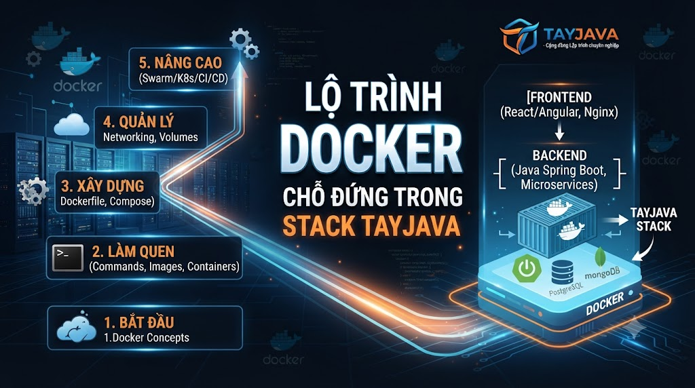
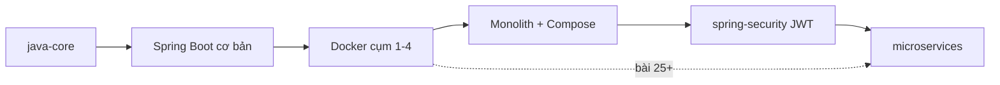
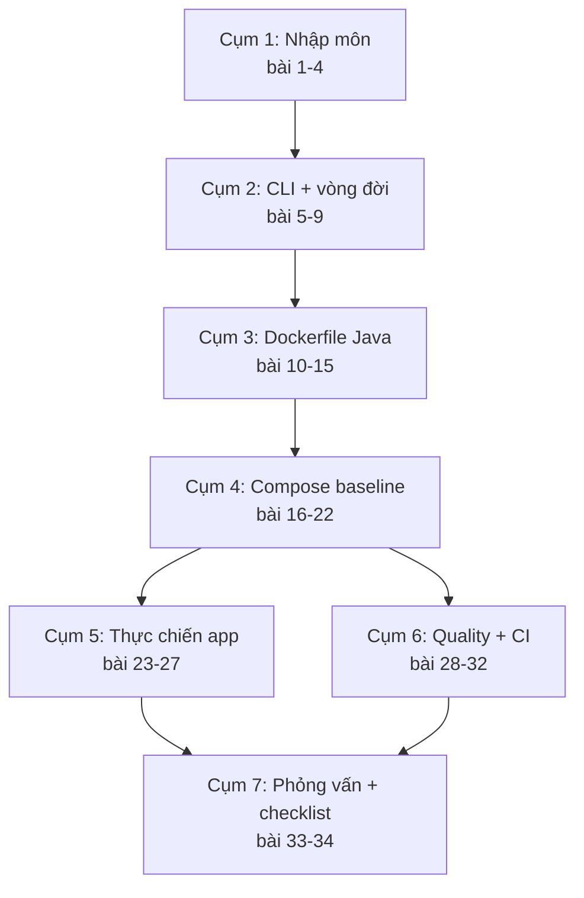
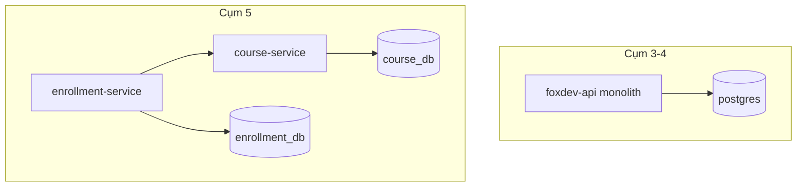

# Lộ trình học Docker và chỗ đứng trong stack FoxDev



Bạn chạy Spring Boot bằng `mvn spring-boot:run`, Postgres cài sẵn trên máy, Redis “nhớ bật trước khi demo” — rồi onboard đồng nghiệp mất nửa ngày vì “máy tôi khác”. Job description ghi Docker; phỏng vấn hỏi Dockerfile và Compose; series microservices FoxDev giả định bạn đã Compose được vài container. Bài này vẽ bản đồ **34 bài** series Docker: học theo thứ tự nào, cụm nào là baseline FoxDev, mất khoảng bao lâu, và chỗ đứng của Docker giữa Java core, Spring Boot, security và microservices — **không** nhảy Kubernetes chỉ vì nghe DevOps.

> Bài này là định hướng — chưa cài Docker hay viết Dockerfile. Container vs VM ở **bài 2**. Image/layer ở **bài 3**. Cài môi trường lab ở **bài 4**. Compose baseline từ **bài 16**.

## Vì sao nên học?

Học Docker không có lộ trình sẽ:

*   Thuộc lệnh `docker run` nhưng không giải thích được image khác container chỗ nào → trượt câu định nghĩa.
    
*   Copy Dockerfile “FROM openjdk:latest” rồi push lên prod → image phình, không tái hiện, rủi ro bảo mật.
    
*   Nhảy K8s YAML khi team chỉ cần Postgres + app trên một VPS Compose → ops nặng hơn lợi ích.
    
*   Vào series microservices bài 6 mà chưa từng `compose up` ổn định → lab đứng hình nửa buổi.
    

Đọc xong bạn sẽ:

*   Biết 34 bài chia **7 cụm** (cụm ≠ số bài); cụm nào cần trước microservices (baseline vs rút gọn).
    
*   Ước lượng thời gian full-time / part-time.
    
*   Tự đánh giá đang ở giai đoạn nào; chọn lộ trình “học đủ” hay “ôn phỏng vấn”.
    
*   Hiểu vì sao FoxDev lấy **Compose làm baseline**, không lấy Swarm/K8s.
    

## Sử dụng trong nguyentienkhoi.hashnode.dev thế nào?

*   **FoxDev:** Backend nghiêng **modular monolith** đóng gói một (hoặc vài) container + Postgres/Redis/Nginx bằng Compose. Series Docker dạy đúng lớp vận hành đó trước; multi-service là phần nối sang `microservices`, không phải mục tiêu tuần đầu.
    
*   **Project / công việc:** Onboard “một lệnh lên stack”, CI build image, staging giống local hơn cài tay từng dịch vụ.
    
*   **Phỏng vấn:** Câu middle thường là Dockerfile multi-stage, volume vs layer, Compose vs K8s khi nào — không phải thuộc hết flag của `dockerd`.
    

## Cần gì trước khi bắt đầu


| Yêu cầu | Mức cần | Thiếu thì học ở đâu |
|---|---|---|
| Terminal | cd, redirect, biến môi trường cơ bản | Tự ôn 1 buổi |
| Java + Maven | Build được JAR Spring Boot | java-core + Spring Boot cơ bản |
| HTTP / REST | Biết app lắng nghe cổng | Project cá nhân |
| Git | Clone, commit theo bài | java-core bài Git |


**Chưa cần** trước khi mở bài 5–9 (CLI):


| Chủ đề | Xuất hiện từ bài | Ghi chú |
|---|---|---|
| Dockerfile Java | 10–15 | Sau khi hiểu image/container |
| Compose | 16–22 | Baseline FoxDev |
| Kafka / Redis trong Compose | 19, 24 | Profile full |
| Kubernetes | Phần mở rộng | Series devops/kubernetes (khi có) |
| Microservices đầy đủ | Sau cụm 4–5 Docker | blogs/microservices |


> ⚠️ **Cảnh báo**: đừng trì hoãn Docker vì “chưa học K8s”. Phần lớn pain onboard và “chạy được trên máy tôi” giải bằng image + Compose.

## Chỗ đứng trong lộ trình FoxDev




| Series | Docker đóng vai |
|---|---|
| java-core / Spring Boot | App chạy được trước khi đóng gói |
| Docker (series này) | Image, CLI, Dockerfile, Compose baseline |
| spring-security | Auth trong app; secret không nhét vào image (bài 14, 29) |
| microservices | Giả định Compose/DNS — bài 6 & 37 dựa trên cụm 4 Docker |


**Trước khi vào microservices lab 5–8:**


| Mức | Học gì | Ghi chú |
|---|---|---|
| Baseline đủ | Bốn cụm đầu (cụm 1→4 = bài 1–22): CLI + Dockerfile + Compose | Đừng nhầm “cụm 1–4” với chỉ bài 1–4 |
| Rút gọn tối thiểu | Cụm 4 (bài 16–22), ưu tiên 16–18; rồi bài 25 | Đủ DNS/Compose để làm MS lab; bổ sung cụm 2–3 khi hổng Dockerfile/CLI |


Bài **25** là cầu nối multi-service rõ trên Compose.

## Bản đồ 34 bài




| Cụm | Bài | Câu hỏi cụm này trả lời |
|---|---|---|
| 1. Nhập môn | 1–4 | Học gì, container vs VM, image/layer, cài lab |
| 2. CLI & vòng đời | 5–9 | Chạy, log, volume/port/env, network, registry, dọn dẹp |
| 3. Dockerfile Java | 10–15 | Đóng gói Spring Boot đúng cách, cache, non-root, secret |
| 4. Compose baseline | 16–22 | Một lệnh lên stack FoxDev; profile; runbook |
| 5. Thực chiến | 23–27 | Monolith + Redis/Kafka; multi-service; giới hạn Compose |
| 6. Quality & CI | 28–32 | Scan, secret, CI build, SBOM, troubleshooting |
| 7. Tổng kết | 33–34 | Phỏng vấn + checklist prod Compose |


### Thứ tự bắt buộc

*   Viết Dockerfile (10+) khi chưa hiểu image/container (3) → copy tutorial không debug được.
    
*   Compose nhiều service (25) khi chưa xong 16–18 → rối network/env.
    
*   Coi xong bài 5 (`docker run`) là “biết Docker” → thiếu đóng gói Java và Compose — **cụm 3–4 mới đủ baseline FoxDev**.
    

### Chỗ được linh hoạt

*   Bài 33–34 có thể đọc sớm như mục tiêu phỏng vấn, rồi quay lại lab.
    
*   Cụm 6 (scan/SBOM) có thể học song song cụm 5 nếu đang chuẩn bị CI.
    
*   Kafka trong Compose (24) bỏ qua nếu chưa cần messaging — dùng profile `core`.
    

Danh sách tiêu đề đầy đủ: `blogs/devops/docker/danh-sach-bai-viet.md`.

## Thời gian tham chiếu

Thời gian = học + gõ lệnh/lab (part-time nhân ~1.5–2).


| Giai đoạn | Bài | Full-time gợi ý | Dấu hiệu đủ để lên tiếp |
|---|---|---|---|
| Nhập môn + CLI | 1–9 | 2–3 ngày | Tự run Postgres, vào exec, đọc log, prune có chủ đích |
| Dockerfile Java | 10–15 | 2–3 ngày | Build multi-stage Spring Boot, chạy non-root, không lộ secret trong layer |
| Compose baseline | 16–22 | 3–4 ngày | compose up app + Postgres healthy; có .env.example + runbook |
| Thực chiến + quality | 23–32 | 4–6 ngày | Monolith hoặc 2 service ổn; CI build image; biết giới hạn Compose |
| Tổng kết | 33–34 | 1 ngày | Trả lời được trade-off Compose vs K8s; tick checklist |


**Cả series:** khoảng **2–3 tuần** part-time nghiêm túc; **rút gọn** (xem bảng dưới) ~1 tuần nếu chỉ cần vào microservices lab.

### Lộ trình rút gọn


| Mục tiêu | Học bài |
|---|---|
| Chạy Postgres/Redis local | 2–3, 5–6, 16–18 |
| Đóng gói một Spring Boot | 10–14, 18 |
| Lab microservices 5–8 | cụm 4 (16–22) + bài 25 |
| Ship baseline MS bài 37 | cụm 4 + bài 26–27 |


## Ba giai đoạn năng lực


| Giai đoạn | Bạn làm được | Chưa cần khoe |
|---|---|---|
| A — Vận hành container | CLI, volume/port, đọc log, mạng bridge cơ bản | Helm, operator |
| B — Đóng gói & Compose | Dockerfile Java đúng, Compose stack lặp lại được | Service mesh |
| C — Ship có chất lượng | CI image, scan cơ bản, runbook, biết khi nào cần K8s | Trở thành platform engineer |


FoxDev production-minded dừng vững ở **B → C nhẹ** trên Compose. Sang K8s chỉ khi pain đa node/scale thật (bài 27, 34).

## Hai cách đi: học đủ và ôn phỏng vấn

**Học đủ (khuyến nghị):** 1 → 34 theo cụm; lab tay; ghi `notes/lesson-N.md`.

**Ôn phỏng vấn (đã từng dùng Docker):** đọc 1–3, 11–14, 16–18, 27, 32–34; tự giải thích multi-stage và “Compose đủ khi nào”; bổ sung chỗ hổng bằng lab ngắn.

Không thay lab bằng thuộc cheat sheet lệnh.

## Version và lựa chọn mặc định của series


| Chủ đề | Mặc định series | Không mặc định |
|---|---|---|
| CLI | Docker Engine + Compose V2 (docker compose) | docker-compose V1 (legacy) |
| App | Java 21 + Spring Boot (JAR) | Node/Python làm case chính (có thể áp dụng tương tự) |
| Orchestration lab | Docker Compose | Swarm, K8s (mở rộng) |
| Registry minh họa | Docker Hub / GHCR | Registry nội bộ phức tạp ngay bài đầu |
| OS lab | macOS / Linux; Windows → WSL2 | Hyper-V path cũ không khuyến khích |


## Case study xuyên suốt



1.  Đóng gói **một** API FoxDev + Postgres (+ Redis khi cần).
    
2.  Thêm Nginx/Gateway đơn giản, profile `full`.
    
3.  Tách lab hai service — cầu nối `microservices` — vẫn trên Compose/DNS.
    

## Lỗi và thói quen hay gặp


| Sai | Hậu quả | Cách tránh |
|---|---|---|
| Học K8s trước Compose | Không debug được network/DNS cơ bản | Xong cụm 4 trước |
| latest mọi image | Không tái hiện bug | Tag version/SHA (bài 15) |
| Coi Docker = đủ microservices | Nhầm đóng gói với kiến trúc | Đọc lại định nghĩa MS series |
| Chỉ xem video không gõ lệnh | Quên ngay | Lab + notes mỗi bài |
| Nhét secret vào Dockerfile | Lộ trong layer/history | Bài 14, 29 |


## Checklist tự đánh giá level

**Trước series — tick nếu đúng:**

*   Chạy được Spring Boot local và biết cổng lắng nghe
    
*   Biết Postgres/Redis là process riêng (dù chưa Docker)
    

**Sau cụm 2 (CLI):**

*   `docker run` Postgres, map port, volume giữ data
    
*   `logs` / `exec` / `rm` có chủ đích
    

**Sau cụm 4 (baseline FoxDev):**

*   `docker compose up` app + DB healthy
    
*   Giải thích được hostname service trên network Compose
    
*   Có `.env.example` và không commit mật khẩu
    

**Sau series:**

*   Multi-stage Java image non-root
    
*   Biết giới hạn Compose vs K8s
    
*   Trả lời được vài câu phỏng vấn có trade-off (bài 33)
    

## Bài tập — chuẩn bị workspace ghi chú

### 1\. Folder notes

```text
foxdev-docker-lab/
  notes/
    lesson-01.md
  (sẽ thêm compose.yaml, services/ từ bài sau)
```

### 2\. Ghi vào `notes/lesson-01.md`

1.  Bạn đang ở giai đoạn A / B / C (bảng trên) — vì sao?
    
2.  Mục tiêu 2 tuần tới: chỉ Compose cho monolith, hay chuẩn bị microservices lab?
    
3.  Máy bạn: macOS / Linux / Windows+WSL2?
    

### 3\. Đọc lướt danh sách

Mở `danh-sach-bai-viet.md`, đánh dấu bài thuộc lộ trình rút gọn bạn chọn.

## Checkpoint — hoàn thành bài này khi

*   Nêu được 7 cụm (và không nhầm “cụm 1–4” với chỉ bài 1–4); biết cụm nào là baseline Compose
    
*   Phân biệt baseline bài 1–22 vs rút gọn 16–22 + 25 trước lab microservices
    
*   Biết Docker đứng đâu giữa Spring Boot và microservices
    
*   Chọn được lộ trình học đủ hoặc rút gọn
    
*   Hiểu Compose mặc định, K8s không bắt buộc
    
*   Có `notes/lesson-01.md`
    
*   Không kỳ vọng “xong bài 1 là biết Docker”
    

## Làm gì ngay sau bài này

1.  Sang **bài 2**: [Container vs VM — Docker giải quyết pain gì và _không_ giải quyết gì](/vi/technologies/container-vs-vm-docker-giai-quyet-pain-gi-va-khong-giai-quyet-gi).
    
2.  Không cài đặt vội nếu chưa đọc bài 2–3 (mô hình tư duy); bài **4** mới là cài lab chính thức.
    
3.  Nếu đang kẹt microservices bài 6: ưu tiên rút gọn cụm 4 sau khi xong nhập môn + CLI.
    

## Tóm tắt

*   Series Docker = **34 bài / 7 cụm**; baseline FoxDev là **Compose**, không phải K8s.
    
*   Đứng sau Spring Boot chạy được, trước (và phục vụ) microservices lab.
    
*   Cụm 3–4 = đóng gói Java + stack một lệnh; đủ để onboard và nối MS.
    
*   Học đủ theo lab; ôn phỏng vấn có lối tắt nhưng không bỏ trade-off.
    

