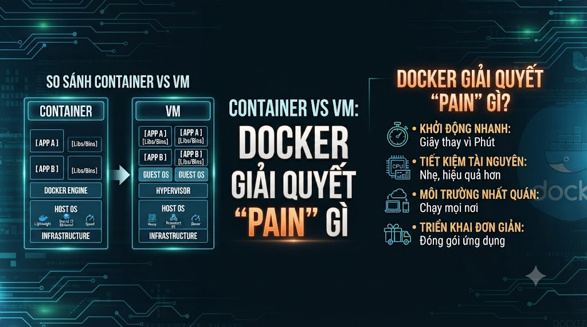
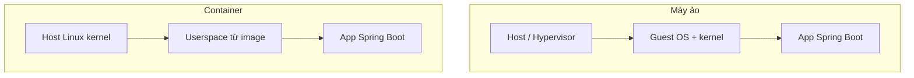
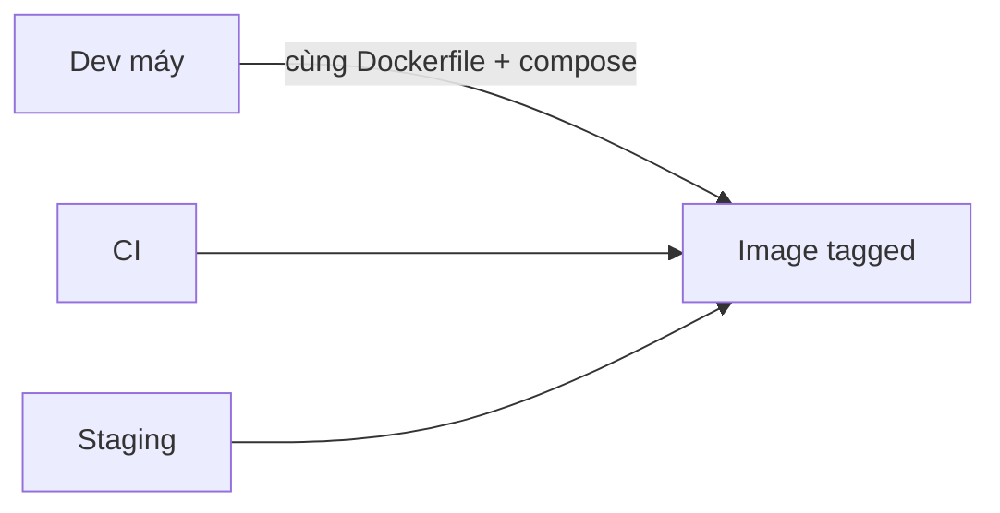

# Container vs VM: Docker giải quyết pain gì (và không giải quyết gì)



Ở [**bài 1**](/vi/technologies/lo-trinh-hoc-docker-va-cho-dung-trong-stack-tayjava) bạn đã có bản đồ 34 bài và chỗ đứng Docker trong stack FoxDev. Trước khi gõ `docker run`, cần chốt mô hình: **container khác máy ảo (VM) chỗ nào**, Docker thực sự chữa pain nào của team Java/Spring, và những kỳ vọng sai khiến người học thất vọng (“cài Docker xong không còn bug môi trường”, “Docker = đủ bảo mật/prod scale”). Bài này là nền để bài 3 nói image/layer và bài 4 cài lab cho đúng kỳ vọng.

> Phạm vi: so sánh tư duy container vs VM, pain hợp lệ / pain giả, giới hạn Docker. Chưa CLI chi tiết (bài 5+), chưa Dockerfile (bài 10+). Image, layer, registry → **bài 3**.

## Vì sao nên học?

Lẫn container với VM (hoặc thần thánh hoá Docker) sẽ:

*   Giải thích phỏng vấn kiểu “container có OS riêng giống VM” → sai mô hình, bị đào tiếp.
    
*   Dùng container như VM đầy đủ (SSH vào, cài tay, nâng cấp in-place) → mất tính **tái tạo từ image**.
    
*   Mong Docker sửa code race, thiết kế DB sai, thiếu timeout giữa service → thất vọng và đổ lỗi tool.
    
*   Đề xuất “chuyển hết sang K8s” khi pain thật chỉ là “cài Postgres lệch version giữa hai máy”.
    

Đọc xong bạn sẽ:

*   Vẽ được khác biệt VM vs container (hypervisor vs kernel chia sẻ).
    
*   Liệt kê pain Docker/Compose **hợp lệ** với FoxDev.
    
*   Nêu rõ những gì vẫn phải giải bằng code, process, hoặc platform khác.
    
*   Trả lời được: _Docker khác VM chỗ nào?_ kèm ví dụ Spring Boot.
    

## Sử dụng trong nguyentienkhoi.hashnode.dev thế nào?

*   **FoxDev:** Đóng gói API + Postgres/Redis bằng container để **mọi máy dev/staging cùng phiên bản**; không biến mỗi container thành “máy chủ pet” cấu hình tay. Production baseline vẫn có thể là Compose trên host — đúng tinh thần series.
    
*   **Project / công việc:** Tách “đóng gói môi trường chạy” khỏi “sửa architecture”. Review đề xuất DevOps: hỏi pain nào đang đau.
    
*   **Phỏng vấn:** Câu kinh điển container vs VM — trả lời tầng isolation + khởi động nhanh + chia sẻ kernel; nêu trade-off bảo mật/isolation kém hơn VM đầy đủ nếu được hỏi sâu.
    

## VM và container — cùng isolation, khác tầng

**Máy ảo (VM):** hypervisor chạy guest có **kernel riêng** (+ thường full userspace). Mỗi VM nặng về RAM/CPU, boot chậm hơn, isolation mạnh giữa tenant.

**Container:** process (và filesystem view) được cô lập trên **cùng một kernel host** (Linux namespaces, cgroups). Image mang userspace + app + dependency — **không** mang kernel riêng như VM.




| Tiêu chí | VM | Container (Docker) |
|---|---|---|
| Kernel | Riêng mỗi guest | Chia sẻ host |
| Kích thước / RAM | Lớn hơn | Nhẹ hơn nhiều (thường) |
| Thời gian start | Phút → hàng chục giây | Giây / thấp hơn |
| Isolation | Mạnh (hardware-ish) | Mạnh đủ cho nhiều app; không bằng VM mọi threat model |
| Đóng gói app | Image VM / packer… | Image layer (bài 3) |
| Phù hợp | Cô lập tenant, OS khác nhau | Ship app + dependency lặp lại |


Trên **macOS / Windows**, Docker Desktop chạy Linux VM nhẹ phía dưới rồi mới chạy container Linux bên trong — bạn vẫn thao tác như container, nhưng “Docker trên Mac” ≠ container native trên kernel macOS.

## Nhìn từ app Spring Boot

Không Docker:

```text
Máy A: JDK 21.0.2, Postgres 15, Redis tự cài
Máy B: JDK 17, Postgres 16 Homebrew, quên Redis
→ “Chạy được trên máy tôi”
```

Có Docker (ý tưởng):

```text
Image app: Java 21 + JAR (cùng Dockerfile)
Container Postgres: postgres:16-alpine (cùng tag)
Compose: một mạng, một lệnh up
→ Cùng công thức trên mọi máy lab
```

Docker **không** sửa giúp bạn: race enroll, quên idempotency, JWT cấu hình sai — những thứ thuộc series Spring Security / microservices.

## Docker giải quyết pain gì?

Pain **hợp lệ** series nhắm tới:


| Pain | Docker/Compose giúp thế nào |
|---|---|
| Lệch JDK / lib native / tool | Image khóa toolchain runtime |
| Lệch version Postgres/Redis | Image tag cố định trong Compose |
| Onboard lâu | Runbook compose up (bài 22) |
| “Cài tay trên server” khó tái tạo | Build image → chạy cùng artifact |
| Nhiều process phụ thuộc | Compose network + DNS tên service |
| CI cần môi trường giống | Build/push image; test smoke trên Compose |




Đó là giá trị cốt lõi với FoxDev: **công thức chạy lặp lại được**, không phải “ảo hoá mọi thứ”.

## Những gì Docker không giải quyết


| Kỳ vọng sai | Thực tế |
|---|---|
| Hết bug nghiệp vụ | Container chỉ đóng gói; logic sai vẫn sai |
| Đủ bảo mật production | Cần user non-root, scan, secret, network policy… (cụm 6); container ≠ sandbox hoàn hảo |
| Thay monitoring / backup | Vẫn cần log/metrics, backup volume/DB |
| Tự scale đa máy | Compose một/hai host; đa node → K8s/Nomad… (bài 27, 34) |
| Biến monolith thành microservices | Đóng gói nhiều process ≠ data ownership / deploy độc lập (series MS) |
| Thay hẳn VM mọi chỗ | Một số workload (kernel module đặc thù, isolation pháp lý) vẫn cần VM |


**Công thức nhớ:** Docker giải quyết _đóng gói và chạy thống nhất_; không giải quyết _thiết kế hệ thống và vận hành quy mô lớn_ một mình.

## Docker Desktop trên Mac/Windows — lưu ý

*   Container Linux của bạn chạy trong **VM Linux** do Desktop quản lý.
    
*   Volume mount từ macOS → VM → container có thể **chậm hơn** native Linux (đặc biệt node\_modules / nhiều file nhỏ; với JAR Java thường chấp nhận được).
    
*   RAM gán cho Desktop hết → OOM container “bí ẩn” — kiểm tra setting trước khi nghi app.
    
*   Linux server/CI: thường Engine native, gần mô hình “chia sẻ kernel” thuần hơn.
    

Bài 4 sẽ hướng dẫn kiểm tra môi trường; ở đây chỉ cần kỳ vọng đúng: Desktop tiện cho lab, không phải mọi hành vi I/O giống prod Linux 100%.

## Pain giả thường gặp ở team e-learning


| Phát biểu | Phân loại | Hướng xử lý đúng |
|---|---|---|
| “Cần Docker vì sắp microservices” | Pain giả nếu monolith còn ổn | Modular monolith + Compose trước |
| “Dev A Postgres 15, dev B 16 lệch migration” | Pain thật | Pin image Postgres trên Compose |
| “Muốn scale enrollment Black Friday” | Có thể thật — nhưng | Đo bottleneck; Docker alone không = autoscaling |
| “Không muốn cài JDK trên máy mới” | Pain thật (onboard) | Devcontainer hoặc chỉ chạy app trong container |
| “Docker cho bảo mật PCI” | Pain giả nếu chỉ docker run | Threat model + control riêng; đừng thay bằng container |


## Lỗi và thói quen hay gặp


| Sai | Hậu quả | Cách tránh |
|---|---|---|
| Coi container = mini VM (SSH, patch in-place) | Drift cấu hình; không tái tạo | Immutable: sửa Dockerfile/Compose → tạo lại |
| Giải thích “mỗi container một OS đầy đủ” | Sai phỏng vấn | Userspace + chia sẻ kernel |
| Bỏ VM hoàn toàn mọi workload | Sai isolation khi cần mạnh | Chọn theo threat/ops |
| docker run thủ công 10 service không Compose | Onboard vẫn đau | Cụm 4 Compose |
| Đổ lỗi Docker cho flaky test | Che bug timing/network | Tách nguyên nhân app vs môi trường |


## Bài tập — phân loại pain quanh bạn

### 1\. Liệt kê 5 pain môi trường

Từ project FoxDev / công ty / đồ án — mỗi dòng một pain (ví dụ: lệch JDK, khó cài Kafka…).

### 2\. Gán nhãn

Với mỗi pain: **Docker giải được / giải một phần / không giải**. Viết một câu vì sao.

### 3\. Notes — `notes/lesson-02.md`

1.  Container khác VM ở tầng nào (3–5 câu)?
    
2.  Vì sao Docker Desktop trên Mac vẫn liên quan VM?
    
3.  Một kỳ vọng về Docker bạn từng có mà bài này bác bỏ.
    

## Checkpoint — hoàn thành bài này khi

*   Giải thích container vs VM không lẫn “OS đầy đủ”
    
*   Kể ≥3 pain Docker giải hợp lệ cho team Java
    
*   Kể ≥3 điều Docker không giải
    
*   Hiểu Desktop trên Mac/Windows chạy qua VM Linux
    
*   Không dùng Docker như lý do duy nhất để tách microservices
    
*   Notes hoàn thành
    

## Làm gì ngay sau bài này

1.  Sang **bài 3**: Image, container, layer, registry — mô hình tư duy để nhìn `docker images` / `history` cho đúng.
    
2.  Giữ danh sách pain đã phân loại — dùng lại khi chọn rút gọn lộ trình (bài 1).
    
3.  Cài đặt chính thức để ở **bài 4** (sau khi có vocabulary bài 3).
    

## Tóm tắt

*   VM: kernel riêng, isolation nặng; container: chia sẻ kernel host, đóng gói userspace + app.
    
*   Docker chữa lệch môi trường, onboard, artifact chạy thống nhất — cốt lõi baseline FoxDev.
    
*   Không chữa logic sai, không thay scale đa node, không biến monolith thành microservices.
    
*   Desktop trên Mac/Windows = UX container trên nền VM Linux; kỳ vọng I/O/RAM cho đúng.
    

