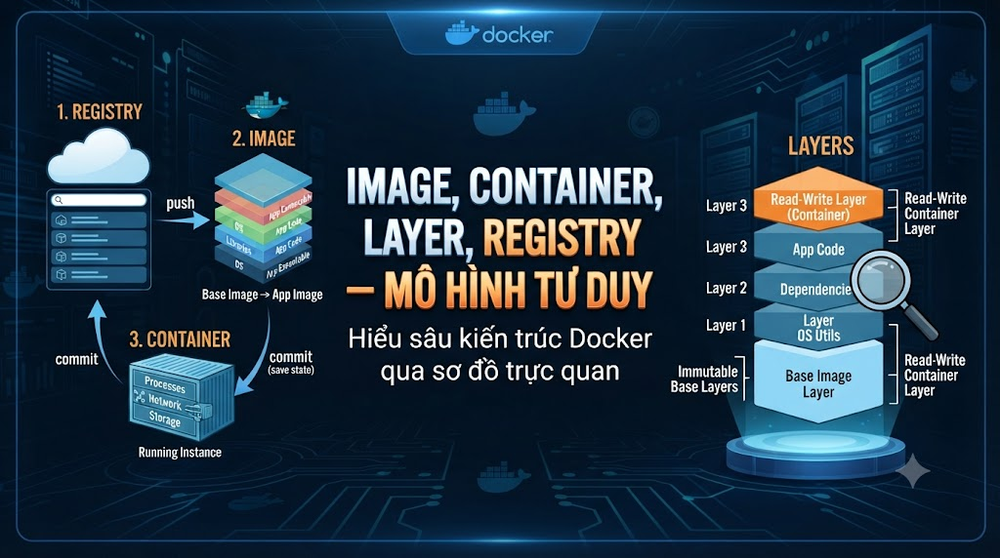
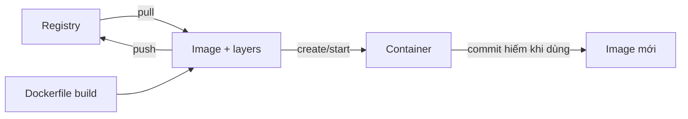
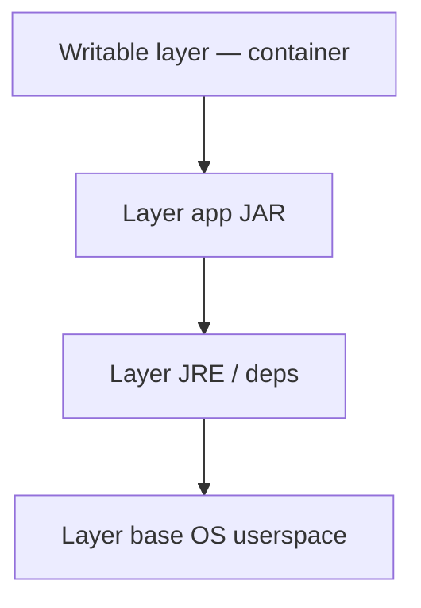
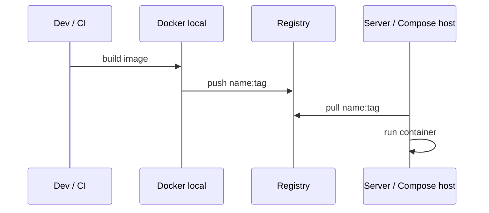

# Image, container, layer, registry — mô hình tư duy



Ở [**bài 2**](/vi/technologies/container-vs-vm-docker-giai-quyet-pain-gi-va-khong-giai-quyet-gi) bạn đã phân biệt container với VM và biết Docker chữa (và không chữa) pain nào. Trước khi cài Desktop và gõ CLI cả ngày, cần một mô hình tư duy vững: **image** khác **container** chỗ nào, **layer** quyết định build/cache/security ra sao, **registry** nằm ở đâu trong vòng đời. Không có mô hình này, mọi `docker images` / `history` / “tại sao image 800MB” đều trở thành thử-sai.

> Phạm vi: khái niệm và quan hệ image → container, layer, tag, registry. Chưa cài đặt (bài 4), chưa thuần thục CLI (bài 5+), chưa viết Dockerfile (bài 10+). Có thể minh họa bằng lệnh đọc — chưa yêu cầu lab build Java.

## Vì sao nên học?

Lẫn các khái niệm này sẽ:

*   Sửa “trong container đang chạy” rồi tưởng đã lưu vào image → mất thay đổi khi `rm`, không tái tạo được.
    
*   Đẩy `myapp:latest` mọi nơi → không biết staging đang chạy bản nào khi có bug.
    
*   Không hiểu layer → Dockerfile COPY lung tung, cache vỡ, CI chậm (bài 12 sẽ khoét).
    
*   Phỏng vấn hỏi “image khác container?” trả lời vòng vo bằng “cái chứa app”.
    

Đọc xong bạn sẽ:

*   Định nghĩa image (template bất biến) vs container (instance có trạng thái runtime).
    
*   Giải thích layer xếp chồng và writable layer của container.
    
*   Phân biệt tag tiện dụng với digest pin chặt.
    
*   Biết registry (Hub/GHCR) trong luồng pull/build/push.
    

## Lab

Series đóng gói `foxdev-api` (và sau này Postgres/Redis trong Compose). Mọi image bạn gặp từ bài 10 trở đi — `eclipse-temurin`, `postgres:16-alpine`, image app tự build — đều tuân mô hình bài này. Chưa cần repo; chỉ cần nhớ: **cùng tag image → cùng công thức chạy** trên máy dev và CI.

## Bốn khái niệm một dòng


| Khái niệm | Một dòng |
|---|---|
| Image | Gói filesystem + metadata bất biến; “khuôn” để tạo container |
| Container | Process (+ writable layer) tạo từ image; có vòng đời start/stop |
| Layer | Lớp chỉ-đọc xếp chồng tạo nên image; chia sẻ giữa image |
| Registry | Nơi lưu/phân phối image (docker.io, ghcr.io, registry nội bộ) |




Trong workflow FoxDev/series: **build từ Dockerfile → tag → (push registry) → run container**. `docker commit` không phải đường chính — dễ tạo image “pet” không tái tạo.

## Image vs container

**Image** giống class / template:

*   Không “chạy”; chỉ lưu trên disk (local) hoặc registry.
    
*   Nội dung (layers) coi là **immutable** sau khi build xong một digest.
    
*   Định danh: `name:tag` hoặc `@sha256:…`.
    

**Container** giống object / process instance:

*   Có ID, trạng thái (`created`, `running`, `exited`…).
    
*   Có **writable layer** riêng: file tạo/sửa trong container không tự chảy ngược vào image.
    
*   Xóa container ≠ xóa image (trừ khi bạn chủ động `rmi` / prune).
    


| Hành động | Ảnh hưởng image? | Ảnh hưởng container? |
|---|---|---|
| docker pull | Thêm/cập nhật image local | Không |
| docker run | Không (đọc image) | Tạo + thường start container |
| Sửa file trong exec | Không | Chỉ writable layer container đó |
| docker rm | Không | Xóa instance (+ writable layer) |
| docker rmi | Xóa image (nếu không còn container phụ thuộc) | — |


**Hệ quả thực tế:** muốn thay đổi bền → sửa Dockerfile (hoặc Compose config) → **build lại image** → chạy container mới. Đừng SSH-vào-sửa-xong-quên.

## Layer và union filesystem

Image = nhiều **layer chỉ-đọc** xếp chồng. Container thêm một layer **đọc-ghi** ở trên cùng.



Vì sao quan trọng:

1.  **Chia sẻ:** hai image cùng base `eclipse-temurin:21-jre` → layer base chỉ tải một lần trên máy.
    
2.  **Cache build:** Dockerfile đổi lệnh cuối → layer trên rebuild; layer dưới tái sử dụng (bài 12).
    
3.  **Bảo mật / kích thước:** mỗi `RUN apt-get` / `COPY` thừa = layer thừa; secret từng có trong layer cũ vẫn có thể nằm trong history nếu từng COPY vào (bài 14).
    

Lệnh sẽ gặp sau (bài 5+): `docker history <image>` — xem từng layer và kích thước tương đối (con số “virtual size” dễ gây hiểu nhầm; quan trọng là _thứ tự và nội dung_ layer).

## Tag, digest và “latest”

*   **Tag** (`foxdev-api:1.4.2`, `postgres:16-alpine`): nhãn tiện đọc; **có thể bị gán lại** cho nội dung khác.
    
*   **Digest** (`postgres@sha256:abc…`): hash nội dung; pin chặt cho reproduce.
    
*   `latest`**:** chỉ là tag mặc định khi không ghi tag — **không** có nghĩa “bản mới nhất an toàn mãi”. Team/CI nên pin version hoặc SHA.
    


| Ngữ cảnh | Nên dùng |
|---|---|
| Lab học nhanh | Tag version rõ (16-alpine, 1.0.0-SNAPSHOT) |
| Prod / staging nghiêm | Tag immutable + ghi nhận digest trong release note |
| Tránh | myapp:latest làm nguồn sự thật duy nhất giữa nhiều môi trường |


## Registry trong vòng đời



*   **Docker Hub** (`docker.io`): image công khai phổ biến (`postgres`, `redis`).
    
*   **GHCR / registry riêng:** image app nội bộ FoxDev — kiểm soát quyền pull/push.
    
*   Máy chỉ `pull` base + build local vẫn ổn cho lab; push cần khi chia sẻ máy khác hoặc deploy host không build.
    

Bài 8 sẽ thao tác `pull` / tag / `push` cụ thể — ở đây chỉ cần biết registry là **kho phân phối image**, không phải chỗ chạy container.

## Nhìn một image Spring Boot (trước khi tự build)

Hình dung multi-stage sau này (bài 11):


| Layer nhóm | Nội dung |
|---|---|
| Base runtime | JRE tối giản (không cần full JDK) |
| App | User non-root + file JAR |
| Metadata | ENTRYPOINT/CMD, EXPOSE, healthcheck (bài 13) |


Một container chạy từ image đó: process Java lắng nghe `8080`; log ghi stdout; file upload nếu ghi vào filesystem container sẽ **mất** khi xóa container trừ khi gắn **volume** (bài 6).

## Lỗi và thói quen hay gặp


| Sai | Hậu quả | Cách tránh |
|---|---|---|
| Coi container = image đang chạy mãi | Mất dữ liệu / config khi recreate | Volume cho data; image cho code |
| Chỉ dùng latest | Không tái hiện bug | Tag version / digest |
| docker commit thành pipeline | Image không có Dockerfile nguồn | Build từ Dockerfile |
| Lẫn registry với container host | Deploy nhầm chỗ | Registry lưu; Engine/Compose chạy |
| Nghĩ xóa container xóa luôn image | Disk đầy image mồ côi | prune có chủ đích (bài 9) |


## Bài tập

### 1\. Viết lại bằng lời của bạn

Trong `notes/lesson-03.md`, định nghĩa image, container, layer, registry — mỗi cái ≤2 câu, không copy bảng.

### 2\. Kịch bản

“Sửa `application.yml` trong container đang chạy bằng `exec`, demo OK, rồi `docker rm` và `run` lại từ cùng image.”  
→ Config còn không? Phải làm gì mới bền? (Trả lời trong notes.)

### 3\. Quan sát (nếu đã có Docker từ trước; không thì để bài 4–5)

```bash
docker images
docker history postgres:16-alpine   # sau khi pull
```

Ghi: tag nào, roughly bao nhiêu layer “đáng chú ý”.

## Checkpoint — hoàn thành bài này khi

*   Phân biệt image (template) và container (instance + writable layer)
    
*   Giải thích layer xếp chồng và vì sao liên quan cache/size
    
*   Biết rủi ro của tag `latest` vs digest
    
*   Chỉ được registry trong luồng pull/build/push
    
*   Không coi `commit` là cách ship chuẩn
    
*   Notes hoàn thành
    

## Làm gì ngay sau bài này

1.  Sang **bài 4**: cài Docker Desktop / Engine và kiểm tra môi trường lab.
    
2.  Giữ vocabulary bài này — bài 5 sẽ gắn vào lệnh thật.
    
3.  Khi đọc Dockerfile sau này, luôn hỏi: _layer nào đổi? tag nào pin?_
    

## Tóm tắt

*   Image = khuôn bất biến; container = process chạy từ khuôn + lớp ghi.
    
*   Layer tạo image, chia sẻ và quyết định cache/bảo mật build.
    
*   Tag tiện dụng; digest pin chặt; tránh thần thánh `latest`.
    
*   Registry phân phối image; Engine chạy container — đừng lẫn.
    

