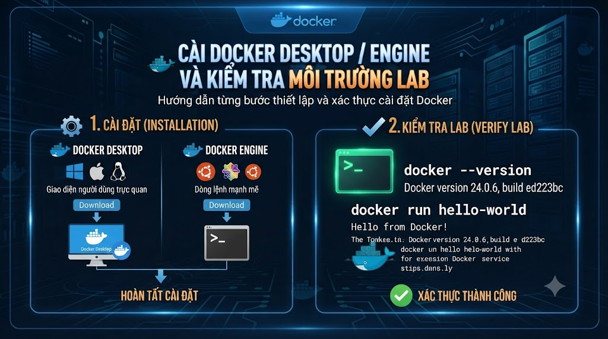

# Cài Docker Desktop / Engine và kiểm tra môi trường lab



Ở [**bài 3**](/vi/technologies/container-vs-vm-docker-giai-quyet-pain-gi-va-khong-giai-quyet-gi) bạn đã có vocabulary: image, container, layer, registry. Bài này **cài và xác minh** môi trường lab để từ bài 5 trở đi chỉ còn học lệnh và đóng gói — không mất buổi vì daemon không chạy, Compose V1/V2 lệch, hay Desktop hết RAM. Mục tiêu không phải tối ưu prod server, mà có một máy (hoặc WSL2) **đủ sạch và kiểm chứng được** cho series.

> Phạm vi: cài Docker Desktop (macOS/Windows) hoặc Engine (Linux), bật Compose V2, smoke test, checklist tài nguyên. Chưa đi sâu CLI vòng đời (bài 5), chưa Dockerfile. Windows: **WSL2** là đường khuyến nghị.

## Vì sao nên học?

Cài “xong nhưng chưa verify” sẽ:

*   `docker` có trong PATH nhưng daemon down → mọi lệnh fail khó hiểu.
    
*   Dùng nhầm `docker-compose` (V1) vs `docker compose` (V2) → lệch docs series và team.
    
*   Desktop RAM mặc định thấp → Postgres + app Java OOM khi vào Compose (cụm 4).
    
*   Trên Windows quên WSL2 → volume/path/perf rối từ bài 6.
    

Đọc xong / làm xong bạn sẽ:

*   Cài đúng stack theo OS của mình.
    
*   Pass smoke test: `docker version`, `run hello-world` (hoặc tương đương), `docker compose version`.
    
*   Biết chỉnh RAM/disk Desktop trước khi lab nặng.
    
*   Ghi được môi trường vào notes để onboard sau này.
    

## Lab

Môi trường này phục vụ suốt series: đóng gói `foxdev-api`, Postgres/Redis, sau đó multi-service. Không cần clone repo ở bài này — chỉ cần Engine/Desktop xanh và Compose V2. Ghi OS + phiên bản vào `notes/lesson-04.md` để khi nhờ người khác hỗ trợ không phải đoán.

## Chọn đường cài theo OS


| OS | Đường khuyến nghị series |
|---|---|
| macOS (Apple Silicon / Intel) | Docker Desktop |
| Windows 10/11 | Docker Desktop + WSL2 (backend WSL2) |
| Ubuntu / Debian / Fedora… | Docker Engine + plugin Compose V2 (hoặc Desktop for Linux nếu muốn GUI) |


Không khuyến nghị: VirtualBox + Docker cũ, Docker Toolbox, Hyper-V backend Windows (trừ ràng buộc công ty — ghi chú và chấp nhận lệch docs volume).

## macOS — Docker Desktop

1.  Tải Docker Desktop từ trang chính thức Docker (chọn Apple Silicon vs Intel đúng chip).
    
2.  Kéo app vào Applications, mở, hoàn tất quyền ảo hoá nếu được hỏi.
    
3.  Chờ icon báo Engine running.
    
4.  Mở Terminal:
    

```bash
docker version
docker compose version
```

Cả Client và Server (Engine) phải hiện version; nếu Server lỗi → Desktop chưa start hoặc cần quyền.

**Gợi ý:** bật bắt đầu Desktop lúc login nếu bạn lab hàng ngày — tránh quên daemon.

## Windows — Docker Desktop + WSL2

1.  Bật **WSL2** và cài distro (Ubuntu) theo docs Microsoft.
    
2.  Cài Docker Desktop; Settings → General: dùng **WSL2 based engine**.
    
3.  Settings → Resources → WSL integration: bật distro bạn dùng.
    
4.  Mở terminal **trong WSL** (ưu tiên Linux path khi làm lab series):
    

```bash
docker version
docker compose version
```

**Lưu ý path:** giữ project trong filesystem Linux của WSL (`~/workspace/...`) — tránh perf kém khi project nằm `C:\` mount sang container (rõ hơn ở bài 6 volume).

## Linux — Engine + Compose plugin

Theo docs Docker cho distro của bạn (tinh thần, không hardcode mọi lệnh apt theo năm):

1.  Gỡ bản `docker.io` lẫn lộn nếu cần (theo guide chính thức).
    
2.  Cài `docker-ce` (Engine) từ repo Docker.
    
3.  Cài plugin Compose V2 (`docker-compose-plugin`) — lệnh là `docker compose`.
    
4.  Thêm user vào group `docker` (rồi **logout/login**) để khỏi `sudo` mọi lệnh — hiểu rủi ro group docker ≈ quyền root.
    
5.  Enable/start service `docker`.
    

```bash
docker version
docker compose version
sudo systemctl status docker   # nếu dùng systemd
```

## Smoke test bắt buộc

Chạy lần lượt; tất cả phải OK trước khi sang bài 5.

```bash
# 1) Client + server nói chuyện được
docker version

# 2) Compose V2
docker compose version
# Kỳ vọng: Docker Compose version v2.x ...

# 3) Chạy container tối thiểu
docker run --rm hello-world

# 4) Xem còn container/image gì
docker ps -a
docker images
```

`hello-world` in thông báo thành công rồi thoát → pull, tạo container, chạy process, `--rm` dọn đều ổn.

Tuỳ chọn (mạng/registry):

```bash
docker pull postgres:16-alpine
docker images postgres
```

Chưa cần `run` Postgres lâu — bài 5–6 sẽ làm.

## Cấu hình Desktop nên chỉnh sớm

Trên **Docker Desktop → Settings → Resources**:


| Mục | Gợi ý lab FoxDev (điểm xuất phát) |
|---|---|
| Memory | ≥ 4 GB; nên 6–8 GB nếu sẽ chạy app Java + Postgres + Redis |
| CPUs | ≥ 2 |
| Disk image size | Đủ headroom; theo dõi khi hay build (bài 9 prune) |
| File sharing / VirtioFS | macOS: theo đề xuất Desktop cho version bạn |


Engine Linux: theo dõi `df -h` và RAM host. Nhắc bài 2: trên Mac/Windows, hết RAM **Desktop** = container chết dù máy còn RAM nhìn trên Activity Monitor.

## Compose V2 và lệnh chuẩn series


| Dùng trong series | Tránh (trừ legacy máy công ty) |
|---|---|
| docker compose up | docker-compose up (binary V1) |
| File compose.yaml / compose.yml | Phụ thuộc tool V1 không doc |


```bash
docker compose version
which docker-compose   # nếu có, ghi chú; ưu tiên plugin V2
```

Cụm 4 (bài 16+) và cầu nối microservices giả định **Compose V2**.

## Lỗi và thói quen hay gặp


| Triệu chứng | Hướng xử lý |
|---|---|
| Cannot connect to the Docker daemon | Start Desktop / systemctl start docker; user trong group docker |
| docker compose not found | Cài Compose plugin / cập nhật Desktop |
| hello-world pull timeout | Mạng, proxy công ty, DNS |
| Desktop trên Mac báo virtualization | Bật Virtualization; máy ảo lồng nhau có thể chặn |
| Windows: Docker chỉ chạy PowerShell không chạy WSL | Bật WSL integration cho distro |
| Disk full sau vài tuần | Bài 9 prune; tạm docker system df |
| Bỏ qua smoke test “cài xong là được” | Luôn chạy 4 bước smoke trước bài 5 |
| Cấp RAM Desktop quá thấp rồi đổ lỗi app | Chỉnh Resources trước lab Java + DB |


## Bài tập

### 1\. Smoke test

Chạy đủ 4 bước smoke; ghi version Client/Server + Compose vào notes — **không** commit token nếu có login.

### 2\. Notes — `notes/lesson-04.md`

1.  OS + chip (macOS arm64 / Win11 + WSL Ubuntu / Ubuntu server…).
    
2.  `docker version` (Engine) và `docker compose version`.
    
3.  RAM đã cấp cho Desktop (nếu có) hoặc RAM host.
    
4.  Đường project lab (ví dụ `~/workspace/foxdev-docker-lab`).
    

### 3\. Folder lab trống

```text
foxdev-docker-lab/
  notes/
    lesson-01.md … lesson-04.md
```

## Checkpoint — hoàn thành bài này khi

*   Client nói chuyện được với Engine
    
*   `docker compose version` hiện v2.x
    
*   `docker run --rm hello-world` thành công
    
*   Đã chỉnh / ghi nhận RAM Desktop (hoặc giới hạn host)
    
*   Windows: làm việc được từ WSL2 nếu đó là môi trường chính
    
*   Notes môi trường hoàn thành
    

## Làm gì ngay sau bài này

1.  Sang **bài 5**: CLI hàng ngày — `run`, `ps`, `logs`, `exec`, `stop`, `rm`.
    
2.  Giữ Desktop/Engine chạy khi lab.
    
3.  Cụm nhập môn **1–4** khép — tiếp theo thiên thao tác và đóng gói.
    

## Tóm tắt

*   Cài đúng theo OS: Desktop (Mac/Win+WSL2) hoặc Engine + Compose plugin (Linux).
    
*   Smoke test bắt buộc trước CLI sâu.
    
*   Compose **V2** (`docker compose`) là chuẩn series.
    
*   Cấp RAM đủ sớm — lab Java + DB nặng hơn `hello-world`.
    

