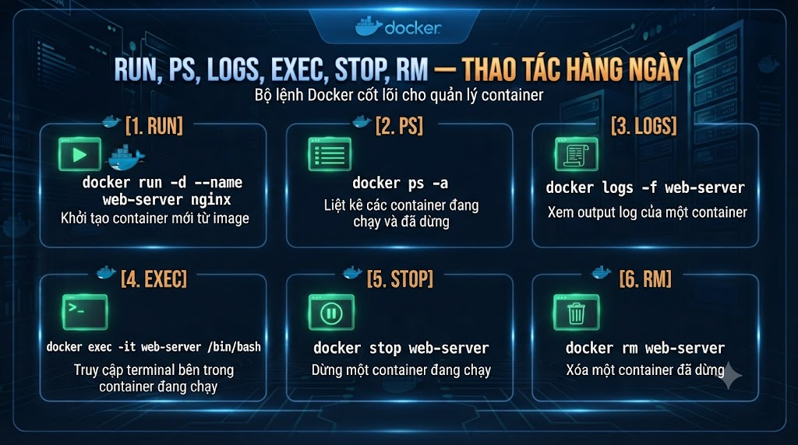
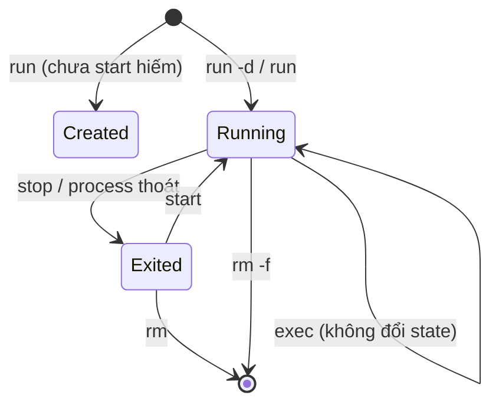

# run, ps, logs, exec, stop, rm — thao tác hàng ngày



Ở **bài 4** môi trường lab đã smoke test xong. Cụm CLI bắt đầu từ đây: sáu thao tác bạn dùng gần như mỗi ngày khi chạy Postgres, Redis hay thử image Spring Boot — **tạo/chạy**, **xem trạng thái**, **đọc log**, **vào trong**, **dừng**, **xóa**. Thành thạo vòng đời này trước khi thêm port/volume/env (bài 6); không thì dễ “mất” container hoặc không biết app chết vì gì.

> Phạm vi: vòng đời container qua CLI cơ bản, `--name`, `-d`, `--rm`, lọc `ps`. Chưa port/volume/env sâu (bài 6), chưa network DNS (bài 7), chưa tự build image Java (bài 10).

## Vì sao nên học?

Không vững CLI vòng đời sẽ:

*   Chạy nhiều `docker run` trùng → loạn tên/cổng, không biết instance nào “đúng”.
    
*   App fail mà không `logs` → đoán mò, reopen Desktop.
    
*   `exec` vào sửa file rồi tưởng đã lưu image (bài 3) → mất khi `rm`.
    
*   `docker kill` / `rm -f` mọi lúc → bỏ qua graceful shutdown (sau này bài 13 / microservices bài 36).
    

Đọc xong / làm xong bạn sẽ:

*   Chạy container nền (`-d`) có `--name` rõ.
    
*   Đọc log follow; `exec` kiểm tra nhanh.
    
*   `stop` rồi `rm` có chủ đích; phân biệt với `--rm`.
    
*   Tự khép một vòng Postgres lab mà không sợ “rác” container.
    

## Lab

Dùng image có sẵn (ví dụ `postgres:16-alpine`) như “stand-in” cho DB mà sau này `compose` của `foxdev-api` sẽ kéo vào. Chưa cần JAR Spring Boot — mục tiêu là **điều khiển vòng đời**, không phải đóng gói app.

## Vòng đời container nhìn từ lệnh




| Lệnh | Việc chính |
|---|---|
| run | Tạo container từ image (+ thường start) |
| ps | Liệt kê |
| logs | Đọc stdout/stderr của process chính |
| exec | Chạy thêm process trong container đang chạy |
| stop | SIGTERM rồi SIGKILL sau timeout |
| rm | Xóa container đã dừng (hoặc -f khi còn chạy) |


## docker run — tạo và chạy

```bash
# Foreground — log dính terminal; Ctrl+C thường dừng container
docker run --name tj-pg-fg postgres:16-alpine

# Nền + tên cố định (khuyến nghị lab)
docker run -d --name tj-pg postgres:16-alpine
```

Cờ hay dùng ngay:


| Cờ | Ý nghĩa |
|---|---|
| -d | Detached — trả về container ID, shell rảnh |
| --name | Tên dễ nhớ thay vì ID hash |
| --rm | Tự rm khi container thoát — hợp one-shot (hello-world), không hợp DB cần xem lại log sau crash trừ khi bạn cố ý |
| -e | Env (chi tiết bài 6) — Postgres cần POSTGRES_PASSWORD mới start ổn |


Postgres thật cần password:

```bash
docker run -d --name tj-pg \
  -e POSTGRES_PASSWORD=secret \
  postgres:16-alpine
```

Nếu quên `-e`, container có thể `Exited` ngay — chuyển sang `logs` (phần dưới).

Image chưa có local → `run` sẽ **pull** (bài 3: registry). Tag rõ `16-alpine`, tránh phụ thuộc `latest` mù.

## docker ps — đang có gì

```bash
docker ps          # chỉ đang chạy
docker ps -a       # gồm Exited
docker ps -a --filter name=tj-pg
docker ps --format 'table {{.Names}}\t{{.Status}}\t{{.Image}}'
```

Đọc cột **STATUS**: `Up 2 minutes` vs `Exited (1) 10 seconds ago` — exit code ≠ 0 thường là cấu hình/env sai hoặc process crash.

## docker logs — mắt của bạn khi không có IDE

```bash
docker logs tj-pg
docker logs --tail 100 tj-pg
docker logs -f tj-pg          # follow; Ctrl+C chỉ rời follow, không stop container
docker logs --since 10m tj-pg
```

Spring Boot sau này: log JSON/plain trên stdout → cùng cách. Không `logs` được thường vì nhầm tên container hoặc container chưa từng start.

## docker exec — vào trong có chủ đích

```bash
# Shell tương tác (image có sh/bash)
docker exec -it tj-pg bash
# alpine thường chỉ có sh:
docker exec -it tj-pg sh

# Một lệnh không mở shell
docker exec tj-pg psql -U postgres -c 'SELECT 1'
```

`-i` + `-t` (`-it`) cho TTY tương tác. Dùng `exec` để **quan sát/chẩn đoán**, không phải để “cài thêm package và quên Dockerfile”.

## stop, kill, rm — dừng và dọn

```bash
docker stop tj-pg          # SIGTERM → chờ (mặc định 10s) → SIGKILL
docker stop -t 30 tj-pg    # chờ lâu hơn (gần với graceful app Java)
docker kill tj-pg          # SIGKILL ngay — chỉ khi stop không xong / lab vỡ

docker rm tj-pg            # xóa khi đã Exited
docker rm -f tj-pg         # stop + rm (tiện nhưng dễ mất dữ liệu trong writable layer)
```


| Muốn | Làm |
|---|---|
| Tắt êm | stop |
| Xóa instance, giữ image | rm (sau stop) |
| Chạy one-shot sạch | run --rm ... |
| Start lại container cũ | docker start tj-pg (cùng writable layer — bài 3) |


Nhắc: `rm` container **không** xóa image; data chỉ trong writable layer sẽ mất trừ khi có **volume** (bài 6).

## Một buổi lab khép kín với Postgres

```bash
docker pull postgres:16-alpine

docker run -d --name tj-pg \
  -e POSTGRES_PASSWORD=secret \
  postgres:16-alpine

docker ps
docker logs --tail 50 tj-pg
docker exec -it tj-pg psql -U postgres -c 'SELECT version();'

docker stop tj-pg
docker rm tj-pg
docker ps -a --filter name=tj-pg
```

Lặp lại đến khi không cần nhìn cheatsheet.

## Lỗi và thói quen hay gặp


| Sai | Hậu quả | Cách tránh |
|---|---|---|
| Không --name | Khó logs/rm | Đặt tên tj-... theo lab |
| run trùng tên | Error tên đã dùng | rm cũ hoặc đổi tên |
| Chỉ ps không -a | Không thấy crash | ps -a khi “biến mất” |
| rm -f phản xạ | Mất bằng chứng trong log/layer | stop → logs → rồi rm |
| exec sửa config lâu dài | Mất khi recreate | Sửa image/Compose/env (bài 6, 10+) |
| kill thay stop | Cắt ngang DB/app | Ưu tiên stop |


## Bài tập

### 1\. Vòng khép Postgres

Chạy đủ chuỗi pull → run `-d` → logs → exec `SELECT 1` → stop → rm.

### 2\. Cố ý phá

Chạy `postgres` **không** `-e POSTGRES_PASSWORD`, quan sát `ps -a` + `logs`. Ghi exit/reason vào notes.

### 3\. Notes — `notes/lesson-05.md`

1.  `stop` khác `kill` chỗ nào?
    
2.  `--rm` khi nào nên / không nên với DB?
    
3.  Sau `rm`, image `postgres:16-alpine` còn không? Kiểm bằng lệnh nào?
    

## Checkpoint — hoàn thành bài này khi

*   `run -d --name` thành thạo
    
*   Phân biệt `ps` / `ps -a`
    
*   `logs -f` và `--tail`
    
*   `exec -it` và `exec` một lệnh
    
*   `stop` rồi `rm`; biết `-f`
    
*   Notes hoàn thành
    

## Làm gì ngay sau bài này

1.  Sang **bài 6**: port mapping, volume, env — để Postgres publish cổng và **giữ data** sau `rm`.
    
2.  Đừng tích tụ container Exited — dọn tên `tj-*` sau lab.
    
3.  Giữ thói quen: fail → `ps -a` → `logs` trước khi run thêm instance.
    

## Tóm tắt

*   Sáu lệnh cốt lõi phủ vòng đời container hàng ngày.
    
*   Đặt tên, chạy `-d`, đọc log, `exec` có chủ đích.
    
*   `stop` trước `kill`; `rm` xóa instance, không xóa image.
    
*   Sau `rm`, data trong writable layer mất — **volume** (và cổng host) ở **bài 6**.
    

