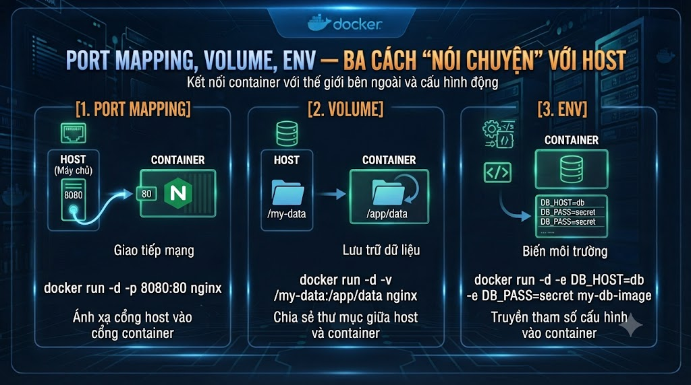
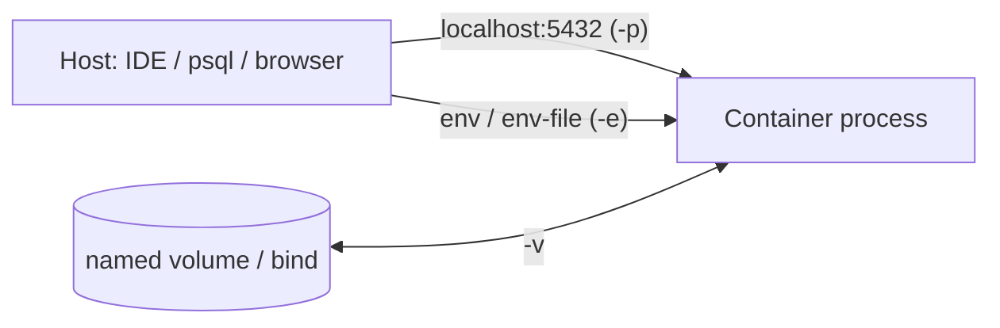

# Port mapping, volume, env — ba cách “nói chuyện” với host



Ở **bài 5** bạn đã điều khiển vòng đời: `run`, `logs`, `exec`, `stop`, `rm`. Postgres trong lab vẫn “kín” trong network container — máy host chưa kết nối được cổng, và `rm` là mất data trong writable layer. Bài này thêm ba cầu nối với host: **publish port (**`-p`**)**, **volume / bind mount (**`-v`**)**, **biến môi trường (**`-e`**)** — đủ để tool local (DBeaver, `psql`, app Spring trên host) nói chuyện với DB trong Docker và **giữ dữ liệu** giữa các lần recreate.

> Phạm vi: `-p` / `-e` / volume named & bind mount, quyền đọc-ghi cơ bản, anti-pattern. Chưa bridge DNS đa container (bài 7), chưa Compose (bài 16). Env file chi tiết hơn khi vào Compose (bài 20).

## Vì sao nên học?

Thiếu ba cầu nối này sẽ:

*   Chạy Postgres nhưng DBeaver/`psql` trên host không vào được → tưởng Docker hỏng.
    
*   Demo tạo bảng rồi `rm` container → data bay; mất niềm tin “Docker giữ state”.
    
*   Hardcode password trong lệnh history shell → lộ secret (mầm bài 14, 29).
    
*   Bind mount lung tung trên Windows path → permission/perf khổ từ đầu.
    

Đọc xong / làm xong bạn sẽ:

*   Publish `5432` (hoặc cổng host khác) có chủ đích.
    
*   Truyền env an toàn hơn một chút (`--env-file` local, không commit).
    
*   Dùng **named volume** cho data Postgres; biết bind mount dùng khi nào.
    
*   Recreate container mà data còn.
    

## Lab

Tiếp `postgres:16-alpine` như DB mà sau này `foxdev-api` / Compose sẽ dùng. Pattern port + volume + env lặp lại cho Redis, Kafka, và chính app Spring (publish `8080`).

## Ba cầu nối trong một hình




| Cầu | Cờ | Mang gì |
|---|---|---|
| Port | -p host:container | Traffic TCP/UDP |
| Env | -e / --env-file | Cấu hình lúc start |
| Volume | -v / --mount | File/data bền hoặc share code |


Nhắc bài 3: sửa file **chỉ** trong writable layer vẫn mất khi không có volume.

## Port mapping `-p`

Trong container, Postgres lắng nghe **5432**. Mặc định cổng đó **không** mở ra host.

```bash
# host:5432 → container:5432
docker run -d --name tj-pg \
  -e POSTGRES_PASSWORD=secret \
  -p 5432:5432 \
  postgres:16-alpine
```


| Cú pháp | Ý nghĩa |
|---|---|
| -p 5432:5432 | Cùng số trên host và container |
| -p 5433:5432 | Host 5433 → tránh lệch Postgres đang cài native trên máy |
| -p 127.0.0.1:5432:5432 | Chỉ localhost host — chặt hơn bind mọi interface |


Kiểm tra:

```bash
docker ps   # cột PORTS
psql -h 127.0.0.1 -p 5432 -U postgres   # nếu có client trên host
```

**Không** publish mọi cổng “cho chắc” trên máy shared — chỉ cổng cần debug/lab.

## Environment `-e` và `--env-file`

Postgres image đọc biến chuẩn (`POSTGRES_PASSWORD`, `POSTGRES_USER`, `POSTGRES_DB`, …):

```bash
docker run -d --name tj-pg \
  -e POSTGRES_USER=foxdev \
  -e POSTGRES_PASSWORD=secret \
  -e POSTGRES_DB=foxdev \
  -p 5432:5432 \
  postgres:16-alpine
```

Gọn hơn với file **local** (thêm vào `.gitignore`):

```bash
# lab.env — không commit
POSTGRES_USER=foxdev
POSTGRES_PASSWORD=secret
POSTGRES_DB=foxdev

docker run -d --name tj-pg \
  --env-file lab.env \
  -p 5432:5432 \
  postgres:16-alpine
```

Spring Boot sau này: `SPRING_DATASOURCE_URL`, `SPRING_DATASOURCE_PASSWORD`… cùng cơ chế — Compose sẽ centralize (bài 18, 20).

## Volume: named vs bind mount

### Named volume (khuyến nghị cho data DB)

Docker quản lý chỗ lưu; tách khỏi vòng đời container.

```bash
docker volume create tj-pg-data

docker run -d --name tj-pg \
  --env-file lab.env \
  -p 5432:5432 \
  -v tj-pg-data:/var/lib/postgresql/data \
  postgres:16-alpine
```

`docker rm tj-pg` → data trong `tj-pg-data` **còn**. Run lại container mới gắn cùng volume → bảng cũ còn.

```bash
docker volume ls
docker volume inspect tj-pg-data
```

### Bind mount (thư mục host)

```bash
docker run ... -v "$PWD/init:/docker-entrypoint-initdb.d:ro" ...
```

Hợp: script init SQL, mount mã nguồn khi hot-reload (dev).  
Không hợp làm “ổ cứng DB” trên Mac/Windows nếu chưa hiểu perf/permission — ưu tiên named volume cho Postgres data.


| Loại | Ưu | Nhược |
|---|---|---|
| Named volume | Đơn giản, ổn định cho DB | Khó xem file bằng Finder trừ khi biết chỗ Desktop |
| Bind mount | Sửa file trên host ngay | Path/WSL/macOS perf & quyền |


`--mount` tường minh hơn `-v` (cú pháp dài) — khi vào Compose sẽ gặp cả hai; lab này `-v` đủ.

## Thực hành khép: Postgres bền + nối từ host

```bash
docker volume create tj-pg-data

cat > lab.env <<'EOF'
POSTGRES_USER=foxdev
POSTGRES_PASSWORD=secret
POSTGRES_DB=foxdev
EOF

docker run -d --name tj-pg \
  --env-file lab.env \
  -p 5432:5432 \
  -v tj-pg-data:/var/lib/postgresql/data \
  postgres:16-alpine

docker logs -f tj-pg   # chờ ready, Ctrl+C

docker exec -it tj-pg \
  psql -U foxdev -d foxdev -c "CREATE TABLE smoke(id int); INSERT INTO smoke VALUES (1);"

docker stop tj-pg && docker rm tj-pg

docker run -d --name tj-pg \
  --env-file lab.env \
  -p 5432:5432 \
  -v tj-pg-data:/var/lib/postgresql/data \
  postgres:16-alpine

docker exec -it tj-pg \
  psql -U foxdev -d foxdev -c "SELECT * FROM smoke;"
# Kỳ vọng: còn dòng id=1
```

Dọn khi hết bài (cẩn thận — xóa volume = mất data lab):

```bash
docker rm -f tj-pg
# docker volume rm tj-pg-data   # chỉ khi muốn reset
rm -f lab.env   # hoặc giữ local gitignore
```

## Quyền, Mac/Windows và perf

*   **WSL2:** project + bind mount nên nằm trong home Linux; tránh `C:\Users\...` làm data dir Postgres.
    
*   **macOS Desktop:** named volume thường mượt hơn bind mount hàng trăm nghìn file; với Postgres data hãy dùng named volume.
    
*   User trong container (Postgres image chạy user riêng) vs file bind mount owned bởi UID host → lỗi permission khi bind sai chỗ — triệu chứng hay gặp bài sau khi mount config.
    

## Lỗi và thói quen hay gặp


| Sai | Hậu quả | Cách tránh |
|---|---|---|
| Quên -p | Host không nối được | Kiểm docker ps cột PORTS |
| -p 5432 khi host đã có Postgres | port is already allocated | Đổi 5433:5432 |
| Không volume cho DB | Mất data sau rm | Named volume |
| Commit lab.env có password | Lộ secret | .gitignore; bài 14/29 |
| Publish 0.0.0.0 trên máy cafe | Rủi ro lộ cổng | 127.0.0.1:port:port khi cần |
| Coi volume = backup | Xóa volume = mất | Backup pg_dump khi quan trọng |


## Bài tập

### 1\. Lab bền

Làm đủ chuỗi tạo volume → run → INSERT → rm container → run lại → SELECT còn data.

### 2\. Lệch cổng

Chạy với `-p 5433:5432`, nối host qua 5433; ghi lệnh bạn dùng vào notes.

### 3\. Notes — `notes/lesson-06.md`

1.  Named volume khác bind mount chỗ nào? Khi nào chọn cái nào cho Postgres?
    
2.  Writable layer (bài 3) khác volume chỗ nào?
    
3.  Vì sao không commit file chứa `POSTGRES_PASSWORD`?
    

## Checkpoint — hoàn thành bài này khi

*   Dùng `-p` và đọc được cột PORTS
    
*   Truyền env bằng `-e` hoặc `--env-file`
    
*   Tạo và gắn named volume cho Postgres data
    
*   Chứng minh data còn sau `rm` + `run` lại
    
*   Biết rủi ro bind mount trên Mac/Windows
    
*   Notes hoàn thành
    

## Làm gì ngay sau bài này

1.  Sang **bài 7**: network bridge và DNS tên container — nhiều container nói chuyện **không** qua `localhost` host.
    
2.  Giữ volume `tj-pg-data` nếu còn lab; xóa có chủ đích.
    
3.  Pattern port/env/volume sẽ xuất hiện y nguyên trong Compose (bài 16–18).
    

## Tóm tắt

*   `-p` mở cổng ra host; chọn cổng tránh xung đột.
    
*   `-e` / `--env-file` cấu hình lúc start — không commit secret.
    
*   Named volume giữ data DB qua vòng đời container; bind mount cho file host.
    
*   Ba cầu nối này + CLI bài 5 = đủ vận hành một DB container trước khi vào mạng đa container.
    

