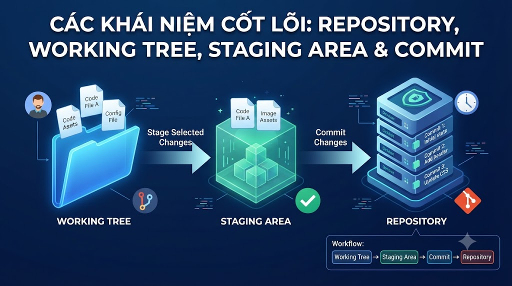

# Các Khái Niệm Cốt Lõi: Repository, Working Tree, Staging Area & Commit



Nhiều developer dùng Git hàng ngày nhưng chỉ biết 3 commands: `add`, `commit`, `push`. Khi gặp vấn đề — conflict, detached HEAD, mất commit — họ không biết xử lý vì không hiểu Git thực sự hoạt động như thế nào bên dưới. Bài này giải thích đúng cách Git lưu trữ và quản lý code, giúp bạn tự tin debug mọi tình huống.

## 1\. Ba Vùng Của Git

Đây là khái niệm quan trọng nhất của Git. Mọi thứ xoay quanh **3 vùng**:

```java
┌─────────────────────────────────────────────────────┐
│                   Local Machine                     │
│                                                     │
│  ┌──────────────┐  git add  ┌──────────────┐        │
│  │   Working    │ ────────► │   Staging    │        │
│  │   Directory  │ ◄──────── │   Area       │        │
│  │              │ git restore│  (Index)    │        │
│  │  Các file    │           │  Sắp commit  │        │
│  │  bạn đang    │           │              │        │
│  │  chỉnh sửa   │           └──────┬───────┘        │
│  └──────────────┘                  │ git commit     │
│                                    ▼                │
│                           ┌──────────────┐          │
│                           │  Repository  │          │
│                           │  (.git/)     │          │
│                           │  Lịch sử     │          │
│                           │  commits     │          │
│                           └──────────────┘          │
└─────────────────────────────────────────────────────┘
                                    │ git push
                                    ▼
                           ┌──────────────┐
                           │    Remote    │
                           │  (GitHub/    │
                           │   GitLab)    │
                           └──────────────┘
```

### Working Directory (Working Tree)

Là thư mục dự án của bạn — nơi bạn trực tiếp edit files. Git theo dõi sự khác biệt giữa trạng thái hiện tại và commit cuối cùng.

```bash
# Xem trạng thái Working Directory
git status

# Untracked files: file mới, Git chưa biết
# Modified files: file đã tracked, đã thay đổi
# Deleted files: file đã tracked, đã xóa
```

### Staging Area (Index)

Là vùng trung gian — "ảnh chụp" của những thay đổi bạn muốn đưa vào commit tiếp theo. Không phải tất cả thay đổi đều phải commit cùng lúc.

```bash
# Add file vào staging area
git add PaymentService.java      # 1 file cụ thể
git add src/payment/             # cả thư mục
git add *.java                   # theo pattern
git add .                        # tất cả thay đổi

# Xem những gì đang trong staging area
git diff --staged

# Remove khỏi staging area (giữ nguyên file)
git restore --staged PaymentService.java
```

### Repository (.git/)

Là database của Git — nơi lưu toàn bộ lịch sử. Khi chạy `git init`, Git tạo thư mục `.git/` ẩn trong project.

```bash
ls -la .git/
# branches/
# config          ← local git config
# description
# HEAD            ← con trỏ tới current branch
# hooks/          ← git hooks scripts
# index           ← staging area data
# info/
# objects/        ← tất cả data (blob, tree, commit, tag)
# refs/           ← branches, tags
```

## 2\. Git Objects — Cách Git Lưu Trữ Data

Git không lưu "diff" (sự khác biệt). Git lưu **snapshots** — ảnh chụp toàn bộ project tại mỗi commit. Thực ra, Git lưu 4 loại objects:

### Blob — Nội Dung File

```bash
# Mỗi file được lưu dưới dạng blob (binary large object)
# Hash = SHA-1 của nội dung file
git cat-file -t abc1234   # → blob
git cat-file -p abc1234   # → nội dung file
```

### Tree — Cấu Trúc Thư Mục

```bash
# Tree lưu danh sách blob + subtrees
git cat-file -p HEAD^{tree}
# 100644 blob f3a1b2c README.md
# 100644 blob d4e5f6a pom.xml
# 040000 tree a7b8c9d src
```

### Commit — Snapshot + Metadata

```bash
git cat-file -p HEAD
# tree a7b8c9d...           ← pointer đến tree
# parent f1e2d3c...         ← commit cha
# author Nam <nam@...> 1710000000 +0700
# committer Nam <nam@...> 1710000000 +0700
#
# feat: add payment module
```

### Tag — Đánh Dấu Version

```bash
# Annotated tag (khuyến nghị cho releases)
git tag -a v1.0.0 -m "Release version 1.0.0"
git cat-file -t v1.0.0   # → tag
git cat-file -p v1.0.0   # → tag metadata + commit pointer
```

## 3\. HEAD — Con Trỏ Đặc Biệt

**HEAD** là con trỏ trỏ đến **commit hiện tại** bạn đang làm việc. Thường HEAD trỏ đến một branch, branch trỏ đến commit mới nhất.

```java
Trạng thái bình thường:
  HEAD → main → commit C (latest)

         A ← B ← C  (main, HEAD)

Sau git commit:
  HEAD → main → commit D (new latest)

         A ← B ← C ← D  (main, HEAD)
```

**Detached HEAD** — xảy ra khi HEAD trỏ thẳng vào commit thay vì branch:

```bash
# Checkout một commit cụ thể → detached HEAD
git checkout abc1234
# HEAD is now at abc1234

# Trạng thái:
HEAD → abc1234 (không qua branch nào)

# ⚠️ Commit mới trong detached HEAD sẽ không được lưu vào branch nào
# → Có thể mất khi checkout branch khác

# Fix: tạo branch mới từ đây
git checkout -b hotfix/from-old-commit
# Hoặc quay về branch cũ
git checkout main
```

## 4\. Các Trạng Thái Của File

```java
File trong Git có 4 trạng thái:

Untracked    ─── git add ───►  Staged (new file)
                                    │
                                git commit
                                    │
                                    ▼
                               Unmodified ──── edit ────► Modified
                                    │                         │
                                    │                      git add
                                    │                         │
                               git rm                         ▼
                                    │                      Staged (modified)
                                    ▼                         │
                               Removed                   git commit
                                                              │
                                                              ▼
                                                         Unmodified
```

```bash
git status

# On branch main
# Changes to be committed:      ← Staged
#   new file:   NewFeature.java
#   modified:   PaymentService.java
#
# Changes not staged for commit: ← Modified (Working Directory)
#   modified:   UserService.java
#   deleted:    OldFile.java
#
# Untracked files:               ← Untracked
#   temp.txt
```

## 5\. Commit — Thực Hành Đúng Cách

### Anatomy của một Good Commit

```java
feat: add VNPay payment gateway integration
^────  ^────────────────────────────────────
type   description (imperative mood, lowercase, no period)

Body (optional):
Implement VNPay payment flow including:
- Payment URL generation
- IPN callback handling
- Transaction verification

Closes #123
```

**Conventional Commits format (industry standard):**

```java
type(scope): description

Types:
  feat:     New feature
  fix:      Bug fix
  docs:     Documentation only
  style:    Formatting, no logic change
  refactor: Code restructure, no feature/fix
  test:     Adding tests
  chore:    Build process, dependencies

Examples:
  feat(payment): add VNPay integration
  fix(auth): resolve JWT token expiration issue
  docs(api): update REST API documentation
  refactor(user): extract UserValidator class
  test(order): add unit tests for OrderService
  chore(deps): upgrade Spring Boot to 3.2.0
```

### Viết Commit Message Trong VSCode và IntelliJ

**VSCode:**

```bash
# Cách 1: Terminal
git commit -m "feat(payment): add VNPay integration"

# Cách 2: Source Control panel
# Gõ message vào ô "Message" → Ctrl+Enter để commit

# Cách 3: Commit với editor (multi-line message)
git commit
# → Mở VSCode editor để gõ message dài
```

**IntelliJ:**

```java
Commit dialog (Ctrl+K):
  → Ô lớn ở trên: commit message
  → Checkbox: files muốn stage
  → "Commit" button: commit
  → "Commit and Push": commit + push ngay

Tích hợp Conventional Commits:
  → Cài plugin "Git Commit Template"
  → Shift+Alt+H để mở template dialog
```

## 6\. Xem Lịch Sử Commit

```bash
# Xem log đơn giản
git log

# Compact (1 dòng mỗi commit)
git log --oneline
# abc1234 feat: add payment module
# def5678 fix: resolve login bug
# ghi9012 initial commit

# Với graph (visualize branches)
git log --oneline --graph --all
# * abc1234 (HEAD → feature/payment) feat: add payment
# | * def5678 (main) fix: resolve login bug
# |/
# * ghi9012 initial commit

# Xem N commits gần nhất
git log -5

# Xem commits của 1 file
git log -- src/payment/PaymentService.java

# Xem commits theo author
git log --author="Nam"

# Xem commits theo message
git log --grep="payment"

# Xem commits theo khoảng thời gian
git log --since="2025-01-01" --until="2025-03-31"

# Xem thay đổi trong từng commit
git log -p
git log -p -3   # chỉ 3 commits gần nhất
```

## 7\. git diff — So Sánh Thay Đổi

```bash
# Diff Working Directory vs Staging Area (chưa stage)
git diff

# Diff Staging Area vs Last Commit (đã stage, chưa commit)
git diff --staged

# Diff Working Directory vs Last Commit
git diff HEAD

# Diff giữa 2 commits
git diff abc1234 def5678

# Diff giữa 2 branches
git diff main feature/payment

# Diff chỉ xem file names (không xem nội dung)
git diff --name-only
git diff --name-status
# M  src/PaymentService.java     ← Modified
# A  src/VNPayGateway.java       ← Added
# D  src/OldPayment.java         ← Deleted
```

**Xem diff trong VSCode:**

```java
Source Control panel → click vào file → mở diff view
Timeline view (View → Open View → Timeline) → xem history của 1 file
```

**Xem diff trong IntelliJ:**

```java
Commit panel → click file → mở diff viewer tự động
Git Log → chọn commit → xem changed files bên phải
```

## 8\. .gitignore — Bỏ Qua Files Không Cần Track

```bash
# .gitignore — đặt ở root của project

# IDE files
.idea/
.vscode/
*.iml

# Build output
target/
build/
dist/
*.class
*.jar
*.war

# Environment & secrets
.env
.env.local
application-prod.properties
*.key

# OS files
.DS_Store       # macOS
Thumbs.db       # Windows

# Logs
*.log
logs/

# Dependencies
node_modules/
vendor/

# Coverage reports
coverage/
.nyc_output/
```

**Syntax của .gitignore:**

```bash
# Comment
*.log           # ignore tất cả .log files
!important.log  # nhưng không ignore file này
/TODO           # ignore TODO ở root, không phải subdir
build/          # ignore thư mục build
doc/*.txt       # ignore *.txt trong doc/, không phải subdirs
doc/**/*.txt    # ignore *.txt trong doc/ và mọi subdirs
```

**GitHub gitignore templates:**

```bash
# Tạo .gitignore tự động cho Java/Spring Boot:
# https://gitignore.io → chọn: java, maven, intellij, vscode
# → Download → paste vào .gitignore
```

**Đã commit file mà bây giờ muốn ignore:**

```bash
# File đã được track, thêm vào .gitignore nhưng vẫn bị track
git rm --cached application.properties
# → Remove khỏi Git tracking, giữ file trên disk
# → Thêm vào .gitignore
# → Commit lại
```

## 9\. Thực Hành Tổng Hợp

```bash
# Chuẩn bị: clone project foxdev
git clone https://github.com/tayjava/backend.git
cd backend

# Tạo vài files để thực hành
mkdir -p src/main/java/com/foxdev/payment
cat > src/main/java/com/foxdev/payment/PaymentService.java << 'EOF'
package com.foxdev.payment;

public class PaymentService {
    public boolean processPayment(String orderId, double amount) {
        // TODO: implement
        return false;
    }
}
EOF

# Xem trạng thái
git status
# Untracked files: src/main/java/com/foxdev/payment/PaymentService.java

# Stage file mới
git add src/main/java/com/foxdev/payment/PaymentService.java

# Xem staging area
git diff --staged

# Commit
git commit -m "feat(payment): add PaymentService skeleton"

# Chỉnh sửa file
# ... edit PaymentService.java ...

# Xem thay đổi chưa stage
git diff

# Stage và commit theo từng phần (patch mode)
git add -p PaymentService.java
# → Interactive: chọn hunk nào muốn stage
# y=yes, n=no, s=split, e=edit

# Xem lịch sử
git log --oneline
```

## Tổng Kết

```java
3 vùng của Git:
  Working Directory  →  Staging Area  →  Repository
  (git add)              (git commit)

4 loại objects:
  blob (file content) → tree (directory) → commit → tag

4 trạng thái file:
  Untracked → Staged → Unmodified → Modified

HEAD:
  Con trỏ đến commit/branch hiện tại
  Detached HEAD = HEAD trỏ thẳng vào commit
```


| Command | Tác dụng |
|---|---|
| git status | Xem trạng thái Working Directory và Staging Area |
| git add <file> | Stage thay đổi |
| git diff | Xem thay đổi chưa stage |
| git diff --staged | Xem thay đổi đã stage |
| git commit -m "msg" | Tạo commit mới |
| git log --oneline | Xem lịch sử commits |


Bài tiếp theo chúng ta sẽ học **Remote Repository** — kết nối với GitHub/GitLab, push/pull, clone và cách setup SSH key để không cần nhập password mỗi lần.

