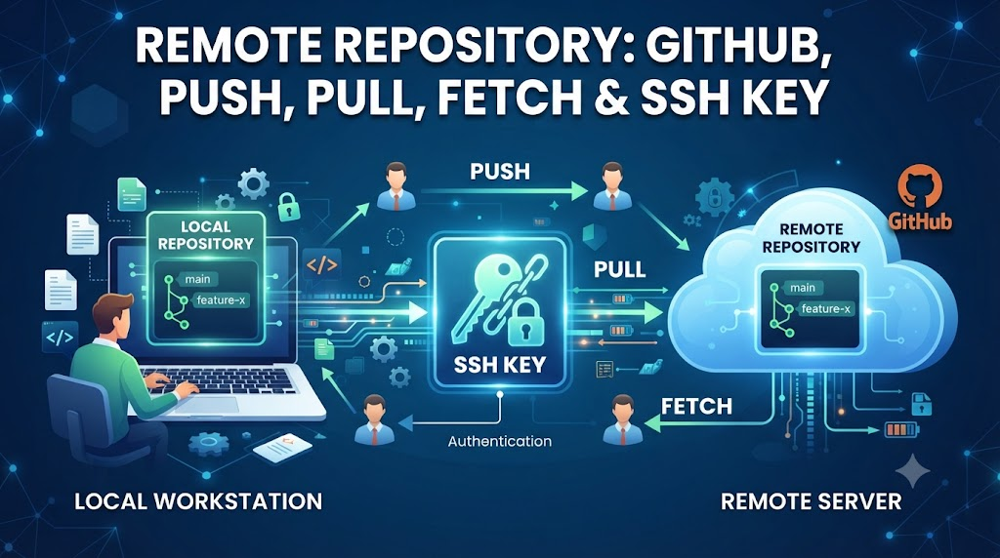

# Remote Repository: GitHub, Push, Pull, Fetch & SSH Key



Code trên máy local là chưa đủ — bạn cần đẩy code lên **remote repository** để team cùng làm việc, để backup, và để CI/CD chạy tự động. Bài này hướng dẫn kết nối với GitHub/GitLab, setup SSH key để không cần nhập password mỗi lần, và hiểu rõ sự khác biệt giữa `fetch`, `pull` và `push`.

## 1\. Remote Repository Là Gì?

```java
Local Repository              Remote Repository
(máy bạn)                     (GitHub / GitLab / Bitbucket)

┌─────────────────┐           ┌─────────────────────────┐
│  .git/          │  push ──► │  github.com/tayjava/    │
│  Working Dir    │ ◄── pull  │  backend.git            │
│  Staging Area   │           │                         │
└─────────────────┘           │  Tất cả team có thể     │
                              │  push/pull vào đây      │
                              └─────────────────────────┘
```

**Remote** = URL trỏ đến repository trên server:

```java
HTTPS: https://github.com/tayjava/backend.git
SSH:   git@github.com:tayjava/backend.git
```

## 2\. HTTPS vs SSH — Chọn Cái Nào?


|  | HTTPS | SSH |
|---|---|---|
| Setup | Không cần setup | Cần tạo SSH key |
| Authentication | Username + password / token | SSH key pair |
| Nhập credentials | Mỗi lần push (hoặc dùng credential store) | Không bao giờ sau khi setup |
| Firewall | Thường pass qua | Có thể bị block (port 22) |
| Khuyến nghị | Nhanh để test | Production, daily work |


**Kết luận:** Setup SSH một lần, dùng mãi mãi — tiết kiệm thời gian về lâu dài.

## 3\. Setup SSH Key

### Bước 1: Tạo SSH Key Pair

```bash
# Tạo SSH key mới (Ed25519 — thuật toán hiện đại, an toàn hơn RSA)
ssh-keygen -t ed25519 -C "nam@nguyentienkhoi.hashnode.dev"

# Prompt:
# Enter file in which to save the key: /home/nam/.ssh/id_ed25519  ← Enter để dùng default
# Enter passphrase: ← có thể để trống hoặc đặt passphrase
# Enter same passphrase again:

# Kết quả:
ls ~/.ssh/
# id_ed25519      ← private key (KHÔNG BAO GIỜ share)
# id_ed25519.pub  ← public key (copy lên GitHub/GitLab)
```

**Nhiều SSH keys cho nhiều accounts:**

```bash
# Tạo key riêng cho work account
ssh-keygen -t ed25519 -C "nam@company.com" -f ~/.ssh/id_ed25519_work

# Cấu hình ~/.ssh/config để Git biết dùng key nào
cat > ~/.ssh/config << 'EOF'
# Personal GitHub
Host github.com
    HostName github.com
    User git
    IdentityFile ~/.ssh/id_ed25519

# Work GitHub
Host github-work
    HostName github.com
    User git
    IdentityFile ~/.ssh/id_ed25519_work

# GitLab
Host gitlab.com
    HostName gitlab.com
    User git
    IdentityFile ~/.ssh/id_ed25519
EOF
```

### Bước 2: Thêm Public Key Lên GitHub

```bash
# Copy public key ra clipboard
# macOS:
cat ~/.ssh/id_ed25519.pub | pbcopy

# Linux:
cat ~/.ssh/id_ed25519.pub | xclip -selection clipboard
# Hoặc:
cat ~/.ssh/id_ed25519.pub

# Windows (Git Bash):
cat ~/.ssh/id_ed25519.pub | clip
```

**Trên GitHub:**

```java
1. Settings → SSH and GPG keys → New SSH key
2. Title: "MacBook Pro 2024" (tên máy tính)
3. Key type: Authentication Key
4. Key: paste public key vào đây
5. Add SSH key
```

**Trên GitLab:**

```java
1. Profile → Preferences → SSH Keys → Add new key
2. Key: paste public key
3. Title: tên máy
4. Expiration date: để trống (hoặc đặt ngày hết hạn)
5. Add key
```

### Bước 3: Test SSH Connection

```bash
ssh -T git@github.com
# Hi foxdev! You've successfully authenticated,
# but GitHub does not provide shell access.

ssh -T git@gitlab.com
# Welcome to GitLab, @foxdev!
```

### Bước 4: Thêm SSH Key Vào ssh-agent

```bash
# macOS / Linux: start ssh-agent
eval "$(ssh-agent -s)"

# Thêm key
ssh-add ~/.ssh/id_ed25519

# macOS: lưu vào Keychain (không cần nhập passphrase lại sau restart)
ssh-add --apple-use-keychain ~/.ssh/id_ed25519

# Xem keys đang được load
ssh-add -l
```

## 4\. Tạo Repository Trên GitHub/GitLab

### GitHub

```java
1. github.com → New repository (Ctrl+N hoặc click "+" → New repository)
2. Repository name: foxdev-backend
3. Description: Backend API cho nguyentienkhoi.hashnode.dev
4. Visibility: Public hoặc Private
5. KHÔNG check "Add a README" (vì đã có local repo)
6. Create repository
```

### GitLab

```java
1. gitlab.com → New project → Create blank project
2. Project name: foxdev-backend
3. Visibility: Private
4. KHÔNG check "Initialize repository with a README"
5. Create project
```

## 5\. Kết Nối Local với Remote

```bash
# Sau khi tạo repo trên GitHub, họ sẽ hiển thị:
# "…or push an existing repository from the command line"

# Thêm remote (SSH)
git remote add origin git@github.com:tayjava/tayjava-backend.git

# Kiểm tra remote đã được thêm
git remote -v
# origin  git@github.com:tayjava/tayjava-backend.git (fetch)
# origin  git@github.com:tayjava/tayjava-backend.git (push)

# "origin" là tên mặc định cho remote chính — có thể đổi tên
git remote rename origin main-remote
git remote rename main-remote origin  # đổi lại

# Xem chi tiết remote
git remote show origin
# * remote origin
#   Fetch URL: git@github.com:tayjava/tayjava-backend.git
#   Push  URL: git@github.com:tayjava/tayjava-backend.git
#   HEAD branch: main
#   Remote branches:
#     main tracked
#   Local branch configured for 'git pull':
#     main merges with remote main

# Xóa remote
git remote remove origin

# Đổi URL remote (ví dụ từ HTTPS sang SSH)
git remote set-url origin git@github.com:tayjava/tayjava-backend.git
```

## 6\. git push — Đẩy Code Lên Remote

```bash
# Push lần đầu — set upstream
git push -u origin main
# Enumerating objects: 5, done.
# Writing objects: 100% (5/5), 1.23 KiB | 1.23 MiB/s, done.
# Branch 'main' set up to track remote branch 'main' from 'origin'.

# -u / --set-upstream: liên kết local branch với remote branch
# Sau khi set upstream, chỉ cần gõ:
git push   # tự biết push lên origin main

# Push branch khác
git push origin feature/payment

# Push và set upstream cùng lúc
git push -u origin feature/payment

# Force push (cẩn thận!)
git push --force
git push --force-with-lease  # an toàn hơn — fail nếu remote có commits mới

# Push tất cả branches
git push --all origin

# Push tags
git push origin v1.0.0        # push 1 tag
git push origin --tags        # push tất cả tags
```

**⚠️ Khi nào dùng force push:**

```java
Chỉ force push khi:
  → Branch là personal branch (chưa ai pull về)
  → Sau khi amend commit chưa ai dùng
  → Sau khi rebase interactive

KHÔNG force push:
  → main branch
  → Branch đang có người khác đang làm việc
  → Protected branches (cần cấu hình trên GitHub/GitLab)
```

## 7\. git fetch vs git pull — Sự Khác Biệt Quan Trọng

```java
Remote: A ← B ← C ← D  (origin/main)
Local:  A ← B           (main, HEAD)

git fetch origin:
  → Tải commits D, C về local
  → origin/main di chuyển đến D
  → Local main VẪN ở B
  → KHÔNG thay đổi working directory

After fetch:
  origin/main: A ← B ← C ← D
  local main:  A ← B  (chưa thay đổi)

git merge origin/main:
  → Merge commits vào local main
  → Local main di chuyển đến D

git pull = git fetch + git merge
  → Tải về VÀ merge ngay
```

```bash
# ─── git fetch ───

# Fetch tất cả từ origin
git fetch origin

# Fetch branch cụ thể
git fetch origin main

# Fetch tất cả remotes
git fetch --all

# Xem sự khác biệt sau fetch
git log HEAD..origin/main --oneline
# → những commits có trên remote nhưng chưa có local

git diff HEAD origin/main
# → xem thay đổi trước khi merge

# Merge sau khi review
git merge origin/main

# ─── git pull ───

# Pull = fetch + merge
git pull origin main

# Hoặc nếu đã set upstream:
git pull

# Pull với rebase thay vì merge (giữ history sạch hơn)
git pull --rebase origin main

# Config mặc định dùng rebase
git config --global pull.rebase true
```

**Khi nào dùng fetch vs pull:**

```java
git fetch: khi muốn xem changes trước khi merge
           khi không muốn tự động merge
           best practice trong môi trường team

git pull: khi biết chắc remote không có conflict
          khi muốn nhanh
```

## 8\. git clone — Lấy Repository Về

```bash
# Clone qua SSH (khuyến nghị)
git clone git@github.com:tayjava/tayjava-backend.git

# Clone qua HTTPS
git clone https://github.com/tayjava/tayjava-backend.git

# Clone vào thư mục tên khác
git clone git@github.com:tayjava/tayjava-backend.git my-project

# Clone chỉ 1 branch
git clone --single-branch --branch main git@github.com:...

# Shallow clone — chỉ lấy N commits gần nhất (nhanh hơn)
git clone --depth 1 git@github.com:tayjava/tayjava-backend.git
# Hữu ích khi repo lớn, chỉ cần build/deploy

# Sau khi clone:
cd foxdev-backend
git remote -v
# origin  git@github.com:tayjava/tayjava-backend.git (fetch)
# origin  git@github.com:tayjava/tayjava-backend.git (push)
```

## 9\. Tracking Branches — Local vs Remote

```bash
# Local branches: main, feature/payment
# Remote branches: origin/main, origin/feature/payment

# Xem tất cả branches (local + remote)
git branch -a
# * main                          ← local, current
#   feature/payment               ← local
#   remotes/origin/main           ← remote
#   remotes/origin/feature/payment ← remote

# Xem remote branches
git branch -r
# origin/main
# origin/feature/payment

# Checkout remote branch → tự tạo local tracking branch
git checkout feature/payment
# Switched to a new branch 'feature/payment'
# Branch 'feature/payment' set up to track remote branch

# Xem tracking info
git branch -vv
# * main           abc1234 [origin/main] feat: add UserService
#   feature/payment def5678 [origin/feature/payment: ahead 2] feat: payment

# "ahead 2" = local có 2 commits chưa push
# "behind 3" = remote có 3 commits chưa pull

# Xóa remote branch
git push origin --delete old-feature-branch

# Cleanup stale remote tracking branches (remote đã xóa nhưng local vẫn còn ref)
git fetch --prune
git remote prune origin
```

## 10\. Personal Access Token — Thay Thế Password (HTTPS)

GitHub không còn cho phép dùng password để push qua HTTPS từ 2021. Cần dùng **Personal Access Token (PAT)**:

```java
GitHub:
1. Settings → Developer settings → Personal access tokens → Tokens (classic)
2. Generate new token
3. Note: "foxdev-laptop"
4. Expiration: 90 days
5. Scopes: check "repo" (full control of private repos)
6. Generate token → copy ngay (chỉ hiện 1 lần)

GitLab:
1. Profile → Preferences → Access Tokens
2. Token name: "foxdev-laptop"
3. Scopes: api, read_repository, write_repository
4. Create personal access token → copy
```

**Lưu credentials để không nhập lại:**

```bash
# macOS: dùng Keychain
git config --global credential.helper osxkeychain

# Windows: dùng Windows Credential Manager
git config --global credential.helper manager-core

# Linux: cache trong memory (15 phút)
git config --global credential.helper cache
git config --global credential.helper 'cache --timeout=3600'

# Linux: lưu vào file (không encrypt — ít an toàn hơn)
git config --global credential.helper store
```

## 11\. Làm Việc Với Nhiều Remotes

```bash
# Thêm remote thứ 2 (ví dụ: fork hoặc mirror)
git remote add upstream git@github.com:original-org/tayjava-backend.git

# Xem tất cả remotes
git remote -v
# origin    git@github.com:tayjava/tayjava-backend.git (fetch)
# origin    git@github.com:tayjava/tayjava-backend.git (push)
# upstream  git@github.com:original-org/tayjava-backend.git (fetch)
# upstream  git@github.com:original-org/tayjava-backend.git (push)

# Pull từ upstream (giữ fork sync với original)
git fetch upstream
git merge upstream/main

# Push lên origin (fork)
git push origin main
```

## 12\. VSCode và IntelliJ Remote Operations

**VSCode:**

```java
Source Control panel:
  → Click "..." (More Actions) → Pull, Push, Fetch
  → Hoặc click nút "Sync Changes" (↕) ở status bar

Status bar phía dưới:
  → "↑3 ↓2" = 3 commits chưa push, 2 commits chưa pull
  → Click để sync

Extensions → GitHub Pull Requests:
  → Tạo và review PR ngay trong VSCode
  → Clone repos từ GitHub
```

**IntelliJ:**

```java
VCS → Git → Push (Ctrl+Shift+K)
  → Xem commits sẽ push trước
  → Chọn branch để push

VCS → Git → Pull
  → Chọn remote, branch, merge strategy

VCS → Git → Fetch

Git toolbar (View → Toolbar):
  → Quick buttons cho push/pull/fetch
  → Hiển thị "↑3 ↓2" tương tự VSCode
```

## 13\. Thực Hành Tổng Hợp

```bash
# ─── Setup hoàn chỉnh từ đầu ───

# 1. Tạo repo local
mkdir foxdev-api && cd foxdev-api
git init

# 2. Tạo files
echo "# FoxDev API" > README.md
echo "*.class\ntarget/\n.idea/" > .gitignore
git add .
git commit -m "chore: initial project setup"

# 3. Tạo repo trên GitHub (qua web UI) → copy SSH URL

# 4. Kết nối và push
git remote add origin git@github.com:yourname/tayjava-api.git
git push -u origin main

# ─── Daily workflow ───

# 5. Sáng: lấy code mới nhất
git fetch origin
git log HEAD..origin/main --oneline  # xem có gì mới
git pull  # merge về local

# 6. Code, commit
git add .
git commit -m "feat: add CourseController"

# 7. Trước khi push: lấy code mới nhất 1 lần nữa
git pull --rebase
# → Rebase commits của mình lên trên commits mới

# 8. Push
git push

# ─── Kiểm tra sync status ───
git status
# Your branch is ahead of 'origin/main' by 1 commit.
# → Cần push

git status
# Your branch is up to date with 'origin/main'.
# → Đã sync
```

## Tổng Kết

```java
Remote Repository flow:
  git remote add origin <URL>    → kết nối lần đầu
  git push -u origin main        → push + set upstream
  git fetch                      → tải về KHÔNG merge
  git pull                       → fetch + merge
  git clone                      → clone repo về
```


| Command | Tác dụng |
|---|---|
| git remote add origin <url> | Kết nối với remote |
| git remote -v | Xem danh sách remotes |
| git push -u origin main | Push + set upstream |
| git push | Push lên remote đã set |
| git fetch | Tải về, không merge |
| git pull | Tải về + merge |
| git clone <url> | Clone repo về máy |
| git branch -vv | Xem tracking status |


**SSH vs HTTPS:**

```java
SSH:   setup một lần, dùng mãi → khuyến nghị
HTTPS: nhanh để test, cần token từ 2021
```

Bài tiếp theo chúng ta sẽ học **Branch** — tạo, chuyển, merge và xóa branch, cùng với `git log --graph` để visualize branch tree.

