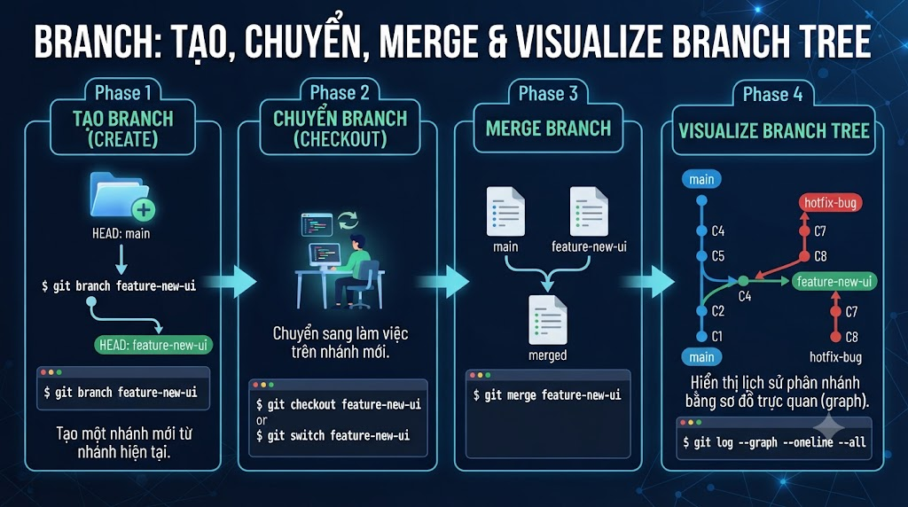

# Branch: Tạo, Chuyển, Merge & Visualize Branch Tree



Branch là tính năng mạnh nhất của Git và là lý do Git thắng mọi VCS khác. Trong SVN, tạo branch là thao tác nặng — copy toàn bộ thư mục. Trong Git, tạo branch chỉ là tạo một **con trỏ mới** trỏ vào commit — tốn 41 bytes, xong trong milliseconds. Hiểu branch đúng cách sẽ thay đổi hoàn toàn cách bạn làm việc với code.

## 1\. Branch Là Gì?

**Branch** = một con trỏ nhẹ trỏ đến một commit cụ thể.

```java
Không có branch:
  A ← B ← C ← D  (tất cả commits trên 1 line)

Với branches:
  A ← B ← C ← D  (main)
               ↑
               └── E ← F  (feature/payment)

Branch "main" = con trỏ trỏ vào D
Branch "feature/payment" = con trỏ trỏ vào F
HEAD = con trỏ trỏ vào branch hiện tại
```

**Tại sao branch quan trọng:**

```java
✅ Phát triển feature mới mà không ảnh hưởng main
✅ Nhiều developer làm việc song song
✅ Thử nghiệm rủi ro, xóa branch nếu không dùng
✅ Hotfix production trong khi vẫn phát triển feature mới
✅ Code review qua Pull Request trước khi merge vào main
```

## 2\. Tạo và Chuyển Branch

```bash
# ─── Tạo branch ───

# Tạo branch (vẫn đứng ở branch hiện tại)
git branch feature/payment

# Tạo và chuyển sang branch mới (cách phổ biến nhất)
git checkout -b feature/payment

# Cú pháp mới hơn (Git 2.23+)
git switch -c feature/payment

# Tạo branch từ branch khác
git checkout -b hotfix/login origin/main
git switch -c hotfix/login main

# Tạo branch từ một commit cụ thể
git checkout -b debug/old-version abc1234

# ─── Chuyển branch ───

# Cách cũ (vẫn hoạt động)
git checkout main
git checkout feature/payment

# Cách mới (Git 2.23+, rõ ràng hơn)
git switch main
git switch feature/payment

# Quay lại branch trước đó (như cd -)
git switch -
git checkout -

# ─── Xem branches ───

# Xem local branches
git branch
# * feature/payment   ← current branch (có dấu *)
#   main
#   hotfix/login

# Xem tất cả (local + remote)
git branch -a

# Xem với thông tin commit
git branch -v
# * feature/payment   a1b2c3d feat: add payment gateway
#   main              e4f5g6h chore: initial setup

# Xem tracking status
git branch -vv
# * feature/payment   a1b2c3d [origin/feature/payment: ahead 2]
#   main              e4f5g6h [origin/main]
```

## 3\. Đặt Tên Branch — Convention

```java
Format: type/description

Types phổ biến:
  feature/  → tính năng mới
  fix/      → bug fix
  hotfix/   → urgent fix trên production
  release/  → chuẩn bị release
  chore/    → maintenance, deps, config
  docs/     → chỉ documentation
  refactor/ → refactoring, không thêm feature

Examples:
  feature/payment-vnpay
  feature/user-authentication
  fix/login-null-pointer
  hotfix/payment-timeout-prod
  release/v1.2.0
  chore/upgrade-spring-boot-3.2
  refactor/user-service-clean-code
  docs/api-documentation

Rules:
  → lowercase, dùng dấu gạch ngang (-)
  → ngắn gọn nhưng đủ nghĩa
  → không dùng space hay ký tự đặc biệt
  → thêm ticket number nếu có: feature/TJ-123-payment-vnpay
```

## 4\. Làm Việc Trên Branch

```bash
# Kịch bản: thêm tính năng payment

# 1. Tạo branch từ main
git switch main
git pull   # lấy code mới nhất
git switch -c feature/payment-vnpay

# 2. Code trên branch
cat > src/main/java/com/foxdev/payment/PaymentService.java << 'EOF'
package com.foxdev.payment;

import org.springframework.stereotype.Service;

@Service
public class PaymentService {

    public String createPaymentUrl(String orderId, double amount) {
        // VNPay integration
        return "https://sandbox.vnpayment.vn/pay?order=" + orderId;
    }

    public boolean verifyPayment(String transactionId) {
        // Verify signature from VNPay
        return true;
    }
}
EOF

git add .
git commit -m "feat(payment): add PaymentService with VNPay"

# 3. Thêm controller
cat > src/main/java/com/foxdev/payment/PaymentController.java << 'EOF'
package com.foxdev.payment;

import org.springframework.web.bind.annotation.*;
import org.springframework.beans.factory.annotation.Autowired;

@RestController
@RequestMapping("/api/payment")
public class PaymentController {

    @Autowired
    private PaymentService paymentService;

    @PostMapping("/create")
    public String createPayment(@RequestParam String orderId,
                                @RequestParam double amount) {
        return paymentService.createPaymentUrl(orderId, amount);
    }
}
EOF

git add .
git commit -m "feat(payment): add PaymentController REST endpoints"

# 4. Xem lịch sử branch hiện tại
git log --oneline
# b2c3d4e feat(payment): add PaymentController REST endpoints
# a1b2c3d feat(payment): add PaymentService with VNPay
# e4f5g6h chore: initial project setup

# 5. Push branch lên remote
git push -u origin feature/payment-vnpay
```

## 5\. Merge — Gộp Branch

### Fast-forward Merge

Xảy ra khi branch được merge không có "divergence" — main không có commit mới kể từ khi tách branch.

```java
Trước merge:
  main: A ← B ← C
                 ↑
                 └── D ← E  (feature/payment)

git switch main
git merge feature/payment

Sau merge (fast-forward):
  main: A ← B ← C ← D ← E
                           ↑
                    (main, feature/payment)

→ Không tạo merge commit
→ Lịch sử tuyến tính, sạch sẽ
```

```bash
# Thực hành fast-forward merge
git switch main

# Xem commits sẽ được merge
git log main..feature/payment-vnpay --oneline
# b2c3d4e feat(payment): add PaymentController
# a1b2c3d feat(payment): add PaymentService

# Merge
git merge feature/payment-vnpay
# Updating e4f5g6h..b2c3d4e
# Fast-forward
#  src/main/java/com/foxdev/payment/PaymentController.java | 20 +++
#  src/main/java/com/foxdev/payment/PaymentService.java    | 15 +++
#  2 files changed, 35 insertions(+)
```

### 3-way Merge (Merge Commit)

Xảy ra khi cả 2 branches đều có commits mới — Git cần tạo một "merge commit" để kết hợp.

```java
Trước merge:
  main:    A ← B ← C ← F  (main có commit F mới)
                    ↑
                    └── D ← E  (feature)

git merge feature

Sau merge:
  main:    A ← B ← C ← F ← G  (G là merge commit)
                    ↑       ↑
                    └── D ← E
                    
→ Tạo merge commit G với 2 parents: F và E
→ Lịch sử rõ ràng: biết chính xác feature được merge khi nào
```

```bash
# Merge với message tùy chỉnh
git merge feature/payment-vnpay -m "Merge feature/payment-vnpay into main"

# Merge nhưng không fast-forward (luôn tạo merge commit)
git merge --no-ff feature/payment-vnpay
# → Tạo merge commit dù có thể fast-forward
# → Giữ nguyên thông tin "feature này được merge vào khi nào"
# → Nhiều team dùng --no-ff để giữ lịch sử rõ ràng

# Merge chỉ xem preview, không thực sự merge
git merge --no-commit --no-ff feature/payment-vnpay
# → Stage changes, nhưng chưa commit
# → Xem xong: git merge --abort để cancel
# → Hoặc: git commit để hoàn thành
```

### Squash Merge — Gộp Nhiều Commits Thành 1

```bash
# Thay vì merge tất cả commits của feature branch
# Gộp tất cả thành 1 commit duy nhất
git merge --squash feature/payment-vnpay
git commit -m "feat(payment): add VNPay payment integration"

# Kết quả: main chỉ có 1 commit mới, không phải N commits
# → History sạch hơn
# → Nhưng mất thông tin chi tiết của từng commit trên feature branch
```

## 6\. Xóa Branch

```bash
# Xóa local branch (đã merge)
git branch -d feature/payment-vnpay
# Deleted branch feature/payment-vnpay (was b2c3d4e).

# Xóa local branch (chưa merge — force delete)
git branch -D feature/experiment
# ⚠️ Cẩn thận: commits chưa merge có thể bị mất

# Xóa remote branch
git push origin --delete feature/payment-vnpay
# To github.com:tayjava/tayjava-backend.git
#  - [deleted]         feature/payment-vnpay

# Shorthand xóa remote branch
git push origin :feature/payment-vnpay

# Cleanup local refs đến remote branches đã bị xóa
git fetch --prune
git remote prune origin
```

## 7\. Visualize Branch Tree

### CLI

```bash
# Graph đơn giản
git log --oneline --graph --all
# * b2c3d4e (HEAD → main) Merge feature/payment-vnpay
# |\
# | * a1b2c3d (feature/payment-vnpay) feat: add PaymentController
# | * e4f5g6h feat: add PaymentService
# |/
# * f1e2d3c chore: initial setup

# Graph chi tiết hơn
git log --oneline --graph --all --decorate
# → thêm tag, remote branch refs

# Alias hữu ích (thêm vào ~/.gitconfig)
git config --global alias.lg "log --oneline --graph --all --decorate"
git lg  # gọi tắt
```

### VSCode — Git Graph Extension

```java
1. Cài extension "Git Graph"
2. Source Control panel → "View Git Graph" button (trên cùng)
3. Hoặc: Ctrl+Shift+P → "Git Graph: View Git Graph"

Features:
→ Visual branch tree với màu sắc
→ Click commit → xem changed files
→ Right-click branch → checkout, merge, delete, rebase
→ Right-click commit → cherry-pick, revert, create branch
→ Drag & drop để rebase (advanced)
```

### IntelliJ — Git Log

```java
View → Tool Windows → Git (Alt+9) → Log tab

Features:
→ Visual branch graph ở bên trái
→ Filter theo branch, author, date, message
→ Click commit → xem files thay đổi bên phải
→ Double-click file → xem diff
→ Right-click branch → checkout, merge, rebase
→ Nút "+" để tạo branch từ commit
```

## 8\. Kịch Bản Thực Tế — Hotfix Trong Khi Đang Làm Feature

```java
Tình huống:
- Đang làm feature/new-checkout (chưa xong)
- Phát hiện bug critical trên production: login timeout
- Cần fix gấp trên main

main:          A ← B ← C
                        ↑
feature:                └── D ← E  (đang làm dở)
```

```bash
# 1. Đang làm dở feature, chưa muốn commit
# Stash lại (bài 8 sẽ học kỹ hơn)
git stash
# Saved working directory and index state "WIP on feature/new-checkout"

# 2. Về main, tạo hotfix branch
git switch main
git pull   # lấy production code mới nhất
git switch -c hotfix/login-timeout

# 3. Fix bug
# ... sửa LoginService.java ...
git add .
git commit -m "fix(auth): resolve login session timeout issue"

# 4. Merge hotfix vào main
git switch main
git merge --no-ff hotfix/login-timeout
# Merge commit được tạo

# 5. Push lên main (deploy production)
git push origin main

# 6. Xóa hotfix branch
git branch -d hotfix/login-timeout

# 7. Merge hotfix vào feature branch (để feature không bị outdated)
git switch feature/new-checkout
git merge main
# Hoặc rebase (sẽ học ở bài 6)

# 8. Lấy lại work dở dang
git stash pop

# Kết quả:
# main:    A ← B ← C ← F (hotfix) ← G (merge)
#                   ↑
# feature:          └── D ← E ← H (merge from main)
```

## 9\. Thực Hành Tổng Hợp

```bash
# Kịch bản: team 2 người cùng làm trên 1 project

# Developer 1: làm feature user authentication
git switch -c feature/user-auth
cat > src/main/java/com/foxdev/auth/AuthService.java << 'EOF'
package com.foxdev.auth;
public class AuthService {
    public String login(String email, String password) {
        return "jwt-token-here";
    }
}
EOF
git add . && git commit -m "feat(auth): add AuthService with login"

cat > src/main/java/com/foxdev/auth/AuthController.java << 'EOF'
package com.foxdev.auth;
import org.springframework.web.bind.annotation.*;

@RestController
@RequestMapping("/api/auth")
public class AuthController {
    @PostMapping("/login")
    public String login(@RequestParam String email,
                        @RequestParam String password) {
        return "token";
    }
}
EOF
git add . && git commit -m "feat(auth): add AuthController login endpoint"

# Xem lịch sử
git log --oneline --graph --all
# * b2c3d4e (HEAD → feature/user-auth) feat(auth): add AuthController
# * a1b2c3d feat(auth): add AuthService
# * e4f5g6h (main) chore: initial setup

# Merge vào main
git switch main
git merge --no-ff feature/user-auth -m "Merge feature/user-auth: add user authentication"
git branch -d feature/user-auth

# Xem kết quả
git log --oneline --graph
# *   c3d4e5f (HEAD → main) Merge feature/user-auth
# |\
# | * b2c3d4e feat(auth): add AuthController
# | * a1b2c3d feat(auth): add AuthService
# |/
# * e4f5g6h chore: initial setup

# Push
git push origin main
```

## 10\. Một Số Tips Hay

```bash
# Xem branch nào đã merge vào main (có thể xóa an toàn)
git branch --merged main
# * main
#   feature/payment-vnpay  ← đã merge, có thể xóa

# Xem branch nào chưa merge vào main (cẩn thận khi xóa)
git branch --no-merged main
# feature/wip-experiment  ← chưa merge

# Rename branch hiện tại
git branch -m old-name new-name
git branch -m feature/pay feature/payment  # rename cụ thể

# Rename và update remote
git branch -m feature/old-name feature/new-name
git push origin --delete feature/old-name
git push -u origin feature/new-name

# Tạo branch mà không switch sang
git branch new-branch main  # tạo new-branch từ main
# → Vẫn đứng ở branch hiện tại

# Copy branch (tạo branch mới giống hệt 1 branch)
git switch -c feature/copy feature/original
```

## Tổng Kết

```java
Branch trong Git:
  → Con trỏ nhẹ trỏ vào commit (41 bytes)
  → Tạo/xóa trong milliseconds
  → Mỗi feature/fix có branch riêng → isolate work

Merge strategies:
  Fast-forward: không tạo merge commit, history tuyến tính
  3-way merge:  tạo merge commit, thấy rõ khi nào merge
  --no-ff:      luôn tạo merge commit dù có thể fast-forward
  --squash:     gộp nhiều commits thành 1
```


| Command | Tác dụng |
|---|---|
| git switch -c <name> | Tạo và chuyển sang branch mới |
| git switch <name> | Chuyển branch |
| git branch | Xem danh sách branches |
| git branch -vv | Xem branches + tracking status |
| git merge <branch> | Merge branch vào current branch |
| git merge --no-ff | Merge + luôn tạo merge commit |
| git branch -d <name> | Xóa branch đã merge |
| git log --graph --all | Visualize branch tree |


Bài tiếp theo chúng ta sẽ học **Merge vs Rebase** — sự khác biệt, khi nào dùng cái nào, và Interactive Rebase để viết lại lịch sử commit.

