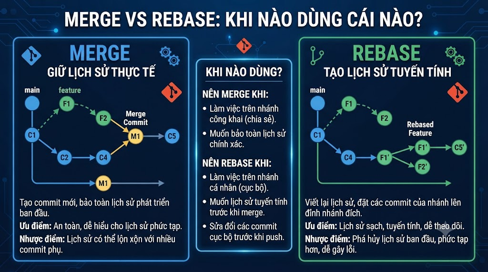

# Merge vs Rebase: Khi Nào Dùng Cái Nào?



Đây là bài gây tranh cãi nhất trong cộng đồng Git. Một nửa developer thề với merge, nửa còn lại chỉ dùng rebase. Sự thật là cả hai đều đúng — nhưng cho những tình huống khác nhau. Bài này sẽ giúp bạn hiểu rõ cơ chế hoạt động của từng loại, tránh sai lầm phổ biến và biết khi nào nên dùng cái nào trong thực tế.

## 1\. Vấn Đề Cần Giải Quyết

```java
Tình huống phổ biến:
  Bạn tách branch feature/payment từ main
  Trong khi bạn code, đồng nghiệp đã push 2 commits lên main
  Bây giờ cần "cập nhật" feature branch với commits mới của main

main:    A ← B ← C ← F ← G  (F, G là commits mới của đồng nghiệp)
                  ↑
feature:          └── D ← E  (commits của bạn)

Có 2 cách giải quyết:
  1. git merge main → vào feature  (Merge approach)
  2. git rebase main               (Rebase approach)
```

## 2\. Merge — Tạo Merge Commit

```bash
git switch feature/payment
git merge main
```

```java
Trước:
  main:    A ← B ← C ← F ← G
                    ↑
  feature:          └── D ← E

Sau merge:
  main:    A ← B ← C ← F ← G
                    ↑         ↖
  feature:          └── D ← E ← M  (M = merge commit, 2 parents: G và E)
```

**Kết quả:**

*   Tạo merge commit M với 2 parents
    
*   Lịch sử phản ánh đúng những gì thực sự xảy ra
    
*   Commits D, E vẫn ở vị trí cũ, hash không đổi
    
*   Non-destructive — không viết lại lịch sử
    

## 3\. Rebase — Di Chuyển Commits

```bash
git switch feature/payment
git rebase main
```

```java
Trước:
  main:    A ← B ← C ← F ← G
                    ↑
  feature:          └── D ← E

Sau rebase:
  main:    A ← B ← C ← F ← G
                              ↑
  feature:                    └── D' ← E'
  (D' và E' là commits MỚI — hash khác D và E)
```

**Kết quả:**

*   Commits D, E được "replayed" lên đỉnh G
    
*   Tạo ra D' và E' — commits mới với nội dung giống D, E nhưng có parent khác
    
*   Hash thay đổi hoàn toàn
    
*   Lịch sử tuyến tính — như thể feature được bắt đầu từ G
    

## 4\. Merge vs Rebase — So Sánh Trực Quan

```java
Merge history:
  *   M (feature) Merge main into feature/payment
  |\
  | * G (main) fix: resolve login bug
  | * F (main) feat: add email verification
  * | E feat: add payment verification
  * | D feat: add payment gateway
  |/
  * C initial setup

Rebase history:
  * E' feat: add payment verification
  * D' feat: add payment gateway
  * G fix: resolve login bug
  * F feat: add email verification
  * C initial setup

→ Rebase: lịch sử tuyến tính, dễ đọc hơn
→ Merge: lịch sử thật, thấy được parallel development
```

## 5\. Rebase Thực Hành

```bash
# ─── Basic Rebase ───

# Setup: tạo 2 commits trên main
git switch main
echo "// Feature F" >> src/FeatureF.java && git add . && git commit -m "feat: feature F"
echo "// Feature G" >> src/FeatureG.java && git add . && git commit -m "feat: feature G"

# Quay về feature branch
git switch feature/payment

# Rebase feature lên đỉnh main
git rebase main

# Nếu không có conflict:
# Successfully rebased and updated refs/heads/feature/payment.

# Xem lịch sử mới
git log --oneline --graph
# * e5f6a7b (HEAD → feature/payment) feat: add payment verification
# * d4e5f6a feat: add payment gateway
# * b3c4d5e (main) feat: feature G
# * a2b3c4d feat: feature F
# * e4f5g6h chore: initial setup

# ─── Rebase với conflict ───

# Khi có conflict trong quá trình rebase:
# CONFLICT (content): Merge conflict in PaymentService.java
# error: could not apply abc1234... feat: add payment gateway

# Giải quyết conflict
git status
# rebase in progress; onto b3c4d5e
# You are currently rebasing branch 'feature/payment' on 'b3c4d5e'.
# Unmerged paths:
#   both modified:   src/PaymentService.java

# Edit file, giải quyết conflict
# ... sửa file ...

# Stage file đã resolve
git add src/PaymentService.java

# Tiếp tục rebase
git rebase --continue

# Bỏ qua commit hiện tại (nếu conflict nhỏ, không cần commit này)
git rebase --skip

# Hủy rebase, quay về trạng thái trước
git rebase --abort
```

## 6\. Interactive Rebase — Viết Lại Lịch Sử

**Interactive rebase** (`git rebase -i`) là tính năng mạnh nhất cho phép:

*   Sửa commit messages
    
*   Gộp nhiều commits thành 1 (squash)
    
*   Chia 1 commit thành nhiều
    
*   Xóa commit
    
*   Đổi thứ tự commits
    

```bash
# Rebase interactive N commits gần nhất
git rebase -i HEAD~3
# → Mở editor với danh sách 3 commits gần nhất
```

**Editor hiển thị:**

```java
pick a1b2c3d feat: add payment gateway
pick b2c3d4e feat: add payment verification  
pick c3d4e5f fix: typo in comment

# Rebase abc..def onto abc (3 commands)
#
# Commands:
# p, pick   = use commit
# r, reword = use commit, but edit the commit message
# e, edit   = use commit, but stop for amending
# s, squash = use commit, but meld into previous commit
# f, fixup  = like "squash", but discard this commit's log message
# d, drop   = remove commit
# ... (more options)
```

### 6.1 Reword — Sửa Commit Message

```java
pick a1b2c3d feat: add payment gateway
reword b2c3d4e feat: add payment verification  ← đổi "pick" thành "reword"
pick c3d4e5f fix: typo in comment
```

```bash
# Lưu và đóng editor → Git mở editor cho commit b2c3d4e
# Sửa message → lưu → tiếp tục
```

### 6.2 Squash — Gộp Commits

```java
pick a1b2c3d feat: add payment gateway
squash b2c3d4e feat: add payment verification  ← squash vào commit trước
squash c3d4e5f fix: typo in comment            ← squash vào commit trước
```

```bash
# Sau khi lưu, Git mở editor để viết message cho commit mới (gộp cả 3)
# Kết quả: 3 commits → 1 commit duy nhất
```

**fixup** tương tự squash nhưng bỏ luôn message của commit bị gộp:

```java
pick a1b2c3d feat: add payment gateway
fixup b2c3d4e feat: add payment verification  ← bỏ message này
fixup c3d4e5f fix: typo in comment            ← bỏ message này
# → Chỉ giữ message của a1b2c3d
```

### 6.3 Drop — Xóa Commit

```java
pick a1b2c3d feat: add payment gateway
drop b2c3d4e feat: add debug logging    ← xóa commit này
pick c3d4e5f fix: resolve payment bug
```

### 6.4 Reorder — Đổi Thứ Tự

```java
pick c3d4e5f fix: resolve payment bug    ← đổi thứ tự trong editor
pick a1b2c3d feat: add payment gateway
# b2c3d4e bị bỏ ra

# ⚠️ Đổi thứ tự có thể gây conflict
```

### 6.5 Edit — Dừng Lại Để Amend

```java
pick a1b2c3d feat: add payment gateway
edit b2c3d4e feat: add payment verification  ← dừng ở đây
pick c3d4e5f fix: typo in comment
```

```bash
# Git dừng tại b2c3d4e
# Bạn có thể:
git commit --amend   # sửa commit hiện tại
git add forgot.java && git commit --amend --no-edit  # thêm file bị quên

# Tiếp tục sau khi sửa xong
git rebase --continue
```

### 6.6 Rebase Interactive Trong VSCode và IntelliJ

**VSCode với GitLens:**

```java
Source Control → GitLens → Repositories → Commits
→ Right-click commit → "Rebase to Commit (Interactive)"
→ Hoặc mở "Interactive Rebase Editor" khi chạy git rebase -i
→ GitLens có visual UI cho interactive rebase
```

**IntelliJ:**

```java
Git Log → Right-click commit → "Interactively Rebase from Here"
→ Mở dialog cho phép drag-drop, squash, reword trực quan
→ Không cần nhớ commands p/r/s/f/d
```

## 7\. Quy Tắc Vàng Của Rebase

> **"Không bao giờ rebase shared branches (branches mà người khác đang dùng)"**

**Tại sao:**

```java
Trước rebase:
  origin/feature: ... ← D ← E
  Nam's local:    ... ← D ← E
  Linh's local:   ... ← D ← E  (Linh đang dùng branch này)

Nam chạy: git rebase main → push --force
  origin/feature: ... ← D' ← E'  (hash MỚI)

Linh bây giờ:
  Linh's local:   ... ← D ← E   (hash CŨ)
  origin/feature: ... ← D' ← E' (hash MỚI)
  → Linh bị out of sync, rất khó resolve
  → Khi Linh pull → tạo ra duplicate commits rất lộn xộn
```

**Nguyên tắc an toàn:**

```java
✅ Rebase safe:
  - Local branch chưa push
  - Personal feature branch (chỉ bạn dùng)
  - Sau khi push, chưa ai pull về

❌ Rebase nguy hiểm:
  - main, develop (shared branches)
  - Branch đang có người khác làm việc
  - Đã push và biết người khác đã pull
```

## 8\. Khi Nào Dùng Merge, Khi Nào Dùng Rebase?

```java
Dùng MERGE khi:
  ✅ Merge feature branch vào main (kết thúc feature)
  ✅ Muốn giữ lịch sử đúng thực tế
  ✅ Branch là shared (nhiều người dùng)
  ✅ Pull Request workflow (GitHub/GitLab tự tạo merge commit)

Dùng REBASE khi:
  ✅ Update feature branch với changes mới từ main
     (git rebase main trong khi làm feature)
  ✅ Dọn dẹp commits trước khi tạo PR
     (interactive rebase để squash WIP commits)
  ✅ Giữ history tuyến tính trên feature branch
  ✅ git pull --rebase (thay vì tạo merge commit mỗi lần pull)

Tóm gọn:
  "Rebase để tích hợp changes từ main vào feature"
  "Merge để tích hợp feature vào main"
```

## 9\. git pull --rebase — Best Practice

```bash
# Thay vì:
git pull   # = git fetch + git merge origin/main
           # → tạo merge commit mỗi lần pull → lịch sử lộn xộn

# Dùng:
git pull --rebase   # = git fetch + git rebase origin/main
                    # → rebase local commits lên trên remote commits
                    # → history tuyến tính

# Config mặc định
git config --global pull.rebase true
# Từ đây, git pull luôn dùng rebase

# Hoặc per-branch
git config branch.main.rebase true
```

**Tình huống:**

```java
Remote: A ← B ← C ← F (đồng nghiệp push F)
Local:  A ← B ← C ← D (bạn commit D local)

git pull (merge):
  A ← B ← C ← F ← M  (M = merge commit, 2 parents: F và D)
              ↗
              D

git pull --rebase:
  A ← B ← C ← F ← D'  (D' được replay lên trên F)
→ Sạch hơn, không có merge commit vô nghĩa
```

## 10\. Rebase Onto — Rebase Phức Tạp

```bash
# Tình huống: branch tách từ branch sai
# feature/checkout được tách từ feature/payment
# Nhưng bây giờ muốn tách trực tiếp từ main

main:    A ← B ← C
                  ↑
payment:          └── D ← E
                          ↑
checkout:                 └── F ← G

# Muốn: checkout từ main thay vì payment
git rebase --onto main feature/payment feature/checkout

# Kết quả:
main:    A ← B ← C
              ↑         ↑
payment:      └── D ← E │
                         │
checkout:                └── F' ← G'  (chỉ commits F, G được giữ lại)

# Syntax: git rebase --onto <new-base> <old-base> <branch>
# → Lấy commits từ <old-base> đến HEAD của <branch>
# → Replay lên đỉnh <new-base>
```

## 11\. Thực Hành Tổng Hợp

```bash
# Setup scenario
git switch main

# Main có 2 commits
echo "email verification" >> src/Email.java
git add . && git commit -m "feat: add email verification"
echo "2FA auth" >> src/TwoFactor.java
git add . && git commit -m "feat: add 2FA authentication"

# Tạo feature branch từ trước khi có 2 commits trên
git switch -c feature/payment HEAD~2
echo "vnpay init" >> src/VNPay.java
git add . && git commit -m "feat: init VNPay"
echo "vnpay callback" >> src/VNPay.java
git add . && git commit -m "feat: add VNPay callback"
echo "wip debug" >> src/VNPay.java
git add . && git commit -m "WIP: debug payment flow"

# Xem lịch sử trước rebase
git log --oneline --graph --all
# * b4c5d6e (HEAD → feature/payment) WIP: debug payment flow
# * a3b4c5d feat: add VNPay callback
# * e2f3a4b feat: init VNPay
# | * g7h8i9j (main) feat: add 2FA authentication
# | * f6g7h8i feat: add email verification
# |/
# * d5e6f7g (origin/main) chore: initial setup

# ─── Bước 1: Dọn dẹp commits trước khi rebase ───
git rebase -i HEAD~3
# Trong editor:
# pick e2f3a4b feat: init VNPay
# squash a3b4c5d feat: add VNPay callback
# fixup b4c5d6e WIP: debug payment flow
# → Lưu → git sẽ mở editor để viết message mới
# Message: feat(payment): add VNPay integration

# ─── Bước 2: Rebase lên main ───
git rebase main

# ─── Bước 3: Push và tạo PR ───
git push -u origin feature/payment

# Lịch sử sau:
git log --oneline --graph --all
# * h9i0j1k (HEAD → feature/payment) feat(payment): add VNPay integration
# * g7h8i9j (main) feat: add 2FA authentication
# * f6g7h8i feat: add email verification
# * d5e6f7g chore: initial setup
# → Tuyến tính, sạch sẽ, dễ review PR
```

## Tổng Kết

```java
Merge:
  → Tạo merge commit, giữ lịch sử thật
  → Dùng khi: kết thúc feature, shared branches

Rebase:
  → Di chuyển commits, tạo lịch sử tuyến tính
  → Dùng khi: update feature với main, dọn dẹp commits
  → KHÔNG rebase shared branches

Interactive Rebase (rebase -i):
  → Viết lại lịch sử local
  → squash: gộp commits
  → reword: sửa message
  → drop: xóa commit
  → edit: sửa nội dung commit
```


| Command | Tác dụng |
|---|---|
| git merge <branch> | Merge, tạo merge commit nếu cần |
| git merge --no-ff | Luôn tạo merge commit |
| git rebase main | Rebase current branch lên main |
| git rebase -i HEAD~N | Interactive rebase N commits |
| git rebase --continue | Tiếp tục sau khi resolve conflict |
| git rebase --abort | Hủy rebase |
| git pull --rebase | Pull với rebase thay vì merge |


Bài tiếp theo chúng ta sẽ học **Conflict Resolution** — tại sao conflict xảy ra, cách giải quyết bằng CLI, VSCode merge editor và IntelliJ, cùng với các kỹ thuật tránh conflict từ đầu.

