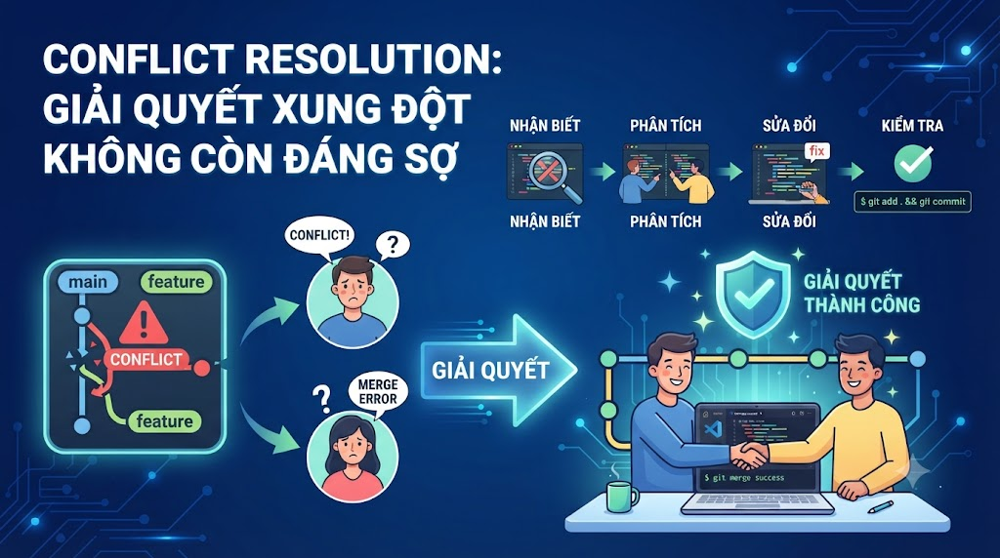

# Conflict Resolution: Giải Quyết Xung Đột Không Còn Đáng Sợ



Conflict là nỗi ám ảnh của nhiều developer mới học Git. Thực ra, conflict không phải lỗi — đó là Git đang nói với bạn: "Hai người đã sửa cùng một chỗ theo cách khác nhau, tôi không biết giữ cái nào, bạn quyết định đi." Hiểu đúng nguyên nhân và cách giải quyết sẽ biến conflict từ thứ đáng sợ thành một bước bình thường trong workflow.

## 1\. Tại Sao Conflict Xảy Ra?

```java
Conflict xảy ra khi Git KHÔNG THỂ tự động merge vì:
  2 người sửa CÙNG DÒNG trong CÙNG FILE theo cách KHÁC NHAU

Không conflict (Git tự merge được):
  Nam sửa  UserService.java (method login)
  Linh sửa UserService.java (method register)
  → Khác method, khác dòng → Git tự merge OK ✅

Conflict:
  Nam sửa  UserService.java dòng 15: return "token-v1"
  Linh sửa UserService.java dòng 15: return "token-v2"
  → Cùng dòng, khác nội dung → Git không biết chọn cái nào → CONFLICT ❌
```

**Khi nào conflict xảy ra:**

*   `git merge`: merge 2 branches có cùng dòng bị sửa
    
*   `git rebase`: replay commits có cùng dòng bị sửa
    
*   `git cherry-pick`: apply commit có cùng dòng bị sửa
    
*   `git stash pop`: apply stash có cùng dòng bị sửa
    

## 2\. Anatomy của Conflict Markers

```java
// UserService.java sau khi conflict

public class UserService {

<<<<<<< HEAD
    // Bản của bạn (current branch)
    public String generateToken(String userId) {
        return "jwt-" + userId + "-v2";
    }
=======
    // Bản của người kia (incoming branch)
    public String generateToken(String userId) {
        return "token-" + userId + "-v1";
    }
>>>>>>> feature/auth-refactor
```

**Giải thích markers:**

```java
<<<<<<< HEAD
  → Bắt đầu phần của bạn (current branch / HEAD)
  → Nội dung từ HEAD đến =======

=======
  → Phân cách 2 phiên bản

>>>>>>> feature/auth-refactor
  → Kết thúc, tên của branch đang được merge vào
  → Nội dung từ ======= đến đây là của incoming branch
```

## 3\. Quy Trình Giải Quyết Conflict

```java
Bước 1: Phát hiện conflict
  git status → xem files bị conflict

Bước 2: Quyết định giải pháp cho từng conflict
  - Giữ bản của mình (HEAD)
  - Giữ bản người kia (incoming)
  - Kết hợp cả hai
  - Viết hoàn toàn mới

Bước 3: Edit file, xóa markers, giữ code đúng

Bước 4: Stage file đã resolve
  git add <file>

Bước 5: Hoàn thành merge/rebase
  git merge --continue  hoặc
  git rebase --continue hoặc
  git commit (nếu là merge)
```

## 4\. Giải Quyết Conflict Bằng CLI

```bash
# ─── Setup tình huống conflict ───

# Main branch
git switch main
cat > src/main/java/com/foxdev/UserService.java << 'EOF'
package com.foxdev;

public class UserService {

    public String generateToken(String userId) {
        return "jwt-" + userId + "-v2";
    }

    public boolean validateToken(String token) {
        return token.startsWith("jwt-");
    }
}
EOF
git add . && git commit -m "feat(auth): update token format to JWT v2"

# Feature branch (tạo từ commit trước đó)
git switch -c feature/auth-refactor HEAD~1
cat > src/main/java/com/foxdev/UserService.java << 'EOF'
package com.foxdev;

public class UserService {

    public String generateToken(String userId) {
        return "token-" + userId + "-v1";
    }

    public boolean validateToken(String token) {
        return token != null && !token.isEmpty();
    }
}
EOF
git add . && git commit -m "feat(auth): refactor token generation"

# ─── Merge → Conflict ───
git switch main
git merge feature/auth-refactor
# Auto-merging src/main/java/com/foxdev/UserService.java
# CONFLICT (content): Merge conflict in UserService.java
# Automatic merge failed; fix conflicts and then commit the result.

# Xem files bị conflict
git status
# Unmerged paths:
#   (use "git add <file>..." to mark resolution)
#   both modified:   src/main/java/com/foxdev/UserService.java

# Xem nội dung conflict
cat src/main/java/com/foxdev/UserService.java
# package com.foxdev;
# 
# public class UserService {
# 
# <<<<<<< HEAD
#     public String generateToken(String userId) {
#         return "jwt-" + userId + "-v2";
#     }
# 
#     public boolean validateToken(String token) {
#         return token.startsWith("jwt-");
#     }
# =======
#     public String generateToken(String userId) {
#         return "token-" + userId + "-v1";
#     }
# 
#     public boolean validateToken(String token) {
#         return token != null && !token.isEmpty();
#     }
# >>>>>>> feature/auth-refactor
# }
```

### Giải Quyết Thủ Công

```bash
# Mở file và edit thủ công
# Quyết định: giữ JWT v2 (HEAD) nhưng dùng validation tốt hơn (incoming)

cat > src/main/java/com/foxdev/UserService.java << 'EOF'
package com.foxdev;

public class UserService {

    // Giữ JWT v2 format (từ HEAD)
    public String generateToken(String userId) {
        return "jwt-" + userId + "-v2";
    }

    // Dùng validation tốt hơn (từ feature branch)
    public boolean validateToken(String token) {
        return token != null && token.startsWith("jwt-");
    }
}
EOF

# Stage file đã resolve
git add src/main/java/com/foxdev/UserService.java

# Kiểm tra status
git status
# All conflicts fixed but you are still merging.
# Changes to be committed:
#   modified:   src/main/java/com/foxdev/UserService.java

# Hoàn thành merge
git commit
# → Mở editor với merge commit message
# → Lưu để confirm

# Hoặc với message tùy chỉnh
git commit -m "Merge feature/auth-refactor: combine JWT v2 with improved validation"
```

### Git Checkout Ours/Theirs — Chấp Nhận Toàn Bộ Một Phía

```bash
# Giữ toàn bộ bản của mình (HEAD) — bỏ qua tất cả changes từ branch khác
git checkout --ours src/main/java/com/foxdev/UserService.java
git add src/main/java/com/foxdev/UserService.java

# Giữ toàn bộ bản của người kia (incoming)
git checkout --theirs src/main/java/com/foxdev/UserService.java
git add src/main/java/com/foxdev/UserService.java

# ⚠️ Trong rebase, ours/theirs bị NGƯỢC:
# ours   = commit đang được rebase (incoming)
# theirs = branch đang rebase lên (base)
```

## 5\. Giải Quyết Conflict Trong VSCode

VSCode có merge editor tích hợp sẵn — rất trực quan.

```java
Khi có conflict, VSCode hiển thị:
  ↑ số conflict ở Source Control panel

Mở file bị conflict → VSCode tự nhận ra và hiển thị:
┌──────────────────────────────────────────────────────────┐
│  <<<<<<< HEAD (Current Change)                           │
│  ┌───────────────────────┐                               │
│  │ return "jwt-" + ...   │  [Accept Current Change]      │
│  └───────────────────────┘  [Accept Incoming Change]     │
│  =======                     [Accept Both Changes]       │
│  ┌───────────────────────┐   [Compare Changes]           │
│  │ return "token-" + ... │                               │
│  └───────────────────────┘                               │
│  >>>>>>> feature/auth-refactor (Incoming Change)         │
└──────────────────────────────────────────────────────────┘
```

**Các options trong VSCode:**

```java
Accept Current Change:   Giữ bản của bạn (HEAD)
Accept Incoming Change:  Giữ bản incoming
Accept Both Changes:     Giữ cả hai (nối tiếp nhau)
Compare Changes:         Mở split view để so sánh
```

**Merge Editor (VSCode 1.69+):**

```java
Click "Resolve in Merge Editor" (xuất hiện ở trên cùng file conflict)
→ Mở 3-panel view:
  Left:   Your changes (Current)
  Right:  Incoming changes
  Bottom: Result (bạn edit trực tiếp ở đây)
→ Click checkboxes để accept từng hunk
→ Hoặc edit kết quả thủ công ở panel dưới
→ "Complete Merge" khi xong
```

## 6\. Giải Quyết Conflict Trong IntelliJ

IntelliJ có merge tool tốt nhất trong số các IDE — 3-panel với syntax highlighting.

```java
Khi có conflict, IntelliJ hiển thị dialog:
"Files merged with conflicts"
→ Click "Merge" hoặc "Resolve"
→ Mở 3-panel merge tool
```

**3-panel merge tool:**

```java
┌──────────────┬──────────────┬──────────────┐
│   LEFT       │    RESULT    │    RIGHT     │
│ (Your/HEAD)  │  (edit here) │  (Incoming)  │
│              │              │              │
│ return "jwt" │              │return "token"│
│              │              │              │
└──────────────┴──────────────┴──────────────┘
```

**Thao tác:**

```java
→ Click "X" để từ chối một hunk
→ Click ">" hoặc "<" để accept hunk từ một phía
→ Edit trực tiếp ở cột RESULT
→ Dùng ">>" và "<<" để accept toàn bộ file từ một phía
→ "Apply" khi xong
```

## 7\. Conflict Trong Rebase

```bash
# Khi rebase gặp conflict, Git dừng lại tại commit gây conflict
# git rebase -i main → conflict ở commit thứ 2

# Interactive display:
# CONFLICT (content): Merge conflict in PaymentService.java
# error: could not apply a1b2c3d... feat: add VNPay callback
# Resolve all conflicts manually,
# mark them as resolved with "git add <conflicted_files>",
# then run "git rebase --continue".

# Xem đang ở đâu trong quá trình rebase
git status
# rebase in progress; onto g7h8i9j
# You are currently rebasing branch 'feature/payment' on 'g7h8i9j'.
# (fix conflicts and then run "git rebase --continue")
# (use "git rebase --skip" to skip this patch)
# (use "git rebase --abort" to check out the original branch)

# Sau khi giải quyết
git add PaymentService.java
git rebase --continue
# → Git tiếp tục apply commit tiếp theo
# → Nếu commit tiếp theo cũng conflict → lặp lại

# Nếu conflict không quan trọng, bỏ qua commit này
git rebase --skip
# ⚠️ Mất toàn bộ code trong commit bị skip

# Hủy toàn bộ rebase
git rebase --abort
# → Quay về trạng thái trước khi rebase
```

## 8\. Xem 3-way Diff Khi Conflict

```bash
# Xem conflict với base chung (ancestor)
git diff                  # current vs working directory
git diff --staged         # staged vs HEAD
git diff HEAD             # HEAD vs working directory

# Xem conflict markers với context
git diff --diff-algorithm=patience  # thuật toán diff tốt hơn cho conflict lớn

# Xem bản của từng phía
# Bản của HEAD (ours)
git show HEAD:src/UserService.java

# Bản của branch đang merge (theirs)
git show MERGE_HEAD:src/UserService.java

# Bản chung (ancestor - common base)
git show :1:src/UserService.java   # base
git show :2:src/UserService.java   # ours
git show :3:src/UserService.java   # theirs
```

## 9\. Cấu Hình Merge Tool

```bash
# Dùng VSCode làm merge tool
git config --global merge.tool vscode
git config --global mergetool.vscode.cmd 'code --wait $MERGED'

# Dùng IntelliJ làm merge tool
git config --global merge.tool intellij
git config --global mergetool.intellij.cmd 'idea merge "$LOCAL" "$REMOTE" "$BASE" "$MERGED"'
git config --global mergetool.intellij.trustExitCode true

# Dùng vimdiff (terminal-based)
git config --global merge.tool vimdiff

# Mở merge tool
git mergetool
# → Mở tool cho từng file bị conflict
# → Sau khi giải quyết file → lưu → tool tiếp tục file tiếp theo
```

## 10\. Conflict Phức Tạp — Strategies

```bash
# Merge với strategy cụ thể
git merge -X ours feature/branch     # ưu tiên bản của mình khi conflict
git merge -X theirs feature/branch   # ưu tiên bản của người kia

# Diff3 format — hiển thị thêm base (ancestor) trong conflict markers
git config --global merge.conflictstyle diff3
# Conflict sẽ hiển thị:
# <<<<<<< HEAD
#     return "jwt-v2";
# ||||||| merged common ancestors
#     return "token";           ← đây là bản gốc chung
# =======
#     return "token-v1";
# >>>>>>> feature/auth

# zdiff3 (Git 2.35+) — tốt hơn diff3
git config --global merge.conflictstyle zdiff3
```

## 11\. Tránh Conflict Từ Đầu — Best Practices

```java
1. Pull trước khi code
   → Luôn git pull (hoặc git fetch + merge) trước khi bắt đầu work

2. Pull thường xuyên trong khi code
   → Mỗi vài giờ, pull để giữ sync với remote
   → Conflict nhỏ hơn khi merge thường xuyên

3. Communicate với team
   → Nếu sắp sửa file quan trọng → báo team trước
   → Tránh 2 người cùng sửa 1 file lớn trong cùng thời gian

4. Branch nhỏ, tồn tại ngắn
   → Feature branch sống < 1-2 ngày → ít diverge
   → Branch tồn tại 2 tuần → nhiều conflict hơn

5. Tách file hợp lý
   → Mỗi class một file (Single Responsibility)
   → Không có file "God class" 5000 dòng
   → Ít người cùng sửa cùng file

6. Rebase thường xuyên
   → Mỗi ngày: git rebase main trên feature branch
   → Giải quyết conflict nhỏ từng ngày thay vì conflict lớn cuối tuần

7. Sử dụng feature flags
   → Code mới hide sau flag → merge vào main sớm
   → Tránh branch sống lâu
```

## 12\. Thực Hành Tổng Hợp

```bash
# Scenario: conflict thực tế trong team

# ─── Developer 1 (Nam): update CourseService ───
git switch -c feature/course-update
cat > src/main/java/com/foxdev/CourseService.java << 'EOF'
package com.foxdev;

public class CourseService {
    public Course findById(Long id) {
        // Nam's implementation: dùng Optional
        return courseRepository.findById(id)
            .orElseThrow(() -> new CourseNotFoundException(id));
    }

    public double calculateDiscount(double price) {
        return price * 0.9;  // Nam: 10% discount
    }
}
EOF
git add . && git commit -m "feat(course): improve findById with Optional"

# ─── Developer 2 (Linh): cũng update CourseService trên main ───
git switch main
cat > src/main/java/com/foxdev/CourseService.java << 'EOF'
package com.foxdev;

public class CourseService {
    public Course findById(Long id) {
        // Linh's implementation: dùng null check
        Course course = courseRepository.findById(id).orElse(null);
        if (course == null) throw new RuntimeException("Course not found: " + id);
        return course;
    }

    public double calculateDiscount(double price) {
        return price * 0.85;  // Linh: 15% discount
    }
}
EOF
git add . && git commit -m "feat(course): update findById with null check"

# ─── Merge → Conflict ───
git switch main
git merge feature/course-update
# CONFLICT: CourseService.java

# Xem conflict
cat src/main/java/com/foxdev/CourseService.java

# Giải quyết: giữ Optional (tốt hơn), discount 15% (business decision)
cat > src/main/java/com/foxdev/CourseService.java << 'EOF'
package com.foxdev;

public class CourseService {
    // Resolved: use Optional (better practice)
    public Course findById(Long id) {
        return courseRepository.findById(id)
            .orElseThrow(() -> new CourseNotFoundException(id));
    }

    // Resolved: 15% discount (aligned with business)
    public double calculateDiscount(double price) {
        return price * 0.85;
    }
}
EOF

git add src/main/java/com/foxdev/CourseService.java
git commit -m "Merge feature/course-update: use Optional + 15% discount"

# Xem kết quả
git log --oneline --graph
# *   h9i0j1k Merge feature/course-update
# |\
# | * g8h9i0j feat(course): improve findById with Optional
# * | f7g8h9i feat(course): update findById with null check
# |/
# * e6f7g8h chore: initial setup
```

## Tổng Kết

```java
Conflict xảy ra khi: 2 branches sửa cùng dòng khác nhau
Không phải lỗi: Git đang hỏi bạn quyết định

Quy trình:
  1. git status → xem files conflict
  2. Mở file → edit → xóa markers
  3. git add <file> → mark as resolved
  4. git merge --continue / git commit

Công cụ:
  CLI:       git checkout --ours/--theirs
  VSCode:    Merge Editor (3-panel visual)
  IntelliJ:  3-panel merge tool (tốt nhất)
```


| Tình huống | Command |
|---|---|
| Xem files bị conflict | git status |
| Giữ toàn bộ bản mình | git checkout --ours <file> |
| Giữ toàn bộ bản người kia | git checkout --theirs <file> |
| Mark file đã resolve | git add <file> |
| Hoàn thành merge | git commit |
| Hoàn thành rebase | git rebase --continue |
| Hủy merge | git merge --abort |
| Hủy rebase | git rebase --abort |


Bài tiếp theo chúng ta sẽ học **git stash, .gitignore nâng cao, git tag** và **Conventional Commits** — những công cụ giúp workflow hàng ngày chuyên nghiệp hơn.

