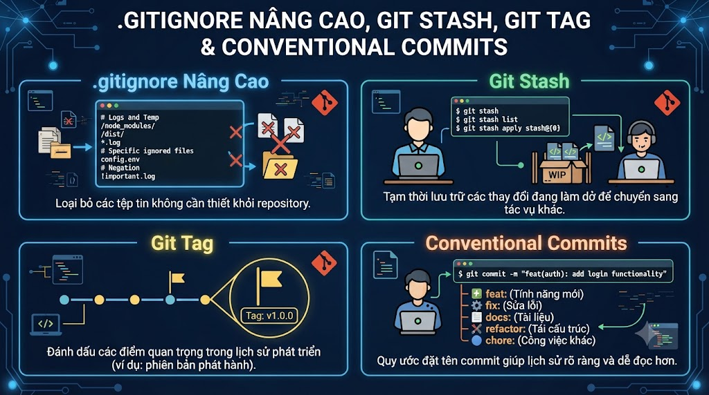

# .gitignore Nâng Cao, git stash, git tag & Conventional Commits



Bài này gom 4 công cụ giúp workflow hàng ngày chuyên nghiệp hơn. **git stash** để tạm cất code dở dang khi cần chuyển việc đột ngột. **.gitignore nâng cao** để không bao giờ vô tình commit secrets hoặc build artifacts. **git tag** để đánh dấu releases. Và **Conventional Commits** — chuẩn đặt tên commit được cả industry áp dụng, giúp tự động generate changelog và semantic versioning.

## 1\. git stash — Tạm Cất Code Dở Dang

### Tại Sao Cần Stash?

```java
Tình huống quen thuộc:
  Đang code feature/payment (chưa xong, chưa muốn commit)
  → PM nhắn: "có bug urgent trên production, fix gấp!"
  → Cần switch sang hotfix/critical-bug

Không có stash:
  → Commit code chưa xong? → Lịch sử lộn xộn
  → Xóa code rồi viết lại? → Mất công
  → Để đó và switch? → Git có thể từ chối nếu có uncommitted changes

Với stash:
  git stash   → cất code vào "ngăn kéo"
  git switch hotfix/critical-bug
  ... fix bug, commit, push ...
  git switch feature/payment
  git stash pop   → lấy code ra tiếp tục
```

### Các Commands Cơ Bản

```bash
# ─── Tạo stash ───

# Stash tất cả changes (tracked files)
git stash

# Stash với tên mô tả
git stash push -m "WIP: payment VNPay integration"

# Stash cả untracked files (chưa git add lần nào)
git stash push --include-untracked
git stash push -u   # shorthand

# Stash cả ignored files
git stash push --all
git stash push -a   # shorthand

# Stash chỉ 1 file cụ thể
git stash push -m "WIP payment" src/PaymentService.java

# ─── Xem stash list ───

git stash list
# stash@{0}: WIP on feature/payment: abc1234 WIP: payment VNPay
# stash@{1}: On main: def5678 fix: previous unfinished work
# → stash@{0} là mới nhất

# Xem nội dung stash
git stash show              # summary của stash mới nhất
git stash show -p           # diff đầy đủ
git stash show stash@{1}    # stash cụ thể
git stash show stash@{1} -p # diff đầy đủ của stash cụ thể

# ─── Lấy stash ra ───

# Pop: lấy stash mới nhất + xóa khỏi stash list
git stash pop

# Apply: lấy stash ra NHƯNG giữ trong stash list
git stash apply              # stash mới nhất
git stash apply stash@{1}   # stash cụ thể

# ─── Xóa stash ───

# Xóa stash cụ thể
git stash drop stash@{0}

# Xóa tất cả stashes
git stash clear
```

### Stash Nâng Cao

```bash
# Tạo branch mới từ stash (rất hữu ích)
git stash branch feature/from-stash stash@{0}
# → Tạo branch, checkout, apply stash, drop stash
# → Nếu stash có conflict khi apply → giải quyết ngay trên branch mới

# Stash interactive — chọn từng hunk muốn stash
git stash push -p
# → Tương tự git add -p
# → Chọn hunk nào muốn stash

# Stash chỉ staged changes (giữ unstaged)
git stash push --staged
```

### Conflict Khi Pop Stash

```bash
# Nếu stash pop gặp conflict:
git stash pop
# CONFLICT: UserService.java

# Giải quyết conflict như bình thường
# Stage file đã resolve
git add UserService.java

# Stash đã bị drop khi pop (dù conflict)
# → Code stash VẪN được apply vào working dir
# → Chỉ cần resolve conflict, không cần pop lại
```

## 2\. .gitignore Nâng Cao

### Syntax Đầy Đủ

```bash
# .gitignore

# ─── Comment ───
# Đây là comment

# ─── Exact file name ───
secrets.txt         # ignore file này ở bất kỳ thư mục nào
/secrets.txt        # chỉ ignore ở root (leading slash)

# ─── Wildcard ───
*.log               # tất cả .log files
*.class             # tất cả .class files
build-*.jar         # build-anything.jar

# ─── Directories ───
target/             # trailing slash = chỉ directories
.idea/
node_modules/

# ─── Negation (unignore) ───
*.log               # ignore tất cả .log
!important.log      # NHƯNG không ignore file này

# ─── Double asterisk ───
**/logs             # ignore thư mục "logs" ở bất kỳ cấp nào
logs/**/*.log       # tất cả .log files trong logs/ ở mọi subdirs
**/logs/**          # mọi thứ trong bất kỳ thư mục "logs" nào

# ─── Range ───
doc/[abc].txt       # doc/a.txt, doc/b.txt, doc/c.txt
```

### .gitignore Chuẩn Cho Java/Spring Boot

```bash
# .gitignore cho foxdev-backend

# ─── Build output ───
target/
build/
out/
*.class
*.jar
!*-sources.jar      # giữ sources jar cho dependencies
*.war
*.ear
*.nar

# ─── IDE ───
# IntelliJ IDEA
.idea/
*.iml
*.iws
*.ipr
# ⚠️ Nên commit .idea/codeStyles/ và .idea/inspectionProfiles/ cho team consistency

# VSCode
.vscode/
!.vscode/extensions.json      # chia sẻ recommended extensions
!.vscode/settings.json         # chia sẻ workspace settings

# Eclipse
.classpath
.project
.settings/
bin/

# ─── Environment & Secrets ───
.env
.env.local
.env.*.local
*.properties.local

# Application configs với sensitive data
application-prod.properties
application-staging.properties
application-local.properties

# Nhưng giữ template
!application.properties
!application-dev.properties

# ─── Credentials ───
*.pem
*.key
*.p12
*.jks                          # Java Keystore
src/main/resources/keystore*   # Spring Boot keystore

# ─── OS files ───
.DS_Store                      # macOS
.DS_Store?
._*
.Spotlight-V100
.Trashes
ehthumbs.db
Thumbs.db                      # Windows
desktop.ini

# ─── Logs ───
*.log
logs/
log/

# ─── Test coverage ───
/coverage/
*.exec                         # JaCoCo coverage

# ─── Docker ───
docker-compose.override.yml    # local overrides, không share

# ─── Terraform (nếu có) ───
.terraform/
*.tfstate
*.tfstate.backup

# ─── Temporary ───
*.tmp
*.bak
*.swp
*~
```

### Global .gitignore — Áp Dụng Cho Mọi Repos

```bash
# Tạo global gitignore (cho tất cả repos trên máy)
cat > ~/.gitignore_global << 'EOF'
# macOS
.DS_Store
.AppleDouble
.LSOverride

# Windows
Thumbs.db
ehthumbs.db
desktop.ini

# Editor
*.swp
*.swo
*~
.vscode/
.idea/

# OS
[Dd]esktop.ini
$RECYCLE.BIN/
EOF

# Config Git dùng global gitignore
git config --global core.excludesfile ~/.gitignore_global
```

### Giải Phóng Files Đã Bị Track Nhầm

```bash
# Lỡ commit .env hoặc target/ trước khi thêm vào .gitignore
# File vẫn bị track dù đã có trong .gitignore

# Xóa khỏi tracking (giữ file trên disk)
git rm --cached .env
git rm --cached -r target/    # recursive cho thư mục

# Commit để xóa khỏi lịch sử future commits
git add .gitignore
git commit -m "chore: untrack .env and target/"

# ⚠️ File vẫn tồn tại trong lịch sử cũ!
# Nếu cần xóa khỏi lịch sử (sensitive data):
# → Dùng git filter-repo (sẽ học ở bài sau)
# → Hoặc BFG Repo Cleaner
```

## 3\. git tag — Đánh Dấu Releases

### Lightweight vs Annotated Tag

```bash
# Lightweight tag: chỉ là con trỏ đến commit (giống branch)
git tag v1.0.0

# Annotated tag (khuyến nghị): có metadata đầy đủ
git tag -a v1.0.0 -m "Release version 1.0.0"
# → Lưu: tagger name/email, date, message
# → Có thể sign với GPG key
# → Là best practice cho releases
```

### Tag Operations

```bash
# ─── Tạo tags ───

# Tag commit hiện tại
git tag -a v1.0.0 -m "First stable release"

# Tag một commit cụ thể
git tag -a v0.9.0 abc1234 -m "Release candidate"

# ─── Xem tags ───

git tag                       # danh sách tags
git tag -l "v1.*"            # filter theo pattern

git show v1.0.0              # xem chi tiết tag

# ─── Push tags ───

git push origin v1.0.0       # push 1 tag
git push origin --tags       # push tất cả tags

# ─── Delete tags ───

git tag -d v1.0.0-beta       # xóa local tag
git push origin --delete v1.0.0-beta  # xóa remote tag

# ─── Checkout tag ───

git checkout v1.0.0
# Note: you are in 'detached HEAD' state
# → Detached HEAD — tạo branch nếu muốn commit

git checkout -b hotfix/from-v1 v1.0.0  # tạo branch từ tag
```

### Semantic Versioning

```java
Format: MAJOR.MINOR.PATCH (e.g., 2.5.3)

MAJOR: Breaking changes (incompatible API changes)
  v1.0.0 → v2.0.0: API thay đổi, code cũ cần update

MINOR: New features (backward compatible)
  v1.0.0 → v1.1.0: thêm tính năng mới, không phá vỡ cũ

PATCH: Bug fixes (backward compatible)
  v1.0.0 → v1.0.1: fix bug, không thêm feature

Pre-release:
  v1.0.0-alpha.1  → testing nội bộ
  v1.0.0-beta.2   → public testing
  v1.0.0-rc.1     → release candidate

Examples cho nguyentienkhoi.hashnode.dev:
  v1.0.0   → First release
  v1.1.0   → Thêm payment VNPay
  v1.1.1   → Fix payment timeout bug
  v1.2.0   → Thêm email notifications
  v2.0.0   → API v2 (breaking changes)
```

## 4\. Conventional Commits — Chuẩn Đặt Tên Commit

### Format Chuẩn

```java
<type>(<scope>): <description>

[optional body]

[optional footer(s)]
```

### Types Phổ Biến

```java
feat:      Tính năng mới (trigger MINOR version bump)
fix:       Bug fix (trigger PATCH version bump)
docs:      Chỉ thay đổi documentation
style:     Formatting, không thay đổi logic (whitespace, semicolons)
refactor:  Refactoring (không feat, không fix)
perf:      Cải thiện performance
test:      Thêm/sửa tests
build:     Build system, external dependencies (Maven, Gradle, npm)
ci:        CI/CD configuration (GitHub Actions, GitLab CI)
chore:     Maintenance tasks không ảnh hưởng src hay tests
revert:    Revert một commit trước đó

BREAKING CHANGE: → trigger MAJOR version bump
```

### Ví Dụ Thực Tế

```bash
# feat: thêm feature mới
git commit -m "feat(payment): add VNPay payment gateway integration"
git commit -m "feat(user): implement OAuth2 Google login"
git commit -m "feat(course): add video progress tracking"

# fix: bug fix
git commit -m "fix(auth): resolve JWT token expiration not refreshing"
git commit -m "fix(payment): handle VNPay IPN callback timeout"
git commit -m "fix(ui): course thumbnail not loading on mobile"

# docs: documentation
git commit -m "docs(api): add Swagger documentation for payment endpoints"
git commit -m "docs: update README with Docker setup instructions"

# refactor: code refactoring
git commit -m "refactor(user): extract UserValidator from UserService"
git commit -m "refactor(course): simplify enrollment logic"

# test: tests
git commit -m "test(payment): add unit tests for VNPay callback handling"
git commit -m "test(user): add integration tests for login flow"

# chore: maintenance
git commit -m "chore(deps): upgrade Spring Boot from 3.1.0 to 3.2.0"
git commit -m "chore: add .editorconfig for code style consistency"

# ci: CI/CD
git commit -m "ci: add GitHub Actions workflow for PR checks"
git commit -m "ci: configure SonarQube code quality gate"

# perf: performance
git commit -m "perf(course): add Redis cache for course list API"
git commit -m "perf(db): add index on enrollments.user_id"

# Breaking change
git commit -m "feat(api)!: change authentication from Basic to JWT

BREAKING CHANGE: The Authorization header format has changed.
Old: Authorization: Basic base64(username:password)
New: Authorization: Bearer <jwt_token>

Migration guide: see docs/auth-migration.md"
```

### Multi-line Commit Message

```bash
# Sử dụng editor để viết commit message dài
git commit

# Editor mở ra:
# feat(payment): implement full VNPay checkout flow
#
# Implement complete VNPay payment integration:
# - Generate payment URL with HMAC-SHA512 signature
# - Handle IPN callback and verify transaction
# - Update order status after successful payment
# - Send email confirmation to user
#
# The implementation follows VNPay's integration guide v2.1
# Test cards: https://sandbox.vnpayment.vn/apis/vnpay-demo/
#
# Closes #123
# Reviewed-by: Linh Tran <linh@nguyentienkhoi.hashnode.dev>
```

## 5\. Tự Động Hóa Với Conventional Commits

### Tự Động Generate CHANGELOG

```bash
# Cài conventional-changelog
npm install -g conventional-changelog-cli

# Generate CHANGELOG từ commit history
conventional-changelog -p angular -i CHANGELOG.md -s

# CHANGELOG.md tự động được tạo:
# ## [1.2.0] - 2025-03-15
# ### Features
# - **payment:** add VNPay payment gateway integration
# - **user:** implement OAuth2 Google login
#
# ### Bug Fixes
# - **auth:** resolve JWT token expiration not refreshing
# - **payment:** handle VNPay IPN callback timeout
```

### Semantic Release — Tự Động Versioning

```yaml
# .releaserc.yml (semantic-release config)
branches:
  - main

plugins:
  - "@semantic-release/commit-analyzer"
  - "@semantic-release/release-notes-generator"
  - "@semantic-release/changelog"
  - "@semantic-release/github"

# Với config này:
# feat commit → bump MINOR version, tạo release
# fix commit  → bump PATCH version, tạo release
# BREAKING CHANGE → bump MAJOR version, tạo release
# Tự động create GitHub Release với changelog
```

### Commitlint — Enforce Conventional Commits

```bash
# Cài commitlint
npm install -g @commitlint/cli @commitlint/config-conventional

# commitlint.config.js
module.exports = {
  extends: ['@commitlint/config-conventional'],
  rules: {
    'type-enum': [2, 'always', [
      'feat', 'fix', 'docs', 'style', 'refactor',
      'perf', 'test', 'build', 'ci', 'chore', 'revert'
    ]],
    'subject-max-length': [2, 'always', 72],
    'body-max-line-length': [2, 'always', 100]
  }
};

# Dùng với Husky (Git hooks) để auto-validate khi commit
# → Sẽ học kỹ ở Bài 13 (Git Hooks)
```

## 6\. Alias — Phím Tắt Cho Commands Dài

```bash
# Thêm vào ~/.gitconfig

git config --global alias.st "status"
git config --global alias.co "checkout"
git config --global alias.sw "switch"
git config --global alias.br "branch"
git config --global alias.cm "commit -m"
git config --global alias.lg "log --oneline --graph --all --decorate"
git config --global alias.lgs "log --oneline --graph"
git config --global alias.last "log -1 HEAD --stat"
git config --global alias.undo "reset HEAD~1 --mixed"   # undo last commit, keep changes
git config --global alias.unstage "restore --staged"

# Sử dụng
git st     # = git status
git lg     # = git log --oneline --graph --all --decorate
git last   # = xem commit gần nhất + files thay đổi
git undo   # = undo commit gần nhất, giữ code

# Xem tất cả aliases
git config --global --list | grep alias
```

## 7\. Thực Hành Tổng Hợp

```bash
# Scenario: Quy trình làm việc hoàn chỉnh

# ─── Setup ───
git switch -c feature/email-notification

# Code một phần
cat > src/EmailService.java << 'EOF'
public class EmailService {
    // TODO: implement
    public void sendWelcomeEmail(String email) {
        System.out.println("Sending to: " + email);
    }
}
EOF

# ─── Nhận task urgent ───
# PM: "fix bug login bây giờ đi!"

# Stash work dở dang
git stash push -u -m "WIP: EmailService basic structure"

git stash list
# stash@{0}: On feature/email-notification: WIP: EmailService basic structure

# Switch sang hotfix
git switch main && git pull
git switch -c hotfix/login-500-error

# Fix bug
sed -i 's/return null/return Optional.empty()/' src/UserService.java
git add .
git commit -m "fix(auth): resolve 500 error when user not found

Previously returned null causing NullPointerException downstream.
Now returns Optional.empty() for proper handling.

Fixes #456"

# Push và tạo PR
git push -u origin hotfix/login-500-error

# Merge vào main (sau khi review)
git switch main
git merge --no-ff hotfix/login-500-error
git tag -a v1.0.1 -m "Hotfix: resolve login 500 error"
git push && git push --tags
git branch -d hotfix/login-500-error

# ─── Quay lại feature ───
git switch feature/email-notification
git stash pop
# → Code EmailService được restore

# Continue coding...
cat >> src/EmailService.java << 'EOF'
    public void sendOrderConfirmation(String email, String orderId) {
        // Implementation
    }
}
EOF

git add .
git commit -m "feat(notification): add EmailService with welcome and order confirmation"

# Rebase lên main mới nhất
git rebase main

git push -u origin feature/email-notification
# Tạo PR → review → merge

# ─── Release ───
git switch main && git pull
git tag -a v1.1.0 -m "Release v1.1.0: add email notifications"
git push origin --tags

git log --oneline --graph
# * j1k2l3m (HEAD → main, tag: v1.1.0) Merge feature/email-notification
# * i0j1k2l Merge hotfix/login-500-error (tag: v1.0.1)
# * h9i0j1k fix(auth): resolve 500 error when user not found
```

## Tổng Kết


| Tool | Dùng khi |
|---|---|
| git stash | Tạm cất code khi cần switch việc đột ngột |
| git stash pop | Lấy lại code đã cất |
| .gitignore | Không track build artifacts, secrets, IDE files |
| git rm --cached | Xóa file đã track nhầm khỏi Git |
| git tag -a | Đánh dấu release với semantic versioning |
| Conventional Commits | Chuẩn commit message cho auto-changelog |


```java
Conventional Commits format:
  feat(scope): description    → MINOR bump
  fix(scope): description     → PATCH bump
  feat!: breaking change      → MAJOR bump

BREAKING CHANGE footer
```

Bài tiếp theo chúng ta sẽ học **Undoing Changes** — `git restore`, `git reset` (soft/mixed/hard), `git revert` và khi nào dùng cái nào để không bao giờ mất code.

