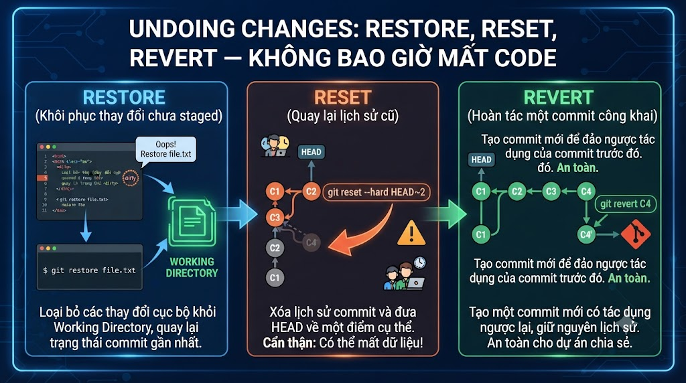

# Undoing Changes: restore, reset, revert — Không Bao Giờ Mất Code



Một trong những điều developer hay lo lắng nhất khi dùng Git: "Lỡ tay xóa mất code thì sao?" Tin vui: Git gần như không bao giờ thực sự xóa data — nó chỉ không hiển thị nữa. Bài này dạy đúng cách undo ở từng tình huống cụ thể, từ "undo thay đổi chưa commit" đến "quay lại commit cách đây 3 ngày" mà không gây rắc rối cho team.

## 1\. Bản Đồ Undo Trong Git

```java
Vấn đề                          Giải pháp
──────────────────────────────────────────────────────
Sửa file, chưa stage            git restore <file>
Stage file nhầm                  git restore --staged <file>
Commit sai message               git commit --amend
Commit thiếu file                git commit --amend
Undo 1-2 commits (chưa push)    git reset HEAD~N
Undo commit đã push              git revert <commit>
Undo nhiều commits đã push       git revert <from>..<to>
Mất code do reset --hard         git reflog + git reset
```

## 2\. git restore — Undo Thay Đổi Chưa Commit

```bash
# ─── Undo thay đổi trong Working Directory ───

# Discard changes trong 1 file (về trạng thái last commit)
git restore UserService.java
# ⚠️ KHÔNG THỂ UNDO — changes bị mất vĩnh viễn!

# Discard tất cả changes
git restore .

# Restore về version ở commit cụ thể
git restore --source HEAD~2 UserService.java
# → File được restore về version 2 commits trước
# → File vào Working Directory (chưa staged)

# Restore về version ở branch khác
git restore --source main UserService.java

# ─── Unstage file (Working Directory không đổi) ───

# Unstage 1 file
git restore --staged UserService.java

# Unstage tất cả
git restore --staged .

# ─── Undo cả staged và working directory changes ───
git restore --staged --worktree UserService.java
# = restore về HEAD, undo cả 2 areas
```

**Trực quan hóa:**

```java
Trước:
  HEAD: "return token-v1"
  Staging: "return token-v2"
  Working: "return token-v3"

git restore --staged:
  HEAD: "return token-v1"
  Staging: "return token-v1"  ← reset về HEAD
  Working: "return token-v3"  ← giữ nguyên

git restore (không --staged):
  HEAD: "return token-v1"
  Staging: "return token-v2"  ← giữ nguyên
  Working: "return token-v2"  ← reset về staging

git restore --staged --worktree:
  HEAD: "return token-v1"
  Staging: "return token-v1"  ← reset về HEAD
  Working: "return token-v1"  ← reset về HEAD
```

## 3\. git reset — Undo Commits

**reset di chuyển con trỏ HEAD** và branch về một commit trước đó. 3 modes khác nhau ở chỗ làm gì với Staging Area và Working Directory.

```java
git reset có 3 modes:
  --soft:  Di chuyển HEAD, GIỮ staging + working dir
  --mixed: Di chuyển HEAD, RESET staging, giữ working dir (DEFAULT)
  --hard:  Di chuyển HEAD, RESET cả staging + working dir
```

### git reset --soft

```bash
# Undo 1 commit, giữ changes trong Staging Area
git reset --soft HEAD~1

# Trước reset --soft:
#   HEAD → C (latest commit)
#   Staging: clean
#   Working: clean

# Sau reset --soft HEAD~1:
#   HEAD → B (1 commit trước)
#   Staging: chứa diff(B→C) = changes của commit C
#   Working: clean
#
# → Như thể "uncommit" commit C
# → Code vẫn trong staging, sẵn sàng commit lại

# Use case: commit sai message, muốn viết lại
git reset --soft HEAD~1
git commit -m "feat(payment): better message here"
```

### git reset --mixed (Default)

```bash
# Undo 1 commit, đưa changes về Working Directory
git reset HEAD~1          # --mixed là default
git reset --mixed HEAD~1  # explicit

# Sau reset --mixed HEAD~1:
#   HEAD → B
#   Staging: clean (reset về HEAD)
#   Working: chứa changes của commit C
#
# → "Uncommit" và "unstage" commit C
# → Code vẫn trong working directory

# Use case: commit quá nhiều thứ, muốn tách thành nhiều commits nhỏ
git reset HEAD~1
# Giờ có thể git add từng phần, commit riêng lẻ
git add UserService.java && git commit -m "feat: update UserService"
git add PaymentService.java && git commit -m "feat: update PaymentService"
```

### git reset --hard

```bash
# Undo commits VÀ xóa luôn changes (không thể recover dễ dàng)
git reset --hard HEAD~1

# Sau reset --hard HEAD~1:
#   HEAD → B
#   Staging: clean
#   Working: clean (changes bị XÓA)
#
# ⚠️ Changes bị xóa khỏi working directory!
# Nhưng vẫn có thể recover qua git reflog (trong 90 ngày)

# Use case phổ biến: về đúng trạng thái remote (bỏ local commits)
git reset --hard origin/main

# Xóa sạch uncommitted changes
git reset --hard HEAD   # về HEAD, xóa tất cả
```

### Reset Đến Một Commit Cụ Thể

```bash
# Reset về commit cách đây 3 commits
git reset --hard HEAD~3

# Reset về commit hash cụ thể
git reset --hard abc1234

# Reset về trạng thái của remote branch
git reset --hard origin/main

# Xem log để biết cần reset về đâu
git log --oneline
# e5f6a7b feat: add new feature
# d4e5f6a fix: some bug
# c3d4e5f refactor: cleanup code  ← muốn về đây
# b2c3d4e feat: previous feature
# a1b2c3d initial setup

git reset --hard c3d4e5f
```

## 4\. git revert — Undo An Toàn (Đã Push)

**revert khác reset**: revert tạo commit MỚI để đảo ngược, không xóa commit cũ.

```bash
# Revert commit cụ thể (tạo commit mới đảo ngược)
git revert abc1234

# Revert commit gần nhất
git revert HEAD

# Revert không tạo commit ngay (để bạn edit rồi mới commit)
git revert HEAD --no-commit
# Sau đó commit thủ công
git commit -m "revert: undo payment feature due to critical bug"

# Revert nhiều commits
git revert HEAD~3..HEAD   # revert 3 commits gần nhất
# → Tạo 3 revert commits riêng lẻ

# Revert nhiều commits thành 1 commit duy nhất
git revert HEAD~3..HEAD --no-commit
git commit -m "revert: undo payment feature (commits abc..def)"
```

**Tại sao dùng revert thay vì reset cho shared branches:**

```java
Tình huống: đã push commit lỗi lên main

reset --hard (WRONG):
  Local: A ← B ← C ← D     (xóa D)
  Remote: A ← B ← C ← D    (vẫn có D)
  → Diverged! Push phải dùng --force
  → Đồng nghiệp sẽ bị confused

revert (CORRECT):
  Local: A ← B ← C ← D ← D'   (D' = revert of D)
  Remote: A ← B ← C ← D ← D'  (push bình thường)
  → Lịch sử rõ ràng: D được add rồi được revert
  → Không ai bị ảnh hưởng
```

## 5\. git reflog — Mạng Lưới An Toàn Cuối Cùng

**reflog** = reference log — lưu lịch sử của HEAD trong 90 ngày. Kể cả sau `reset --hard`, code vẫn có thể recover.

```bash
# Xem reflog
git reflog
# hoặc
git reflog show HEAD

# Output:
# e5f6a7b (HEAD → main) HEAD@{0}: reset: moving to HEAD~2
# d4e5f6a HEAD@{1}: commit: feat: add email feature
# c3d4e5f HEAD@{2}: commit: fix: payment bug
# b2c3d4e HEAD@{3}: commit: feat: add payment
# a1b2c3d HEAD@{4}: commit: initial setup

# → HEAD@{0}: trạng thái hiện tại (sau reset)
# → HEAD@{1}: commit vừa bị "mất" do reset
```

### Recover Sau reset --hard

```bash
# Tình huống: reset --hard nhầm, mất commits quan trọng

git reset --hard HEAD~3   # lỡ tay! mất 3 commits

# Tìm lại commits bị mất
git reflog
# d4e5f6a HEAD@{1}: commit: feat: add email feature  ← đây!
# c3d4e5f HEAD@{2}: commit: fix: payment bug         ← và đây
# b2c3d4e HEAD@{3}: commit: feat: add payment        ← và đây

# Recover: reset về trạng thái trước khi reset nhầm
git reset --hard d4e5f6a   # HEAD@{1} - trạng thái trước khi reset

# Hoặc tạo branch từ commit bị mất
git checkout -b recover/lost-work d4e5f6a
```

### Recover File Đã Bị Xóa

```bash
# Tình huống: git restore . xóa mất file chưa commit
# git restore . không thể recover (chưa commit = không có trong reflog)
# → Chỉ recover nếu đã từng commit file đó

# Recover file đã từng commit
git checkout HEAD -- src/PaymentService.java  # cú pháp cũ
git restore --source HEAD src/PaymentService.java  # cú pháp mới

# Recover file ở commit cụ thể
git restore --source abc1234 src/PaymentService.java
```

## 6\. So Sánh Tổng Hợp

```java
Situation                    Command                      Safe to push?
────────────────────────────────────────────────────────────────────
Discard unstaged changes     git restore <file>           N/A
Unstage file                 git restore --staged <file>  N/A
Amend last commit            git commit --amend           ❌ Nếu đã push
Undo last commit (keep code) git reset --soft HEAD~1      ❌ Nếu đã push
Undo + unstage               git reset HEAD~1             ❌ Nếu đã push
Undo + xóa changes           git reset --hard HEAD~1      ❌ Nếu đã push
Undo an toàn (đã push)       git revert HEAD              ✅ Luôn safe
Recover mọi thứ              git reflog                   N/A
```

**Quy tắc đơn giản:**

```java
Chưa push:   Dùng reset (soft/mixed/hard tùy nhu cầu)
Đã push:     Dùng revert
Mất hết:     git reflog để tìm lại
```

## 7\. Undoing Trong VSCode và IntelliJ

**VSCode:**

```java
Discard changes:
  Source Control → hover file → click "↺" (Discard Changes)
  ⚠️ Không undo được!

Unstage:
  Source Control → hover staged file → click "-" (Unstage)

Undo commit:
  Source Control → "..." → Undo Last Commit
  → Tương đương git reset --soft HEAD~1

GitLens → Commits:
  Right-click commit → "Undo Commit" (soft reset)
  Right-click commit → "Reset Current Branch to Commit..." (chọn mode)
  Right-click commit → "Revert Commit" (tạo revert commit)
```

**IntelliJ:**

```java
Undo last commit:
  VCS → Git → Undo Commit
  → Dialog: chọn giữ changes hay không

Reset to commit:
  Git Log → right-click commit → "Reset Current Branch to Here"
  → Dialog chọn: Soft / Mixed / Hard

Revert commit:
  Git Log → right-click commit → "Revert Commit"
  → Tạo revert commit

Discard changes:
  VCS → Git → Rollback (Ctrl+Alt+Z)
  → Dialog chọn files muốn rollback
```

## 8\. Cleanup Working Directory

```bash
# ─── Xóa untracked files và directories ───

# Xem những gì sẽ bị xóa (dry run)
git clean -nd
# Would remove temp.txt
# Would remove debug/

# Xóa untracked files
git clean -f

# Xóa untracked files VÀ directories
git clean -fd

# Xóa cả ignored files
git clean -fdx

# Interactive: chọn từng file muốn xóa
git clean -i

# ─── Kết hợp reset + clean để về trạng thái sạch hoàn toàn ───
git reset --hard HEAD    # undo all tracked file changes
git clean -fd            # xóa untracked files và dirs
# → Working directory giống hệt HEAD
```

## 9\. Thực Hành Tổng Hợp

```bash
# ─── Scenario 1: Undo staged file nhầm ───
echo "debug code" >> src/UserService.java
git add .    # lỡ add tất cả
git restore --staged src/UserService.java   # unstage file này
git restore src/UserService.java            # xóa debug code
git status   # clean

# ─── Scenario 2: Commit sai message ───
git commit -m "asdfghjk"  # message sai
git commit --amend -m "fix(auth): resolve token refresh bug"
# → Message được sửa

# ─── Scenario 3: Commit thiếu file ───
git commit -m "feat(payment): add VNPay service"
# Quên thêm VNPayConfig.java
git add src/VNPayConfig.java
git commit --amend --no-edit  # thêm file vào commit cũ

# ─── Scenario 4: Undo 3 commits chưa push ───
git log --oneline
# e commit 5
# d commit 4
# c commit 3   ← muốn về đây
# b commit 2
# a initial

git reset --mixed c   # về commit c, giữ changes D và E trong working dir
git status
# Changes not staged for commit:
#   modified: files from commit d
#   modified: files from commit e
# Bây giờ có thể tổ chức lại thành commits có ý nghĩa hơn

# ─── Scenario 5: Undo commit đã push ───
git log --oneline
# g7h8i9j (HEAD → main, origin/main) feat: payment feature (BUG!)
# f6g7h8i feat: user feature
# e5f6a7b initial setup

git revert g7h8i9j -m "revert: undo payment feature (critical bug, will fix in #456)"
git push   # push revert commit lên remote

# ─── Scenario 6: Recover sau reset --hard nhầm ───
git reset --hard HEAD~5   # lỡ tay!
git reflog
# e5f6a7b HEAD@{0}: reset: moving to HEAD~5
# g7h8i9j HEAD@{1}: commit: feat: payment feature
# f6g7h8i HEAD@{2}: commit: ...
# (...)

git reset --hard HEAD@{1}  # về trạng thái trước khi reset nhầm
# Đã recover!

# ─── Scenario 7: Clean working directory ───
# Sau một buổi debug với nhiều file temp
ls
# temp.log  debug.txt  test_output/  src/

git status
# Untracked: temp.log, debug.txt, test_output/

git clean -fd    # xóa sạch untracked files
# Removing temp.log
# Removing debug.txt
# Removing test_output/
```

## Tổng Kết

```java
3 công cụ undo chính:

git restore:   Undo changes trong Working Dir / Staging Area
               Không ảnh hưởng commit history

git reset:     Di chuyển HEAD về commit cũ hơn
               --soft: giữ staged
               --mixed: giữ working dir (default)
               --hard: xóa changes ⚠️
               KHÔNG dùng nếu đã push (shared branch)

git revert:    Tạo commit mới đảo ngược commit cũ
               AN TOÀN cho shared branches
               Luôn push được
```


| Tình huống | Command |
|---|---|
| Discard unstaged file | git restore <file> |
| Unstage file | git restore --staged <file> |
| Amend last commit | git commit --amend |
| Undo commit (keep code staged) | git reset --soft HEAD~1 |
| Undo commit (keep code unstaged) | git reset HEAD~1 |
| Undo commit (delete code) | git reset --hard HEAD~1 |
| Undo pushed commit | git revert HEAD |
| Recover từ reset --hard | git reflog + git reset --hard HEAD@{N} |
| Xóa untracked files | git clean -fd |


Bài tiếp theo chúng ta sẽ học **Git Log nâng cao** — filter, search, blame, diff nâng cao và `git bisect` để tìm commit gây ra bug.

