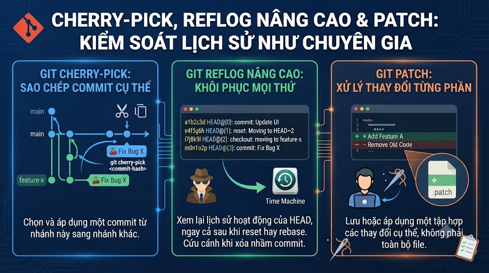

# cherry-pick, reflog Nâng Cao & Patch: Kiểm Soát Lịch Sử Như Chuyên Gia



Bài này đi vào nhóm Advanced — những kỹ năng phân biệt developer biết Git cơ bản với developer thực sự thành thạo. **cherry-pick** để lấy đúng commit cần thiết mà không merge cả branch. **reflog** để recover bất kỳ tình huống nào tưởng chừng đã mất. **Patch** để share code khi không có remote chung. Tất cả đều có use cases thực tế xảy ra thường xuyên trong team.

## 1\. git cherry-pick — Lấy Đúng Commit Cần Thiết

### Khái Niệm

```java
cherry-pick = áp dụng changes của một commit CỤ THỂ
              vào branch hiện tại, tạo commit MỚI

Khác với merge: merge lấy tất cả commits của branch
cherry-pick:    chỉ lấy đúng commit bạn chỉ định
```

**Diagram:**

```java
Trước cherry-pick:
  main:    A ← B ← C
  feature: A ← D ← E ← F

  Chỉ muốn lấy commit E (bugfix) vào main
  Không muốn lấy D và F (chưa xong)

Sau git cherry-pick E (trên main):
  main:    A ← B ← C ← E'  (E' = bản copy của E, hash mới)
  feature: A ← D ← E ← F  (không thay đổi)

→ E' có cùng nội dung với E
→ Nhưng hash khác vì parent khác
```

### 2\. Cherry-pick Cơ Bản

```bash
# ─── Cherry-pick 1 commit ───

# Lấy commit hash cần cherry-pick
git log --oneline feature/payment
# f6g7h8i feat: add VNPay integration
# e5f6a7b fix: resolve payment timeout  ← chỉ muốn cái này
# d4e5f6a WIP: payment gateway

# Cherry-pick vào main
git switch main
git cherry-pick e5f6a7b

# Output:
# [main h9i0j1k] fix: resolve payment timeout
# 1 file changed, 3 insertions(+), 1 deletion(-)

# ─── Cherry-pick nhiều commits (range) ───

# Cherry-pick từ D đến F (exclusive D, inclusive F)
git cherry-pick D..F

# Cherry-pick inclusive cả D
git cherry-pick D^..F   # ^ = cha của D, tức là bắt đầu từ D

# Cherry-pick list commits cụ thể
git cherry-pick abc1234 def5678 ghi9012
# → Apply từng commit theo thứ tự

# ─── Options hữu ích ───

# Cherry-pick không commit ngay (để edit rồi commit)
git cherry-pick abc1234 --no-commit
git cherry-pick abc1234 -n   # shorthand
# → Staged changes, chưa commit → edit nếu cần → git commit

# Cherry-pick với message mới
git cherry-pick abc1234 --edit
git cherry-pick abc1234 -e   # shorthand
# → Mở editor để sửa commit message trước khi commit

# Cherry-pick và giữ author gốc (thay vì dùng committer)
git cherry-pick abc1234 --signoff
# → Thêm "Signed-off-by: Your Name" vào message

# Cherry-pick từ remote branch (không cần checkout)
git fetch origin
git cherry-pick origin/hotfix/payment-bug
```

### 3\. Xử Lý Conflict Trong Cherry-pick

```bash
# Cherry-pick gặp conflict
git cherry-pick abc1234
# CONFLICT (content): Merge conflict in PaymentService.java
# error: could not apply abc1234... fix: resolve payment timeout

# Xem status
git status
# You are currently cherry-picking commit abc1234.

# Giải quyết conflict như bình thường
# ... edit file ...
git add PaymentService.java

# Tiếp tục cherry-pick
git cherry-pick --continue

# Bỏ qua commit này và tiếp tục (khi cherry-pick range)
git cherry-pick --skip

# Hủy toàn bộ cherry-pick
git cherry-pick --abort
```

### 4\. Use Cases Thực Tế Của Cherry-pick

```bash
# ─── Use Case 1: Backport hotfix ───
# Bug fix trên develop branch, cần apply vào main (production)

git log --oneline develop
# h8i9j0k feat: new feature (chưa stable)
# g7h8i9j fix(payment): CRITICAL - fix payment data loss  ← cần cái này
# f6g7h8i feat: another feature (chưa stable)

git switch main
git cherry-pick g7h8i9j
git push origin main   # deploy fix lên production

# ─── Use Case 2: Lấy feature từ abandoned branch ───
# Developer nghỉ việc, branch của họ có code tốt

git log --oneline feature/abandoned-by-john
# last3 feat: useful utility functions  ← muốn cái này
# last2 WIP: half-done feature
# last1 Initial implementation

git cherry-pick last3   # chỉ lấy utility functions

# ─── Use Case 3: Undo cherry-pick ───
# Lỡ cherry-pick nhầm commit

# Cách 1: Revert commit vừa cherry-pick
git revert HEAD   # undo commit vừa cherry-pick

# Cách 2: Reset (nếu chưa push)
git reset --hard HEAD~1

# ─── Use Case 4: Feature toggle deploy ───
# Cherry-pick chỉ những commits đã hoàn chỉnh

git log --oneline feature/big-feature
# e: feat: component E (done)
# d: feat: component D (done)
# c: WIP: component C (not ready)
# b: feat: component B (done)
# a: feat: component A (done)

# Chỉ deploy A, B, D, E (bỏ C)
git switch release/v1.2
git cherry-pick a b d e
```

## 5\. git reflog Nâng Cao

### Hiểu Reflog Sâu Hơn

```bash
# reflog lưu mọi thao tác HEAD (90 ngày mặc định)
git reflog show HEAD
# hoặc ngắn gọn hơn:
git reflog

# Output:
# e5f6a7b (HEAD → main) HEAD@{0}: cherry-pick: fix payment timeout
# d4e5f6a HEAD@{1}: reset: moving to HEAD~2
# c3d4e5f HEAD@{2}: commit: feat: add email notification
# b2c3d4e HEAD@{3}: merge feature/payment: Fast-forward
# a1b2c3d HEAD@{4}: checkout: moving from feature to main
# f0e1d2c HEAD@{5}: rebase (finish): refs/heads/feature/payment
# e9d0c1b HEAD@{6}: rebase (pick): fix: payment validation
# d8c9b0a HEAD@{7}: rebase (pick): feat: add payment gateway
# c7b8a9f HEAD@{8}: rebase (start): checkout main

# Xem reflog của 1 branch cụ thể
git reflog show main
git reflog show feature/payment

# Xem với timestamps
git reflog --date=iso
git reflog --date=relative   # "2 hours ago"
```

### Recovery Scenarios

```bash
# ─── Scenario 1: Recover sau git reset --hard ───
git reset --hard HEAD~5   # lỡ tay!

git reflog
# Now: HEAD@{0} reset: moving to HEAD~5
# d4e5f6a HEAD@{1}: commit: feat: email  ← commit bị mất
# c3d4e5f HEAD@{2}: commit: fix: payment ← commit bị mất
# ...

# Recover về trạng thái TRƯỚC reset
git reset --hard HEAD@{1}   # = d4e5f6a
# Done! Commits được phục hồi

# ─── Scenario 2: Recover branch đã bị xóa ───
git branch -D feature/important  # lỡ xóa!

git reflog
# a1b2c3d HEAD@{2}: checkout: moving from feature/important to main
# → HEAD@{2} = trạng thái khi còn ở feature/important

# Tạo lại branch từ commit đó
git checkout -b feature/important a1b2c3d
# Hoặc
git branch feature/important a1b2c3d

# ─── Scenario 3: Recover commit mồ côi (orphan commit) ───
# Commit tồn tại nhưng không có branch nào trỏ đến

# Tìm commit mồ côi
git fsck --lost-found
# dangling commit abc1234
# dangling blob def5678

# Xem commit đó
git show abc1234

# Tạo branch từ commit mồ côi
git checkout -b recover/orphan abc1234

# ─── Scenario 4: Recover sau rebase gone wrong ───
git rebase main   # rebase làm mất commits quan trọng

git reflog
# HEAD@{0}: rebase (finish): ...
# HEAD@{5}: rebase (start): checkout main
# f6g7h8i HEAD@{6}: commit: feat: important feature  ← TRƯỚC rebase

# Về trạng thái trước rebase
git reset --hard HEAD@{6}
# → f6g7h8i: trạng thái trước khi rebase
```

### Reflog Expiry

```bash
# Xem config expiry
git config gc.reflogExpire      # default: 90 ngày
git config gc.reflogExpireUnreachable  # default: 30 ngày cho commits không reachable

# Đừng xóa reflog quá sớm — tăng retention nếu cần
git config --global gc.reflogExpire "180 days"
git config --global gc.reflogExpireUnreachable "90 days"

# Manually expire reflog (cẩn thận!)
git reflog expire --expire=now --all    # xóa tất cả reflog ← không làm!
```

## 6\. git patch — Chia Sẻ Code Không Qua Remote

Patch hữu ích khi:

*   Không có quyền push lên remote
    
*   Muốn email code cho người khác review
    
*   Apply changes qua email/Slack
    

```bash
# ─── Tạo patch file ───

# Patch cho 3 commits gần nhất
git format-patch -3

# Output:
# 0001-feat-add-payment-gateway.patch
# 0002-feat-add-payment-controller.patch
# 0003-fix-resolve-payment-timeout.patch

# Patch cho 1 commit cụ thể
git format-patch -1 abc1234

# Patch cho toàn bộ feature branch (so với main)
git format-patch main..feature/payment

# Patch ra 1 file duy nhất
git format-patch main..feature/payment --stdout > feature-payment.patch

# Patch với binary files
git format-patch -3 --binary

# ─── Xem nội dung patch ───
cat 0001-feat-add-payment-gateway.patch
# From abc1234 Mon Sep 17 00:00:00 2001
# From: Nam Nguyen <nam@nguyentienkhoi.hashnode.dev>
# Date: Sat, 15 Mar 2025 10:00:00 +0700
# Subject: [PATCH 1/3] feat: add payment gateway
#
# ---
#  src/PaymentService.java | 45 ++++++++++++++++
#  1 file changed, 45 insertions(+)
# ... diff content ...

# ─── Apply patch ───

# Check patch có apply được không (dry run)
git apply --check feature-payment.patch

# Apply patch (không tạo commit)
git apply feature-payment.patch
# → Changes vào working directory

# Apply patch với whitespace warnings
git apply --whitespace=warn feature-payment.patch

# Apply và tạo commit (giữ nguyên author, date, message)
git am feature-payment.patch
# git am = apply mailbox format

# Apply nhiều patches
git am *.patch

# Apply nếu có conflict
git am --reject feature-payment.patch
# → Tạo *.rej files cho conflicts
# → Giải quyết thủ công rồi:
git am --continue
# Hoặc bỏ qua patch này:
git am --skip
# Hoặc hủy:
git am --abort

# ─── Quick diff patch (không phải mailbox format) ───

# Tạo simple diff
git diff > changes.patch
git diff HEAD~3 HEAD > last3.patch
git diff main feature/payment > feature.patch

# Apply simple diff
git apply changes.patch
```

## 7\. Xóa Sạch Sensitive Data Khỏi History

```bash
# Lỡ commit API key, password vào Git history
# Cần xóa khỏi toàn bộ lịch sử

# ─── Dùng git filter-repo (khuyến nghị) ───
pip install git-filter-repo

# Xóa file cụ thể khỏi toàn bộ history
git filter-repo --path secrets.properties --invert-paths

# Xóa nhiều files
git filter-repo --path config/secrets.yml --path .env --invert-paths

# Xóa pattern
git filter-repo --path-glob "*.key" --invert-paths

# Thay thế sensitive text trong tất cả commits
git filter-repo --replace-text replacements.txt
# replacements.txt:
# sk_live_abc123==>REMOVED_API_KEY
# mypassword123==>REMOVED_PASSWORD

# ─── Sau khi filter-repo ───
# Force push (vì history đã thay đổi)
git push --force --all
git push --force --tags

# ⚠️ Tất cả người clone cần:
git pull --rebase
# Hoặc clone lại từ đầu

# ─── Invalidate leaked credentials ngay! ───
# Dù đã xóa khỏi history, credentials đã bị expose
# → Rotate API keys, change passwords NGAY LẬP TỨC
```

## 8\. Thực Hành Tổng Hợp

```bash
# ─── Scenario 1: Backport hotfix ───

# Situation: Bug critical trên main/production
# Fix đã có trên develop branch
git log --oneline develop | head -5
# g7h8i9j fix(payment): CRITICAL payment data loss
# f6g7h8i feat: new UI (not ready for prod)
# e5f6a7b feat: another feature

# Backport hotfix sang main
git switch main
git cherry-pick g7h8i9j
git tag -a v1.0.1 -m "Hotfix: payment data loss"
git push origin main --tags

# ─── Scenario 2: Team member có commits hay nhưng branch abandoned ───
git log --oneline feature/great-utils
# d3e4f5a feat: add DateUtils helper (great!)
# c2d3e4f feat: add StringUtils helper (great!)
# b1c2d3e WIP: half-baked feature (don't want)

# Chỉ cherry-pick 2 commits hay
git switch main
git cherry-pick d3e4f5a c2d3e4f

# Hoặc range
git cherry-pick c2d3e4f^..d3e4f5a

# ─── Scenario 3: Recover từ disaster ───

# Lỡ chạy: git reset --hard HEAD~10
# Mất 10 commits quan trọng!

git reflog
# HEAD@{0}: reset: moving to HEAD~10
# HEAD@{1}: commit: feat: very important feature
# ...

# Xem reflog có timestamp
git reflog --date=iso | head -5
# d4e5f6a HEAD@{1} 2025-03-15 14:30:00 +0700: commit: very important feature

# Recover
git reset --hard HEAD@{1}
# Hoặc tạo branch để review trước
git checkout -b recover/important-work HEAD@{1}

# ─── Scenario 4: Tạo patch cho code review offline ───

git format-patch main..feature/payment -o /tmp/patches/
ls /tmp/patches/
# 0001-feat-add-payment-gateway.patch
# 0002-feat-add-payment-controller.patch
# 0003-test-add-payment-unit-tests.patch

# Gửi folder /tmp/patches/ qua email
# Reviewer apply:
git am /tmp/patches/*.patch
# → Có đầy đủ commits với author, date, message gốc
```

## Tổng Kết

```java
cherry-pick:  Lấy đúng commit cần thiết, không merge cả branch
              → Backport hotfix
              → Lấy commits từ abandoned branch
              → Feature toggle

reflog:       Mạng lưới an toàn tối thượng
              → Recover sau reset --hard
              → Recover branch đã xóa
              → Về trạng thái bất kỳ trong 90 ngày

patch:        Chia sẻ code không qua remote
              → Code review offline
              → Backport qua email
              → Apply changes từ nguồn khác
```


| Command | Tác dụng |
|---|---|
| git cherry-pick <hash> | Apply commit vào branch hiện tại |
| git cherry-pick A..B | Cherry-pick range commits |
| git cherry-pick -n | Cherry-pick không commit |
| git cherry-pick --continue/abort | Tiếp tục/hủy sau conflict |
| git reflog | Xem lịch sử HEAD |
| git reset --hard HEAD@{N} | Recover về trạng thái N |
| git format-patch -N | Tạo patch N commits |
| git am *.patch | Apply patch files |
| git apply patch.diff | Apply diff patch |


Bài tiếp theo chúng ta sẽ học **Submodule và Subtree** — quản lý dependencies và code sharing giữa nhiều repositories.

