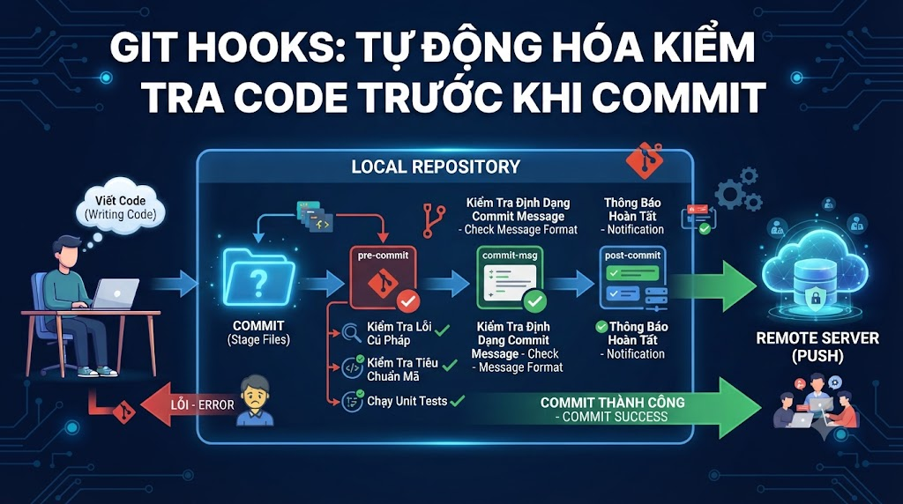

# Git Hooks: Tự Động Hóa Kiểm Tra Code Trước Khi Commit



Bạn đã bao giờ push code lên rồi CI mới báo lỗi format, test fail, hay commit message sai convention? **Git Hooks** giải quyết điều này — tự động chạy scripts tại các điểm quan trọng trong Git workflow, bắt lỗi ngay trên máy developer trước khi code lên remote. Bài này xây dựng hệ thống hooks hoàn chỉnh cho foxdev-backend: tự động format, lint, test và validate commit message.

## 1\. Git Hooks Là Gì?

**Hooks** = scripts tự động chạy khi Git thực hiện một hành động cụ thể.

```java
git commit      git push        git merge
    │               │               │
    ▼               ▼               ▼
pre-commit    pre-push        post-merge
commit-msg    post-push       pre-merge-commit
post-commit
```

**Tất cả hooks nằm trong** `.git/hooks/`**:**

```bash
ls .git/hooks/
# applypatch-msg.sample
# commit-msg.sample
# pre-commit.sample        ← đây là các mẫu có sẵn
# pre-push.sample
# pre-rebase.sample
# prepare-commit-msg.sample
# update.sample
# ... và nhiều hơn nữa

# Để activate hook: bỏ ".sample" đi
cp .git/hooks/pre-commit.sample .git/hooks/pre-commit
chmod +x .git/hooks/pre-commit
```

**Vấn đề với hooks trong** `.git/hooks/`**:**

```java
.git/ không được track bởi Git
→ Mỗi developer clone về phải setup lại thủ công
→ Không thể share hooks trong team

Giải pháp: Husky (cho JavaScript/Node projects)
           hoặc custom hooks trong thư mục tracked
```

## 2\. Client-side Hooks Quan Trọng

### pre-commit

Chạy TRƯỚC khi tạo commit. Exit code non-zero → commit bị hủy.

```bash
# .git/hooks/pre-commit
#!/bin/bash

echo "Running pre-commit checks..."

# ─── Check 1: Java code format với Checkstyle ───
echo "→ Checking code style..."
mvn checkstyle:check -q
if [ $? -ne 0 ]; then
    echo "❌ Checkstyle failed. Fix formatting issues before committing."
    exit 1
fi

# ─── Check 2: Run unit tests ───
echo "→ Running unit tests..."
mvn test -q
if [ $? -ne 0 ]; then
    echo "❌ Tests failed. Fix failing tests before committing."
    exit 1
fi

# ─── Check 3: No debug code ───
echo "→ Checking for debug code..."
if git diff --cached --name-only | xargs grep -l "System.out.println\|TODO: REMOVE\|FIXME: DEBUG" 2>/dev/null; then
    echo "❌ Found debug code. Remove System.out.println and debug comments."
    exit 1
fi

# ─── Check 4: No large files ───
echo "→ Checking file sizes..."
MAX_FILE_SIZE=5242880  # 5MB in bytes
for file in $(git diff --cached --name-only); do
    if [ -f "$file" ]; then
        size=$(wc -c < "$file")
        if [ $size -gt $MAX_FILE_SIZE ]; then
            echo "❌ File $file is too large ($(($size/1024/1024))MB). Max 5MB."
            exit 1
        fi
    fi
done

# ─── Check 5: No secrets/credentials ───
echo "→ Scanning for secrets..."
PATTERNS=(
    "password\s*=\s*['\"][^'\"]{4,}"
    "api_key\s*=\s*['\"][^'\"]{10,}"
    "secret\s*=\s*['\"][^'\"]{10,}"
    "sk_live_"
    "AKIA[0-9A-Z]{16}"  # AWS Access Key
)

for pattern in "${PATTERNS[@]}"; do
    if git diff --cached | grep -iE "$pattern" > /dev/null 2>&1; then
        echo "❌ Potential secret detected: $pattern"
        echo "   Remove sensitive data before committing."
        exit 1
    fi
done

echo "✅ All pre-commit checks passed!"
exit 0
```

### commit-msg

Chạy SAU khi user nhập commit message, TRƯỚC khi commit được lưu. Dùng để validate commit message format.

```bash
# .git/hooks/commit-msg
#!/bin/bash

# $1 = đường dẫn đến file chứa commit message
COMMIT_MSG_FILE=$1
COMMIT_MSG=$(cat "$COMMIT_MSG_FILE")

echo "Validating commit message..."

# ─── Conventional Commits format ───
# Regex: type(scope): description
CONVENTIONAL_PATTERN="^(feat|fix|docs|style|refactor|perf|test|build|ci|chore|revert)(\(.+\))?: .{1,72}"
MERGE_PATTERN="^Merge "
REVERT_PATTERN="^Revert "

# Bỏ qua merge commits và revert commits
if echo "$COMMIT_MSG" | grep -qE "^(Merge|Revert)"; then
    exit 0
fi

# Validate Conventional Commits
if ! echo "$COMMIT_MSG" | grep -qE "$CONVENTIONAL_PATTERN"; then
    echo ""
    echo "❌ Invalid commit message format!"
    echo ""
    echo "Expected format:"
    echo "  type(scope): description"
    echo ""
    echo "Types: feat, fix, docs, style, refactor, perf, test, build, ci, chore, revert"
    echo ""
    echo "Examples:"
    echo "  feat(payment): add VNPay integration"
    echo "  fix(auth): resolve token expiration"
    echo "  docs: update API documentation"
    echo ""
    echo "Your message: $COMMIT_MSG"
    echo ""
    exit 1
fi

# ─── Description length check ───
DESCRIPTION=$(echo "$COMMIT_MSG" | head -1 | sed 's/^[^:]*: //')
if [ ${#DESCRIPTION} -gt 72 ]; then
    echo "❌ Commit subject too long (${#DESCRIPTION} chars). Max 72."
    exit 1
fi

# ─── No dot at end ───
if echo "$COMMIT_MSG" | head -1 | grep -q '\.$'; then
    echo "❌ Commit subject should not end with a period."
    exit 1
fi

echo "✅ Commit message is valid!"
exit 0
```

### prepare-commit-msg

Chạy TRƯỚC khi editor mở — dùng để inject template vào commit message:

```bash
# .git/hooks/prepare-commit-msg
#!/bin/bash

COMMIT_MSG_FILE=$1
COMMIT_SOURCE=$2    # merge, squash, commit, etc.

# Chỉ inject template cho commit thường (không phải merge/squash)
if [ -z "$COMMIT_SOURCE" ]; then
    BRANCH=$(git symbolic-ref --short HEAD 2>/dev/null)

    # Extract ticket number từ branch name
    # feature/TJ-123-payment → TJ-123
    TICKET=$(echo "$BRANCH" | grep -oE 'TJ-[0-9]+')

    if [ -n "$TICKET" ]; then
        # Prepend ticket number vào message hiện tại
        CURRENT_MSG=$(cat "$COMMIT_MSG_FILE")
        echo -e "\n\nRefs: $TICKET" >> "$COMMIT_MSG_FILE"
        # → Tự động thêm "Refs: TJ-123" vào cuối mỗi commit
    fi
fi
```

### pre-push

Chạy TRƯỚC khi `git push`. Dùng để chạy tests nặng hơn (integration tests):

```bash
# .git/hooks/pre-push
#!/bin/bash

REMOTE="$1"
URL="$2"

echo "Running pre-push checks for remote: $REMOTE"

# Lấy branch đang push
LOCAL_REF=$(git symbolic-ref HEAD 2>/dev/null)
BRANCH=${LOCAL_REF#refs/heads/}

# ─── Không cho phép push trực tiếp vào main ───
if [[ "$REMOTE" == "origin" && "$BRANCH" == "main" ]]; then
    echo "❌ Direct push to main branch is not allowed!"
    echo "   Please create a Pull Request instead."
    exit 1
fi

# ─── Chạy integration tests trước khi push ───
if [[ "$BRANCH" == release/* ]]; then
    echo "→ Running integration tests for release branch..."
    mvn verify -Dspring.profiles.active=test -q
    if [ $? -ne 0 ]; then
        echo "❌ Integration tests failed. Fix before pushing release branch."
        exit 1
    fi
fi

echo "✅ Pre-push checks passed!"
exit 0
```

### post-commit, post-merge

```bash
# .git/hooks/post-commit — chạy SAU khi commit thành công
#!/bin/bash
# Notification khi commit
echo "✅ Committed! Don't forget to push: git push"

# ─────────────────────────────────────────

# .git/hooks/post-merge — chạy SAU khi merge thành công
#!/bin/bash
# Tự động cài lại dependencies sau merge
if git diff HEAD@{1} HEAD --name-only | grep -q "pom.xml"; then
    echo "→ pom.xml changed, running mvn install..."
    mvn install -q -DskipTests
fi

if git diff HEAD@{1} HEAD --name-only | grep -q "package.json"; then
    echo "→ package.json changed, running npm install..."
    npm install --silent
fi
```

* * *

## 3\. Server-side Hooks

Server-side hooks chạy trên Git server (GitHub/GitLab managed, hoặc self-hosted Gitea/Bare repos):

```bash
# pre-receive — chạy khi nhận push, trước khi update refs
#!/bin/bash
# Kiểm tra force push vào protected branches
while read oldrev newrev refname; do
    branch="${refname#refs/heads/}"
    if [[ "$branch" == "main" || "$branch" == "develop" ]]; then
        # Kiểm tra có phải force push không
        if git merge-base --is-ancestor "$newrev" "$oldrev" 2>/dev/null; then
            echo "❌ Force push to protected branch '$branch' is not allowed!"
            exit 1
        fi
    fi
done

# update — chạy cho mỗi ref được update
# post-receive — chạy sau khi tất cả refs được update
```

## 4\. Husky — Hooks Cho JavaScript/Node Projects

**Husky** giải quyết vấn đề share hooks trong team — hooks được commit vào repo và tự động setup khi `npm install`.

```bash
# Cài Husky (trong frontend project)
cd foxdev-frontend
npm install --save-dev husky

# Init Husky
npx husky init
# → Tạo .husky/ directory (được track bởi Git)
# → Thêm "prepare": "husky" vào package.json scripts
```

### Setup Husky Hooks

```bash
# .husky/pre-commit
#!/bin/sh
. "$(dirname "$0")/_/husky.sh"

echo "Running pre-commit..."
npx lint-staged    # chỉ lint files đang staged
```

```json
// package.json
{
  "scripts": {
    "prepare": "husky",
    "lint": "eslint src --ext .ts,.tsx",
    "format": "prettier --write src",
    "test": "jest --passWithNoTests"
  },
  "lint-staged": {
    "src/**/*.{ts,tsx}": [
      "eslint --fix",
      "prettier --write",
      "jest --findRelatedTests --passWithNoTests"
    ],
    "src/**/*.{json,css,md}": [
      "prettier --write"
    ]
  },
  "devDependencies": {
    "husky": "^9.0.0",
    "lint-staged": "^15.0.0",
    "eslint": "^8.0.0",
    "prettier": "^3.0.0"
  }
}
```

```bash
# .husky/commit-msg
#!/bin/sh
. "$(dirname "$0")/_/husky.sh"

npx --no -- commitlint --edit $1
```

```javascript
// commitlint.config.js
module.exports = {
  extends: ['@commitlint/config-conventional'],
  rules: {
    'type-enum': [
      2,
      'always',
      ['feat', 'fix', 'docs', 'style', 'refactor', 'perf',
       'test', 'build', 'ci', 'chore', 'revert']
    ],
    'subject-max-length': [2, 'always', 72],
    'header-max-length': [2, 'always', 100],
  }
};
```

```bash
# .husky/pre-push
#!/bin/sh
. "$(dirname "$0")/_/husky.sh"

npm run test
```

## 5\. Custom Hooks Cho Java/Maven Projects

Vì Maven không có Husky equivalent, cần tạo script share hooks:

```bash
# scripts/install-hooks.sh
#!/bin/bash

HOOKS_DIR=".git/hooks"
SCRIPTS_DIR="scripts/hooks"

echo "Installing Git hooks..."

for hook in "$SCRIPTS_DIR"/*; do
    hook_name=$(basename "$hook")
    cp "$hook" "$HOOKS_DIR/$hook_name"
    chmod +x "$HOOKS_DIR/$hook_name"
    echo "  ✅ Installed: $hook_name"
done

echo "Done! Git hooks installed."
```

```java
Project structure:
foxdev-backend/
  scripts/
    install-hooks.sh       ← chạy 1 lần khi setup
    hooks/
      pre-commit           ← hook scripts được track
      commit-msg
      pre-push
  .git/
    hooks/                 ← chỉ là symlinks, không track
```

```bash
# README.md setup section
## Setup

1. Clone repository
2. Install hooks:
   chmod +x scripts/install-hooks.sh
   ./scripts/install-hooks.sh
3. Done!
```

**Hoặc dùng Maven lifecycle:**

```xml
<!-- pom.xml: tự động install hooks khi mvn initialize -->
<plugin>
    <groupId>org.codehaus.mojo</groupId>
    <artifactId>exec-maven-plugin</artifactId>
    <executions>
        <execution>
            <id>install-git-hooks</id>
            <phase>initialize</phase>
            <goals><goal>exec</goal></goals>
            <configuration>
                <executable>bash</executable>
                <arguments>
                    <argument>scripts/install-hooks.sh</argument>
                </arguments>
            </configuration>
        </execution>
    </executions>
</plugin>
```

## 6\. Bypass Hooks Khi Cần

```bash
# Skip pre-commit hook (trường hợp khẩn cấp)
git commit --no-verify -m "hotfix: urgent production fix"
git commit -n -m "hotfix: urgent production fix"  # -n shorthand

# Skip pre-push hook
git push --no-verify

# ⚠️ Chỉ dùng --no-verify khi thực sự cần thiết
# → Lý do chấp nhận: commit WIP, sửa typo nhỏ
# → Không được: bỏ qua test fail thường xuyên
```

## 7\. Debug Hooks

```bash
# Thêm vào đầu hook để debug
#!/bin/bash
set -x   # print mỗi command trước khi chạy
# hoặc
set -e   # exit immediately nếu command fail

# Log hook execution
echo "[$(date)] pre-commit hook started" >> /tmp/git-hooks.log

# Test hook thủ công
bash .git/hooks/pre-commit
echo "Exit code: $?"

# Xem hook nào đang active
ls -la .git/hooks/ | grep -v ".sample"
```

## 8\. Thực Hành Tổng Hợp

```bash
# Setup đầy đủ cho foxdev-backend

mkdir -p scripts/hooks

# 1. pre-commit: format check + test + secrets scan
cat > scripts/hooks/pre-commit << 'HOOK'
#!/bin/bash
set -e

echo "🔍 Running pre-commit checks..."

# Chỉ check files đang staged
STAGED_JAVA=$(git diff --cached --name-only --diff-filter=ACM | grep "\.java$" || true)

if [ -n "$STAGED_JAVA" ]; then
    echo "→ Running Checkstyle on staged Java files..."
    mvn checkstyle:check -q 2>/dev/null || {
        echo "❌ Checkstyle violations found!"
        mvn checkstyle:check 2>&1 | grep "ERROR"
        echo ""
        echo "Fix with: mvn checkstyle:check"
        exit 1
    }

    echo "→ Running unit tests..."
    mvn test -q -DskipITs 2>/dev/null || {
        echo "❌ Unit tests failed!"
        exit 1
    }
fi

echo "→ Scanning for secrets..."
SECRET_PATTERNS=(
    "password\s*=\s*['\"][^'\"]{4,}"
    "AKIA[0-9A-Z]{16}"
    "sk_live_[a-zA-Z0-9]+"
    "ghp_[a-zA-Z0-9]{36}"
)

for pattern in "${SECRET_PATTERNS[@]}"; do
    if git diff --cached | grep -iE "$pattern" > /dev/null 2>&1; then
        echo "❌ Possible secret pattern found: $pattern"
        exit 1
    fi
done

echo "✅ pre-commit checks passed!"
HOOK

# 2. commit-msg: Conventional Commits
cat > scripts/hooks/commit-msg << 'HOOK'
#!/bin/bash

MSG=$(cat "$1")
PATTERN="^(feat|fix|docs|style|refactor|perf|test|build|ci|chore|revert)(\(.+\))!?: .{1,72}$"

# Skip merge/revert/WIP
if echo "$MSG" | grep -qE "^(Merge|Revert|WIP)"; then
    exit 0
fi

if ! echo "$MSG" | head -1 | grep -qE "$PATTERN"; then
    echo ""
    echo "❌ Invalid commit message!"
    echo "   Format: type(scope): description"
    echo "   Types:  feat fix docs style refactor perf test build ci chore revert"
    echo "   Your:   $MSG"
    echo ""
    exit 1
fi

echo "✅ Commit message OK"
HOOK

# 3. pre-push: protect main
cat > scripts/hooks/pre-push << 'HOOK'
#!/bin/bash

REMOTE="$1"
BRANCH=$(git symbolic-ref --short HEAD 2>/dev/null)

if [[ "$REMOTE" == "origin" ]] && [[ "$BRANCH" == "main" || "$BRANCH" == "develop" ]]; then
    echo "❌ Direct push to '$BRANCH' is not allowed!"
    echo "   Please create a Pull Request."
    exit 1
fi

echo "✅ pre-push OK"
HOOK

# 4. Install script
cat > scripts/install-hooks.sh << 'SCRIPT'
#!/bin/bash
HOOKS_DIR=".git/hooks"
SCRIPTS_DIR="scripts/hooks"

echo "Installing Git hooks for foxdev-backend..."
mkdir -p "$HOOKS_DIR"

for hook in "$SCRIPTS_DIR"/*; do
    name=$(basename "$hook")
    cp "$hook" "$HOOKS_DIR/$name"
    chmod +x "$HOOKS_DIR/$name"
    echo "  ✅ $name"
done

echo ""
echo "Git hooks installed! Happy coding 🚀"
SCRIPT

chmod +x scripts/install-hooks.sh

# 5. Chạy một lần khi setup
./scripts/install-hooks.sh

# 6. Thêm vào repo
git add scripts/
git commit -m "chore: add Git hooks for code quality automation"

# Test hooks
echo "System.out.println('debug');" >> src/UserService.java
git add src/UserService.java
git commit -m "test commit"
# → ❌ Found debug code. Hooks hoạt động!
git restore src/UserService.java
```

## Tổng Kết

```java
Client-side hooks (trên máy developer):
  pre-commit:          Chạy trước commit — format, lint, test
  commit-msg:          Validate commit message format
  prepare-commit-msg:  Inject template vào message
  pre-push:            Chạy trước push — integration tests

Server-side hooks (trên Git server):
  pre-receive:         Validate trước khi accept push
  update:              Validate từng ref
  post-receive:        Actions sau khi accept push

Tools:
  Husky:      Chia sẻ hooks trong JavaScript projects
  Custom:     scripts/hooks/ + install script cho Java
```


| Hook | Khi nào chạy | Dùng để |
|---|---|---|
| pre-commit | Trước commit | Lint, format, test, secrets scan |
| commit-msg | Sau khi nhập message | Validate Conventional Commits |
| prepare-commit-msg | Trước khi mở editor | Inject ticket number, template |
| pre-push | Trước push | Integration tests, protect branches |
| post-commit | Sau commit | Notification |
| post-merge | Sau merge | Auto install dependencies |


Bài tiếp theo chúng ta sẽ học **Git Internals** — hiểu Git hoạt động từ bên trong: objects, pack files, garbage collection và tại sao Git nhanh như vậy.

