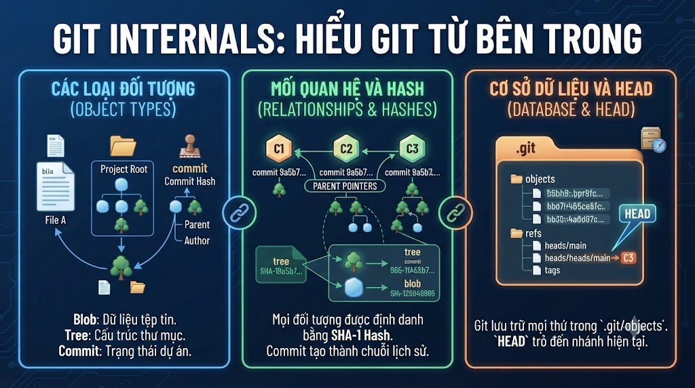

# Git Internals: Hiểu Git Từ Bên Trong



Bạn đã dùng Git mỗi ngày, nhưng bạn có biết tại sao `git branch` gần như tức thì dù có hàng nghìn commits? Tại sao `git checkout` chỉ mất vài giây dù file thay đổi hàng trăm? Tại sao Git gần như không bao giờ mất data? Tất cả bắt nguồn từ cách Git thiết kế storage layer. Hiểu internals giúp bạn tự tin debug mọi vấn đề và không còn sợ Git nữa.

## 1\. Git Là Content-addressed Storage

**Git không lưu diffs** — Git lưu **snapshots** (ảnh chụp toàn bộ project tại mỗi commit).

Mọi object trong Git được định danh bởi **SHA-1 hash** của nội dung:

```bash
# Xem hash của một string
echo "Hello FoxDev" | git hash-object --stdin
# 4a5e4a62b4c68e5c98b5e69d3bfc4d8a7e2f1abc

# Lưu vào Git object store
echo "Hello FoxDev" | git hash-object -w --stdin
# 4a5e4a62b4c68e5c98b5e69d3bfc4d8a7e2f1abc

# Object được lưu ở:
ls .git/objects/4a/
# 5e4a62b4c68e5c98b5e69d3bfc4d8a7e2f1abc
# → 2 ký tự đầu = thư mục, còn lại = filename
```

**Content-addressed nghĩa là:**

```java
Cùng nội dung → luôn cùng hash
→ Git không bao giờ lưu trùng nội dung
→ Nếu 100 files có cùng nội dung → chỉ 1 object được lưu
→ Verification tự động: hash sai = data bị corrupt
```

## 2\. Bốn Loại Git Objects

### 2.1 Blob — Nội Dung File

```bash
# Xem type của object
git cat-file -t HEAD:src/UserService.java
# blob

# Xem nội dung
git cat-file -p HEAD:src/UserService.java
# package com.foxdev;
# ...

# Tạo blob thủ công
echo "public class Test {}" | git hash-object -w --stdin
# abc1234...

# Verify
git cat-file -t abc1234
# blob
git cat-file -p abc1234
# public class Test {}
```

**Blob không chứa:**

*   Tên file (tên file được lưu ở tree)
    
*   Permissions (được lưu ở tree)
    
*   Ngày tạo (không được lưu trong Git data model)
    

### 2.2 Tree — Cấu Trúc Thư Mục

```bash
# Xem tree của commit hiện tại
git cat-file -p HEAD^{tree}
# 100644 blob f3a1b2c README.md
# 100644 blob d4e5f6a pom.xml
# 040000 tree a7b8c9d src

# Đào sâu vào subtree
git cat-file -p a7b8c9d
# 040000 tree b8c9d0e main
# 040000 tree c9d0e1f test

# Format: mode type hash name
# mode:
#   100644 = regular file
#   100755 = executable file
#   120000 = symbolic link
#   040000 = directory (subtree)
#   160000 = submodule commit

# Tạo tree thủ công
git update-index --add --cacheinfo 100644 \
    $(echo "Hello" | git hash-object -w --stdin) hello.txt
git write-tree
# def5678...
```

### 2.3 Commit Object

```bash
# Xem commit object
git cat-file -p HEAD
# tree a7b8c9d1e2f3a4b5c6d7e8f9a0b1c2d3e4f5a6b7
# parent f1e2d3c4b5a6f7e8d9c0b1a2f3e4d5c6b7a8f9e0
# author Nam Nguyen <nam@nguyentienkhoi.hashnode.dev> 1710000000 +0700
# committer Nam Nguyen <nam@nguyentienkhoi.hashnode.dev> 1710000000 +0700
#
# feat(payment): add VNPay integration
#
# Implement complete VNPay payment flow...

# Trường "tree": SHA-1 của root tree (snapshot toàn bộ project)
# Trường "parent": commit cha (merge commit có 2 parents)
# "author" vs "committer":
#   author = người viết code
#   committer = người tạo commit (khác nhau khi cherry-pick, rebase)
```

### 2.4 Tag Object

```bash
# Annotated tag (khác lightweight tag)
git cat-file -p v1.0.0
# object abc1234...   ← commit được tag
# type commit
# tag v1.0.0
# tagger Nam Nguyen <nam@nguyentienkhoi.hashnode.dev> 1710000000 +0700
#
# Release version 1.0.0

# Lightweight tag chỉ là ref file, không phải object
cat .git/refs/tags/v1.0.0-lite
# abc1234...   ← trỏ thẳng đến commit hash
```

## 3\. Refs — Con Trỏ Đến Commits

```bash
# Refs = tên thân thiện trỏ đến commit hash
ls .git/refs/
# heads/    ← local branches
# remotes/  ← remote tracking branches
# tags/     ← tags

# Local branches
cat .git/refs/heads/main
# abc1234...   ← hash của latest commit trên main

cat .git/refs/heads/feature/payment
# def5678...

# Remote tracking
cat .git/refs/remotes/origin/main
# ghi9012...

# HEAD: trỏ đến current branch (hoặc commit nếu detached)
cat .git/HEAD
# ref: refs/heads/main    ← symbolic ref đến main

# Detached HEAD:
# cat .git/HEAD → abc1234... (trỏ thẳng commit, không qua branch)

# Packed refs (khi nhiều refs được pack vào 1 file)
cat .git/packed-refs
# # pack-refs with: peeled fully-peeled sorted
# abc1234 refs/heads/main
# def5678 refs/heads/feature/payment
# ghi9012 refs/tags/v1.0.0
# ^hij1234 ← annotated tag: peeled commit hash
```

## 4\. Index (Staging Area)

```bash
# Index = binary file lưu trạng thái staging area
# .git/index

# Xem nội dung index (human-readable)
git ls-files --stage
# 100644 abc1234 0	README.md
# 100644 def5678 0	pom.xml
# 100644 ghi9012 0	src/UserService.java
# Format: mode hash stage_number filename

# Stage numbers:
# 0 = normal (no conflict)
# 1 = base (common ancestor) — khi conflict
# 2 = ours (HEAD version) — khi conflict
# 3 = theirs (incoming) — khi conflict

# Đây là lý do git checkout --ours/--theirs hoạt động
# Git chọn từ stage 2 hoặc stage 3

# Xem index stats (không download content)
git ls-files -v
# H README.md     ← H = hashed (in index and unchanged)
# h pom.xml       ← h = skip-worktree
# M UserService.java ← M = merge conflict
```

## 5\. Object Storage — Cách Lưu Trên Disk

### Loose Objects

```bash
# Mỗi object = 1 file trong .git/objects/
ls .git/objects/
# ab/  cd/  ef/  ...  info/  pack/
# → 256 thư mục (hex 00-ff)
# → Mỗi thư mục có thể có nhiều files

ls .git/objects/ab/
# c1234d5e6f7a8b9c0d1e2f3a4b5c6d7e8f9a0b

# File được compress bằng zlib
# Xem bằng git cat-file, không đọc trực tiếp được

# Đếm số loose objects
git count-objects
# 42 objects, 328 kilobytes

# Xem chi tiết
git count-objects -v
# count: 42
# size: 328
# in-pack: 1234
# packs: 2
# size-pack: 2048
# prune-packable: 0
# garbage: 0
# size-garbage: 0
```

### Pack Files

Khi nhiều loose objects tích lũy, Git gom chúng vào **pack files** — lưu hiệu quả hơn bằng delta compression:

```bash
# Xem pack files
ls .git/objects/pack/
# pack-abc123.idx   ← index file (tra cứu nhanh)
# pack-abc123.pack  ← data file (compressed objects)

# Tạo pack file thủ công
git gc --auto   # Git tự quyết định có cần gc không
git gc          # Force garbage collection + pack

# Xem objects trong pack file
git verify-pack -v .git/objects/pack/pack-abc123.pack | head -20
# abc1234 commit 230 161 12  ← hash type size offset
# def5678 blob   1024 512 173 1 abc1234  ← delta base = abc1234

# → "1 abc1234" = đây là delta của abc1234 (tiết kiệm space)
# → Git không lưu file đầy đủ, chỉ lưu diff với base

# Pack file cho phép:
# Git lưu 1000 versions của file lớn
# với tổng size ≈ 1 version + 999 deltas nhỏ
```

## 6\. Commit Graph — Cấu Trúc DAG

```bash
# Git history = Directed Acyclic Graph (DAG)
# Mỗi commit trỏ về cha (ngược chiều thời gian)

# Visualize DAG
git log --oneline --graph --all
# * h8i9j0k (HEAD → main) Merge feature/payment
# |\
# | * g7h8i9j feat: add payment controller
# | * f6g7h8i feat: add payment service
# * | e5f6a7b feat: add email notification
# |/
# * d4e5f6a initial setup

# Xem parents của commit
git cat-file -p h8i9j0k
# tree ...
# parent e5f6a7b    ← parent 1 (main history)
# parent g7h8i9j    ← parent 2 (merged branch)
# → Merge commit có 2 parents

# Traverse ancestors
git rev-list HEAD         # tất cả commits từ HEAD
git rev-list HEAD --count # số commits
git rev-list HEAD~5..HEAD # 5 commits gần nhất
```

## 7\. Plumbing vs Porcelain Commands

```java
Porcelain (high-level, user-friendly):
  git add, git commit, git push, git log, git diff, git merge...

Plumbing (low-level, scripting):
  git cat-file     → đọc object content
  git hash-object  → tính hash + lưu object
  git ls-files     → xem index
  git update-index → update index
  git write-tree   → tạo tree từ index
  git commit-tree  → tạo commit từ tree
  git rev-parse    → parse revision names
  git rev-list     → list commits
  git diff-tree    → diff giữa 2 trees
  git pack-objects → tạo pack
  git unpack-objects → unpack pack
```

### Tạo Commit Thủ Công Bằng Plumbing

```bash
# Thực hành: tạo commit mà không dùng git add/commit

# Bước 1: Tạo blob cho file
BLOB_HASH=$(echo "public class Hello {}" | git hash-object -w --stdin)
echo "Blob: $BLOB_HASH"

# Bước 2: Tạo tree chứa blob
git update-index --add --cacheinfo 100644,$BLOB_HASH,Hello.java
TREE_HASH=$(git write-tree)
echo "Tree: $TREE_HASH"

# Bước 3: Tạo commit từ tree
COMMIT_HASH=$(echo "Manual commit" | git commit-tree $TREE_HASH)
echo "Commit: $COMMIT_HASH"

# Bước 4: Update branch ref để trỏ đến commit mới
git update-ref refs/heads/manual-branch $COMMIT_HASH

# Xem kết quả
git log manual-branch --oneline
# abc1234 Manual commit

# → Đây chính xác là những gì "git add . && git commit" làm bên dưới!
```

## 8\. git fsck — Kiểm Tra Tính Toàn Vẹn

```bash
# Kiểm tra repository có bị corrupt không
git fsck
# Checking object connectivity and validity.
# dangling blob abc1234  ← object không có ref trỏ đến (bình thường)
# dangling commit def5678

# Verbose
git fsck --full

# Tìm lost commits/blobs (orphan objects)
git fsck --lost-found
# → Copy objects vào .git/lost-found/

# Sau git fsck --lost-found:
ls .git/lost-found/other/   # blobs
ls .git/lost-found/commit/  # commits

# Xem lost commit
git show $(ls .git/lost-found/commit/ | head -1)
# → Có thể recover code tưởng đã mất!
```

## 9\. Garbage Collection

```bash
# Git tự chạy gc khi cần (> 6700 loose objects, > 50 unreachable refs)
git gc --auto

# Force gc
git gc

# Gc với log
git gc --aggressive   # optimize pack files mạnh hơn (chậm hơn)
# → Dùng khi repo quá lớn, muốn compress tối đa

# Gc specific
git prune           # xóa unreachable objects (loose)
git prune-packed    # xóa loose objects đã có trong pack

# Xóa reflog để gc có thể thu hồi commits
git reflog expire --expire=now --all
git gc --prune=now

# ⚠️ Sau khi gc aggressive, objects không thể recover
# → Luôn check trước khi gc aggressive
```

## 10\. Hiểu Tại Sao Git Nhanh

```java
Câu hỏi: git branch -c new-branch chỉ tốn 1ms?
Trả lời: Tạo branch = tạo 1 file 41 bytes (.git/refs/heads/new-branch)
         Không copy data, không rewrite files
         → Đó là tất cả!

Câu hỏi: git checkout branch-with-1000-commits nhanh như thế nào?
Trả lời: Đọc tree object của commit target
         So sánh với index hiện tại
         Chỉ update files có sự khác biệt (selective update)
         → Không phải copy tất cả!

Câu hỏi: Tại sao clone lần đầu chậm nhưng pull sau đó nhanh?
Trả lời: Clone = download tất cả objects (pack file)
         Pull = chỉ download pack với objects CÒN THIẾU
         Git dùng negotiation: "Tôi có đến object X, bạn thiếu gì?"

Câu hỏi: git log --oneline nhanh dù 100K commits?
Trả lời: Git đọc commit objects từ commit-graph file (cache)
         Không cần traverse full DAG
         → commit-graph được build bởi git gc
```

## 11\. Commit-graph và Multi-pack Index

```bash
# Commit-graph: cache cấu trúc DAG để tăng tốc git log
git commit-graph write --reachable
# → Tạo .git/objects/info/commit-graph

# Auto-update commit-graph
git config --global fetch.writeCommitGraph true
git config --global gc.writeCommitGraph true

# Multi-pack index: index chung cho nhiều pack files
git multi-pack-index write

# Kiểm tra tính hợp lệ
git commit-graph verify
git multi-pack-index verify

# Partial clone (fetch chỉ objects cần thiết)
git clone --filter=blob:none <url>   # không download blobs khi clone
# Blobs được download lazy khi cần

git clone --filter=tree:0 <url>      # không download trees
```

## 12\. Thực Hành — Khám Phá Repository

```bash
# Khám phá .git/ structure
cd foxdev-backend

# ─── Xem tổng quan ───
find .git -type f | grep -v pack | head -30
# .git/config
# .git/HEAD
# .git/index
# .git/COMMIT_EDITMSG    ← message của commit gần nhất
# .git/refs/heads/main
# .git/objects/ab/c123...

# ─── Traverse từ HEAD đến blobs ───
echo "=== HEAD ==="
cat .git/HEAD
# ref: refs/heads/main

echo "=== Latest commit hash ==="
COMMIT=$(cat .git/refs/heads/main)
echo $COMMIT

echo "=== Commit object ==="
git cat-file -p $COMMIT

echo "=== Root tree ==="
TREE=$(git cat-file -p $COMMIT | grep "^tree" | awk '{print $2}')
git cat-file -p $TREE

echo "=== File content (src/ subtree) ==="
SRC_TREE=$(git cat-file -p $TREE | grep "src$" | awk '{print $3}')
git cat-file -p $SRC_TREE

# ─── Size analysis ───
git count-objects -v
# count: X (loose objects)
# in-pack: Y (objects in pack files)
# size-pack: Z KB

# Files chiếm nhiều space nhất
git rev-list --all --objects | \
  git cat-file --batch-check='%(objecttype) %(objectname) %(objectsize) %(rest)' | \
  sort -k3 -rn | \
  head -10

# ─── Tìm commit đầu tiên ───
git rev-list --max-parents=0 HEAD
git log --oneline $(git rev-list --max-parents=0 HEAD)

# ─── Check object database integrity ───
git fsck --no-progress 2>&1 | head -10
```

## Tổng Kết

```java
Git Object Model:
  blob:   nội dung file
  tree:   cấu trúc thư mục + permissions
  commit: snapshot + metadata + parents
  tag:    annotated tag với metadata

Storage:
  Loose objects: .git/objects/ab/cdef...
  Pack files:    .git/objects/pack/*.pack + *.idx
  Delta compression: file mới = base + delta

Refs:
  .git/refs/heads/ = branches
  .git/refs/remotes/ = remote tracking
  .git/refs/tags/ = tags
  .git/HEAD = current branch/commit

Tại sao Git nhanh:
  Branch = 41 bytes
  Checkout = selective file update
  Pull = chỉ download missing objects
  Log = commit-graph cache
```


| Plumbing Command | Tác dụng |
|---|---|
| git cat-file -t <hash> | Xem type của object |
| git cat-file -p <hash> | Xem nội dung object |
| git hash-object -w | Tạo blob từ stdin/file |
| git ls-files --stage | Xem index |
| git rev-list HEAD | List all commits |
| git fsck | Kiểm tra tính toàn vẹn |
| git gc | Garbage collection |
| git count-objects -v | Thống kê objects |


Bài tiếp theo chúng ta chuyển sang **Team & Production section**: **Branching Strategies** — GitFlow, GitHub Flow, Trunk-based Development và khi nào chọn cái nào cho dự án.

