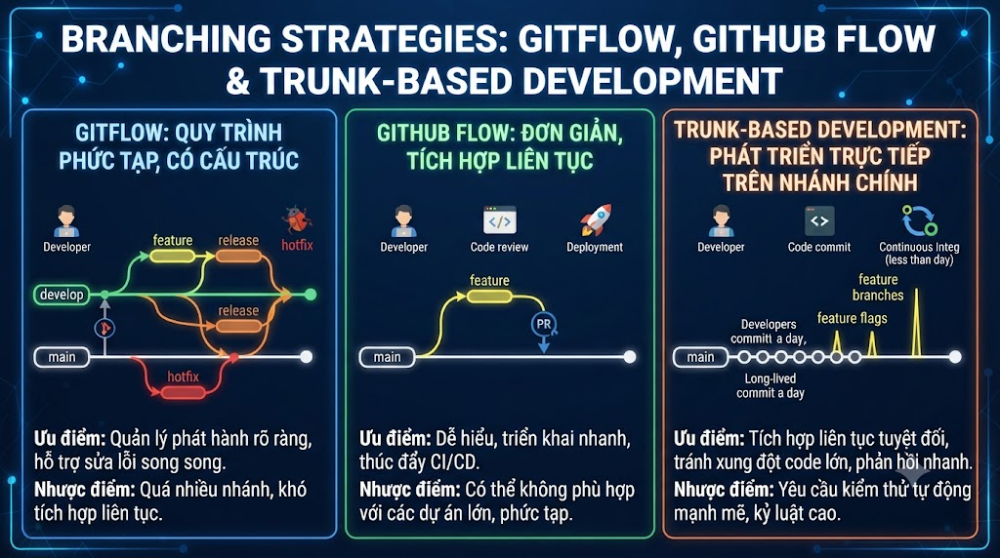

# Branching Strategies: GitFlow, GitHub Flow & Trunk-based Development



Đây là bài đầu tiên của section **Team & Production** — nơi Git không còn là công cụ cá nhân mà là nền tảng cộng tác của cả team. Không có một chiến lược branch nào phù hợp với mọi team — GitFlow phù hợp với release cycle dài, GitHub Flow phù hợp với CD nhanh, Trunk-based Development là nền tảng của DevOps hiện đại. Hiểu cả ba để chọn đúng cho dự án của bạn.

## 1\. Tại Sao Cần Branching Strategy?

```java
Không có strategy:
  Developer A push thẳng vào main
  Developer B push thẳng vào main
  Conflict liên tục, không ai biết code nào stable
  Deploy lúc nào cũng lo lắng

Với strategy:
  Quy tắc rõ ràng: branch nào dùng cho gì
  Main luôn stable và deployable
  Code review trước khi merge
  Rollback dễ dàng khi có vấn đề
```

## 2\. GitFlow — Cho Release Cycle Có Lịch Trình

### Tổng Quan

GitFlow được **Vincent Driessen** đề xuất năm 2010. Phù hợp khi bạn release theo schedule (ví dụ: mỗi 2 tuần, mỗi tháng).

```java
Branches chính (tồn tại vĩnh viễn):
  main     → Production code (luôn stable)
  develop  → Integration branch (latest development)

Branches hỗ trợ (tạm thời):
  feature/  → Tính năng mới
  release/  → Chuẩn bị release
  hotfix/   → Sửa lỗi khẩn trên production
```

### Luồng Hoàn Chỉnh

```java
                        ┌─────────────────────────────────────────┐
                        │              MAIN (Production)          │
                        └──┬─────────────────────────────────┬────┘
                           │ (init)                          │ (hotfix merge)
                           ▼                                 │
                        ┌─────────────────────────────────────────┐
                        │             DEVELOP                     │
                        └──┬──────────────────────────┬───────────┘
                           │                          │
               feature/A   │           feature/B      │
               ┌───────────┤           ┌──────────────┤
               │ feat: A1  │           │ feat: B1     │
               │ feat: A2  │           │ feat: B2     │
               └───────────►           └───────────────►
                 (merge to develop)       (merge to develop)
                                          │
                                    release/v1.0
                                    ┌─────────────┐
                                    │ bump version│
                                    │ fix bugs    │
                                    └──┬──────────┘
                                       │ merge to main + develop
                                       ▼
                                    tag: v1.0.0
```

### GitFlow Thực Hành

```bash
# ─── Cài git-flow extension (optional, giúp commands ngắn hơn) ───
# macOS: brew install git-flow
# Ubuntu: apt install git-flow

# ─── Setup GitFlow thủ công ───

# Khởi tạo
git switch main
git switch -c develop
git push -u origin develop

# ─── Feature branch ───

# Bắt đầu feature (từ develop)
git switch develop
git pull
git switch -c feature/payment-vnpay

# Code, commit...
git add . && git commit -m "feat(payment): add VNPay service"
git add . && git commit -m "feat(payment): add VNPay controller"
git add . && git commit -m "test(payment): add VNPay unit tests"

# Merge feature vào develop (qua PR hoặc local)
git switch develop
git merge --no-ff feature/payment-vnpay \
    -m "Merge feature/payment-vnpay into develop"
git push origin develop
git branch -d feature/payment-vnpay
git push origin --delete feature/payment-vnpay

# ─── Release branch ───

# Khi develop đã đủ features cho 1 release
git switch develop
git switch -c release/v1.2.0

# Chỉ làm trên release branch:
# - Bump version
# - Bug fixes (không add features mới!)
# - Update CHANGELOG
sed -i 's/0.0.1-SNAPSHOT/1.2.0/' pom.xml
git add pom.xml
git commit -m "chore(release): bump version to 1.2.0"

# Fix bugs nếu có trong QA
git commit -m "fix(payment): resolve edge case in VNPay callback"

# Merge vào main VÀ develop
git switch main
git merge --no-ff release/v1.2.0 \
    -m "Release v1.2.0: add VNPay payment integration"
git tag -a v1.2.0 -m "Release v1.2.0"
git push origin main --tags

git switch develop
git merge --no-ff release/v1.2.0 \
    -m "Merge release/v1.2.0 back into develop"
git push origin develop

# Xóa release branch
git branch -d release/v1.2.0
git push origin --delete release/v1.2.0

# ─── Hotfix branch ───

# Bug critical trên production
git switch main
git pull
git switch -c hotfix/payment-data-loss

git commit -m "fix(payment): prevent duplicate transaction processing"

# Merge vào main VÀ develop
git switch main
git merge --no-ff hotfix/payment-data-loss \
    -m "Hotfix v1.2.1: prevent payment data loss"
git tag -a v1.2.1 -m "Hotfix: prevent payment data loss"
git push origin main --tags

git switch develop
git merge --no-ff hotfix/payment-data-loss
git push origin develop

git branch -d hotfix/payment-data-loss
```

### Dùng git-flow Extension

```bash
# Init (interactive)
git flow init
# Branch name for production releases: [master] main
# Branch name for "next release": [develop]
# Feature branches? [feature/]
# Bugfix branches? [bugfix/]
# Release branches? [release/]
# Hotfix branches? [hotfix/]
# Support branches? [support/]
# Version tag prefix? [] v

# Feature
git flow feature start payment-vnpay     # tạo feature/payment-vnpay từ develop
git flow feature finish payment-vnpay    # merge vào develop + xóa branch

# Release
git flow release start 1.2.0             # tạo release/1.2.0 từ develop
git flow release finish 1.2.0            # merge vào main + develop + tạo tag

# Hotfix
git flow hotfix start payment-data-loss  # tạo hotfix từ main
git flow hotfix finish payment-data-loss # merge vào main + develop + tag
```

### Ưu và Nhược Điểm GitFlow

```java
✅ Phù hợp với:
   - Software có scheduled releases (v1.0, v2.0...)
   - Multiple versions cần support đồng thời (v1.x và v2.x)
   - Team lớn, release cycle dài
   - Cần strict separation giữa dev và production

❌ Không phù hợp với:
   - Web apps cần deploy liên tục
   - Small teams
   - Muốn CI/CD nhanh
   - Develop branch = thêm overhead và potential conflicts
```

## 3\. GitHub Flow — Đơn Giản, Phù Hợp CD

### Tổng Quan

GitHub Flow được GitHub thiết kế cho chính họ — team nhỏ, deploy thường xuyên, không cần scheduled releases.

```java
Chỉ có 1 branch chính: main (luôn deployable)
Mọi thứ khác = short-lived feature branches
```

### Quy Trình

```java
main: ─────────────────────────────────────────►
         ↑ merge          ↑ merge       ↑ merge
         │                │             │
feature/A ──────────      │             │
                          │             │
              feature/B ──┤             │
                                        │
                          feature/C ────┘
```

```bash
# ─── GitHub Flow Workflow ───

# 1. Luôn bắt đầu từ main mới nhất
git switch main
git pull

# 2. Tạo branch mô tả feature/fix
git switch -c feature/add-course-search
# Hoặc: fix/course-thumbnail-not-loading

# 3. Commit thường xuyên, push lên remote sớm
git commit -m "feat(search): add Elasticsearch integration"
git push -u origin feature/add-course-search

# 4. Tạo Pull Request sớm (không cần xong)
# → "Draft PR" để team biết đang làm gì
# → Thảo luận, feedback sớm

# 5. Deploy và test (nếu có staging environment)
# GitHub Actions tự động deploy feature branch vào staging

# 6. Merge vào main sau khi review
# → Squash merge hoặc merge commit
# → Xóa feature branch

# 7. Deploy main lên production ngay
# CI/CD pipeline tự động deploy sau mỗi merge vào main
```

### Ưu và Nhược Điểm GitHub Flow

```java
✅ Phù hợp với:
   - Web applications (deploy liên tục)
   - Small to medium teams (2-15 người)
   - CI/CD mature
   - SaaS products (chỉ 1 version production)

❌ Không phù hợp với:
   - Cần support multiple versions
   - Release phải được approved/scheduled
   - Team lớn với nhiều features song song (conflict nhiều)
```

## 4\. Trunk-based Development — Nền Tảng DevOps

### Tổng Quan

Trunk-based Development (TBD) là **extreme version của GitHub Flow** — developers commit thẳng vào `main` (trunk), hoặc dùng **very short-lived** feature branches (< 2 ngày).

Được dùng bởi Google, Facebook, Netflix cho internal development.

```java
Trunk (main):
  Developer A commit ──►
  Developer B commit ──►  ─────────────────────────────► DEPLOY
  Developer C commit ──►

Hoặc với short branches (< 2 ngày):
  main: ─────────────────────────────────────────►
           ↑          ↑          ↑
           │          │          │
  feat/A ──┤(1 day)   │          │
              feat/B ──┤(2 days) │
                          feat/C ─┘(1 day)
```

### Feature Flags — Merge Incomplete Code Safely

TBD yêu cầu **feature flags** để merge code chưa hoàn chỉnh vào main mà không ảnh hưởng users:

```java
// FeatureFlags.java
public class FeatureFlags {
    // Đọc từ config, database, hoặc feature flag service
    public static boolean isEnabled(String flag) {
        return System.getenv("FEATURE_" + flag.toUpperCase()) != null;
    }
}

// PaymentController.java
@PostMapping("/checkout")
public ResponseEntity<String> checkout(@RequestBody CheckoutRequest req) {
    if (FeatureFlags.isEnabled("NEW_PAYMENT_FLOW")) {
        // Code mới — chỉ enable cho internal testing
        return newPaymentService.process(req);
    }
    // Code cũ — tất cả users đang dùng
    return oldPaymentService.process(req);
}
```

```bash
# Workflow TBD
git switch main
git pull

# Code ngay trên main hoặc branch rất ngắn
git switch -c feature/payment-v2    # branch tối đa 1-2 ngày
git commit -m "feat(payment): add new payment flow behind feature flag"
git push

# Tạo PR → review → merge trong NGÀY HÔM ĐÓ
# (hoặc tối đa ngày hôm sau)

# Deploy main lên production
# → Feature flag OFF → users không thấy feature mới
# → Khi ready: bật flag cho 10% users → 50% → 100% (gradual rollout)
# → Khi stable: xóa flag và code cũ
```

### Ưu và Nhược Điểm TBD

```java
✅ Phù hợp với:
   - Teams mature với CI/CD tốt
   - Cần release nhiều lần/ngày
   - Feature flags infrastructure sẵn có
   - High trust, experienced developers

❌ Không phù hợp với:
   - Team mới, junior-heavy
   - Chưa có feature flag system
   - Cần extensive QA period
   - External/scheduled releases
```

## 5\. So Sánh Ba Strategies


| Tiêu chí | GitFlow | GitHub Flow | Trunk-based |
|---|---|---|---|
| Complexity | Cao | Thấp | Thấp |
| Release frequency | Scheduled | Thường xuyên | Nhiều lần/ngày |
| Branch lifetime | Dài (weeks) | Ngắn (days) | Rất ngắn (hours) |
| Suitable team size | Lớn | Nhỏ-vừa | Bất kỳ |
| CI/CD requirement | Thấp | Vừa | Cao |
| Multiple versions | ✅ | ❌ | ❌ |
| Feature flags | Không cần | Không cần | Bắt buộc |
| Conflict risk | Cao (long branches) | Vừa | Thấp |


## 6\. Protected Branches — Bảo Vệ Branch Quan Trọng

Dù dùng strategy nào, cần bảo vệ `main` (và `develop` nếu dùng GitFlow):

### GitHub Branch Protection

```java
Repository Settings → Branches → Branch protection rules → Add rule

Branch name pattern: main

✅ Require a pull request before merging
   → Required approvals: 2
   → Dismiss stale reviews when new commits pushed
   → Require review from Code Owners

✅ Require status checks to pass before merging
   → Require branches to be up to date
   → Required checks: build, test, lint

✅ Require conversation resolution before merging

✅ Require signed commits (optional, cho security)

✅ Do not allow bypassing the above settings
   (kể cả admins cũng phải follow rules)

✅ Restrict who can push to matching branches
   → Chỉ CI/CD bot được merge (sau khi review)
```

### GitLab Protected Branches

```java
Repository → Settings → Repository → Protected Branches

Branch: main
Allowed to merge: Maintainers + Developers (with MR)
Allowed to push: No one (chỉ merge qua MR)
Allowed to force push: Disabled
Code owner approval: Required
```

## 7\. Chọn Strategy Phù Hợp Cho Dự Án

```java
Decision tree:

Bạn cần support nhiều versions đồng thời?
  YES → GitFlow

Release theo schedule (monthly, quarterly)?
  YES → GitFlow

Deploy nhiều lần mỗi ngày?
  YES → TBD (nếu có feature flags) hoặc GitHub Flow

Team < 10 người?
  YES → GitHub Flow hoặc TBD

CI/CD mature, automated testing tốt?
  YES → TBD
  NO  → GitHub Flow

nguyentienkhoi.hashnode.dev recommendation:
  Phase 1 (MVP, team nhỏ):        GitHub Flow
  Phase 2 (growing team):         GitHub Flow + Protected branches
  Phase 3 (mature, CD):           Trunk-based Development
```

## 8\. Thực Hành — Setup GitHub Flow Cho [nguyentienkhoi.hashnode.dev](http://nguyentienkhoi.hashnode.dev)

```bash
# ─── Initial setup ───
git switch main
git pull

# Đảm bảo main luôn deployable: CI pipeline phải pass trước khi merge

# ─── Feature development ───

# Developer 1: Payment feature
git switch -c feature/vnpay-integration
git commit -m "feat(payment): add VNPay SDK dependency"
git commit -m "feat(payment): implement payment URL generation"
git commit -m "feat(payment): add IPN callback handler"
git commit -m "test(payment): add unit tests for VNPay service"
git push -u origin feature/vnpay-integration
# → Tạo PR trên GitHub

# Developer 2: Course search (làm song song)
git switch main && git pull
git switch -c feature/course-elasticsearch
git commit -m "feat(search): add Elasticsearch configuration"
git commit -m "feat(search): implement full-text course search"
git push -u origin feature/course-elasticsearch
# → Tạo PR trên GitHub

# ─── Review và Merge ───
# Developer 1's PR được review và approved
# CI checks pass (build, test, lint)
# Merge vào main (squash merge)

# Developer 2's PR: cần rebase trước khi merge
git switch feature/course-elasticsearch
git rebase main   # cập nhật với changes từ Developer 1
git push --force-with-lease  # force push sau rebase
# CI re-run → pass → merge

# ─── Post merge ───
git switch main
git pull
# CI/CD tự động deploy main lên staging
# QA pass → auto deploy lên production

# ─── Cleanup ───
git fetch --prune   # xóa local refs của remote branches đã xóa
git branch -d feature/vnpay-integration
git branch -d feature/course-elasticsearch
```

## 9\. Branching Naming Convention Summary

```bash
# Feature
feature/TJ-123-vnpay-payment
feature/add-course-search
feature/user-oauth2-google

# Bug fix
fix/TJ-456-payment-timeout
fix/login-null-pointer
bugfix/course-thumbnail-404

# Hotfix (production urgent)
hotfix/TJ-789-payment-data-loss
hotfix/v1.2.1

# Release
release/v1.2.0
release/2025-Q1

# Chore (no code change)
chore/upgrade-spring-boot-3.2
chore/update-dependencies

# Refactor
refactor/user-service-clean-code
refactor/payment-module

# Docs
docs/api-documentation
docs/setup-guide

# Convention:
# lowercase, dùng dấu gạch ngang (-)
# Thêm ticket number nếu có (TJ-123)
# Ngắn gọn, mô tả đủ nghĩa
# Không dùng dấu /../ (tránh nested)
```

## Tổng Kết

```java
GitFlow:       Scheduled releases, multiple versions
               main + develop + feature + release + hotfix
               → Phù hợp: enterprise software, mobile apps

GitHub Flow:   CD, simple, one version
               main + short feature branches
               → Phù hợp: web apps, SaaS, small teams

Trunk-based:   Multiple deploys per day, feature flags
               main + very short branches (hours)
               → Phù hợp: mature teams, DevOps culture
```


| Strategy | Key Rule | Deploy Frequency |
|---|---|---|
| GitFlow | develop là integration, main = production | Scheduled |
| GitHub Flow | main luôn deployable, merge qua PR | Continuous |
| Trunk-based | Commit nhỏ, thường xuyên, feature flags | Multiple/day |


Bài tiếp theo chúng ta sẽ học **Pull Request Best Practices** — cách viết PR description tốt, code review hiệu quả, squash commit, CODEOWNERS và protect branches.

