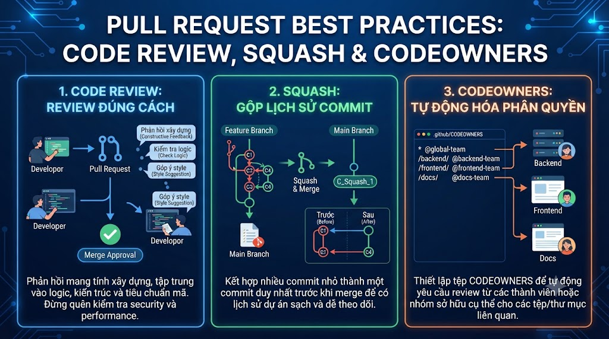

# Pull Request Best Practices: Code Review, Squash & CODEOWNERS



Pull Request (PR) — hay Merge Request (MR) trên GitLab — không chỉ là cơ chế merge code. Đây là nơi **kiến thức được transfer giữa các thành viên trong team**, bugs được phát hiện sớm nhất, và code quality được duy trì theo thời gian. Một PR tốt tiết kiệm hàng giờ debug về sau. Một PR review tệ để lọt bug tốn hàng ngày để sửa. Bài này xây dựng quy trình PR hoàn chỉnh cho team.

## 1\. Anatomy Của Một PR Tốt

### PR Quá Lớn — Vấn Đề Phổ Biến Nhất

```java
PR với 50 files thay đổi, 2000 dòng:
  → Reviewer mất 3-4 giờ để review
  → Reviewer sẽ bỏ qua chi tiết → approve mà không đọc kỹ
  → Bugs lọt qua dễ dàng

PR tốt:
  → < 400 dòng thay đổi (có thể review trong 30-60 phút)
  → Focused: 1 feature/fix/refactor
  → Có thể test độc lập
```

**Quy tắc:** Nếu PR > 400 dòng → cân nhắc tách thành nhiều PRs nhỏ hơn.

## 2\. PR Description Template

```markdown
<!-- .github/pull_request_template.md -->
## Summary
<!-- Mô tả ngắn gọn PR này làm gì (2-3 câu) -->

## Changes
<!-- Liệt kê các thay đổi chính -->
- 
- 
- 

## Type of Change
- [ ] 🚀 New feature
- [ ] 🐛 Bug fix
- [ ] 🔨 Refactoring
- [ ] 📝 Documentation
- [ ] 🧪 Tests
- [ ] ⚙️ CI/CD / Config
- [ ] 💥 Breaking change

## How to Test
<!-- Hướng dẫn reviewer test manually -->
1. 
2. 
3. 

## Screenshots (nếu có UI changes)
<!-- Before / After screenshots -->

## Related Issues
<!-- Đóng issues liên quan -->
Closes #

## Checklist
- [ ] Self-review: đã tự đọc lại code trước khi request review
- [ ] Tests added/updated
- [ ] Documentation updated (nếu cần)
- [ ] No `System.out.println` / debug code
- [ ] No hardcoded secrets
- [ ] API changes are backward compatible (hoặc documented)
```

### Ví Dụ PR Description Tốt

````markdown
## Summary
Add VNPay payment integration for course checkout.
Users can now pay with VNPay in addition to existing methods.

## Changes
- Add `VNPayService` with payment URL generation and IPN callback
- Add `PaymentController` with `/api/payment/create` and `/api/payment/callback`  
- Add `PaymentDTO`, `VNPayConfig` classes
- Add unit tests for VNPayService (coverage: 85%)
- Update `application.properties` with VNPay sandbox config

## Type of Change
- [x] 🚀 New feature

## How to Test
1. Start the application: `mvn spring-boot:run`
2. Call POST `/api/payment/create` with body:
```json
   {"orderId": "TEST001", "amount": 799000}
```
3. Open returned URL in browser → VNPay sandbox
4. Complete payment with test card: 9704198526191432198 (Napas)
5. Check `/api/payment/callback` is called automatically
6. Verify order status updated to PAID in database

## Screenshots
| Before | After |
|--------|-------|
| Only bank transfer | VNPay option visible |

## Related Issues
Closes #123 (Add VNPay payment)
Refs #89 (Payment module design doc)

## Checklist
- [x] Self-review completed
- [x] Unit tests added (VNPayServiceTest, PaymentControllerTest)
- [x] README updated with VNPay config instructions
- [x] No debug code
- [x] VNPay credentials in environment variables, not hardcoded
````

## 3\. Draft PR — Feedback Sớm

```java
Draft PR = PR chưa sẵn sàng merge, nhưng muốn feedback

Khi nào dùng Draft PR:
  → Vừa bắt đầu feature, muốn align với team về approach
  → Code dở dang, muốn check hướng đi đúng không
  → Cần input trước khi đi sâu hơn
  → "Work In Progress" visible cho team

Cách tạo Draft PR:
  GitHub: "Create pull request" → dropdown → "Create draft pull request"
  GitLab: Tạo MR → check "Mark as draft"

Chuyển sang Ready:
  GitHub: "Ready for review" button
  GitLab: "Mark as ready" button
```

## 4\. Code Review — Người Review

#### Mindset Đúng

```java
Review code, không review người:
  ❌ "Code của bạn sai"
  ✅ "Đoạn code này có thể có race condition khi..."

Câu hỏi thay vì phán xét:
  ❌ "Tại sao bạn viết thế này?"
  ✅ "Tôi không hiểu lý do dùng synchronized ở đây, bạn có thể giải thích không?"

Praise công khai, critique private:
  → Comment tốt: comment trực tiếp trên PR
  → Comment nhạy cảm: nhắn private message trước
```

#### Comment Conventions

```java
Prefix để phân loại comment:

[MUST]   → Bắt buộc fix trước khi merge
          "MUST: SQL injection vulnerability here"

[SHOULD] → Nên fix nhưng không block merge
          "SHOULD: Extract this into a separate method for readability"

[NIT]    → Nitpick nhỏ, không quan trọng
          "NIT: Extra whitespace here"

[QUESTION] → Câu hỏi để hiểu, không phải yêu cầu thay đổi
          "QUESTION: Why do we need both validators here?"

[PRAISE] → Khen code tốt (quan trọng!)
          "PRAISE: Great abstraction here, much cleaner than before"

[SUGGEST] → Gợi ý cải thiện (optional)
          "SUGGEST: We could use Builder pattern here if this grows"
```

#### Checklist Review

```java
Security:
  □ SQL injection / NoSQL injection
  □ XSS vulnerabilities
  □ Sensitive data logged / exposed in response
  □ Authentication/authorization logic đúng
  □ Input validation đầy đủ
  □ Hardcoded secrets/credentials

Logic:
  □ Null pointer exception risks
  □ Edge cases (empty list, null values, 0, negative numbers)
  □ Concurrency issues (shared state, race conditions)
  □ Off-by-one errors
  □ Error handling đầy đủ và meaningful

Performance:
  □ N+1 query problem
  □ Missing database indexes
  □ Unnecessary loops, O(n²) algorithms
  □ Large objects loaded vào memory
  □ Missing pagination

Code quality:
  □ Method/class names rõ ràng, mô tả đúng
  □ Single Responsibility Principle
  □ DRY (Don't Repeat Yourself)
  □ Magic numbers → constants
  □ Comments explain WHY, không chỉ WHAT

Tests:
  □ Happy path tested
  □ Error/exception cases tested
  □ Edge cases tested
  □ Test names mô tả rõ behavior
```

## 5\. Code Review — Người Được Review

### Chuẩn Bị Trước Khi Request Review

````java
```bash
# Self-review trước khi submit
git diff main..HEAD                          # xem toàn bộ diff
git diff main..HEAD --stat                   # summary
git log main..HEAD --oneline                 # danh sách commits

# Kiểm tra:
# □ Đọc từng dòng code như reviewer
# □ Xóa debug code, TODO, commented-out code
# □ Chạy tests locally: mvn test
# □ Chạy linter locally: mvn checkstyle:check
# □ Review commit messages: đúng Conventional Commits không?

# Rebase để history sạch
git rebase -i main
# Squash WIP commits
# Reword messages nếu cần
````

### Respond To Comments

```java
✅ Cách respond tốt:
  Comment: "MUST: Null check missing here"
  Response: "Fixed in commit abc1234. Added null check and unit test."
           → Nêu rõ đã fix như thế nào, commit nào

✅ Không đồng ý:
  Comment: "SHOULD: Use Optional instead of null return"
  Response: "Good point. However, this is called 500x/second and Optional
            has small but measurable overhead in hot paths. We have a
            benchmark in docs/benchmarks.md showing 15% slowdown.
            I'll keep the null return with a Javadoc explaining why.
            WDYT?" (What Do You Think?)
            → Giải thích lý do, cung cấp data, mở dialog

✅ Khi cần giải thích dài:
  → Thêm inline comment vào code: // NOTE: We use X instead of Y because...
  → Reviewer tương lai cũng hiểu được
```

## 6\. Squash vs Merge vs Rebase Merge

```java
GitHub/GitLab cho phép 3 merge strategies cho PR:
```

### Squash and Merge

```java
Feature branch:
  A ← B ← C ← D ← E  (5 commits)

After squash merge vào main:
  main: ... ← G  (G = 1 commit tổng hợp của A+B+C+D+E)

→ Main history sạch: 1 PR = 1 commit
→ Mất detail của từng commit trên feature branch
→ Phù hợp khi: feature branch có nhiều WIP commits
```

### Merge Commit (Create a merge commit)

```java
Feature branch:
  A ← B ← C ← D ← E

After merge commit:
  main: ... ← F ← G (G = merge commit, 2 parents: F và E)
                ↗
         B ← C ← D ← E

→ Giữ full history của feature branch
→ Thấy rõ feature được merge khi nào
→ main history có merge commits
```

### Rebase and Merge

```java
Feature branch:
  A ← B ← C ← D ← E

After rebase merge:
  main: ... ← F ← A' ← B' ← C' ← D' ← E' (linear)

→ Linear history không có merge commits
→ History sạch hơn merge commit
→ Commits được replayed, hash thay đổi
→ Phù hợp khi muốn linear history + giữ commit detail
```

### Nên Dùng Gì?

```java
Squash:  Khi feature branch có nhiều WIP/"fix typo" commits
         → Dọn sạch trước khi vào main

Merge commit:  Khi muốn thấy rõ "PR này merge khi nào"
               → GitHub Flow, GitFlow release/hotfix

Rebase:  Khi muốn linear history và commits trên branch có chất lượng tốt
         → Team discipline cao, good commit hygiene

nguyentienkhoi.hashnode.dev recommendation:
  → Squash and Merge cho hầu hết feature PRs
  → Merge commit cho release và hotfix (cần thấy rõ timeline)
```

## 7\. CODEOWNERS — Tự Động Request Review

```java
CODEOWNERS định nghĩa ai responsible cho phần code nào.
Khi PR thay đổi file trong area đó → tự động request review từ owner.
```

```bash
# .github/CODEOWNERS (GitHub)
# hoặc
# .gitlab/CODEOWNERS (GitLab)
# hoặc
# CODEOWNERS (root level)

# Syntax: pattern  owner1  owner2

# Default owners cho tất cả files
*  @foxdev/backend-team

# Payment module: cần senior review
src/main/java/com/foxdev/payment/  @nam-senior @payment-team

# Security-sensitive code
src/main/java/com/foxdev/auth/     @security-team @nam-senior
src/main/java/com/foxdev/config/   @security-team

# Infrastructure / CI
.github/                            @devops-team
docker-compose*.yml                 @devops-team
Dockerfile                          @devops-team

# Database migrations: cần DBA review
src/main/resources/db/migration/    @dba-team @nam-senior

# Frontend (nếu monorepo)
frontend/                           @foxdev/frontend-team

# Documentation
docs/                               @all-team-members
*.md                                @all-team-members

# pom.xml: cần tech lead approve
pom.xml                             @tech-lead
```

**Setup trên GitHub:**

```java
Repository Settings → Branches → main
→ Required approvals: 2
→ "Require review from Code Owners" ✅
→ → PR thay đổi payment/ → @payment-team PHẢI approve (không thể skip)
```

## 8\. Auto-close Issues và Linking

```markdown
# Trong PR description hoặc commit message:

# Đóng issue khi PR merge
Closes #123
Fixes #456
Resolves #789

# Reference không đóng
Refs #100
See #200
Related to #300

# Đóng issues từ multiple repos (GitHub)
Closes org/repo#123

# Kết hợp
Closes #123, Fixes #456
This PR resolves #789 and #790
```

## 9\. PR Labels và Milestones

```java
Labels phổ biến:
  type: feature     → tính năng mới
  type: bugfix      → sửa bug
  type: hotfix      → urgent production fix
  type: refactor    → refactoring
  type: docs        → documentation
  type: test        → tests only
  
  status: WIP          → đang làm
  status: ready        → sẵn sàng review
  status: changes-requested → cần sửa
  status: approved     → được approve
  status: blocked      → bị block bởi dependency
  
  priority: P0   → critical (production down)
  priority: P1   → high (major bug/feature)
  priority: P2   → normal
  priority: P3   → nice to have
  
  size: XS  < 50 lines
  size: S   50-200 lines
  size: M   200-400 lines
  size: L   > 400 lines (cân nhắc tách)
  size: XL  > 1000 lines (bắt buộc tách)
```

## 10\. Tự Động Hóa Review Process

### GitHub Actions — Auto Review Assignment

```yaml
# .github/workflows/auto-assign.yml
name: Auto Assign Reviewers

on:
  pull_request:
    types: [opened, ready_for_review]

jobs:
  assign:
    runs-on: ubuntu-latest
    steps:
      - uses: actions/auto-assign-action@v1
        with:
          configuration-path: .github/auto-assign.yml

# .github/auto-assign.yml
reviewers:
  - nam-nguyen
  - linh-tran
  
numberOfReviewers: 2  # chọn ngẫu nhiên 2 người

# assignees:
#   - minh-le  # auto-assign PR author as assignee
```

### GitHub Actions — PR Size Check

```yaml
# .github/workflows/pr-size.yml
name: Check PR Size

on:
  pull_request:
    types: [opened, synchronize]

jobs:
  check-size:
    runs-on: ubuntu-latest
    steps:
      - name: Check PR size
        uses: actions/github-script@v7
        with:
          script: |
            const { data: pr } = await github.rest.pulls.get({
              owner: context.repo.owner,
              repo: context.repo.repo,
              pull_number: context.issue.number
            });
            
            const additions = pr.additions;
            const deletions = pr.deletions;
            const total = additions + deletions;
            
            if (total > 1000) {
              core.setFailed(`PR too large: ${total} lines changed. Please split into smaller PRs (max 400 lines recommended).`);
            } else if (total > 400) {
              core.warning(`PR is large: ${total} lines changed. Consider splitting.`);
            } else {
              console.log(`PR size OK: ${total} lines changed.`);
            }
```

### GitHub Actions — PR Title Validation

```yaml
# .github/workflows/pr-title.yml
name: Validate PR Title

on:
  pull_request:
    types: [opened, edited, synchronize]

jobs:
  validate-title:
    runs-on: ubuntu-latest
    steps:
      - name: Check PR title
        uses: actions/github-script@v7
        with:
          script: |
            const title = context.payload.pull_request.title;
            const pattern = /^(feat|fix|docs|style|refactor|perf|test|build|ci|chore|revert)(\(.+\))?: .{1,72}$/;
            
            if (!pattern.test(title)) {
              core.setFailed(
                `PR title doesn't follow Conventional Commits format.\n` +
                `Expected: type(scope): description\n` +
                `Examples:\n` +
                `  feat(payment): add VNPay integration\n` +
                `  fix(auth): resolve token expiration\n` +
                `Got: ${title}`
              );
            }
```

## 11\. Thực Hành Tổng Hợp

```bash
# ─── Setup CODEOWNERS cho foxdev-backend ───

mkdir -p .github
cat > .github/CODEOWNERS << 'EOF'
# Default: backend team reviews everything
*  @foxdev/backend-team

# Payment: requires senior + payment team
src/main/java/com/foxdev/payment/  @nam-senior @foxdev/payment-team

# Auth/Security: security team must approve
src/main/java/com/foxdev/auth/     @foxdev/security-team
src/main/java/com/foxdev/config/   @foxdev/security-team

# DB migrations: DBA must approve
src/main/resources/db/migration/    @dba-lead

# CI/CD
.github/                            @foxdev/devops-team
Dockerfile                          @foxdev/devops-team
docker-compose*.yml                 @foxdev/devops-team

# Dependencies
pom.xml                             @tech-lead
EOF

# ─── Setup PR template ───

cat > .github/pull_request_template.md << 'EOF'
## Summary
<!-- Mô tả PR này làm gì -->

## Changes
- 
- 

## Type of Change
- [ ] 🚀 New feature
- [ ] 🐛 Bug fix
- [ ] 🔨 Refactoring
- [ ] 📝 Documentation
- [ ] 🧪 Tests only
- [ ] ⚙️ Config / CI

## How to Test
1. 
2. 

## Checklist
- [ ] Self-review completed
- [ ] Tests added/updated
- [ ] No debug code or hardcoded secrets
- [ ] API changes are documented
EOF

git add .github/
git commit -m "chore: add CODEOWNERS and PR template"
git push

# ─── Tạo PR theo quy trình đúng ───

# 1. Tạo feature branch nhỏ, focused
git switch main && git pull
git switch -c feature/TJ-456-course-rating

# 2. Code với commits rõ ràng
git commit -m "feat(course): add CourseRating entity and repository"
git commit -m "feat(course): add CourseRatingService with add/update/delete"
git commit -m "feat(course): add CourseRatingController REST endpoints"
git commit -m "test(course): add unit tests for CourseRatingService"

# 3. Self-review
git diff main..HEAD --stat
# 6 files changed, 220 insertions(+), 5 deletions(-)
# Tốt! < 400 dòng

# 4. Dọn dẹp commits (squash WIP)
git rebase -i main
# → Squash "WIP: debugging" commits nếu có

# 5. Push
git push -u origin feature/TJ-456-course-rating

# 6. Tạo PR trên GitHub với:
#    - Title: "feat(course): add course rating system"
#    - Fill in PR template
#    - Add labels: type:feature, size:S
#    - Add milestone: v1.3.0
#    - GitHub tự động request review từ CODEOWNERS

# 7. Address feedback
git commit -m "fix(course): address review comments - add input validation"
git push
# GitHub Actions re-run automatically

# 8. Squash and Merge sau khi approved
# → History sạch: 1 PR = 1 commit trên main

# 9. Delete feature branch (GitHub có thể tự động delete)
```

## Tổng Kết

```java
PR tốt:
  → Small (< 400 lines)
  → Single purpose (1 feature/fix)
  → Description đầy đủ với How to Test
  → Self-reviewed trước khi submit

Code review tốt:
  → Review code không review người
  → Comment với prefix [MUST]/[SHOULD]/[NIT]
  → Praise code tốt
  → Respond với explanation + commit reference

Merge strategy:
  → Squash: feature branches với WIP commits
  → Merge commit: releases, hotfixes
  → Rebase: khi muốn linear history

CODEOWNERS:
  → Tự động request review đúng người
  → Enforce review cho security-sensitive code
```


| Practice | Benefit |
|---|---|
| Small PRs (< 400 lines) | Faster, more thorough review |
| PR template | Consistent info, fewer back-and-forths |
| Draft PR | Early feedback, aligned direction |
| Comment prefixes | Clear priority, less confusion |
| CODEOWNERS | Right people review right code |
| Auto PR validation | Enforce conventions automatically |


Bài cuối chúng ta sẽ học **Git trong CI/CD** — trigger GitHub Actions từ branch/tag, semantic versioning tự động, deployment strategy và GitOps.

