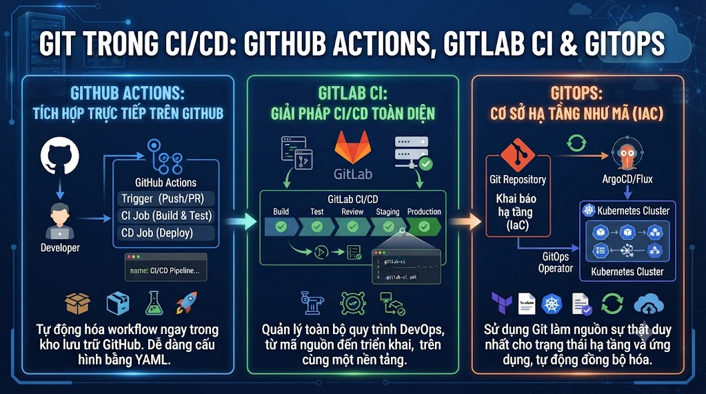

# Git Trong CI/CD: GitHub Actions, GitLab CI & GitOps



Bài cuối của Git series. Code review tốt, branching strategy rõ ràng, nhưng deploy vẫn thủ công? **CI/CD** là bước hoàn thiện vòng tròn — mỗi `git push` tự động trigger build, test, và deploy. Bài này xây dựng pipeline hoàn chỉnh cho foxdev-backend: từ push code đến production, với semantic versioning tự động, environment promotions và GitOps pattern.

## 1\. CI/CD Và Git Hoạt Động Cùng Nhau

```java
Git Events → Trigger CI/CD

git push origin feature/payment
  → CI: Run tests, lint, build
  → Deploy to dev environment (optional)

git push origin main (sau khi merge PR)
  → CI: Run full test suite
  → Build Docker image
  → Push to registry
  → Deploy to staging

git push origin --tags (v1.2.0)
  → CI: Run full suite
  → Build production Docker image
  → Deploy to production
  → Create GitHub Release với changelog
```

## 2\. GitHub Actions — Cơ Bản

### Cấu Trúc Workflow File

```yaml
# .github/workflows/ci.yml

name: CI Pipeline          # Tên workflow

on:                        # Triggers
  push:
    branches: [main, develop]
  pull_request:
    branches: [main]

jobs:                      # Các jobs chạy song song hoặc tuần tự
  build:
    runs-on: ubuntu-latest # Runner
    steps:                 # Các bước trong job
      - uses: actions/checkout@v4
      - name: Build
        run: mvn package
```

### Trigger Events Quan Trọng

```yaml
on:
  # Push vào branches cụ thể
  push:
    branches:
      - main
      - develop
      - 'release/**'
      - 'hotfix/**'
    # Chỉ trigger khi files này thay đổi
    paths:
      - 'src/**'
      - 'pom.xml'
      - '.github/workflows/**'
    # Bỏ qua khi chỉ docs thay đổi
    paths-ignore:
      - 'docs/**'
      - '**.md'

  # Pull Request
  pull_request:
    branches: [main]
    types: [opened, synchronize, reopened]

  # Tags (cho releases)
  push:
    tags:
      - 'v*.*.*'          # v1.0.0, v1.2.3, etc.

  # Schedule (cron)
  schedule:
    - cron: '0 2 * * *'  # 2 AM UTC mỗi ngày

  # Manual trigger
  workflow_dispatch:
    inputs:
      environment:
        description: 'Deploy to environment'
        required: true
        default: 'staging'
        type: choice
        options: [staging, production]
```

## 3\. CI Pipeline Hoàn Chỉnh Cho Spring Boot

```yaml
# .github/workflows/ci.yml
name: CI — Build, Test & Code Quality

on:
  push:
    branches: [main, develop, 'feature/**', 'fix/**', 'hotfix/**']
    paths:
      - 'src/**'
      - 'pom.xml'
  pull_request:
    branches: [main, develop]

env:
  JAVA_VERSION: '21'
  MVN_OPTS: '-Xmx1024m -XX:+TieredCompilation -XX:TieredStopAtLevel=1'

jobs:
  # ─── Job 1: Build & Test ───
  build-and-test:
    name: Build & Test
    runs-on: ubuntu-latest

    services:
      # Start PostgreSQL for integration tests
      postgres:
        image: postgres:16
        env:
          POSTGRES_DB:       foxdev_test
          POSTGRES_USER:     test
          POSTGRES_PASSWORD: test
        ports:
          - 5432:5432
        options: >-
          --health-cmd pg_isready
          --health-interval 10s
          --health-timeout 5s
          --health-retries 5

      # Start Redis for cache tests
      redis:
        image: redis:7.2-alpine
        ports:
          - 6379:6379
        options: --health-cmd "redis-cli ping"

    steps:
      - name: Checkout code
        uses: actions/checkout@v4
        with:
          fetch-depth: 0   # full history cho SonarQube

      - name: Set up Java ${{ env.JAVA_VERSION }}
        uses: actions/setup-java@v4
        with:
          java-version: ${{ env.JAVA_VERSION }}
          distribution: 'temurin'
          cache: 'maven'   # cache ~/.m2/repository

      - name: Build
        run: mvn compile -q $MVN_OPTS

      - name: Run unit tests
        run: mvn test -q $MVN_OPTS
        env:
          SPRING_PROFILES_ACTIVE: test

      - name: Run integration tests
        run: mvn verify -Dspring.profiles.active=test $MVN_OPTS
        env:
          SPRING_DATASOURCE_URL:      jdbc:postgresql://localhost:5432/foxdev_test
          SPRING_DATASOURCE_USERNAME: test
          SPRING_DATASOURCE_PASSWORD: test
          SPRING_REDIS_HOST:          localhost

      - name: Upload test results
        if: always()   # upload dù pass hay fail
        uses: actions/upload-artifact@v4
        with:
          name: test-results
          path: target/surefire-reports/

      - name: Upload coverage report
        uses: actions/upload-artifact@v4
        with:
          name: coverage-report
          path: target/site/jacoco/

  # ─── Job 2: Code Quality ───
  code-quality:
    name: Code Quality
    runs-on: ubuntu-latest
    needs: build-and-test   # chạy SAU build-and-test

    steps:
      - uses: actions/checkout@v4
        with:
          fetch-depth: 0

      - uses: actions/setup-java@v4
        with:
          java-version: ${{ env.JAVA_VERSION }}
          distribution: 'temurin'
          cache: 'maven'

      - name: Checkstyle
        run: mvn checkstyle:check -q

      - name: SpotBugs
        run: mvn spotbugs:check -q

      - name: SonarQube analysis
        run: mvn sonar:sonar
        env:
          SONAR_TOKEN: ${{ secrets.SONAR_TOKEN }}
          SONAR_HOST_URL: ${{ vars.SONAR_HOST_URL }}

  # ─── Job 3: Security Scan ───
  security:
    name: Security Scan
    runs-on: ubuntu-latest

    steps:
      - uses: actions/checkout@v4

      - name: Run OWASP Dependency Check
        run: mvn dependency-check:check
        continue-on-error: true   # không fail pipeline, chỉ warn

      - name: Run Trivy vulnerability scan
        uses: aquasecurity/trivy-action@master
        with:
          scan-type: 'fs'
          severity: 'HIGH,CRITICAL'
          exit-code: '1'
```

## 4\. CD Pipeline — Build và Deploy Docker

```yaml
# .github/workflows/cd-staging.yml
name: CD — Deploy to Staging

on:
  push:
    branches: [main]   # Mỗi merge vào main → deploy staging

jobs:
  build-docker:
    name: Build & Push Docker Image
    runs-on: ubuntu-latest

    outputs:
      image-tag: ${{ steps.meta.outputs.tags }}
      image-digest: ${{ steps.build.outputs.digest }}

    steps:
      - uses: actions/checkout@v4

      - name: Set up Docker Buildx
        uses: docker/setup-buildx-action@v3

      - name: Log in to GitHub Container Registry
        uses: docker/login-action@v3
        with:
          registry: ghcr.io
          username: ${{ github.actor }}
          password: ${{ secrets.GITHUB_TOKEN }}   # auto-provided

      - name: Extract metadata for Docker
        id: meta
        uses: docker/metadata-action@v5
        with:
          images: ghcr.io/${{ github.repository }}
          tags: |
            type=ref,event=branch
            type=sha,prefix=sha-,format=short
            type=raw,value=latest,enable={{is_default_branch}}
            # → tags: main, sha-abc1234, latest

      - name: Build and push Docker image
        id: build
        uses: docker/build-push-action@v5
        with:
          context: .
          push: true
          tags: ${{ steps.meta.outputs.tags }}
          labels: ${{ steps.meta.outputs.labels }}
          cache-from: type=gha     # GitHub Actions cache
          cache-to: type=gha,mode=max

  deploy-staging:
    name: Deploy to Staging
    runs-on: ubuntu-latest
    needs: build-docker
    environment:
      name: staging
      url: https://staging.nguyentienkhoi.hashnode.dev

    steps:
      - name: Deploy to staging server
        uses: appleboy/ssh-action@v1.0.0
        with:
          host:     ${{ secrets.STAGING_HOST }}
          username: ${{ secrets.STAGING_USER }}
          key:      ${{ secrets.STAGING_SSH_KEY }}
          script: |
            # Pull latest image
            docker pull ghcr.io/foxdev/foxdev-backend:main

            # Update container (zero-downtime)
            docker-compose -f /opt/foxdev/docker-compose.yml \
              up -d --no-deps backend

            # Health check
            sleep 10
            curl -f https://staging.nguyentienkhoi.hashnode.dev/actuator/health \
              || (echo "Health check failed!" && exit 1)

            echo "✅ Deployed to staging successfully!"

  run-e2e-tests:
    name: E2E Tests on Staging
    runs-on: ubuntu-latest
    needs: deploy-staging

    steps:
      - uses: actions/checkout@v4
      - name: Run E2E tests
        run: |
          cd e2e-tests
          npm install
          npm run test:staging
        env:
          BASE_URL: https://staging.nguyentienkhoi.hashnode.dev
```

## 5\. Release Pipeline — Semantic Versioning Tự Động

```yaml
# .github/workflows/release.yml
name: Release — Create Release và Deploy Production

on:
  push:
    tags:
      - 'v[0-9]+.[0-9]+.[0-9]+'   # v1.0.0, v2.3.1, etc.

jobs:
  create-release:
    name: Create GitHub Release
    runs-on: ubuntu-latest

    outputs:
      release-url: ${{ steps.release.outputs.html_url }}

    steps:
      - uses: actions/checkout@v4
        with:
          fetch-depth: 0   # full history để generate changelog

      - name: Generate changelog
        id: changelog
        uses: orhun/git-cliff-action@v2
        with:
          config: cliff.toml
          args: --latest --strip header

      - name: Create GitHub Release
        id: release
        uses: ncipollo/release-action@v1
        with:
          tag: ${{ github.ref_name }}
          name: "Release ${{ github.ref_name }}"
          body: ${{ steps.changelog.outputs.content }}
          draft: false
          prerelease: ${{ contains(github.ref_name, '-rc') || contains(github.ref_name, '-beta') }}

  build-production:
    name: Build Production Image
    runs-on: ubuntu-latest
    needs: create-release

    steps:
      - uses: actions/checkout@v4

      - name: Build and push production image
        uses: docker/build-push-action@v5
        with:
          context: .
          push: true
          tags: |
            ghcr.io/foxdev/foxdev-backend:${{ github.ref_name }}
            ghcr.io/foxdev/foxdev-backend:stable
          # → tags: v1.2.0, stable

  deploy-production:
    name: Deploy to Production
    runs-on: ubuntu-latest
    needs: build-production
    environment:
      name: production
      url: https://nguyentienkhoi.hashnode.dev

    steps:
      - name: Deploy to production
        uses: appleboy/ssh-action@v1.0.0
        with:
          host:     ${{ secrets.PROD_HOST }}
          username: ${{ secrets.PROD_USER }}
          key:      ${{ secrets.PROD_SSH_KEY }}
          script: |
            VERSION=${{ github.ref_name }}
            echo "Deploying $VERSION to production..."

            # Pull specific version (không dùng :latest cho production)
            docker pull ghcr.io/foxdev/foxdev-backend:$VERSION

            # Blue-green deployment
            docker-compose -f /opt/foxdev/docker-compose.prod.yml \
              up -d --no-deps --scale backend=2 backend

            sleep 30  # warm up

            # Health check
            curl -f https://nguyentienkhoi.hashnode.dev/actuator/health \
              || (echo "❌ Production deploy failed!" && exit 1)

            # Scale back down
            docker-compose -f /opt/foxdev/docker-compose.prod.yml \
              up -d --no-deps --scale backend=1 backend

            echo "✅ Production deployment successful: $VERSION"

      - name: Notify Slack
        if: always()
        uses: 8398a7/action-slack@v3
        with:
          status: ${{ job.status }}
          text: |
            ${{ job.status == 'success' && '✅' || '❌' }}
            Production deploy ${{ github.ref_name }}: ${{ job.status }}
        env:
          SLACK_WEBHOOK_URL: ${{ secrets.SLACK_WEBHOOK }}
```

## 6\. Semantic Release — Version Tự Động

```bash
# Thay vì tự tạo tag thủ công, semantic-release tự làm
# Dựa vào Conventional Commits để bump version

# .releaserc.yml
branches:
  - main
  - name: develop
    prerelease: beta      # → v1.2.0-beta.1

plugins:
  - "@semantic-release/commit-analyzer"      # phân tích commits
  - "@semantic-release/release-notes-generator"  # generate notes
  - "@semantic-release/changelog"             # update CHANGELOG.md
  - "@semantic-release/exec"                 # custom scripts
  - "@semantic-release/github"               # create GitHub Release
  - "@semantic-release/git"                  # commit back CHANGELOG

# How it works:
# feat: add X     → bump MINOR → v1.0.0 → v1.1.0
# fix: resolve Y  → bump PATCH → v1.1.0 → v1.1.1
# feat!: ...      → bump MAJOR → v1.1.1 → v2.0.0
# (BREAKING CHANGE in footer)
```

```yaml
# .github/workflows/semantic-release.yml
name: Semantic Release

on:
  push:
    branches: [main]

jobs:
  release:
    runs-on: ubuntu-latest
    permissions:
      contents: write
      issues: write
      pull-requests: write

    steps:
      - uses: actions/checkout@v4
        with:
          fetch-depth: 0
          persist-credentials: false

      - uses: actions/setup-node@v4
        with:
          node-version: 20

      - name: Install semantic-release
        run: npm install -g semantic-release @semantic-release/changelog @semantic-release/git

      - name: Run semantic-release
        run: npx semantic-release
        env:
          GITHUB_TOKEN: ${{ secrets.GITHUB_TOKEN }}
```

## 7\. GitLab CI/CD

```yaml
# .gitlab-ci.yml
stages:
  - build
  - test
  - quality
  - package
  - deploy-staging
  - deploy-production

variables:
  MAVEN_OPTS: "-Xmx1024m"
  DOCKER_IMAGE: "$CI_REGISTRY_IMAGE:$CI_COMMIT_SHORT_SHA"

# ─── Templates ───
.java-setup:
  image: maven:3.9-eclipse-temurin-21
  cache:
    key: "$CI_PROJECT_ID-maven"
    paths:
      - .m2/

# ─── Build ───
build:
  extends: .java-setup
  stage: build
  script:
    - mvn compile -q $MAVEN_OPTS
  artifacts:
    paths:
      - target/

# ─── Test ───
test:
  extends: .java-setup
  stage: test
  services:
    - name: postgres:16
      alias: postgres
    - name: redis:7.2-alpine
      alias: redis
  variables:
    POSTGRES_DB:       foxdev_test
    POSTGRES_USER:     test
    POSTGRES_PASSWORD: test
  script:
    - mvn verify $MAVEN_OPTS
  artifacts:
    reports:
      junit: target/surefire-reports/TEST-*.xml
      coverage_report:
        coverage_format: jacoco
        path: target/site/jacoco/jacoco.xml
  coverage: '/Total.*?([0-9]{1,3})%/'

# ─── Package ───
package:
  stage: package
  image: docker:24
  services:
    - docker:24-dind
  script:
    - docker login -u $CI_REGISTRY_USER -p $CI_REGISTRY_PASSWORD $CI_REGISTRY
    - docker build -t $DOCKER_IMAGE .
    - docker push $DOCKER_IMAGE
    # Tag latest cho main branch
    - |
      if [ "$CI_COMMIT_BRANCH" == "main" ]; then
        docker tag $DOCKER_IMAGE $CI_REGISTRY_IMAGE:latest
        docker push $CI_REGISTRY_IMAGE:latest
      fi
  only:
    - main
    - tags

# ─── Deploy Staging ───
deploy-staging:
  stage: deploy-staging
  image: alpine:latest
  before_script:
    - apk add --no-cache openssh-client
    - eval $(ssh-agent -s)
    - echo "$STAGING_SSH_KEY" | ssh-add -
  script:
    - ssh -o StrictHostKeyChecking=no $STAGING_USER@$STAGING_HOST "
        docker pull $DOCKER_IMAGE &&
        docker-compose -f /opt/foxdev/docker-compose.yml up -d --no-deps backend
      "
  environment:
    name: staging
    url: https://staging.nguyentienkhoi.hashnode.dev
  only:
    - main

# ─── Deploy Production (manual gate) ───
deploy-production:
  stage: deploy-production
  image: alpine:latest
  before_script:
    - apk add --no-cache openssh-client
    - eval $(ssh-agent -s)
    - echo "$PROD_SSH_KEY" | ssh-add -
  script:
    - ssh -o StrictHostKeyChecking=no $PROD_USER@$PROD_HOST "
        docker pull $DOCKER_IMAGE &&
        docker-compose -f /opt/foxdev/docker-compose.prod.yml up -d --no-deps backend
      "
  environment:
    name: production
    url: https://nguyentienkhoi.hashnode.dev
  when: manual          # ← cần click nút manual trên GitLab UI
  only:
    - tags              # chỉ từ tags
```

## 8\. Secrets Management

```yaml
# Không bao giờ hardcode secrets trong workflow files!

# ─── GitHub Secrets ───
# Repository → Settings → Secrets and variables → Actions

# Secrets (encrypted, không đọc được sau khi set):
PROD_SSH_KEY
STAGING_SSH_KEY
DOCKER_PASSWORD
SONAR_TOKEN
SLACK_WEBHOOK
VNPAY_SECRET_KEY

# Variables (readable):
PROD_HOST: prod.nguyentienkhoi.hashnode.dev
STAGING_HOST: staging.nguyentienkhoi.hashnode.dev

# Sử dụng trong workflow:
env:
  PROD_HOST:    ${{ secrets.PROD_HOST }}       # secret
  STAGING_HOST: ${{ vars.STAGING_HOST }}       # variable
  
# ─── Environment Secrets (per-environment) ───
# Cho phép khác nhau giữa staging và production:
# staging environment: PROD_HOST=staging.nguyentienkhoi.hashnode.dev
# production environment: PROD_HOST=nguyentienkhoi.hashnode.dev

# ─── OIDC (không cần long-lived credentials) ───
# Dùng cho AWS, GCP, Azure — short-lived tokens
- name: Configure AWS credentials
  uses: aws-actions/configure-aws-credentials@v4
  with:
    role-to-assume: arn:aws:iam::123456789:role/GitHubActions
    aws-region: ap-southeast-1
    # → Không cần AWS_ACCESS_KEY_ID, AWS_SECRET_ACCESS_KEY
```

## 9\. GitOps — Git Là Source of Truth Cho Infrastructure

```java
Traditional deployment:
  CI/CD push → production server
  "Push model"

GitOps:
  Desired state stored in Git
  Agent (ArgoCD/Flux) continuously sync
  "Pull model"
```

```yaml
# GitOps với ArgoCD pattern

# ─── App repo: foxdev-backend ───
# CI build image → push to registry
# Update image tag trong config repo

# ─── Config repo: foxdev-config ───
# manifests/production/deployment.yaml
apiVersion: apps/v1
kind: Deployment
metadata:
  name: foxdev-backend
spec:
  replicas: 3
  template:
    spec:
      containers:
        - name: backend
          image: ghcr.io/foxdev/foxdev-backend:v1.2.0   # ← CI cập nhật tag này
```

```yaml
# CI workflow cập nhật config repo sau khi build
# .github/workflows/update-config.yml

- name: Update image tag in config repo
  uses: actions/checkout@v4
  with:
    repository: foxdev/foxdev-config
    token: ${{ secrets.CONFIG_REPO_TOKEN }}
    path: config-repo

- name: Update image tag
  run: |
    cd config-repo
    # Dùng yq để update YAML
    yq e '.spec.template.spec.containers[0].image = "ghcr.io/foxdev/foxdev-backend:${{ github.ref_name }}"' \
       -i manifests/production/deployment.yaml
    
    git config user.email "ci@nguyentienkhoi.hashnode.dev"
    git config user.name "CI Bot"
    git add manifests/
    git commit -m "chore: update backend image to ${{ github.ref_name }}"
    git push
# ArgoCD tự động detect change và sync Kubernetes cluster
```

## 10\. Dockerfile Tối Ưu Cho CI/CD

```dockerfile
# Dockerfile — multi-stage build

# ─── Stage 1: Build ───
FROM maven:3.9-eclipse-temurin-21-alpine AS builder

WORKDIR /app

# Copy pom.xml trước để cache dependencies
COPY pom.xml .
RUN mvn dependency:go-offline -q   # cache layer này nếu pom.xml không đổi

# Copy source và build
COPY src ./src
RUN mvn package -q -DskipTests   # tests đã chạy trong CI

# ─── Stage 2: Runtime ───
FROM eclipse-temurin:21-jre-alpine

WORKDIR /app

# Non-root user (security best practice)
RUN addgroup -S appgroup && adduser -S appuser -G appgroup

# Copy only the JAR
COPY --from=builder /app/target/*.jar app.jar

USER appuser

EXPOSE 8080

# Health check
HEALTHCHECK --interval=30s --timeout=3s --start-period=60s \
  CMD wget -qO- http://localhost:8080/actuator/health || exit 1

ENTRYPOINT ["java", \
  "-XX:+UseContainerSupport", \
  "-XX:MaxRAMPercentage=75.0", \
  "-jar", "app.jar"]
```

## 11\. Thực Hành Tổng Hợp

```bash
# ─── Setup CI/CD hoàn chỉnh cho foxdev-backend ───

mkdir -p .github/workflows

# ─── Bước 1: Tạo CI workflow ───
# (copy từ phần 3 ở trên)

# ─── Bước 2: Tạo CD staging workflow ───
# (copy từ phần 4)

# ─── Bước 3: Tạo release workflow ───
# (copy từ phần 5)

# ─── Bước 4: Setup GitHub Secrets ───
# Repository → Settings → Secrets and variables → Actions
# Add: STAGING_HOST, STAGING_USER, STAGING_SSH_KEY
# Add: PROD_HOST, PROD_USER, PROD_SSH_KEY
# Add: SONAR_TOKEN, SLACK_WEBHOOK

# ─── Bước 5: Commit ───
git add .github/
git commit -m "ci: add CI/CD workflows for build test deploy"
git push

# ─── Bước 6: Trigger pipeline ───

# Trigger CI với feature branch push
git switch -c feature/test-pipeline
echo "// CI test" >> src/main/java/com/foxdev/FoxDevApplication.java
git add . && git commit -m "test: verify CI pipeline works"
git push -u origin feature/test-pipeline
# → GitHub Actions chạy CI workflow

# Trigger staging deploy (merge vào main)
git switch main
git merge feature/test-pipeline
git push origin main
# → GitHub Actions chạy CD staging workflow

# Trigger production release (tạo tag)
git tag -a v1.0.0 -m "First production release"
git push origin v1.0.0
# → GitHub Actions chạy release workflow
# → Creates GitHub Release với changelog
# → Deploys to production

# ─── Xem kết quả ───
# GitHub → Actions tab → xem workflow runs
# GitHub → Releases → xem release mới được tạo
```

## 12\. Tóm Tắt Toàn Bộ Git Series

```java
17 bài, từ git init đến production CI/CD:

BEGINNER (Bài 1-5):
  Git là gì, Concepts, Workflow cơ bản, Remote, Branch

INTERMEDIATE (Bài 6-10):
  Merge vs Rebase, Conflict, Stash/Tag/Conventional Commits,
  Undoing Changes, Git Log nâng cao

ADVANCED (Bài 11-14):
  cherry-pick, reflog, patch, Submodule/Subtree,
  Git Hooks, Git Internals

TEAM & PRODUCTION (Bài 15-17):
  Branching Strategies, PR Best Practices, CI/CD
```

## Tổng Kết Bài 17

```java
Git trong CI/CD:
  push feature  → Run CI (test, lint, build)
  merge main    → Deploy staging
  push tag      → Deploy production + Create Release

Tools:
  GitHub Actions: YAML workflows, Actions marketplace
  GitLab CI:      .gitlab-ci.yml, pipeline stages
  Semantic Release: auto version from commits

GitOps:
  Git = source of truth cho infrastructure
  Agent (ArgoCD/Flux) pull và sync
  Immutable deployments với image tags
```


| Event | Action |
|---|---|
| push feature/* | Run tests |
| push main | Build image, deploy staging |
| push tag v*.*.* | Deploy production, create Release |
| pull_request | Run CI, validate PR |
| schedule | Nightly security scan |
| workflow_dispatch | Manual deploy |


