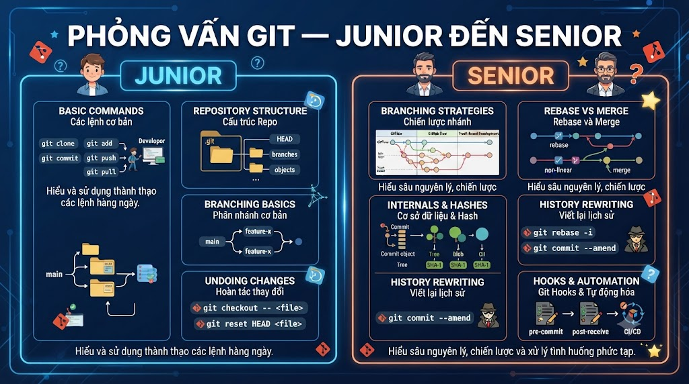

# Bộ Câu Hỏi Phỏng Vấn Git — Junior đến Senior



* * *

## 🟢 JUNIOR (0–2 năm)

Mục tiêu: Kiểm tra hiểu biết cơ bản về Git workflow, commands thường dùng và concepts cốt lõi.

  
**Q1. Git là gì? Tại sao cần dùng Git thay vì copy-paste file?**

Đáp án mong đợi:

*   Git = Distributed Version Control System — theo dõi lịch sử thay đổi code
    
*   **Distributed**: mỗi developer có full copy của toàn bộ history → offline vẫn làm việc được
    
*   Giải quyết các vấn đề thực tế:
    
    *   Không cần đặt tên `code_final_v2_FINAL.java`
        
    *   Biết ai thay đổi gì, khi nào, tại sao (`git blame`, `git log`)
        
    *   Quay lại bất kỳ version nào trong lịch sử
        
    *   Nhiều người làm việc song song mà không ghi đè nhau
        
    *   CI/CD trigger tự động từ `git push`
        

🚩 Red flag: Chỉ nói "để lưu code lên GitHub" — không hiểu khái niệm distributed hay value proposition

  
**Q2. Giải thích 3 trạng thái của file trong Git và 3 vùng tương ứng.**

Đáp án mong đợi:

```java
3 vùng:
  Working Directory  → nơi bạn edit files
  Staging Area (Index) → files sẵn sàng commit
  Repository (.git/) → lịch sử commits

3 trạng thái file:
  Modified (Working Dir)  → đã sửa, chưa stage
  Staged (Staging Area)   → đã stage, chưa commit
  Committed (Repository)  → đã lưu vào history

Flow: edit → git add → git commit
```

✅ Điểm cộng: Giải thích tại sao có Staging Area — cho phép chọn lọc những gì vào commit, thay vì commit tất cả mọi thứ cùng lúc

🚩 Red flag: Không biết Staging Area tồn tại, nghĩ `git add .` và `git commit` là cùng một bước

  
**Q3. Sự khác biệt giữa** `git fetch` **và** `git pull`**?**

Đáp án mong đợi:

```java
git fetch:
  → Tải commits từ remote về local
  → CẬP NHẬT origin/main (remote tracking branch)
  → KHÔNG thay đổi Working Directory hay local branch
  → An toàn, không gây conflict

git pull = git fetch + git merge
  → Tải VÀ merge vào local branch hiện tại
  → Có thể gây conflict
  → Tiện lợi hơn nhưng ít kiểm soát hơn

Best practice:
  git fetch → review changes → git merge (hoặc git rebase)
```

🚩 Red flag: Không biết fetch không thay đổi local branch, hoặc nghĩ fetch và pull như nhau

  
**Q4.** `git merge` **và** `git rebase` **khác nhau thế nào? Khi nào dùng cái nào?**

Đáp án mong đợi:

```java
git merge:
  → Tạo merge commit mới với 2 parents
  → Giữ lịch sử thật (thấy được parallel development)
  → Non-destructive — không thay đổi existing commits

git rebase:
  → Di chuyển commits lên đỉnh branch khác
  → Tạo commits mới (hash thay đổi)
  → Lịch sử tuyến tính, "cleaner"

Khi nào dùng:
  Merge: khi merge feature vào main (kết thúc feature)
  Rebase: update feature branch với changes từ main
          hoặc dọn dẹp commits trước khi tạo PR
```

Quy tắc vàng: **Không rebase shared branches** (branch mà người khác đang dùng)

🚩 Red flag: Không biết quy tắc vàng của rebase, hoặc nhầm lẫn hoàn toàn merge và rebase

  
**Q5. Giải thích** `git reset --soft`**,** `--mixed`**,** `--hard`**. Khi nào dùng mỗi loại?**

Đáp án mong đợi:

```java
git reset --soft HEAD~1:
  → Undo commit, changes vào Staging Area
  → Dùng khi: commit sai message, muốn viết lại

git reset --mixed HEAD~1 (DEFAULT):
  → Undo commit, changes vào Working Directory
  → Dùng khi: muốn tách 1 commit thành nhiều commits nhỏ

git reset --hard HEAD~1:
  → Undo commit VÀ xóa changes
  → ⚠️ Không thể undo dễ dàng
  → Dùng khi: muốn bỏ hoàn toàn commit (chưa push)
```

**Quan trọng:** Không dùng reset trên commits đã push lên shared branch. Thay bằng `git revert`.

  
**Q6.** `git revert` **khác** `git reset` **thế nào? Khi nào dùng revert?**

Đáp án mong đợi:

```java
git reset:
  → Xóa commits khỏi history
  → KHÔNG an toàn nếu đã push (rewrite history)
  → Phải dùng --force push → gây rắc rối cho người khác

git revert:
  → Tạo commit MỚI đảo ngược changes của commit cũ
  → History được giữ nguyên, chỉ thêm revert commit
  → AN TOÀN 100% với shared branches
  → Push bình thường

Nguyên tắc:
  Chưa push → dùng reset
  Đã push lên shared branch → luôn dùng revert
```

  
**Q7. Làm thế nào để xem ai đã viết một đoạn code cụ thể?**

Đáp án mong đợi:

```bash
git blame src/UserService.java
# → Mỗi dòng hiển thị: hash, author, date

# Xem range dòng
git blame -L 10,25 src/UserService.java

# Theo function
git blame -L ":findById" src/UserService.java
```

✅ Điểm cộng: Biết GitLens trong VSCode, Annotate trong IntelliJ cho inline blame

  
**Q8. .gitignore hoạt động như thế nào? Lỡ commit file rồi thêm vào .gitignore thì file có bị ignore không?**

Đáp án mong đợi:

*   `.gitignore` chỉ ignore **untracked** files — files chưa bao giờ được git add
    
*   Nếu file đã bị track (đã commit), thêm vào `.gitignore` không có tác dụng
    

**Fix:**

```bash
git rm --cached .env           # xóa khỏi Git tracking, giữ file trên disk
git rm --cached -r target/     # recursive cho thư mục
git add .gitignore
git commit -m "chore: untrack .env file"
```

🚩 Red flag: Nghĩ chỉ cần thêm vào .gitignore là đủ

  
**Q9. Giải thích Conventional Commits. Tại sao quan trọng?**

Đáp án mong đợi:

```java
Format: type(scope): description

Types: feat, fix, docs, style, refactor, perf, test, build, ci, chore, revert

Examples:
  feat(payment): add VNPay integration
  fix(auth): resolve token expiration bug
  docs: update API documentation
  BREAKING CHANGE → bump major version
```

**Tại sao quan trọng:**

*   Tự động generate CHANGELOG
    
*   Tự động semantic versioning (feat → MINOR, fix → PATCH, BREAKING → MAJOR)
    
*   Dễ đọc history và hiểu context của mỗi commit
    
*   CI/CD có thể trigger actions dựa trên commit type
    

###   
Coding Question Junior

**Q10. Bạn đang làm feature/payment, đột nhiên cần fix bug urgent trên main. Code dở dang chưa muốn commit. Làm gì?**

Đáp án mong đợi:

```bash
# 1. Stash code dở dang
git stash push -u -m "WIP: payment VNPay integration"

# 2. Về main, tạo hotfix branch
git switch main
git pull
git switch -c hotfix/login-500-error

# 3. Fix bug, commit, push
git commit -m "fix(auth): resolve 500 error when user not found"
git push -u origin hotfix/login-500-error

# 4. Merge vào main (hoặc tạo PR)
git switch main
git merge --no-ff hotfix/login-500-error
git push

# 5. Quay lại feature, lấy code ra
git switch feature/payment
git stash pop

# 6. Merge hotfix vào feature để không bị outdated
git merge main
```

Điểm đánh giá: biết dùng stash, biết clean up đúng cách

* * *

## 🟡 INTERMEDIATE (2–4 năm)

  
**Q11. HEAD là gì? Detached HEAD là gì và cách fix?**

Đáp án mong đợi:

```java
HEAD = con trỏ đến current branch (bình thường)
     hoặc trỏ thẳng vào commit (Detached HEAD)

Bình thường:
  HEAD → refs/heads/main → commit C

Detached HEAD (xảy ra khi checkout commit/tag):
  git checkout abc1234  hoặc  git checkout v1.0.0
  HEAD → abc1234  (không qua branch)
  ⚠️ Commit mới sẽ không được lưu vào branch nào!

Fix:
  # Tạo branch từ đây nếu muốn giữ work
  git checkout -b hotfix/from-v1 v1.0.0
  
  # Hoặc quay về branch
  git switch main
```

  
**Q12. git stash hoạt động như thế nào? Những tình huống nào stash không lưu được?**

Đáp án mong đợi:

```bash
git stash        # stash tracked modified files
git stash -u     # stash cả untracked files
git stash -a     # stash cả ignored files
git stash -p     # interactive — chọn từng hunk

git stash list
git stash pop    # apply + xóa khỏi stash list
git stash apply  # apply nhưng giữ trong stash list
git stash drop stash@{0}
```

**Stash KHÔNG lưu:**

*   Untracked files khi dùng `git stash` (không có `-u`)
    
*   Ignored files khi dùng `git stash -u` (cần `-a`)
    
*   Config của git (core.fileMode, etc.)
    

**Conflict khi pop:** Giải quyết như merge conflict bình thường — stash đã được apply dù có conflict

  
**Q13. Interactive Rebase là gì? Khi nào bạn dùng nó?**

Đáp án mong đợi:

```bash
git rebase -i HEAD~5  # interactive rebase 5 commits gần nhất

# Mở editor với danh sách commits:
# pick abc1234 feat: add payment
# pick def5678 WIP: debug
# pick ghi9012 fix typo
# pick jkl3456 feat: add tests
# pick mno7890 chore: cleanup
```

**Use cases:**

```java
squash/fixup: gộp "WIP: debug" và "fix typo" vào commit liên quan
reword:       sửa commit message ("WIP: debug" → "fix(payment): debug edge case")
drop:         xóa commit debug không cần thiết
edit:         dừng lại để amend commit (thêm file, sửa nội dung)
reorder:      đổi thứ tự commits
```

**Khi nào dùng:** Trước khi tạo PR — dọn dẹp commits thành clean history, dễ review

  
**Q14. Giải thích cherry-pick. Use case thực tế?**

Đáp án mong đợi:

```bash
# Apply changes của commit cụ thể vào branch hiện tại
git cherry-pick abc1234

# Cherry-pick range
git cherry-pick abc..def

# Không commit ngay
git cherry-pick abc1234 -n
```

**Use cases thực tế:**

1.  **Backport hotfix**: Bug fix trên develop, cần apply vào main/production mà không merge cả develop
    
2.  **Lấy commit từ abandoned branch**: Developer nghỉ việc, branch của họ có code tốt
    
3.  **Feature toggle deploy**: Chỉ cherry-pick những commits đã hoàn thiện, bỏ WIP commits
    

**Cẩn thận:** Cherry-pick tạo commit mới với hash khác → nếu sau này merge branch gốc có thể tạo conflict

  
**Q15. Làm thế nào để tìm commit nào gây ra bug mà không check từng commit một?**

Đáp án mong đợi: **git bisect** — binary search

```bash
git bisect start
git bisect bad           # commit hiện tại có bug
git bisect good v1.0.0   # commit này không có bug

# Git checkout commit giữa
# Test → có bug không?
git bisect good  # hoặc
git bisect bad

# Lặp lại ~10 lần với 1000 commits (log2(1000) ≈ 10)
# → Git tìm ra commit gây bug

git bisect reset  # về HEAD sau khi xong
```

**Nâng cao:** `git bisect run ./test_script.sh` — tự động với script

  
**Q16. Bạn force push vào main nhầm, làm team bị ảnh hưởng. Xử lý như thế nào?**

Câu hỏi open-ended — đánh giá crisis management:

1.  **Thông báo ngay lập tức** cho team: "Tôi vừa force push nhầm vào main, mọi người tạm dừng push"
    
2.  **Tìm lại commit cũ:**
    

```bash
git reflog
# → Tìm hash trước khi force push
git reset --hard abc1234   # về đúng trạng thái cũ
git push --force-with-lease  # force push lại để restore
```

3.  **Hướng dẫn team:**
    

```bash
git fetch origin
git reset --hard origin/main  # sync lại với remote
```

4.  **Phòng ngừa:** Set up branch protection rule — không ai (kể cả admin) được force push vào main
    

🚩 Red flag: Không biết reflog, hoặc không biết cần thông báo team ngay

###   
Coding Question Intermediate

**Q17. Bạn cần merge feature branch có 20 WIP commits vào main. Làm thế nào để history sạch?**

Đáp án mong đợi — 2 cách:

**Cách 1: Interactive rebase trước khi merge**

```bash
git switch feature/payment
git rebase -i main  # dọn commits
# Squash WIP commits, reword messages
git switch main
git merge --no-ff feature/payment
```

**Cách 2: Squash merge**

```bash
git switch main
git merge --squash feature/payment
git commit -m "feat(payment): add VNPay integration

- Payment URL generation
- IPN callback handling  
- Transaction verification
Closes #123"
```

**Khác biệt:**

*   Rebase + merge: giữ từng commit (nếu đã dọn sạch), thấy được detail
    
*   Squash merge: 1 commit trên main, lose individual commit history
    

* * *

## 🟠 ADVANCED (4–7 năm)

  
**Q18. Giải thích Git object model. Bốn loại objects là gì?**

Đáp án mong đợi:

```java
Git = content-addressed storage
Mọi object được định danh bởi SHA-1 hash của nội dung

4 loại objects:
1. blob:   nội dung file (không có tên file)
2. tree:   cấu trúc thư mục (mode + hash + name của blobs/subtrees)
3. commit: snapshot (tree + parent + author + committer + message)
4. tag:    annotated tag (commit hash + tagger + message)

Tại sao nhanh:
  Branch = 1 file 41 bytes (SHA-1 của commit)
  Checkout = selective update (chỉ update files khác nhau)
  Deduplication tự động: cùng nội dung = cùng hash = lưu 1 lần
```

```bash
# Xem bằng plumbing commands
git cat-file -t HEAD         # → commit
git cat-file -p HEAD         # → xem nội dung commit
git cat-file -p HEAD^{tree}  # → xem root tree
```

  
**Q19. Git Hooks là gì? Bạn sẽ setup hooks gì cho một team Java/Spring Boot?**

Đáp án mong đợi:

**Hooks quan trọng:**

```java
pre-commit:   chạy trước commit → format check, lint, unit tests
commit-msg:   validate commit message format (Conventional Commits)
pre-push:     chạy trước push → integration tests, block push to main
post-merge:   sau khi merge → auto install dependencies
```

**Vấn đề sharing hooks** (`.git/hooks/` không được track):

```java
Giải pháp:
  scripts/hooks/ → track trong repo
  scripts/install-hooks.sh → copy vào .git/hooks/
  README: "Chạy ./scripts/install-hooks.sh sau khi clone"
  
  Hoặc Maven plugin tự động chạy khi mvn initialize
```

**Bypass khi cần:** `git commit --no-verify` — cho phép nhưng cần audit log

  
**Q20. \[System Design\] Thiết kế Git workflow cho team 15 người, Spring Boot microservices, deploy 3 lần/tuần.**

Câu hỏi open-ended — đánh giá system thinking:

*   Strategy: GitHub Flow (không cần GitFlow vì deploy frequent)
    
*   Branch Protection:
    

```java
main:
  Required approvals: 2
  Required checks: build, test, lint
  CODEOWNERS enforced
  No force push
```

**CODEOWNERS:**

```java
Payment module: @payment-team + @security-lead
Auth module:    @security-team
DB migrations:  @dba-lead
```

**CI/CD Pipeline:**

```java
push feature → run tests (2-5 min)
merge main   → build image, deploy staging (10 min)
weekly tag   → deploy production + create Release
```

**Commit Convention:** Conventional Commits với commitlint hook → auto changelog

**Review Process:**

*   PRs < 400 lines
    
*   Draft PR cho feedback sớm
    
*   Comment prefixes: \[MUST\]/\[SHOULD\]/\[NIT\]
    
*   Squash and Merge strategy
    

✅ Senior indicator: Cân nhắc trade-offs, không chỉ nêu tools mà giải thích tại sao

  
**Q21. reflog là gì? Kể 3 tình huống recovery với reflog.**

Đáp án mong đợi:

```bash
git reflog  # lịch sử của HEAD trong 90 ngày
# e5f6a7b HEAD@{0}: reset: moving to HEAD~3
# d4e5f6a HEAD@{1}: commit: feat: important feature ← bị mất!
```

**3 recovery scenarios:**

1.  **Reset --hard nhầm:**
    

```bash
git reset --hard HEAD~5  # lỡ tay!
git reflog
git reset --hard HEAD@{1}  # về trạng thái trước khi reset
```

2.  **Branch bị xóa nhầm:**
    

```bash
git branch -D feature/important  # lỡ tay!
git reflog
# → Tìm hash của commit cuối trên branch đó
git checkout -b feature/important abc1234
```

3.  **Rebase gone wrong:**
    

```bash
git rebase main  # làm mất commits
git reflog
git reset --hard HEAD@{5}  # về trước khi rebase
```

* * *

## 🔴 SENIOR / PRINCIPAL (7+ năm)

  
**Q22. \[Trade-off\] Team đang dùng GitFlow và muốn switch sang Trunk-based Development. Bạn sẽ approach thế nào?**

Câu hỏi open-ended:

**Phân tích trước khi quyết định:**

*   CI/CD hiện tại có mature không? (TBD cần good CI)
    
*   Team có feature flags infrastructure không? (bắt buộc với TBD)
    
*   Release frequency hiện tại? (GitFlow tốt cho scheduled, TBD cho continuous)
    
*   Team size và seniority? (TBD cần team discipline cao)
    

**Migration approach (không big bang):**

```java
Phase 1: Rút ngắn branch lifetime (GitFlow → GitHub Flow)
  → Không dùng develop branch nữa
  → Feature branches max 3-5 ngày
  → Deploy từ main thường xuyên hơn

Phase 2: Rút ngắn hơn nữa (GitHub Flow → TBD)
  → Feature branches max 1-2 ngày
  → Build feature flags system
  → Educate team về practices

Phase 3: Full TBD
  → Commit thẳng vào main (hoặc branches < 1 ngày)
  → Feature flags cho tất cả new features
```

**Risk mitigation:**

*   Pilot với 1 team trước
    
*   Đo deployment frequency và MTTR (metrics quan trọng hơn process)
    
*   Rollback plan: quay về GitHub Flow nếu không ổn
    

  
**Q23. Giải thích Git Internals: tại sao** `git branch` **gần như tức thì, nhưng SVN branch rất chậm?**

Đáp án mong đợi:

*   SVN branch: Copy toàn bộ thư mục trên server → tốn thời gian và storage
    
*   Git branch:
    

```bash
cat .git/refs/heads/main
# abc1234...  ← chỉ là 1 file chứa 41 bytes (commit hash)

# Tạo branch = tạo 1 file mới
echo "abc1234" > .git/refs/heads/new-branch
# → Xong! < 1ms
```

**Git nhanh vì:**

*   Content-addressed storage: deduplication tự động
    
*   Pack files với delta compression: không lưu mỗi version đầy đủ
    
*   Commit-graph cache: tăng tốc `git log`
    
*   Checkout = selective update (chỉ copy files khác nhau)
    
*   Không có central server cho local operations
    

  
**Q24. \[Incident\] Production deploy fail sau khi merge hotfix. Git log cho thấy merge commit có cả code của feature branch chưa ready. Nguyên nhân và fix?**

Câu hỏi root cause analysis:

**Điều tra:**

```bash
git log --oneline --graph main
# →  Xem merge commit có 2 parents không?
# →  Parents là gì? Có đúng là hotfix branch không?

git show MERGE_HEAD~1
git diff main~2 main -- src/
```

**Nguyên nhân phổ biến:**

1.  Merge nhầm từ develop thay vì hotfix
    
2.  Hotfix branch được checkout từ develop (không phải main)
    
3.  Conflict resolution nhập code của feature branch
    

**Fix:**

```bash
# 1. Revert merge commit ngay
git revert -m 1 <merge-commit-hash>  # -m 1 = giữ lại main parent
git push  # deploy revert

# 2. Tạo lại hotfix đúng cách
git checkout -b hotfix/v1.2.1 main  # từ main!
# Cherry-pick chỉ commit hotfix cần thiết
git cherry-pick <hotfix-commit>
```

**Prevention:**

*   CODEOWNERS enforce review cho hotfix
    
*   CI test suite phải bao gồm smoke tests production features
    
*   Pre-deploy validation script
    

  
**Q25. Bạn phát hiện developer commit AWS secret key vào public GitHub repo 2 giờ trước. Quy trình xử lý?**

Câu hỏi incident response:

**Bước 1: Rotate credentials NGAY LẬP TỨC (trước mọi thứ khác)**

```java
AWS Console → IAM → Access Keys → Deactivate old key → Create new key
→ Update trong production environments
→ Đừng chờ xóa khỏi Git trước — credentials đã bị lộ rồi!
```

**Bước 2: Xóa khỏi GitHub history**

```bash
pip install git-filter-repo
git filter-repo --path-glob "**" --replace-text replacements.txt
# replacements.txt: AKIA1234==>REMOVED_SECRET

# Force push
git push --force --all
git push --force --tags

# Notify người clone/fork repo (nếu có)
```

**Bước 3: Kiểm tra damage**

```java
AWS CloudTrail → xem API calls với key cũ trong 2 giờ qua
→ Có unauthorized access không?
→ Cần report incident nếu có
```

**Bước 4: Prevention**

```java
1. Pre-commit hook scan for secrets (git-secrets, truffleHog)
2. GitHub Advanced Security: Secret Scanning
3. Never hardcode credentials — dùng environment variables
4. .gitignore cho .env files
5. Training team
```

* * *

## Bảng Điểm Đánh Giá


| Level | Câu hỏi | Pass khi |
|---|---|---|
| Junior | Q1–Q10 | Pass 8/10, bắt buộc Q2 (3 vùng), Q3 (fetch vs pull), Q5 (reset modes) |
| Intermediate | Q11–Q17 | Pass 5/7, bắt buộc Q14 (cherry-pick) + Q16 (crisis) + Q17 (coding) |
| Advanced | Q18–Q21 | Pass 3/4, bắt buộc Q21 (reflog recovery) |
| Senior | Q22–Q25 | Pass 3/4, đặc biệt Q22 (trade-off) + Q25 (incident) |


* * *

## Câu Hỏi Bẫy Hay Dùng

**Bẫy 1:** "git pull --rebase tốt hơn git pull không?" → Phụ thuộc context. `git pull --rebase` giữ history tuyến tính, tốt cho personal branches. Nhưng nếu local branch đã shared với người khác → rebase thay đổi hash → có thể gây conflict. Không có câu trả lời tuyệt đối.

**Bẫy 2:** "git stash là một commit không?" → Không hoàn toàn. Stash tạo special commits trong refs/stash nhưng không nằm trong branch history. Khác với commit thường.

**Bẫy 3:** "HEAD~1 và HEAD^1 giống nhau không?" → **Thường** giống nhau (đều = commit cha thứ 1). Nhưng với merge commit: `HEAD^2` = parent thứ 2 (merged branch), trong khi `HEAD~2` = parent của parent thứ 1 (2 levels lên). Khác nhau!

**Bẫy 4:** "git rebase -i có thể xóa commit của người khác không?" → Có thể! Nếu rebase range bao gồm commits của người khác và bạn `drop` chúng. Đây là lý do phải cẩn thận với interactive rebase trên shared branches.

**Bẫy 5:** "git commit --amend có thể thay đổi commit cũ hơn không?" → Không. `--amend` chỉ thay đổi commit **gần nhất** (HEAD). Để thay đổi commit cũ hơn → dùng `git rebase -i`.

**Bẫy 6:** "git tag là immutable không?" → Phụ thuộc. Lightweight tag không immutable (chỉ là file ref, có thể xóa/move). Annotated tag cũng xóa được nhưng không nên — có thể gây confusion cho người đã fetch tag đó. Convention: tags là immutable, chỉ xóa trong trường hợp đặc biệt.

