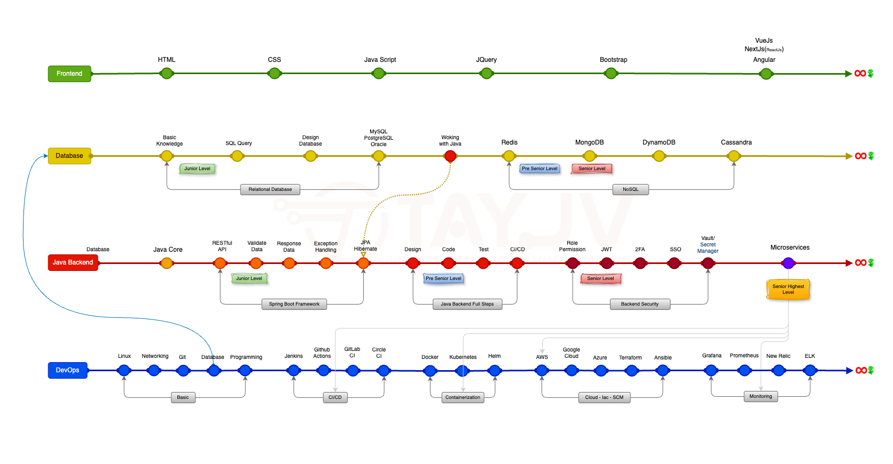

# Lộ Trình Học Java Toàn Diện

## **1\. Vì sao Java developer nên nhìn theo bốn hướng?**

Trong thực tế dự án, **backend Java** không tồn tại một mình: bạn đọc/ghi **database** , giao tiếp với **giao diện hoặc API public** , và triển khai/vận hành qua **pipeline & hạ tầng** . Lộ trình tách bốn tuyến giúp học viên thấy rõ **thứ tự ưu tiên** và **điểm nối** giữa các mảng (ví dụ: “Làm việc với Java” ở tuyến Database nối xuống **JPA/Hibernate** ở tuyến Backend; **Microservices** nối sang **Monitoring** ở DevOps).

## **2\. Frontend (giao diện & client)**

**Thứ tự gợi ý:**  
HTML → CSS → JavaScript → jQuery → Bootstrap → một trong các framework: **Vue.js** , **Next.js (React)** , hoặc **Angular** .

**Ý nghĩa cho học viên:**  
Bạn không nhất thiết trở thành chuyên gia frontend, nhưng cần đủ để **đọc UI** , **debug tích hợp** , **hiểu luồng dữ liệu** từ trình duyệt tới API. Sau Bootstrap, chọn **một** hướng framework và đi sâu sẽ hiệu quả hơn học lườm lợp cả ba.

## **3\. Database (dữ liệu)**

**Luồng chính:**  
Kiến thức nền → **Truy vấn SQL** → **Thiết kế CSDL** → hệ quan hệ: **MySQL / PostgreSQL / Oracle** → **Làm việc cùng Java** (điểm nối với backend) → **Redis** → **MongoDB** → **DynamoDB** → **Cassandra** .

**Hai nhóm lớn trên sơ đồ:**

*   **Relational:** từ nền tảng tới RDBMS phổ biến.
    
*   **NoSQL:** từ cache/document tới các store phân tán.
    

**Gợi ý “mức” tham chiếu (theo sơ đồ):**

*   Giai đoạn đầu **Relational** — tương đương nền **Junior** về dữ liệu.
    
*   Khu vực **Redis** — gần với **Pre-Senior** (cache, mô hình dữ liệu, hiệu năng).
    
*   Vùng **MongoDB** trở đi — hướng **Senior** (đa dạng workload, scale, trade-off).
    

**Điểm nối quan trọng:** Mốc **“Working with Java”** trên tuyến Database liên hệ trực tiếp với **JPA/Hibernate** trên tuyến Java — tức là: học DB phải **gắn với code Java** , không chỉ lý thuyết.

## **4\. Java Backend (trọng tâm nghề Java)**

**Luồng tổng quát:**  
Database → **Java Core** → **RESTful API** → **Validate dữ liệu** → **Trả response** → **Xử lý exception** → **JPA/Hibernate** → **Thiết kế** → **Code** → **Test** → **CI/CD** → **Phân quyền (Role/Permission)** → **JWT** → **2FA** → **SSO** → **Vault / Secret Manager** → **Microservices** (mốc chuyển sắc — thường là bước kiến trúc lớn).

**Các cụm theo sơ đồ:**

*   **Spring Boot / framework:** từ RESTful API tới JPA/Hibernate — đây là “xương sống” làm việc hằng ngày.
    
*   **Java Backend full steps:** Thiết kế → Code → Test → CI/CD — đủ vòng đời feature.
    
*   **Backend security:** từ phân quyền tới bí mật & secret — bắt buộc với hệ thống thật.
    

**Tham chiếu cấp (theo sơ đồ):**

*   **Junior:** bắt đầu từ khu vực **RESTful API** (API rõ ràng, validation, response, exception).
    
*   **Pre-Senior:** từ giai đoạn **Thiết kế** (trade-off, chất lượng, kiểm thử, pipeline).
    
*   **Senior:** từ **Role/Permission** và các lớp bảo mật nâng cao.
    
*   **Senior cao nhất:** gắn với **Microservices** — kiến trúc phân tán, độ phức tạp và trách nhiệm hệ thống.
    

Mốc **Microservices** được nối với nhóm **Monitoring** (Grafana, Prometheus, New Relic, ELK, …) — nhắc học viên: chia service xong phải **quan sát, log, metric, cảnh báo** , không chỉ “chạy được”.

## **5\. DevOps (vận hành & hạ tầng)**

**Luồng chính:**  
Linux → Networking → Git → Database → Programming → **Jenkins** → **GitHub Actions** → **GitLab CI** → **CircleCI** → **Docker** → **Kubernetes** → **Helm** → **AWS** → **Google Cloud** → **Azure** → **Terraform** → **Ansible** → **Grafana** → **Prometheus** → **New Relic** → **ELK** .

**Nhóm theo sơ đồ:**

*   **Basic:** Linux tới Programming — nền cho mọi thứ phía sau.
    
*   **CI/CD:** các công cụ build & pipeline.
    
*   **Containerization:** Docker, K8s, Helm.
    
*   **Cloud – IaaS – SCM:** ba nhà cloud lớn + Terraform + Ansible.
    
*   **Monitoring:** quan sát và log tập trung.
    

DevOps không phải “một chứng chỉ”, mà là **khả năng đưa code Java của bạn lên môi trường thật, tái lập được, đo được, sửa được** .

## **6\. Cách học cho học viên (thực tế, không bị ngợp)**

1.  **Giữ Java Backend làm trục** — mỗi tuần phải có **code + API + DB** .
    
2.  **Frontend & DevOps học theo “mức cần dùng”** — đủ để tự host demo, đọc log, chỉnh pipeline.
    
3.  **Database: SQL trước, NoSQL sau** — hiểu transaction, index, thiết kế bảng rồi mới Redis/MongoDB.
    
4.  **Security & Microservices** — chỉ đi sâu khi đã vững **REST + JPA + test + CI/CD** .
    
5.  **Ghi chú điểm nối trên sơ đồ** mỗi khi học xong một mốc — đó chính là **kiến thức “hệ thống”** , không rời rạc.
    

## **7\. Kết luận**

**Java developer giỏi là người đi được cả bốn hướng** — hiểu client, nắm dữ liệu, xây backend vững, và **đưa sản phẩm ra production có kiểm soát** . Học viên có thể dùng bài này như **mục lục** ; chi tiết từng mốc nên đi kèm **bài lab, dự án nhỏ, checklist** để mỗi ô trên sơ đồ đều có **bằng chứng trong CV** (repo, log pipeline, diagram kiến trúc).

