# Cài Đặt JDK Trên MacOS, Window, Linux/Ubuntu

### **1\. Cài Đặt JDK Trên MacOS**

– Để cài đặt JDK bản mới nhất  
`$ brew install openjdk`  
– Để cài đặt JDK theo version  
`$ brew install openjdk@17`  
– Thêm JDK vào _Path_ bằng cách chạy các câu lệnh được highlight trong hình phía dưới:

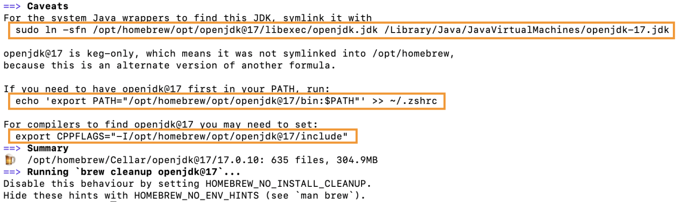

– Nếu các bạn muốn cài đặt thủ công thì có thể làm theo hướng dẫn tại mục **3\. Cài Đặt JDK Trên Linux/Ubuntu**. Khi các bạn cài đặt thủ công thì cần xác định Shell trước để biết là nên lưu biến JAVA\_HOME vào file _.bash\_profile_ hay file _.zprofile_.

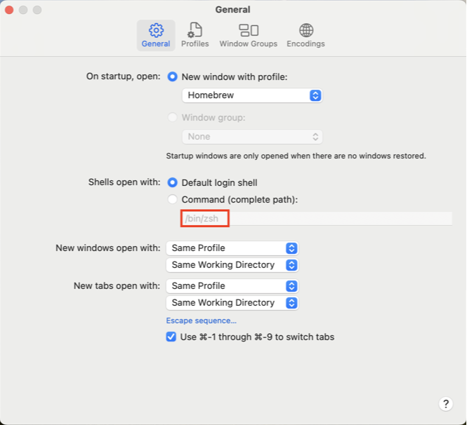

### **2\. Cài Đặt JDK Trên Window**

#### **2.1 Download JDK**

[Download JDK 17](https://www.oracle.com/java/technologies/downloads/#jdk17-windows) hoặc version khác tại [Java Downloads](https://www.oracle.com/java/technologies/downloads/)

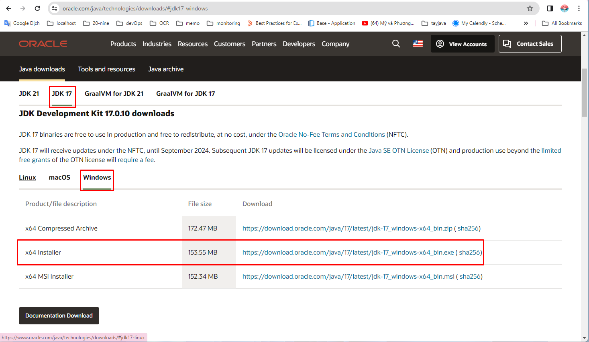

#### **2.2 Cài đặt JDK**

– Chạy file _jdk-17\_windows-x64\_bin.exe_ để cài đặt JDK.

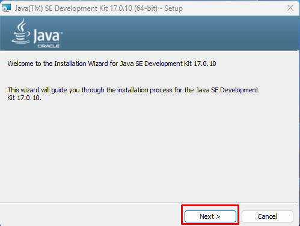

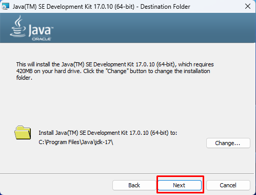

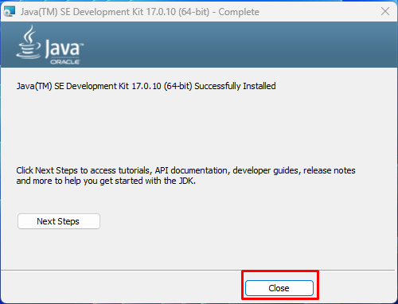

#### **2.3 Cài đặt biến môi trường** `JAVA_HOME`

– Sau khi các bạn cài đặt xong JDK thì các bạn cần thiết lập biến môi trường `JAVA_HOME` để JDK tự động chạy mỗi khi bạn mở PC lên nhé. Nếu thiếu bước này thì sau này các bạn cài đặt IntelliJ, Eclipse hay Docker sẽ bị lỗi nhé

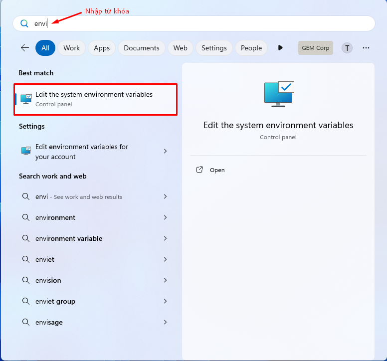

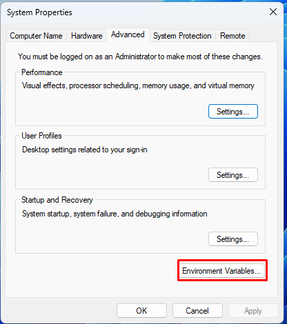

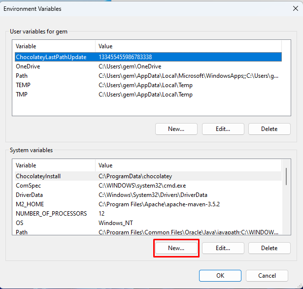

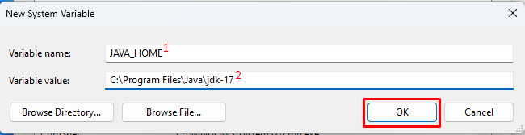

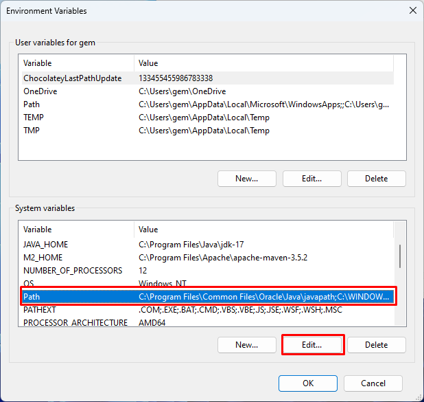

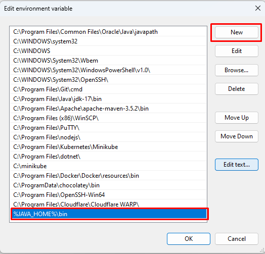

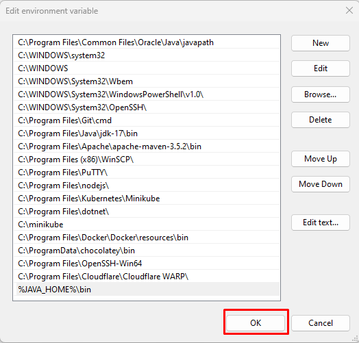

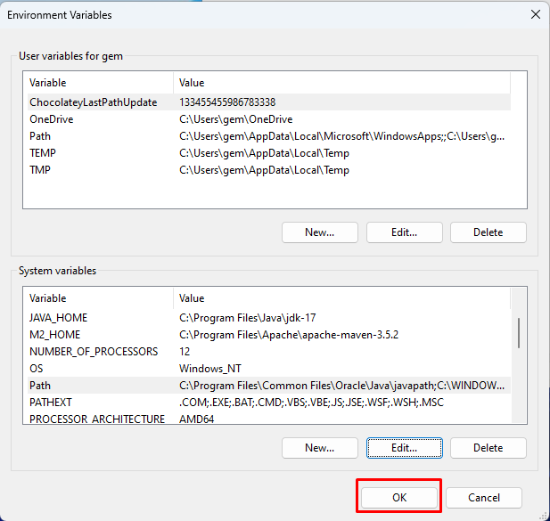

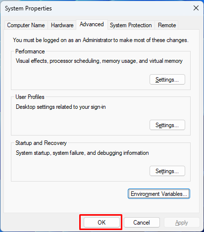

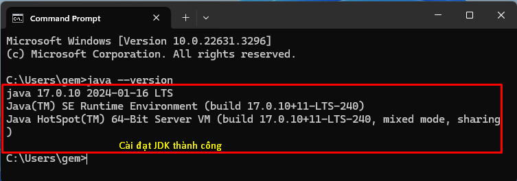

### **3\. Cài Đặt JDK Trên Linux/Ubuntu**

#### **3.1 Chọn thư mục để thao tác**

Chúng ta sẽ tạo một thực mục với tên _/dev-tools_ nắm trong thư mục _/opt_ để lưu trữ các file cài đặt và các tools.

```java
$ cd /
$ cd opt
$ sudo mkdir dev-tools
$ cd dev-tools
```

#### **3.2 Download file JDK**

Nếu chưa cài đặt wget thì chạy câu lệnh `$ sudo yum install wget` ngược lại thì chạy câu lệnh sau để download file _openjdk-17+35\_linux-x64\_bin.tar.gz_ vào thư mục _/dev-tools_

```java
$ sudo wget https://download.java.net/openjdk/jdk17/ri/openjdk-17+35_linux-x64_bin.tar.gz
```

Để cài đặt JDK theo version mong muốn các bạn có thể vào [jdk.java.net](https://jdk.java.net/) để lấy link nhé.

#### **3.3 Giải nén file download tại thư mục /dev-tools**

```java
$ sudo tar -xvf openjdk-17+35_linux-x64_bin.tar.gz
```

#### **3.4 Cài đặt biến môi trường JAVA\_HOME**

Mở file _.bash\_profile_ và thêm vào 2 dòng như phía dưới:

```java
$ vi ~/.bash_profile
...
JAVA_HOME="/opt/dev-tools/jdk-17"
PATH="$JAVA_HOME/bin:$PATH"
```

– Để lưu và thoát khỏi trình editor: gõ phím `ecs` trên bàn phím → gõ phím `:wq` để lưu và thoát.

– Để hệ điều hành nhận biến `JAVA_HOME` ngay lập tức thì chạy lệnh: `$ source ~/.bash_profile`

– Kiểm tra lại với `$ java –version`

```java
$ java --version
openjdk 17 2021-09-14
OpenJDK Runtime Environment (build 17+35-2724)
OpenJDK 64-Bit Server VM (build 17+35-2724, mixed mode, sharing)
```

