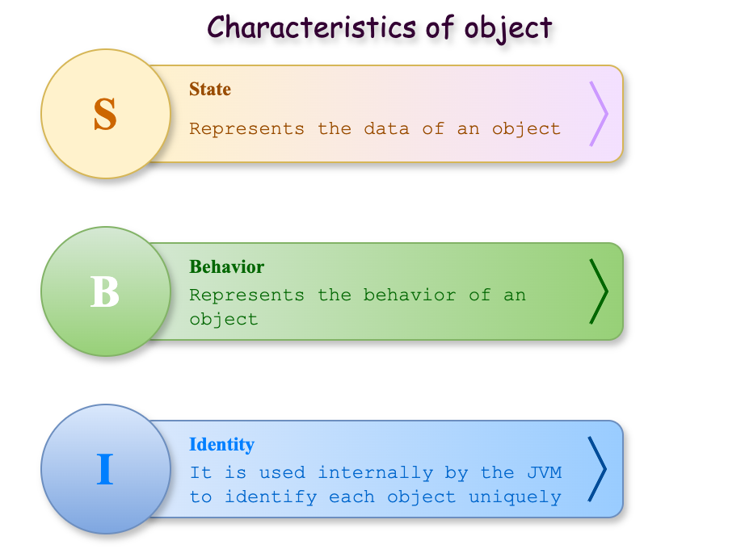
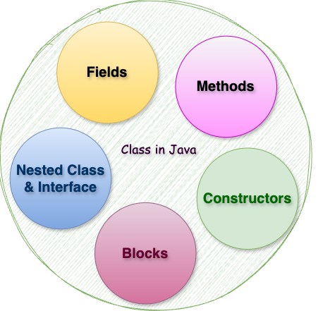

# Lập trình hướng đối tượng trong Java (OOP)

### **1\. Khái niệm về OOP - Lập trình hướng đối tượng**

Object-Oriented Programming System (OOP) là một mô hình lập trình cung cấp nhiều khái niệm như đối tượng, kế thừa, ràng buộc dữ liệu, đa hình, v.v.

Đối tượng có nghĩa là một thực thể trong thế giới thực như con người, đồ vật hay sự kiện. 

Lập trình hướng đối tượng là một phương pháp luận hoặc mô hình để thiết kế phần mềm bằng cách sử dụng các lớp và đối tượng. Nó đơn giản hóa việc phát triển và bảo trì phần mềm bằng cách cung cấp một số khái niệm:

1.  Object (Đối tượng)
    
2.  Class (Lớp)
    
3.  Inheritance (Kế thừa)
    
4.  Polymorphism (Đa hình)
    
5.  Abstraction (Trừu tượng)
    
6.  Encapsulation (Đóng gói)
    

### **2\. Đối tượng (Object)**



Một thực thể có trạng thái và hành vi được gọi là một đối tượng, ví dụ như bàn, ghế, sách, vở, tôm, cua, cá, v.v. Nó có thể là vật lý hoặc logic (hữu hình và vô hình). Ví dụ về một đối tượng vô hình là hệ thống ngân hàng.

*   Một đối tượng có ba đặc điểm:
    
    *   **State(Trạng thái)**: biểu diễn dữ liệu (giá trị) của một đối tượng.
        
    *   **Behavior(Hành vi)**: biểu diễn hành vi (chức năng) của một đối tượng như gửi tiền, rút tiền, v.v.
        
    *   **Identity(Nhận dạng)**: Nhận dạng đối tượng thường được triển khai thông qua một ID duy nhất. Người dùng bên ngoài không nhìn thấy giá trị của ID. Tuy nhiên, JVM sử dụng nó bên trong để nhận dạng duy nhất từng đối tượng.
        

Đối tượng có thể được định nghĩa là một thể hiện của một lớp. Đối tượng chứa một địa chỉ và chiếm một số không gian trong bộ nhớ. Các đối tượng có thể giao tiếp mà không cần biết chi tiết về dữ liệu hoặc mã của nhau. Điều duy nhất cần thiết là loại tin nhắn được chấp nhận và loại phản hồi mà các đối tượng trả về.

### **3\. Class (Lớp)**



Một class (lớp) là một nhóm các đối tượng có các thuộc tính chung. Nó là một mẫu hoặc bản thiết kế mà từ đó các đối tượng được tạo ra. Nó là một thực thể logic và không thể là thực thể vật lý.

Một lớp trong Java có thể chứa:

*   Fields (Các trường)
    
*   Methods (Phương thức)
    
*   Constructors (Khởi tạo)
    
*   Blocks (Khối)
    
*   Nested class and interface (Lớp lồng nhau và giao diện)
    

– Cú pháp:

```java
<public|protected> class <ClassName> { // { = begin block
    // Fields (Các trường)
    // Methods (Phương thức)
    // Constructors (Khởi tạo)
    
} // } = end block
```

– Ví dụ:

```java
import java.util.Date;

public class User { // Ký tự { bắt đầu Block của lớp User

    // Các fields này chính là instance variables
    private Integer id; // đây là fields
    private String firstName; // đây là fields
    private String lastName; // đây là fields
    private Date dateOfBirth; // đây là fields
    private Address address; // đây là fields
    public String message; // đây là fields

    // đây là constructor
    public User() {
    }

    // đây là constructor có tham số truyền vào
    public User(Integer id, String firstName, String lastName, Date dateOfBirth) {
        this.id = id;
        this.firstName = firstName;
        this.lastName = lastName;
        this.dateOfBirth = dateOfBirth;
    }

    // đây là method để thể hiện các hành vi (Behavior)
    public Integer getId() { // { bắt đầu Block của method getId()
        return id;
    } // } kết thúc Block của method getId()

    // đây là method để thể hiện các hành vi (Behavior)
    public void setId(Integer id) {
        this.id = id;
    }

    // đây là method để thể hiện các hành vi (Behavior)
    public String getFirstName() {
        return firstName;
    }

    // đây là method để thể hiện các hành vi (Behavior)
    public void setFirstName(String firstName) {
        this.firstName = firstName;
    }

    // đây là method để thể hiện các hành vi (Behavior)
    public String getLastName() {
        return lastName;
    }

    // đây là method để thể hiện các hành vi (Behavior)
    public void setLastName(String lastName) {
        this.lastName = lastName;
    }

    // đây là method để thể hiện các hành vi (Behavior)
    public Date getDateOfBirth() {
        return dateOfBirth;
    }

    // đây là method để thể hiện các hành vi (Behavior)
    public void setDateOfBirth(Date dateOfBirth) {
        this.dateOfBirth = dateOfBirth;
    }

    // đây là method để thể hiện các hành vi (Behavior)
    public String getFullName() {
        return this.firstName + " " + lastName;
    }

    // đây là method để thể hiện các hành vi (Behavior)
    public Address getAddress() {
        return address;
    }

    // đây là method để thể hiện các hành vi (Behavior)
    public void setAddress(Address address) {
        this.address = address;
    }

    // Nested class (Lớp lồng nhau)
    class Address {
        private String street;
        private String district;
        private String city;
        private String country;
    }

    @Override
    public String toString() {
        return "User{" +
                "id='" + id + '\'' +
                ", firstName='" + firstName + '\'' +
                ", lastName='" + lastName + '\'' +
                '}';
    }
} // Ký tự } kết thúc Block của lớp User
```

– **Instance Variable trong Java:**  
Một biến được tạo bên trong lớp nhưng bên ngoài phương thức được gọi là **Instance Variable**. **Instance Variable** không nhận được bộ nhớ tại thời điểm biên dịch. Nó nhận được bộ nhớ tại thời điểm chạy khi một đối tượng hoặc Instance được tạo ra. Đó là lý do tại sao nó được gọi là **Instance Variable**.

– **Method trong Java**:  
Trong Java, phương thức giống như hàm được sử dụng để biểu diễn hành vi của một đối tượng (behavior). Với phương thức chúng ta có thể tái sử dụng code hoặc tùy chỉnh dễ dàng.

– **Từ khóa** `new` **trong Java**  
Từ khóa `new` được sử dụng để phân bổ bộ nhớ khi chạy. Tất cả các đối tượng đều có bộ nhớ trong vùng bộ nhớ Heap.

```java
public class App {
    public static void main(String[] args) {

        // Tạo đối tượng User với từ khóa new
        User user = new User();
    }
}
```

### **4\. So sánh Object với Class**

Một class là một mẫu hoặc bản thiết kế để mô tả các thực thể hữu hình hoặc vô hình trong thế giới thật còn Object là bản sao hữu hình của class được tạo ra tại thời điểm Runtime của ứng dụng. Như vậy có thể nói Object là một instance của Class.

Có 3 cách để khởi tạo đối tượng  
– Khởi tạo đối tượng thông qua `reference variable` (biến tham chiếu)

```java
public class App {
    public static void main(String[] args) {

        // Tạo đối tượng User với từ khóa new
        User user = new User();

        // Khởi tạo đối tượng thông qua biến tham chiếu (reference variable)
        user.message = "Xin chào";
        System.out.println(user.message);
    }
}
```

– Khởi tạo đối tượng thông qua biến `method` (phương thức)

```java
public class App {
    public static void main(String[] args) {
        // Tạo đối tượng
        User other = new User();

        // Khởi tạo đối tượng qua method
        other.setId(1);
        other.setFirstName("Tây");
        other.setLastName("Java");
        System.out.println(other);
    }
}
```

– Khởi tạo đối tượng thông qua `constructors`

```java
public class App {
    public static void main(String[] args) {

        // Khởi tạo đối tượng thông qua constructors
        User someone = new User(2, "John", "Doe", new Date());
        System.out.println(someone);
    }
}
```

