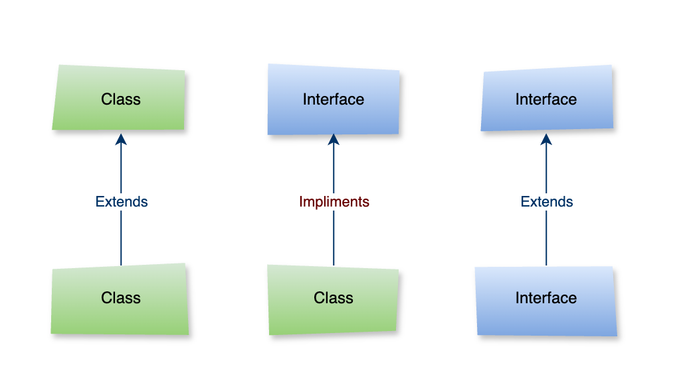
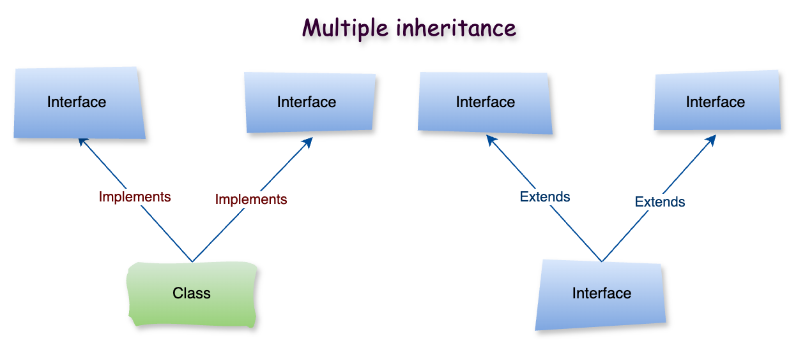
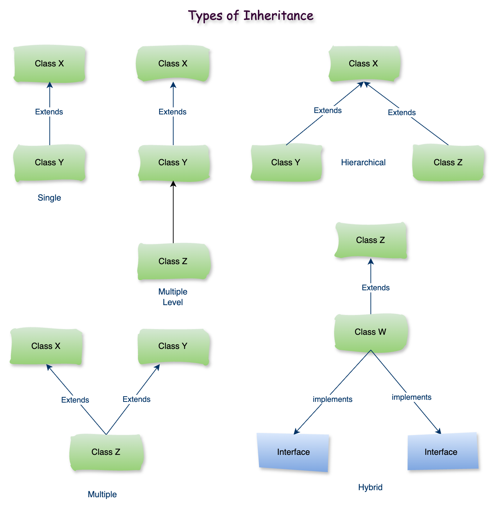

# Tính Kế Thừa Trong Java (Java Inheritance)

### **1\. Java Inheritance là gì?**

Trong thế giới sinh vật thì các thế hệ con cái kế thừa các đặc điểm tính chất của cha mẹ là điều hết sức hiển nhiên hay việc con người có thể xây dựng nên các bộ khung hoặc biểu mẫu để có thể tái sử dụng nhiều lần nhờ đó mà có thể tiết kiệm được thời gian và tiền bạc trong sản xuất. Trong lập trình hướng đối tượng thì tính kế thừa được định nghĩa và thể hiện như là các `interface` và `class abstract`.

### **2\. Interface**

**Interface** là bản thiết kế của một lớp. Nó có các hằng số tĩnh và phương thức trừu tượng.

```java
public interface {
// declare constant fields
// declare methods that abstract
// by default.
// static method
}
```

– Ví dụ:

```java
public interface SampleInterface {

    // constant fields
    String name = "Fox Dev";

    // abstract methods
    void method1();

    int method2();

    String methodN();

    // default method
    default void sayHello() {
        System.out.println("Đây là sample interface");
    }

    // static method
    static String getCurrentTime(){
        return String.valueOf(LocalDate.now());
    }
}
```

### **3\. Tại sao sử dụng** `Interface` **?**

Có ba lý do chính để sử dụng Interface như sau:

*   Interface được sử dụng để đạt được sự trừu tượng.
    
*   Theo Interface, chúng ta có thể hỗ trợ khả năng đa kế thừa.
    
*   Có thể được sử dụng để đạt được sự kết hợp lỏng lẻo.
    

### **4\. Mối quan hệ giữa** `class` **và** `interface`

Java đưa tính kế thừa vào trong lập trình hướng đối tượng thông qua 2 từ khoá là extends và implement để thể hiện việc kế thừa giữa các class và interface.



Như hình thể hiện phía trên một class extends từ một class khác, một interface extends từ một interface khác, Nhưng một class thì implements(triển khai/thực hiện) một interface khác.

### **5\. Đa kế thừa trong Java**



*   Một interface có thể extends từ nhiều interface khác.
    
*   Một class có thể implements từ nhiều interface.
    

– Ví dụ: `public interface <interfaceX> extends <interfaceA>, <interfaceB>`

```java
// Super interface
public interface BaseService {

    default void printMessage() {
        System.out.println("Default message from BaseService");
    }
}

// Super interface
public interface LogService {

    void saveLog();

    void printLog();
}

// Một interface có thể extends từ nhiều interface khác.
public interface UserService extends BaseService, LogService {

    int addUser(User user);

    void updateUser(User userId);

    void deleteUser(long userId);
}
```

– Ví dụ: `public class <ClassX> implements <ClassA>, <ClassB>`

```java
// Một class có thể implements từ nhiều interface.
public class UserServiceImpl implements UserService, CommonService {

    @Override
    public int addUser(User user) {
        System.out.println("-----[ addUser ]-----");
        return 0;
    }

    @Override
    public void updateUser(User userId) {
        System.out.println("-----[ updateUser ]-----");
    }

    @Override
    public void deleteUser(long userId) {
        System.out.println("-----[ deleteUser ]-----");
    }

    @Override
    public void saveLog() {
        System.out.println("-----[ saveLog ]-----");
    }

    @Override
    public void printLog() {
        System.out.println("-----[ printLog ]-----");
    }

    @Override
    public void connectDB() {
        System.out.println("-----[ connectDB ]-----");
    }
}
```

### **6\. Các kiểu kế thừa trong Java**



1.  Single Inheritance
    
2.  Multiple Level Inheritance
    
3.  Hierarchical Inheritance
    
4.  Multiple Inheritance
    
5.  Hybrid Inheritance
    

