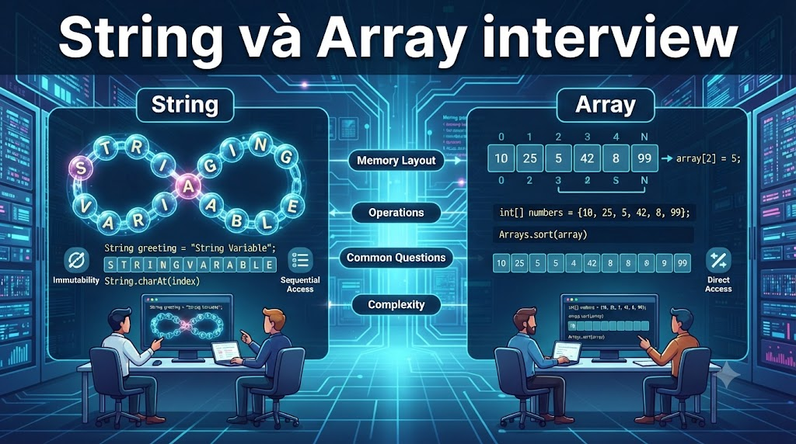

# Tuyển Tập 10 Câu Hỏi Về String và Array Trong Java



### **1\. Sự khác nhau giữa String, StringBuilder và StringBuffer?**

**📌 Trả lời:**

*   **_String:_** _immutable. Mỗi lần thay đổi sẽ tạo object mới._
    
*   **_StringBuilder:_** _mutable, nhanh, không thread-safe._
    
*   **_StringBuffer:_** _mutable, thread-safe (synchronized) nhưng chậm hơn StringBuilder._
    

### **2\. Tại sao String trong Java là immutable?**

**📌 Trả lời:**

*   _Bảo mật: thường dùng trong URL, class loader._
    
*   _Hashing hiệu quả: hỗ trợ caching trong HashMap, HashSet._
    
*   _Thread-safe: nhiều thread có thể dùng chung String._
    
*   _Hỗ trợ String pool để tiết kiệm bộ nhớ._
    

### **3\. String pool trong Java là gì?**

**📌 Trả lời:**

*   _Vùng nhớ đặc biệt trong heap để lưu String literal._
    
*   _Khi tạo_ `"hello"`_, JVM sẽ kiểm tra pool trước, nếu có sẽ tái sử dụng thay vì tạo mới._
    
*   _Dùng_ `intern()` _để thêm String vào pool._
    

### **4\. So sánh** `==` **và** `.equals()` **khi so sánh String?**

**📌 Trả lời:**

*   `==`_: so sánh địa chỉ object (reference)._
    
*   `.equals()`_: so sánh nội dung String._
    

```java
String a = "abc";
String b = new String("abc");
System.out.println(a == b);       // false
System.out.println(a.equals(b)); // true
```

### **5\. Cách đảo ngược (reverse) một String trong Java?**

**📌 Trả lời:**

_Dùng_ `StringBuilder`_:_

```java
String s = "Java";
String reversed = new StringBuilder(s).reverse().toString();
```

Hoặc dùng vòng lặp tự code.

### **6\. Làm thế nào để kiểm tra một chuỗi là Palindrome?**

**📌 Trả lời:**

_Palindrome: chuỗi đọc xuôi và ngược giống nhau._

```java
String s = "madam";
boolean isPalindrome = s.equals(new StringBuilder(s).reverse().toString());
```

### **7\. Làm sao để chuyển một String thành mảng ký tự (char array)?**

**📌 Trả lời:**

_Dùng_ `toCharArray()`_:_

```java
String s = "hello";
char[] arr = s.toCharArray();
```

### **8\. Làm sao để tìm phần tử lớn nhất trong một mảng số nguyên?**

**📌 Trả lời:**

```java
int[] arr = {5, 9, 2, 7};
int max = arr[0];
for (int i = 1; i < arr.length; i++) {
    if (arr[i] > max) max = arr[i];
}
```

### **9\. Làm sao để sắp xếp một mảng trong Java?**

**📌 Trả lời:**

*   _Dùng_ `Arrays.sort(arr);`
    
*   _Hoặc custom comparator cho object array:_
    

```java
Arrays.sort(arr, (a, b) -> b - a); // sắp xếp giảm dần
```

### **10\. Sự khác nhau giữa mảng (Array) và ArrayList trong Java?**

**📌 Trả lời:**

*   **_Array:_**
    
    *   _Kích thước cố định._
        
    *   _Có thể chứa primitive type và object._
        
*   **_ArrayList:_**
    
    *   _Kích thước động, tự mở rộng._
        
    *   _Chỉ chứa object (với primitive thì dùng wrapper)._
        
    *   _Nhiều method tiện ích: add, remove, contains…_
        

