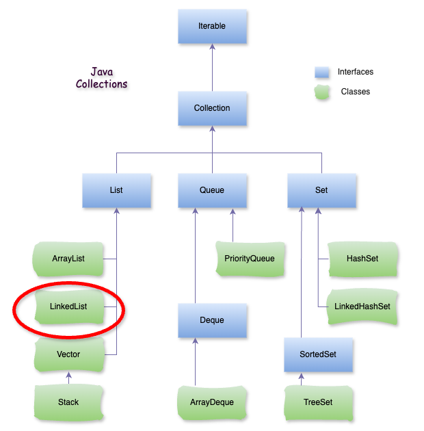

# Java LinkedList

### **1\. LinkedList là gì?**

**LinkedList trong Java** là một trong những cấu trúc dữ liệu thuộc thư viện Java Collections Framework. Nó `implements` cả 2 interfaces là `List` và `Deque`, vì vậy nó có thể hoạt động như một danh sách hoặc một hàng đợi.



### **2\. Đặc điểm chính của LinkedList**

*   **Cấu trúc**: LinkedList được triển khai theo kiểu danh sách liên kết kép (Doubly Linked List), tức là mỗi phần tử (`Node`) có hai con trỏ, một trỏ đến phần tử phía trước và một trỏ đến phần tử phía sau.
    
*   **Thao tác**: So với `ArrayList`, `LinkedList` có khả năng thêm và xóa phần tử ở đầu hoặc cuối danh sách hiệu quả hơn (O(1)) vì chỉ cần cập nhật các liên kết giữa các phần tử mà không cần di chuyển dữ liệu. Tuy nhiên, việc truy cập phần tử ở một vị trí bất kỳ chậm hơn `ArrayList` (O(n)) vì cần phải duyệt qua các phần tử trong danh sách.
    
*   **Các phương thức quan trọng**:
    
    *   `addFirst()`, `addLast()`: Thêm phần tử vào đầu/cuối danh sách.
        
    *   `removeFirst()`, `removeLast()`: Xóa phần tử đầu/cuối danh sách.
        
    *   `getFirst()`, `getLast()`: Truy cập phần tử đầu/cuối.
        
    *   `add(index, element)`: Thêm phần tử vào vị trí chỉ định.
        
    *   `remove(index)`: Xóa phần tử tại vị trí chỉ định.
        
*   **Ưu điểm và nhược điểm**:
    
    *   **Ưu điểm**: Thêm và xóa phần tử nhanh ở đầu hoặc cuối danh sách.
        
    *   **Nhược điểm**: Truy cập phần tử chậm khi so sánh với `ArrayList`, vì `LinkedList` không hỗ trợ truy cập ngẫu nhiên trực tiếp.
        

– Ví dụ:

```java
import java.util.LinkedList;

public class App {

    public static void main(String[] args) {
        LinkedList list = new LinkedList<>();

        // Thêm phần tử
        list.add("Cam");
        list.add("Quýt");
        list.addFirst("Mít");
        list.addLast("Dừa");

        // In ra danh sách
        System.out.println("Danh sách: " + list);

        // Xóa phần tử đầu và cuối
        list.removeFirst();
        list.removeLast();

        // Truy cập phần tử
        String firstElement = list.getFirst();
        String lastElement = list.getLast();

        System.out.println("Phần tử đầu: " + firstElement);
        System.out.println("Phần tử cuối: " + lastElement);
    }
}
```

– Kết quả:

```java
Danh sách: [Mít, Cam, Quýt, Dừa] Phần tử đầu: Cam Phần tử cuối: Quýt
```

### **3\. Khi nào dùng LinkedList ?**

*   **Khi cần nhiều thao tác thêm/xóa (insert/delete) ở giữa danh sách**
    
    *   Thêm hoặc xóa một phần tử ở đầu/cuối danh sách (`addFirst()`, `removeFirst()`, `addLast()`, `removeLast()`) diễn ra rất nhanh **O(1)**.
        
    *   Thêm hoặc xóa ở giữa (khi đã có `Iterator` trỏ sẵn đến vị trí) cũng nhanh hơn `ArrayList`, vì không cần dời các phần tử.
        
*   **Khi không cần truy cập ngẫu nhiên (random access) nhiều**
    
    *   Truy cập theo chỉ số (`get(index)`) trong `LinkedList` mất **O(n)** vì phải duyệt từng node từ đầu hoặc cuối.
        
    *   Nếu ứng dụng của bạn thường xuyên gọi `list.get(i)`, thì `ArrayList` tốt hơn.
        
*   **Khi kích thước danh sách thay đổi thường xuyên**
    
    *   Ví dụ: một hàng đợi (queue), một ngăn xếp (stack), hay một danh sách công việc mà phần tử vào/ra liên tục.
        
*   **Khi cần triển khai cấu trúc dữ liệu đặc biệt**
    
    *   `LinkedList` cài đặt luôn `Deque` và `Queue`, nên có thể dùng như:
        

**→ Hàng đợi (Queue)**: FIFO → `offer()`, `poll()`.

**→ Ngăn xếp (Stack)**: LIFO → `push()`, `pop()`.

