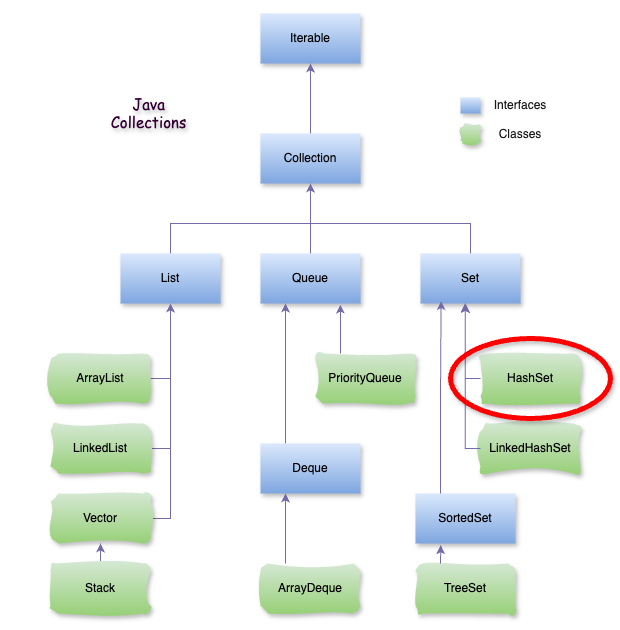

# Java HashSet

### **1\. HashSet là gì?**

HashSet là một cấu trúc dữ liệu thuộc thư viện Java Collections Framework được sử dụng để lưu trữ các phần tử duy nhất, không trùng lặp và không duy trì thứ tự. **HashSet** được triển khai dựa trên HashMap sử dụng bảng băm (hash table) để lưu trữ các phần tử, cho nên các phần tử trong **HashSet** không được sắp xếp theo thứ tự nhất định.



###   
**2\. Đặc điểm của HashSet**

*   **Không cho phép các phần tử trùng lặp:** HashSet chỉ lưu trữ các phần tử duy nhất. Nếu một phần tử đã tồn tại trong tập hợp, HashSet sẽ không cho phép thêm phần tử đó lần nữa.
    
*   **Không duy trì thứ tự:** HashSet không đảm bảo thứ tự của các phần tử.
    
*   **Cho phép phần tử** `null`**:** HashSet cho phép thêm một phần tử null.
    
*   **Hiệu suất cao với các thao tác cơ bản:** HashSet có hiệu suất trung bình là O(1) cho các thao tác thêm, xóa và kiểm tra sự tồn tại của phần tử nhờ vào cấu trúc bảng băm.
    

### **3\. Cách hoạt động của HashSet**

**HashSet** sử dụng hàm băm của phần tử (thông qua phương thức `hashCode()`) để tính toán vị trí của phần tử trong bảng băm. Để thêm một phần tử vào **HashSet**, Java tính toán giá trị băm (hashCode) của phần tử và đặt nó tại vị trí tương ứng trong bảng băm. Khi kiểm tra phần tử trùng lặp, **HashSet** sử dụng cả `hashCode()` và `equals()` để xác định xem phần tử đã tồn tại hay chưa.

### **4\. Các phương thức quan trọng của HashSet**

**HashSet** cung cấp các phương thức sau để thao tác với tập hợp:

*   `add(E e)`: Thêm một phần tử vào HashSet. Nếu phần tử đã tồn tại, phương thức này trả về `false`.
    
*   `remove(Object o)`: Xóa một phần tử khỏi HashSet.
    
*   `contains(Object o)`: Kiểm tra xem phần tử có tồn tại trong HashSet hay không.
    
*   `size()`: Trả về số lượng phần tử trong HashSet.
    
*   `isEmpty()`: Kiểm tra xem HashSet có trống hay không.
    
*   `clear()`: Xóa tất cả các phần tử khỏi HashSet.
    

– Ví dụ:

```java
import java.util.HashSet;

public class App {

    public static void main(String[] args) {
        // Khởi tạo HashSet
        HashSet hashSet = new HashSet<>();

        // Thêm phần tử vào HashSet
        hashSet.add("Cam");
        hashSet.add("Quýt");
        hashSet.add("Mít");
        hashSet.add("Dừa");

        // Thử thêm phần tử trùng lặp
        hashSet.add("Cam");

        // In ra các phần tử của HashSet
        System.out.println("HashSet: " + hashSet); // [Mít, Quýt, Cam, Dừa]

        // Kiểm tra sự tồn tại của một phần tử
        System.out.println("HashSet có chứa 'Quýt' không? " + hashSet.contains("Quýt")); // true

        // Xóa phần tử
        hashSet.remove("Mít");
        System.out.println("HashSet sau khi xóa 'Mít': " + hashSet); // [Quýt, Cam, Dừa]

        // Duyệt qua các phần tử trong HashSet
        System.out.println("Các phần tử trong HashSet:");
        for (String s : hashSet) {
            System.out.println(s);
        }
    }
}
```

– Kết quả:

HashSet: \[Mít, Quýt, Cam, Dừa\] HashSet có chứa 'Quýt' không? true HashSet sau khi xóa 'Mít': \[Quýt, Cam, Dừa\] Các phần tử trong HashSet: Quýt Cam Dừa

### **5\. Khi nào nên dùng HashSet?**

*   Khi cần lưu trữ các phần tử duy nhất và không quan tâm đến thứ tự của chúng.
    
*   Khi muốn tìm kiếm, thêm, xóa phần tử với hiệu suất cao.
    

### **6\. Ưu và nhược điểm của HashSet**

*   **Ưu điểm**:
    
    *   Hiệu suất cao cho các thao tác thêm, xóa và tìm kiếm phần tử.
        
    *   Không cho phép phần tử trùng lặp.
        
*   **Nhược điểm**:
    
    *   Không duy trì thứ tự của các phần tử.
        
    *   Không thích hợp khi cần thao tác với các phần tử theo thứ tự (chèn hoặc sắp xếp).
        

