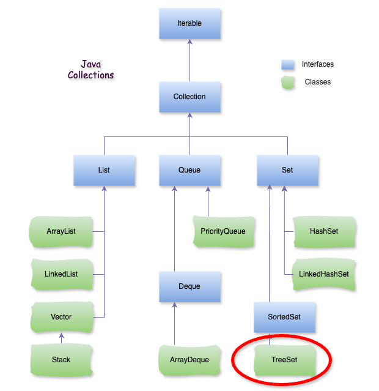

# Java TreeSet

## **1\. TreeSet là gì?**

**TreeSet** là một cấu trúc dữ liệu thuộc Java Collections Framework dùng để lưu trữ các phần tử theo thứ tự tự nhiên (hoặc theo một tiêu chí được chỉ định) và không cho phép các phần tử trùng lặp. TreeSet được triển khai dựa trên `NavigableSet` và sử dụng cây nhị phân cân bằng (`Red-Black Tree`) để lưu trữ và sắp xếp các phần tử.



## **2\. Đặc điểm chính của TreeSet**

*   **Sắp xếp tự động**: Các phần tử trong TreeSet được sắp xếp theo thứ tự tự nhiên hoặc theo thứ tự được xác định bởi `Comparator` tùy chỉnh nếu được cung cấp.
    
*   **Không cho phép trùng lặp**: TreeSet không cho phép các phần tử trùng nhau. Nếu bạn cố thêm phần tử đã tồn tại, `TreeSet` sẽ bỏ qua.
    
*   **Cấu trúc Cây nhị phân cân bằng**: `TreeSet` sử dụng cây `Red-Black` để lưu trữ các phần tử, giúp cho các thao tác như thêm, xóa và tìm kiếm đạt hiệu suất trung bình là O(log n).
    
*   **Không cho phép** `null`: `TreeSet` không cho phép giá trị `null`, vì thứ tự của phần tử `null` không thể xác định trong một cây sắp xếp.
    

## **3\. Các phương thức quan trọng của TreeSet**

Một số phương thức thường dùng trong **TreeSet** bao gồm:

*   `add(E e)`: Thêm một phần tử vào TreeSet.
    
*   `remove(Object o)`: Xóa phần tử cụ thể khỏi TreeSet.
    
*   `first()`: Lấy phần tử nhỏ nhất (đầu tiên) trong TreeSet.
    
*   `last()`: Lấy phần tử lớn nhất (cuối cùng) trong TreeSet.
    
*   `higher(E e)`: Lấy phần tử lớn hơn phần tử `e` gần nhất.
    
*   `lower(E e)`: Lấy phần tử nhỏ hơn phần tử `e` gần nhất.
    
*   `ceiling(E e)`: Lấy phần tử lớn nhất, bằng hoặc lớn hơn `e`.
    
*   `floor(E e)`: Lấy phần tử nhỏ nhất, bằng hoặc nhỏ hơn `e`.
    
*   `subSet(E fromElement, E toElement)`: Trả về một `SortedSet` chứa các phần tử từ _fromElement_ đến _toElement_.
    
*   `headSet(E toElement)`: Trả về một SortedSet chứa các phần tử nhỏ hơn _toElement_.
    
*   `tailSet(E fromElement)`: Trả về một SortedSet chứa các phần tử lớn hơn hoặc bằng _fromElement_.
    

– Ví dụ:

```java
import java.util.TreeSet;

public class App {

    public static void main(String[] args) {
        // Khởi tạo TreeSet
        TreeSet treeSet = new TreeSet<>();

        // Thêm phần tử vào TreeSet
        treeSet.add(10);
        treeSet.add(5);
        treeSet.add(20);
        treeSet.add(15);

        // TreeSet tự động sắp xếp các phần tử
        System.out.println("TreeSet: " + treeSet); // [5, 10, 15, 20]

        // Truy cập phần tử đầu tiên và cuối cùng
        System.out.println("Phần tử nhỏ nhất: " + treeSet.first()); // 5
        System.out.println("Phần tử lớn nhất: " + treeSet.last());  // 20

        // Sử dụng các phương thức điều hướng
        System.out.println("Phần tử lớn hơn 10: " + treeSet.higher(10)); // 15
        System.out.println("Phần tử nhỏ hơn 15: " + treeSet.lower(15));  // 10

        // Xóa phần tử
        treeSet.remove(10);
        System.out.println("TreeSet sau khi xóa 10: " + treeSet); // [5, 15, 20]
    }
}
```

– Kết quả:

```plaintext
TreeSet: [5, 10, 15, 20]
Phần tử nhỏ nhất: 5
Phần tử lớn nhất: 20
Phần tử lớn hơn 10: 15
Phần tử nhỏ hơn 15: 10
TreeSet sau khi xóa 10: [5, 15, 20]
```

### **4\. Ưu và nhược điểm của TreeSet**

*   **Ưu điểm:**
    
    *   Duy trì thứ tự sắp xếp tự nhiên.
        
    *   Cung cấp hiệu suất tốt cho các thao tác tìm kiếm, thêm, và xóa với thời gian O(log n).
        
    *   Hỗ trợ các thao tác điều hướng như subSet, headSet, tailSet để lấy các tập con của TreeSet.
        
*   **Nhược điểm:**
    
    *   Không cho phép phần tử null.
        
    *   TreeSet có hiệu suất kém hơn HashSet trong trường hợp không cần duy trì thứ tự vì HashSet có thời gian O(1) cho các thao tác thêm, xóa, và tìm kiếm.
        

