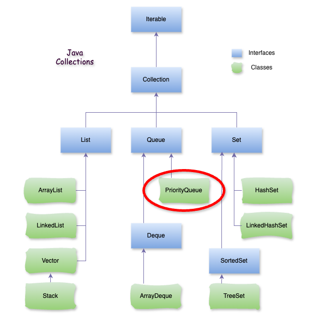

# Java PriorityQueue

### **1\. PriorityQueue là gì?**

**PriorityQueue** là một lớp trong Java thuộc gói `java.util`. Nó đại diện cho một **hàng đợi ưu tiên** dựa trên **heap (cây nhị phân)**, trong đó các phần tử được xử lý theo mức độ ưu tiên thay vì thứ tự chèn vào (FIFO – First In First Out).



### **2\. Đặc điểm chính của** `PriorityQueue`

*   **Sắp xếp phần tử tự động**:
    
    *   Theo mặc định, các phần tử trong `PriorityQueue` được sắp xếp theo **thứ tự tăng dần tự nhiên** (đối với các lớp triển khai `Comparable` như `Integer`, `String`, v.v.).
        
    *   Bạn có thể tùy chỉnh thứ tự sắp xếp bằng cách cung cấp một **bộ so sánh tùy chỉnh** (`Comparator`) trong khi khởi tạo.
        
*   **Không đảm bảo thứ tự chèn (insertion order)**: Phần tử có độ ưu tiên cao nhất sẽ luôn được xử lý trước, không quan trọng nó được thêm vào lúc nào.
    
*   **Không cho phép phần tử** `null`: Không được thêm giá trị `null` vào `PriorityQueue`.
    
*   **Hiệu suất cao**:
    
    *   Các thao tác như **thêm** (`add()` hoặc `offer()`) và **lấy/xóa phần tử có độ ưu tiên cao nhất** (`poll()`) được thực hiện trong thời gian O(log n).
        
    *   Lấy phần tử đầu tiên (có độ ưu tiên cao nhất) mà không xóa (`peek()`) thực hiện trong thời gian O(1).
        
*   **Không đồng bộ**: `PriorityQueue` không an toàn cho môi trường đa luồng. Nếu cần sử dụng trong môi trường đa luồng, bạn nên sử dụng `PriorityBlockingQueue`.
    

### **3\. Một số phương thức quan trọng**

*   **Thêm phần tử**: `add(E e)` hoặc `offer(E e)`: Thêm phần tử vào hàng đợi ưu tiên.
    
*   **Lấy phần tử**:
    
    *   `poll()`: Lấy và xóa phần tử có độ ưu tiên cao nhất khỏi hàng đợi.
        
    *   `peek()`: Lấy nhưng không xóa phần tử có độ ưu tiên cao nhất.
        
*   **Xóa phần tử**: `remove(Object o)`: Xóa phần tử cụ thể khỏi hàng đợi.
    
*   **Kiểm tra kích thước**: `size()`: Trả về số lượng phần tử trong hàng đợi.
    

### **4\. Cách sử dụng** `PriorityQueue`

*   **Sử dụng thứ tự tự nhiên:**
    

```java
import java.util.PriorityQueue;

public class App {
    public static void main(String[] args) {
        PriorityQueue pq = new PriorityQueue<>();

        // Thêm phần tử
        pq.add(10);
        pq.add(20);
        pq.add(15);

        System.out.println("PriorityQueue ban đầu: " + pq);

        // Lấy phần tử có độ ưu tiên cao nhất (nhỏ nhất trong trường hợp này)
        System.out.println("Phần tử nhỏ nhất: " + pq.peek());

        // Lấy và xóa phần tử nhỏ nhất
        System.out.println("Lấy và xóa phần tử nhỏ nhất: " + pq.poll());

        System.out.println("PriorityQueue sau khi xóa: " + pq);
    }
}
```

**– Kết quả in ra:**

```java
PriorityQueue ban đầu: [10, 20, 15]
Phần tử nhỏ nhất: 10
Lấy và xóa phần tử nhỏ nhất: 10
PriorityQueue sau khi xóa: [15, 20]
```

*   **Sử dụng Comparator tùy chỉnh (đảo ngược thứ tự):**
    

```java
import java.util.PriorityQueue;
import java.util.Comparator;

public class App {

    public static void main(String[] args) {

        // Hàng đợi ưu tiên với thứ tự giảm dần
        PriorityQueue pq = new PriorityQueue<>(Comparator.reverseOrder());

        // Thêm phần tử
        pq.add(11);
        pq.add(22);
        pq.add(33);

        System.out.println("PriorityQueue ban đầu: " + pq);

        // Lấy phần tử có độ ưu tiên cao nhất (lớn nhất trong trường hợp này)
        System.out.println("Phần tử lớn nhất: " + pq.peek());

        // Lấy và xóa phần tử lớn nhất
        System.out.println("Lấy và xóa phần tử lớn nhất: " + pq.poll());

        System.out.println("PriorityQueue sau khi xóa: " + pq);
    }
} 
```

**– Kết quả in ra:**

```java
PriorityQueue ban đầu: [33, 11, 22]
Phần tử lớn nhất: 33
Lấy và xóa phần tử lớn nhất: 33
PriorityQueue sau khi xóa: [22, 11]
```

### **5\. Khi nào nên sử dụng** `PriorityQueue`**?**

*   **Cần xử lý các phần tử theo độ ưu tiên**:
    
    *   Ví dụ: Một hàng đợi tác vụ trong hệ điều hành (các tác vụ quan trọng được xử lý trước).
        
*   **Không quan tâm đến thứ tự chèn**:
    
    *   `PriorityQueue` sắp xếp dựa trên độ ưu tiên, không dựa trên thứ tự chèn.
        
*   **Hiệu suất tốt**:
    
    *   Khi cần một cấu trúc dữ liệu gọn nhẹ và nhanh để xử lý các phần tử theo thứ tự ưu tiên.
        

