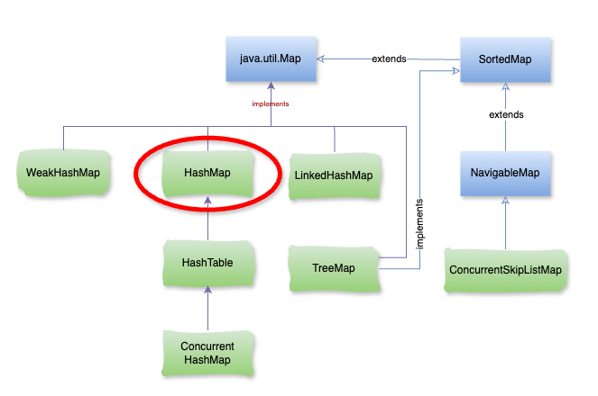

# Java HashMap

## **1\. HashMap là gì ?**

**HashMap** là một triển khai của giao diện **Map**, **HashMap** cho phép lưu trữ các cặp khóa-giá trị (key-value pairs). **HashMap** sử dụng cấu trúc bảng băm (hash table) để lưu trữ các phần tử, cho phép truy cập nhanh chóng và hiệu quả cho các thao tác như thêm, tìm kiếm và xóa phần tử.



### **2\. Đặc điểm nổi bật của** `HashMap`

1.  **Không duy trì thứ tự**: HashMap không đảm bảo thứ tự của các phần tử. Các phần tử có thể được lưu trữ theo thứ tự không xác định.
    
2.  **Cho phép** `null`: HashMap cho phép một khóa `null` và nhiều giá trị `null`. Tuy nhiên, chỉ có một khóa `null` được cho phép.
    
3.  **Hiệu suất**: Các thao tác như thêm, tìm kiếm và xóa phần tử trong HashMap có độ phức tạp trung bình là `O(1)`, nhưng trong trường hợp xấu nhất (khi xảy ra nhiều va chạm hash), độ phức tạp có thể lên tới `O(n)`.
    
4.  **Không đồng bộ hóa**: HashMap không phải là thread-safe. Nếu cần sử dụng trong môi trường đa luồng, bạn có thể sử dụng `Collections.synchronizedMap(new HashMap<>())` để tạo một bản sao đồng bộ của HashMap.
    
5.  **Tối ưu bộ nhớ**: HashMap tự động điều chỉnh dung lượng (capacity) và hệ số tải (load factor) để tối ưu hóa bộ nhớ.
    

### **3\. Các phương thức phổ biến của** `HashMap`

*   `put(K key, V value)`: Thêm một cặp khóa-giá trị vào HashMap.
    
*   `get(Object key)`: Trả về giá trị tương ứng với khóa đã cho.
    
*   `remove(Object key)`: Xóa cặp khóa-giá trị tương ứng với khóa đã cho.
    
*   `containsKey(Object key)`: Kiểm tra xem khóa có tồn tại trong HashMap không.
    
*   `containsValue(Object value)`: Kiểm tra xem giá trị có tồn tại trong HashMap không.
    
*   `size()`: Trả về số lượng phần tử trong HashMap.
    
*   `keySet()`: Trả về một tập hợp chứa tất cả các khóa trong HashMap.
    

### **4\. Cách sử dụng** `HashMap`

**HashMap** là một công cụ mạnh mẽ để lưu trữ và quản lý dữ liệu theo dạng cặp khóa-giá trị trong Java. Nó rất hữu ích trong nhiều tình huống khi cần truy cập dữ liệu một cách nhanh chóng và hiệu quả.

– Ví dụ

```java
import java.util.HashMap;

public class App {

    public static void main(String[] args) {
        // Tạo một HashMap
        HashMap<String, Integer> map = new HashMap<>();

        // Thêm các phần tử vào HashMap
        map.put("Cam", 1);
        map.put("Quýt", 2);
        map.put("Mít", 3);
        map.put(null, 4); // Thêm khóa null
        map.put("Dừa", null); // Thêm giá trị null

        // Lấy giá trị từ HashMap
        System.out.println("Giá trị của khóa 'Quýt': " + map.get("Quýt")); // In ra 2

        // Kiểm tra xem HashMap có chứa khóa hoặc giá trị cụ thể không
        System.out.println("Có chứa khóa 'Mít' không? " + map.containsKey("Mít")); // In ra true
        System.out.println("Có chứa giá trị 4 không? " + map.containsValue(4)); // In ra true

        // Duyệt qua các phần tử của HashMap
        System.out.println("Các phần tử trong HashMap:");
        for (String key : map.keySet()) {
            System.out.println(key + ": " + map.get(key));
        }
    }
}
```

– Kết quả:

```java
Giá trị của khóa 'Quýt': 2
Có chứa khóa 'Mít' không? true
Có chứa giá trị 4 không? true
Các phần tử trong HashMap:
null: 4
Mít: 3
Quýt: 2
Cam: 1
Dừa: null
```

### 5\. Khi nào nên dùng `HashMap`?

*   **Khi cần ánh xạ (key → value)**
    

Ví dụ: lưu thông tin người dùng theo `userId`, đếm số lần xuất hiện của từ trong văn bản, cache dữ liệu với key duy nhất.

*   **Khi cần truy cập/tìm kiếm nhanh theo key**
    

Các thao tác chính (`put`, `get`, `remove`, `containsKey`) thường có độ phức tạp **O(1)** trung bình (nhờ hashing).

Nhanh hơn nhiều so với `ArrayList` hoặc `LinkedList` nếu bạn phải tìm kiếm theo key.

*   **Khi key là duy nhất**
    

`HashMap` không cho phép trùng key (key mới sẽ ghi đè key cũ).

Thích hợp để đảm bảo một "danh bạ" duy nhất.

*   **Khi không quan trọng thứ tự các phần tử**
    

`HashMap` **không đảm bảo thứ tự** khi duyệt.

Nếu bạn cần giữ **thứ tự thêm** → dùng `LinkedHashMap`.

Nếu bạn cần key được **sắp xếp tự động** → dùng `TreeMap`.

*   **Khi không cần thread-safe**
    

`HashMap` **không an toàn trong môi trường đa luồng**. Nếu cần thread-safe → dùng `ConcurrentHashMap` hoặc `Collections.synchronizedMap(new HashMap<>())`.

#### Khi KHÔNG nên dùng `HashMap`

*   Khi bạn cần **duyệt theo thứ tự cụ thể** → hãy dùng `LinkedHashMap` hoặc `TreeMap`.
    
*   Khi key không có `hashCode()` và `equals()` chuẩn xác → dễ gây bug (ví dụ key là một object tự viết nhưng chưa override đúng).
    

