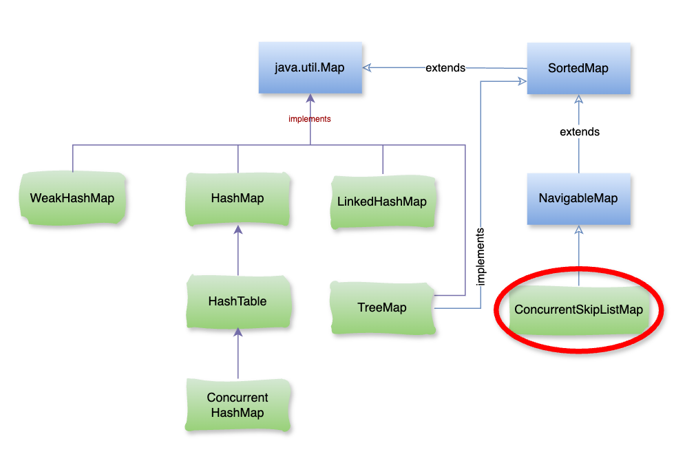

# Java ConcurrentSkipListMap

Trong Java, khi làm việc với **đa luồng (multithreading)**, nếu bạn muốn sử dụng một `NavigableMap` an toàn trong môi trường concurrent thì `ConcurrentSkipListMap` chính là lựa chọn phù hợp. Đây là một cấu trúc dữ liệu được tối ưu để hỗ trợ **song song (concurrent access)** mà vẫn giữ được **thứ tự sắp xếp của key**.

### **1\.** `ConcurrentSkipListMap` **là gì?**

Là một **Map có thứ tự (sorted map)**, tương tự `TreeMap`, nhưng **thread-safe**.

Các key luôn được sắp xếp theo **thứ tự tự nhiên** hoặc **Comparator** do người dùng cung cấp.

Cài đặt dựa trên **Skip List** – một cấu trúc dữ liệu thay thế cho cây cân bằng (balanced tree).

👉 `ConcurrentSkipListMap` thuộc package `java.util.concurrent`.



### **2\. Đặc điểm chính của** `ConcurrentSkipListMap`

*   **Thread-safe**: nhiều luồng có thể đọc/ghi cùng lúc mà không cần đồng bộ hóa thủ công (khác với `TreeMap` hay `HashMap`).
    
*   **Không cho phép null key** (giống `TreeMap`), nhưng cho phép nhiều null value.
    
*   **Sắp xếp**: luôn duy trì thứ tự tăng dần hoặc theo comparator.
    
*   **Hiệu năng**: hỗ trợ tốt cho truy vấn song song, insert/remove/search thường có độ phức tạp **O(log n)**.
    
*   **Navigable**: kế thừa `NavigableMap`, hỗ trợ các phương thức như `floorEntry`, `ceilingEntry`, `higherEntry`, `lowerEntry`…
    

### **3\. Khi nào nên dùng** `ConcurrentSkipListMap`**?**

⚡ Dùng trong các tình huống:

*   Khi cần **Map có thứ tự + thread-safe**.
    
*   Khi nhiều luồng cần truy cập đồng thời (đọc/ghi/xóa).
    
*   Khi cần thay thế `Collections.synchronizedSortedMap(new TreeMap<>())` (vì cách này chậm hơn).
    
*   Khi cần thực hiện **range queries** (lấy dữ liệu theo khoảng) trong môi trường concurrent.
    
*   Khi muốn sử dụng như một **concurrent priority queue theo key**.
    

– Ví dụ:

```java
import java.util.concurrent.*;

public class ConcurrentSkipListMapExample {
    public static void main(String[] args) {
        ConcurrentSkipListMap<Integer, String> map = new ConcurrentSkipListMap<>();

        // Thêm phần tử
        map.put(10, "A");
        map.put(20, "B");
        map.put(30, "C");
        map.put(40, "D");

        // Truy xuất dữ liệu
        System.out.println("Map: " + map);
        System.out.println("Ceiling entry (≥25): " + map.ceilingEntry(25));
        System.out.println("Floor entry (≤25): " + map.floorEntry(25));

        // Duyệt qua map
        for (var entry : map.entrySet()) {
            System.out.println(entry.getKey() + " -> " + entry.getValue());
        }
    }
}
```

– Kết quả:

```java
Map: {10=A, 20=B, 30=C, 40=D}
Ceiling entry (≥25): 30=C
Floor entry (≤25): 20=B
10 -> A
20 -> B
30 -> C
40 -> D
```

### **4\. So sánh với các Map khác**

Đặc điểm`HashMapTreeMapConcurrentHashMapConcurrentSkipListMap`Thứ tự key❌ Không✅ Có❌ Không✅ Có (sorted)Thread-safe❌ Không❌ Không✅ Có✅ CóTìm kiếm gần nhất (floor…)❌ Không✅ Có❌ Không✅ CóHiệu năng concurrent⚡ Cao (O(1))📉 O(log n)⚡ Cao (O(1))📉 O(log n)Null key✅ Cho phép 1❌ Không❌ Không❌ Không

