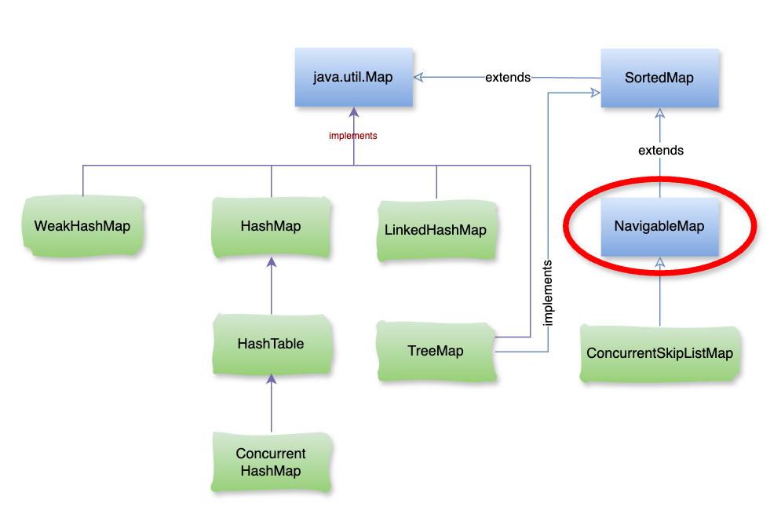

# Java NavigableMap

### **1\. NavigableMap là gì?**

Trong Java, `NavigableMap` là một **interface** thuộc gói `java.util`, được mở rộng từ `SortedMap`. Nếu như `HashMap` giúp bạn tra cứu nhanh một key cụ thể thì `NavigableMap` mạnh hơn ở chỗ: **các phần tử luôn được sắp xếp và bạn có thể dễ dàng tìm kiếm phần tử gần nhất theo key**.



## 2\. Đặc điểm chính của `NavigableMap`

Các key luôn **được sắp xếp** (theo thứ tự tự nhiên hoặc theo `Comparator` định nghĩa).

Cung cấp nhiều phương thức điều hướng giúp tìm kiếm:

*   `lowerEntry(key)` → entry có key nhỏ hơn `key`
    
*   `floorEntry(key)` → entry có key nhỏ hơn hoặc bằng `key`
    
*   `ceilingEntry(key)` → entry có key lớn hơn hoặc bằng `key`
    
*   `higherEntry(key)` → entry có key lớn hơn `key`
    
*   Hỗ trợ duyệt theo cả **tăng dần** và **giảm dần** (`descendingMap`).
    
*   Có thể sử dụng như một **priority queue theo key** với `pollFirstEntry()` và `pollLastEntry()`.
    

## 2\. Khi nào nên dùng `NavigableMap`?

Bạn nên sử dụng `NavigableMap` trong các tình huống sau:

*   **Tìm phần tử gần nhất (nearest neighbor search)**
    

Ví dụ: tìm giá trị gần nhất nhỏ hơn hoặc lớn hơn một key cho trước.

```java
map.floorEntry(30);   // entry có key ≤ 30
map.ceilingEntry(25); // entry có key ≥ 25 
```

*   **Duyệt dữ liệu theo thứ tự tăng/giảm**
    

```java
map.descendingMap(); // view của map theo thứ tự giảm dần 
```

*   **Truy vấn theo khoảng (range queries)**
    

```java
subMap(fromKey, toKey) → Lấy dữ liệu trong một khoảng.
```

Thường dùng trong hệ thống quản lý dữ liệu theo mốc thời gian.

*   **Làm việc với dữ liệu thời gian (timestamps)**
    

Ví dụ: tìm log gần nhất trước hoặc sau một thời điểm `T`.

```java
floorEntry(T) → sự kiện gần nhất trước hoặc đúng T.
ceilingEntry(T) → sự kiện gần nhất sau hoặc đúng T.
```

*   **Thay thế Priority Queue theo key**
    

```java
pollFirstEntry() → lấy ra và xóa phần tử nhỏ nhất.
pollLastEntry() → lấy ra và xóa phần tử lớn nhất.
```

#### **⚠️ KHÔNG cần** `NavigableMap` **khi:**

*   Nếu chỉ cần tra cứu key chính xác (không quan tâm thứ tự) → dùng `HashMap` nhanh hơn.
    
*   Nếu chỉ cần một map có thứ tự cơ bản → `SortedMap` là đủ.
    

### **3\. Ví dụ thực tế**

*   **Trading system (chứng khoán):** tìm mức giá gần nhất khớp lệnh.
    
*   **GPS navigation:** tìm điểm tham chiếu gần nhất.
    
*   **Caching / Time series:** tìm dữ liệu theo timestamp gần nhất.
    

### **4\. So sánh nhanh**

Đặc điểm`HashMapTreeMapNavigableMap`Thứ tự keyKhôngCóCó (tăng/giảm)Tìm kiếm gần nhấtKhôngCóCó (đầy đủ)Truy vấn theo khoảngKhôngCóCó (tiện lợi)Hiệu năng tra cứuO(1)O(log n)O(log n)

