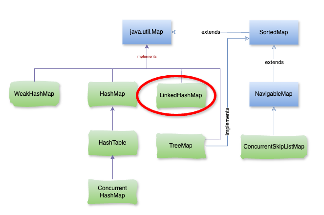

# Java LinkedHashMap

### **1\. LinkedHashMap là gì?**

**LinkedHashMap** là một cấu trúc dữ liệu thuộc loại `Map`, được kế thừa từ `HashMap` nhưng duy trì thứ tự của các phần tử. Khác với `HashMap` các phần tử trong **LinkedHashMap** không chỉ được lưu trữ dựa trên giá trị `hash` mà còn được duy trì theo thứ tự thêm vào hoặc thứ tự truy cập gần nhất. Điều này được thực hiện nhờ một **danh sách liên kết kép (doubly-linked list)** được liên kết với từng phần tử.



### **2\. Đặc điểm chính của LinkedHashMap**

1.  **Thứ tự phần tử**:
    
    *   **Thứ tự thêm vào (Insertion Order)**: Các phần tử được duy trì theo thứ tự thêm vào.
        
    *   **Thứ tự truy cập (Access Order)**: Nếu cấu hình theo cách này, phần tử được truy cập gần nhất sẽ được di chuyển lên đầu (điều này hữu ích cho các trường hợp như cache LRU – Least Recently Used).
        
2.  **Hiệu suất**:
    
    *   `LinkedHashMap` có hiệu suất gần tương đương `HashMap` cho các thao tác như thêm, xoá và truy cập phần tử với độ phức tạp trung bình là `O(1)` cho các thao tác này.
        
    *   Tuy nhiên `LinkedHashMap` sẽ tốn bộ nhớ hơn một chút do cần thêm liên kết kép để duy trì thứ tự.
        
3.  **Cho phép giá trị** `null`: `LinkedHashMap` cho phép cả khóa (`key`) và giá trị (`value`) có thể là `null`.
    
4.  **Sử dụng trong các trường hợp đặc biệt**: `LinkedHashMap` hữu ích khi cần duy trì thứ tự phần tử như thứ tự thêm vào hoặc gần đây nhất, ví dụ như cache LRU.
    

– Ví dụ:

```java
import java.util.LinkedHashMap;
import java.util.Map;

public class App {

    public static void main(String[] args) {
        // Tạo LinkedHashMap với thứ tự thêm vào
        Map<String, Integer> linkedHashMap = new LinkedHashMap<>();

        // Thêm các phần tử vào LinkedHashMap
        linkedHashMap.put("Một", 1);
        linkedHashMap.put("Hai", 2);
        linkedHashMap.put("Ba", 3);
        linkedHashMap.put("Bốn", 4);

        // Duyệt qua các phần tử của LinkedHashMap
        System.out.println("LinkedHashMap (theo thứ tự thêm vào): " + linkedHashMap);

        // Truy cập phần tử để xem thứ tự
        linkedHashMap.get("Hai");
        linkedHashMap.get("Ba");

        // Duyệt qua các phần tử của LinkedHashMap sau khi truy cập
        System.out.println("LinkedHashMap sau khi truy cập (không thay đổi thứ tự): " + linkedHashMap);
    }
}
```

– Kết quả:

```java
LinkedHashMap (theo thứ tự thêm vào): {Một=1, Hai=2, Ba=3, Bốn=4} LinkedHashMap sau khi truy cập (không thay đổi thứ tự): {Một=1, Hai=2, Ba=3, Bốn=4}
```

### **3\. Sử dụng LinkedHashMap**

`LinkedHashMap` là lựa chọn lý tưởng khi cần duy trì thứ tự phần tử và cần hiệu suất cao cho các thao tác thêm, tìm kiếm.

– Để thiết lập thứ tự truy cập gần nhất, bạn có thể sử dụng constructor `LinkedHashMap(int initialCapacity, float loadFactor, boolean accessOrder)` với **accessOrder** được đặt là `true`.

### **4\. Khi nào dùng** `LinkedHashMap`**?**

*   **Khi cần vừa tra cứu nhanh (O(1)) vừa giữ thứ tự chèn**
    

Khác với `HashMap` (thứ tự entry là ngẫu nhiên).

Ví dụ: muốn hiển thị dữ liệu theo đúng thứ tự người dùng nhập.

*   **Khi cần duy trì thứ tự truy cập (access order)**
    

Dùng constructor:

```java
new LinkedHashMap<>(initialCapacity, loadFactor, true);
```

Lúc này, entry nào được `get()` hoặc `put()` sẽ bị đẩy xuống cuối list.

Ứng dụng: **LRU Cache (Least Recently Used)**.

*   **Khi cần predictable iteration**
    

Với `HashMap`, mỗi lần duyệt có thể ra thứ tự khác nhau.

Với `LinkedHashMap`, thứ tự luôn ổn định → hữu ích cho log, UI hiển thị.

## 🔍 So sánh **HashMap** vs **LinkedHashMap**

Tiêu chí**HashMapLinkedHashMapCấu trúc**Mảng (array) + danh sách liên kết / Red-Black Tree (từ Java 8).HashMap + **danh sách liên kết kép (doubly linked list)** để duy trì thứ tự.**Thứ tự phần tử**Không đảm bảo, có thể thay đổi mỗi lần duyệt.Duy trì **thứ tự chèn** (insertion order). Có thể đổi sang **thứ tự truy cập** (access order) bằng constructor.**Tốc độ truy cập (**`get`**,** `put`**)**Trung bình **O(1)**.Trung bình **O(1)** (chậm hơn HashMap một chút do quản lý linked list).**Bộ nhớ**Tốn ít bộ nhớ hơn.Tốn **nhiều hơn** vì phải lưu `before` và `after` pointer cho linked list.**Ứng dụng chính**\- Lookup nhanh  
\- Lưu key-value không quan trọng thứ tự- Khi cần lookup nhanh **và** giữ thứ tự:  
• Hiển thị dữ liệu theo thứ tự chèn  
• LRU Cache (thứ tự truy cập)**Hàm** `removeEldestEntry`Không có.Có thể override → triển khai cache dễ dàng (ví dụ LRU).**Khi nên dùng**Khi chỉ cần ánh xạ key-value và tốc độ.Khi cần ánh xạ key-value nhưng vẫn giữ **thứ tự ổn định**.

