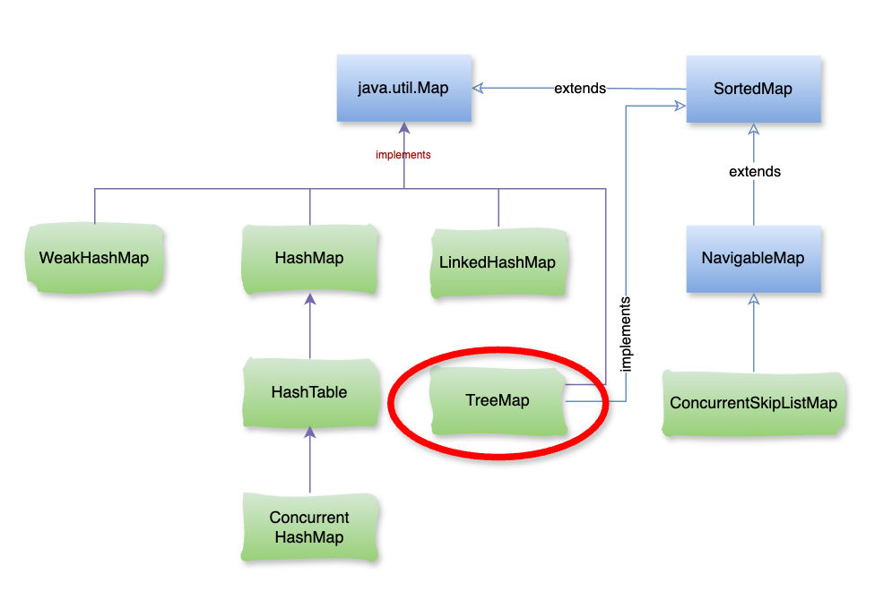

# Java TreeMap

### **1\. TreeMap là gì?**

`TreeMap` trong Java là một cấu trúc dữ liệu thuộc loại `Map`, TreeMap lưu trữ các cặp khóa-giá trị và tự động sắp xếp các phần tử theo thứ tự của khóa. `TreeMap` dựa trên cấu trúc của cây nhị phân cân bằng (cụ thể là cây **Red-Black Tree**) giúp dữ liệu luôn được duy trì theo một thứ tự nhất định, chẳng hạn như thứ tự tự nhiên của khóa hoặc theo thứ tự xác định bởi một `Comparator` tùy chỉnh.



### **2\. Đặc điểm của** `TreeMap`

*   **Sắp xếp theo khóa**: Mỗi phần tử trong `TreeMap` được sắp xếp tự động theo khóa. Điều này khác biệt với `HashMap`, nơi các phần tử không có thứ tự nhất định.
    
*   **Không cho phép khóa** `null`: `TreeMap` không hỗ trợ giá trị `null` cho khóa nhưng các giá trị (`value`) vẫn có thể là `null`.
    
*   **Hiệu suất**: Các thao tác như thêm, xóa, tìm kiếm trong `TreeMap` có độ phức tạp trung bình là `O(log(n))` nhờ cấu trúc của cây Red-Black.
    
*   **Các phương thức bổ sung**:
    
    *   `firstKey()`, `lastKey()`: Lấy khóa nhỏ nhất và lớn nhất trong `TreeMap`.
        
    *   `headMap(toKey)`, `tailMap(fromKey)`, `subMap(fromKey, toKey)`: Trả về một phần của `TreeMap` theo khoảng khóa được chỉ định.
        

– Ví dụ:

```java
import java.util.TreeMap;

public class App {
    public static void main(String[] args) {
        TreeMap<String, Integer> treeMap = new TreeMap<>();

        treeMap.put("Cam", 5);
        treeMap.put("Quýt", 10);
        treeMap.put("Mít", 15);
        treeMap.put("Dừa", 20);

        System.out.println("TreeMap: " + treeMap);
        System.out.println("First key: " + treeMap.firstKey());
        System.out.println("Last key: " + treeMap.lastKey());
        System.out.println("SubMap (Apple to Orange): " + treeMap.subMap("Apple", "Orange"));
    }
}
```

– Kết quả:

```java
TreeMap: {Cam=5, Dừa=20, Mít=15, Quýt=10}
First key: Cam
Last key: Quýt
SubMap (Mít -> Quýt): {Mít=15}
```

### **3\. Khi nào nên sử dụng** `TreeMap`

`TreeMap` thích hợp khi bạn cần lưu trữ các cặp khóa-giá trị theo thứ tự và có thể trích xuất các phần tử theo khoảng khóa xác định.

Bạn nên chọn **TreeMap** thay vì `HashMap`/`LinkedHashMap` khi:

*   **Cần dữ liệu luôn có thứ tự (sorted)**
    

Ví dụ: lưu danh sách sinh viên theo **mã số** hoặc **tên** và cần tự động sắp xếp.

Khác với `LinkedHashMap` (giữ **thứ tự chèn**), `TreeMap` giữ **thứ tự sắp xếp**.

*   **Cần tìm kiếm theo phạm vi (range queries)**
    

Dễ dàng tìm các phần tử có `key` nhỏ hơn/lớn hơn một giá trị nào đó.

→ Dùng được các method như:

*   `headMap(toKey)` → lấy tất cả key nhỏ hơn `toKey`.
    
*   `tailMap(fromKey)` → lấy tất cả key lớn hơn hoặc bằng `fromKey`.
    
*   `subMap(fromKey, toKey)` → lấy key trong khoảng.
    

*   **Cần tìm phần tử gần nhất**
    

Dùng `ceilingKey`, `floorKey`, `higherKey`, `lowerKey` để tìm key gần nhất lớn hơn/nhỏ hơn.

*   **Khi ưu tiên sắp xếp hơn tốc độ**
    
    *   `TreeMap` có độ phức tạp **O(log n)** cho `put`, `get`, `remove`.
        
    *   `HashMap` nhanh hơn (**O(1)** trung bình), nhưng **không có thứ tự**.
        

