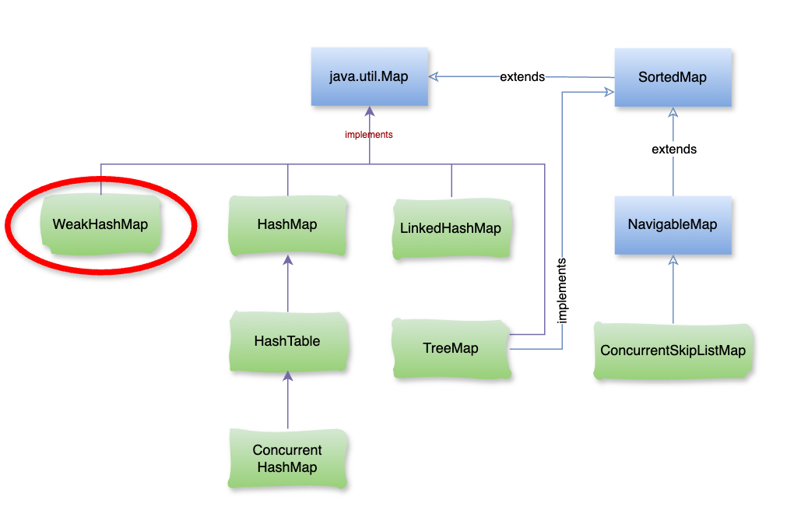

# Java WeakHashMap

### **1\. WeakHashMap là gì?**

**WeakHashMap** là một triển khai của giao diện `Map` trong Java, trong đó các khóa (keys) được giữ bằng **weak references** (tham chiếu yếu). Điều này có nghĩa là nếu không còn bất kỳ tham chiếu mạnh nào (strong references) trỏ đến một khóa cụ thể, thì khóa và cặp khóa-giá trị tương ứng có thể bị thu gom rác (garbage collected) ngay cả khi nó vẫn tồn tại trong WeakHashMap. Điều này khác với các Map thông thường, như `HashMap`, nơi các khóa không bị thu gom cho đến khi chúng bị xóa thủ công.



### **2\. Các đặc điểm chính của** `WeakHashMap`

#### a. Weak References (Tham chiếu yếu)

*   Các khóa trong `WeakHashMap` được giữ bằng các tham chiếu yếu có nghĩa là bộ dọn rác (Garbage Collector – GC) có thể thu gom các mục của Map nếu không có tham chiếu mạnh nào trỏ đến khóa.
    
*   Khi khóa bị GC thu gom, cặp khóa-giá trị đó sẽ bị xóa khỏi **WeakHashMap** một cách tự động.
    

#### b. Garbage Collection

**WeakHashMap** giúp ngăn ngừa rò rỉ bộ nhớ (memory leaks) vì nó cho phép thu gom các mục khi khóa không còn được sử dụng ở bất kỳ đâu khác trong ứng dụng.

#### c. Ứng dụng

**WeakHashMap** thường được sử dụng khi bạn muốn lưu trữ các đối tượng tạm thời và không muốn chúng làm ảnh hưởng đến hiệu suất bộ nhớ bằng cách không để lại các tham chiếu mạnh, ví dụ như cache hoặc bộ nhớ đệm.

– Ví dụ:

```java
import java.util.WeakHashMap;

public class App {

    public static void main(String[] args) {
        WeakHashMap<String, String> weakMap = new WeakHashMap<>();

        // Tạo một đối tượng khóa và thêm nó vào WeakHashMap
        String key1 = new String("Key1");
        String value1 = "Value1";
        weakMap.put(key1, value1);

        // Tạo một đối tượng khác và thêm vào WeakHashMap
        String key2 = new String("Key2");
        String value2 = "Value2";
        weakMap.put(key2, value2);

        // In WeakHashMap trước khi GC thu gom
        System.out.println("Before GC: " + weakMap);

        // Loại bỏ tham chiếu mạnh đến key1
        key1 = null;

        // Yêu cầu bộ dọn rác chạy
        System.gc();

        // Đợi một thời gian để GC hoàn thành
        try {
            Thread.sleep(1000);
        } catch (InterruptedException e) {
            e.printStackTrace();
        }

        // In WeakHashMap sau khi GC có thể đã thu gom key1
        System.out.println("After GC: " + weakMap);
    }
}
```

– Kết quả:

```java
Before GC: {Key1=Value1, Key2=Value2}
After GC: {Key2=Value2}
```

Trong ví dụ này, khi bộ dọn rác chạy, `key1` sẽ bị thu gom vì không còn tham chiếu mạnh nào trỏ tới nó. Sau đó, mục chứa `key1` sẽ tự động bị loại khỏi WeakHashMap.

## **3\. Khi nào nên sử dụng** `WeakHashMap`**?**

*   **Cache tạm thời**: WeakHashMap thường được sử dụng cho các cấu trúc lưu trữ tạm thời, ví dụ như cache, nơi bạn không muốn các đối tượng không còn được sử dụng nữa làm tốn bộ nhớ.
    
*   **Khi muốn tránh rò rỉ bộ nhớ**: Khi bạn lưu trữ các đối tượng phụ thuộc vào sự tồn tại của các đối tượng khác và không muốn giữ chúng lại sau khi các đối tượng gốc bị hủy bỏ.
    

