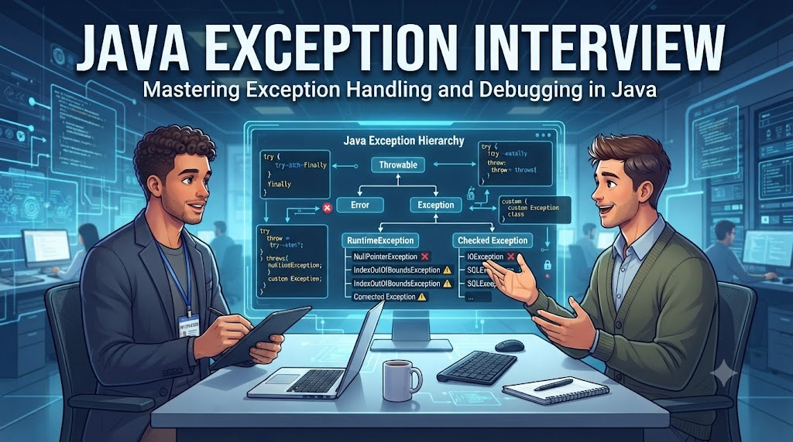

# Tuyển Tập 10 Câu Hỏi Phỏng Vấn Về Exception trong Java



### **1\. Checked vs Unchecked Exception**

🔥 Sự khác nhau giữa **Checked Exception** và **Unchecked Exception** là gì?

**📌 Trả lời:**

*   _Checked Exception (ví dụ:_ `IOException`_) phải được khai báo hoặc bắt bằng_ `try-catch`_._
    
*   _Unchecked Exception (_`RuntimeException`_) thì không bắt buộc phải khai báo hay xử lý._
    

### **2\. Throw vs Throws**

🔥 Trong Java, sự khác biệt giữa `throw` và `throws` là gì?

**📌 Trả lời:**

*   `throw` _dùng để ném một exception cụ thể tại runtime._
    
*   `throws` _dùng trong method signature để khai báo method có thể ném exception._
    

### **3\. Finally block**

🔥 Khi nào `finally` block không được thực thi?

**📌 Trả lời:**  
`finally` _luôn chạy, ngoại trừ trường hợp JVM dừng đột ngột (ví dụ_ `System.exit(0)` _hoặc JVM crash)._

### **4\. Multi-catch**

🔥 Java hỗ trợ **multi-catch** từ phiên bản nào?

**📌 Trả lời:**  
_Từ_ **_Java 7_**_. Cho phép bắt nhiều exception trong cùng một_ `catch`_:_

```java
catch (IOException | SQLException e) { ... }
```

### **5\. Custom Exception**

🔥 Làm sao để tạo một **Custom Exception** trong Java?

**📌 Trả lời:**  
_Tạo class kế thừa_ `Exception` _(checked) hoặc_ `RuntimeException` _(unchecked)._  
– Ví dụ:

```java
public class SampleException extends Exception {
    public SampleException(String message) {
        super(message);
    }
}
```

### **6\. Exception chaining**

🔥 Exception chaining là gì?

**📌 Trả lời:**  
_Là cơ chế ném exception mới nhưng vẫn giữ nguyên nhân gốc (_`cause`_)._  
_– Ví dụ:_

```java
throw new RuntimeException("Error occurred", e);
```

### **7\. Try-with-resources**

🔥 Tại sao nên dùng `try-with-resources` thay cho `try-finally`?

**📌 Trả lời:**  
_Vì_ `try-with-resources` _tự động đóng tài nguyên nếu class đó implement_ `AutoCloseable`_._  
_Giúp code gọn hơn, an toàn hơn, tránh rò rỉ tài nguyên (file, DB connection)._

### **8\. Error vs Exception**

🔥 `Error` và `Exception` khác nhau thế nào?

📌 Trả lời:

*   `Error` _là lỗi nghiêm trọng (OutOfMemoryError, StackOverflowError) → không nên bắt._
    
*   `Exception` _là tình huống bất thường có thể dự đoán và xử lý được._
    

### **9\. Rethrow Exception**

🔥 Có thể rethrow exception sau khi `catch` không?

**📌 Trả lời:**  
_Có. Bạn có thể xử lý một phần (logging) rồi_ `throw e;` _tiếp._  
_Từ Java 7 trở đi, compiler hỗ trợ xác định chính xác loại exception được rethrow._

### **10\. Best practices khi xử lý Exception**

🔥 Những **best practices** khi xử lý Exception trong Java là gì?

**📌 Trả lời:**

*   _Không để_ `catch` _rỗng._
    
*   _Dùng exception cho tình huống bất thường, không cho logic thường xuyên._
    
*   _Ghi log đầy đủ stacktrace._
    
*   _Tạo custom exception rõ nghĩa._
    
*   _Ưu tiên_ `try-with-resources` _cho tài nguyên có thể đóng._
    

