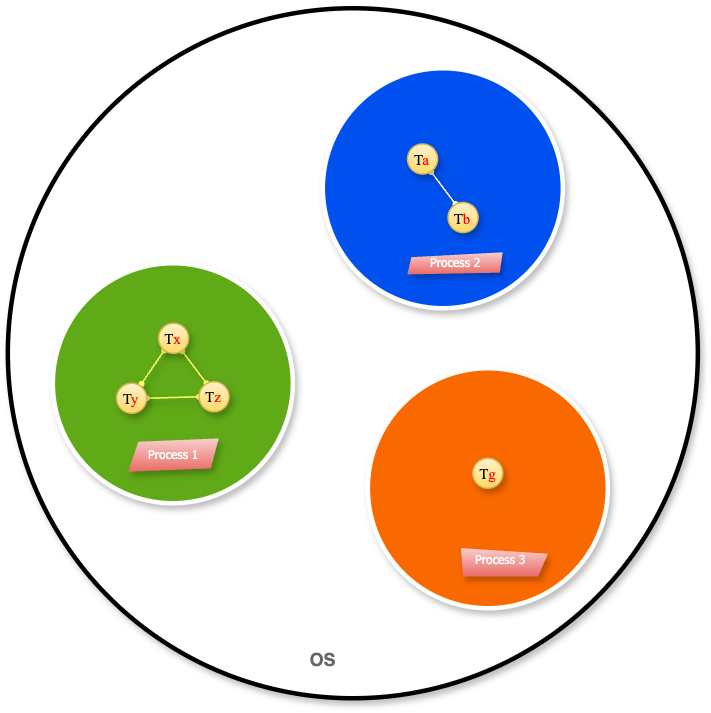

# Xử Lý Đa Luồng Trong Java (Java Multithreading)

**Multithreading** trong Java là một kỹ thuật cho phép một ứng dụng thực thi đồng thời nhiều đoạn mã (nhiều luồng – _thread_). Việc này giúp **tăng hiệu suất** và **tận dụng tối đa tài nguyên hệ thống**.

Multithreading đặc biệt hữu ích trong các ứng dụng cần xử lý song song như:

*   Ứng dụng web
    
*   Game
    
*   Xử lý dữ liệu lớn
    

### **1\. Thread là gì?**

Trong Java, **thread** là đơn vị nhỏ nhất của một tiến trình (_process_), có thể chạy song song với các thread khác trong cùng tiến trình.

*   Các thread **chia sẻ bộ nhớ** của tiến trình cha.
    
*   Mỗi thread có thể thực hiện tác vụ riêng biệt.
    



*   **Process 1**: có 3 thread là x, y, z
    
*   **Process 2**: có 2 thread là a, b
    
*   **Process 3**: có 1 thread là g
    

Có 2 cách tạo thread trong Java:

*   **Kế thừa lớp** `Thread`
    
*   **Cài đặt interface** `Runnable`
    

### **2\. Tạo thread bằng cách kế thừa lớp** `Thread`

Khi kế thừa lớp `Thread`, bạn cần override phương thức `run()` để định nghĩa công việc của thread.

```java
class TestThread extends Thread {
    @Override
    public void run() {
        for (int i = 0; i < 5; i++) {
            System.out.println("TestThread is running: " + i);
        }
    }
}

public class Main {
    public static void main(String[] args) {
        TestThread thread1 = new TestThread();
        TestThread thread2 = new TestThread();

        thread1.start();
        thread2.start();
    }
}
```

### **3\. Tạo thread bằng cách cài đặt** `Runnable`

Cách này phổ biến hơn vì Java **không hỗ trợ đa kế thừa class**.

```java
class TestRunnable implements Runnable {
    @Override
    public void run() {
        for (int i = 0; i < 5; i++) {
            System.out.println("TestRunnable thread is running: " + i);
        }
    }
}

public class Main {
    public static void main(String[] args) {
        TestRunnable task = new TestRunnable();
        Thread thread = new Thread(task);
        thread.start();
    }
}
```

### **4\. Sự khác biệt giữa** `Thread` **và** `Runnable`

*   **Extends Thread**: Không thể kế thừa thêm class nào khác.
    
*   **Implements Runnable**: Linh hoạt hơn vì vẫn có thể kế thừa class khác.
    

### 5\. Các phương thức quản lý Thread

*   `start()` → Bắt đầu một thread.
    
*   `run()` → Định nghĩa công việc của thread (_không gọi trực tiếp_).
    
*   `sleep(milliseconds)` → Tạm dừng thread.
    
*   `join()` → Chờ một thread khác kết thúc.
    
*   `yield()` → Nhường CPU cho thread khác cùng ưu tiên.
    
*   `setPriority(int priority)` → Đặt độ ưu tiên (1–10).
    
*   `isAlive()` → Kiểm tra thread còn đang chạy hay không.
    

### **6\. Thread Synchronization (Đồng bộ hoá)**

Khi nhiều thread truy cập cùng một tài nguyên, dễ xảy ra **race condition**. Giải pháp: sử dụng từ khóa `synchronized`.

```java
public class Counter {
    private int count = 0;

    // Đồng bộ hóa phương thức
    public synchronized void increment() {
        count++;
    }

    public int getCount() {
        return count;
    }
}
```

```java
public class Main {
    public static void main(String[] args) throws InterruptedException {
        Counter counter = new Counter();

        // Tạo 2 thread cùng tăng giá trị counter
        Thread thread1 = new Thread(() -> {
            for (int i = 0; i < 1000; i++) {
                counter.increment();
            }
        });

        Thread thread2 = new Thread(() -> {
            for (int i = 0; i < 1000; i++) {
                counter.increment();
            }
        });

        thread1.start();
        thread2.start();

        thread1.join();
        thread2.join();

        System.out.println("Final count: " + counter.getCount());
    }
}
```

### **7\. ExecutorService và Thread Pool**

Để quản lý nhiều thread hiệu quả, sử dụng **ExecutorService**. Nó dùng **Thread Pool** để tái sử dụng thread, giúp tiết kiệm tài nguyên.

```java
import java.util.concurrent.ExecutorService;
import java.util.concurrent.Executors;

public class Main {
    public static void main(String[] args) {
        // Tạo Thread Pool với 3 thread
        ExecutorService executor = Executors.newFixedThreadPool(3);

        // Gửi 5 task vào pool
        for (int i = 0; i < 5; i++) {
            executor.submit(() -> {
                System.out.println("Thread " + Thread.currentThread().getName() + " is running.");
            });
        }

        // Đóng ExecutorService
        executor.shutdown();
    }
}
```

### **8\. Deadlock và Livelock**

*   **Deadlock**: Xảy ra khi nhiều thread chờ lẫn nhau giải phóng tài nguyên → tất cả bị treo.
    
*   **Livelock**: Các thread vẫn chạy và thay đổi trạng thái, nhưng **không tiến triển** công việc.
    

👉 Cần cẩn thận khi thiết kế cơ chế đồng bộ hoặc dùng **non-blocking locks** để tránh lỗi này.

